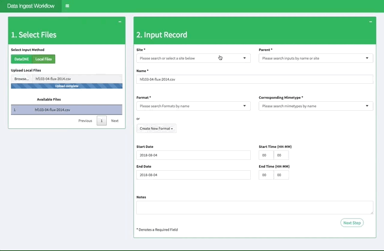

# Pecan Data Ingest via Web Interface 

This tutorial explains the process of ingesting data into PEcAn via our Data-Ingest Application. In order to ingest data, the users must first select data that they wish to upload. Then, they enter metadata to help PEcAn parse and load the data into the main PEcAn workflow.

# 1. Loading Data

## Selecting Ingest Method
The Data-Ingest application is capable of loading data from the DataONE data federation and from the user's local machine. The first step in the workflow is therefore to select an upload method. The application defaults to uploading from DataONE. To upload data from a local device, simply select the radio button titled `Local Files `. 

### DataONE Upload Example 
 

 
The DataONE download feature allows the user to download data at a given doi or DataONE specific package id. To do so, enter the doi or identifier in the `Import From DataONE` field and select `download`. The download process may take a couple of minutes to run depending on the number of files in the dataONE package. This may be a convenient option if the user does not wish to download files directly to their local machine. Once the files have been successfully downloaded from DataONE, they are displayed in a table. Before proceeding to the next step, the user can select a file to ingest by clicking on the corresponding row in the data table. 
  

## Local Upload Example

 
To upload local files, the user should first select the `Local Files` button. From there, the user can upload files from their local machines by selecting `Browse` or by dragging and dropping files into the text box. The files will begin uploading automatically. From there, the user should select a file to ingest and then select the `Next Step` button. 
 
After this step, the workflow is identical for both methods. However, please note that if it becomes necessary to switch from loading data via `DataONE` to uploading local files after the first step, please restart the application. 
 

 

## 2. Creating an Input Record
Creating an input record requires some basic metadata about the file that is being ingested. Each entry field is briefly explained below. 
  

  - Site: To link the selected file with a site, the user can scroll or type to search all the sites in PEcAn. See Example: 
   

 
- Parent: To link the selected file with another dataset, type to search existing datasets in the `Parent` field. 

- Name: this field should be autofilled by selecting a file in step 1.

- Format: If the selected file has an existing format name, the user can search and select in the `Format` field. If the selected file's format is not already in pecan, the user can create a new format by selecting `Create New Format`. Once this new format is created, it will automatically populate the `Format` box and the `Current Mimetype` box (See Section 3).

- Mimetype: If the format already exists, select an existing mimetype. 

- Start and End Date and Time: Inputs can be entered manually or by using the user interface. See example

 

  - Notes: Describe the data that is being uploaded. Please include any citations or references. 

## 3. Creating a format record
If it is necessary to add a new format to PEcAn, the user should fill out the form attached to the `Create New Format` button. The inputs to this form are described below: 

- Mimetype: type to search existing mimetypes. If the mimetype is not in that list, please click on the link `Create New Mimetype` and create a new mimetype via the BETY website.

- New Format Name: Add the name of the new format. Please exclude spaces from the name. Instead please use underscores "_".

- Header: If there is space before the first line of data in the dataset, please select `Yes`

- Skip: The number of lines in the header that should be skipped before the data. 

- Please enter notes that describe the format. 

Example: 
 

## 4. Formats_Variables Record
The final step in the ingest process is to register a formats-variables record. This record links pecan variables with variables from the selected data. 

- Variable: PEcAn variable that is equivalent to variable in selected file.

- Name: The variable name in the imported data need only be specified if it differs from the BETY variable name.

- Unit: Should be in a format parseable by the udunits library and need only be secified if the units of the data in the file differ from the BETY standard.

- Storage Type: Storage type need only be specified if the variable is stored in a format other than would be expected (e.g. if numeric values are stored as quoted character strings). Additionally, storage_type stores POSIX codes that are used to store any time variables (e.g. a column with a 4-digit year would be `%Y`).

- Column Number: Vector of integers that list the column numbers associated with variables in a dataset. Required for text files that lack headers.
 

Finally, the path to the ingest data is displayed in the `Select Files` box. 

