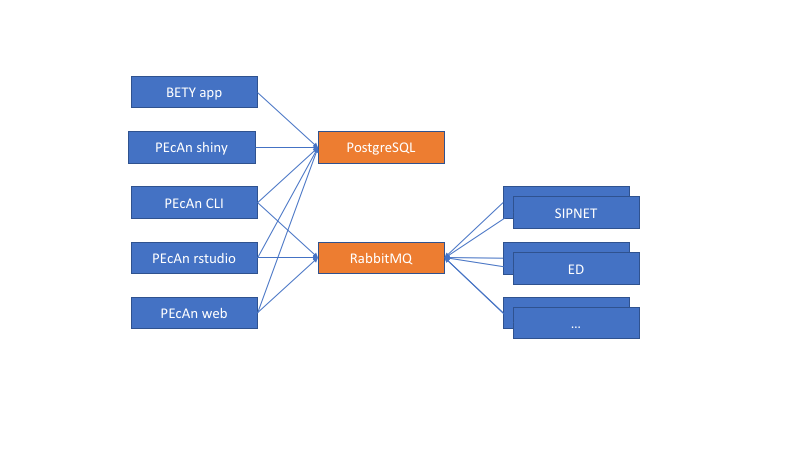

# PEcAn Docker Architecture

**THIS IS EXPERIMENTAL DO NOT USE THIS IN PRODUCTION SUBJECT TO CHANGE**

The PEcAn docker architecture consists of many containers (see figure below) that will communicate with each other. The goal of this architecture is to easily expand the PEcAn system by deploying new model containers and registering them with PEcAn. Once this is done the user can now use these new models in their work. The PEcAn framework will setup the configurations for the models, and send a message to the model containers to start execution. Once the execution is finished the PEcAn framework will continue. This is exactly as if the model is running on a HPC machine. Models can be executed in paralel by launching multiple model containers.

As can be seen in the figure the architecture leverages of two standard containers (in orange). The first container is postgresql with postgis ([mdillon/postgis](https://hub.docker.com/r/mdillon/postgis/)) which is used to store the database used by both BETY and PEcAn. The second containers is a messagebus, more specifically RabbitMQ ([rabbitmq](https://hub.docker.com/_/rabbitmq/)). 

The BETY app container  ([pecan/bety](https://hub.docker.com/r/pecan/bety/)) is the front end to the BETY database and is connected to the postgresql container. A http server can be put in front of this container for SSL termination as well to allow for load balancing (by using multiple BETY app containers).

The PEcAn framework containers consist of multiple unique ways to interact with the PEcAn system (none of these containers will have any models installed):

- PEcAn shiny hosts the shiny applications developed and will interact with the database to get all information necessary to display
- PEcAn rstudio is a rstudio environment with the PEcAn libraries preloaded. This allows for prototyping of new algorithms that can be used as part of the PEcAn framework later.
- PEcAn web allows the user to create a new PEcAn workflow. The workflow is stored in the database, and the models are executed by the model containers.
- PEcAn cli will allow the user to give a pecan.xml file that will be executed by the PEcAn framework.  The workflow created from the XML file is stored in the database, and the models are executed by the model containers.

The model containers contain the actual models that are executed as well as small wrappers to make them work in the PEcAn framework. The containers will run the model based on the parameters received from the message bus and convert the outputs back to the standard PEcAn output format. Once the container is finished processing a message it will immediatly get the next message and start processing it.

