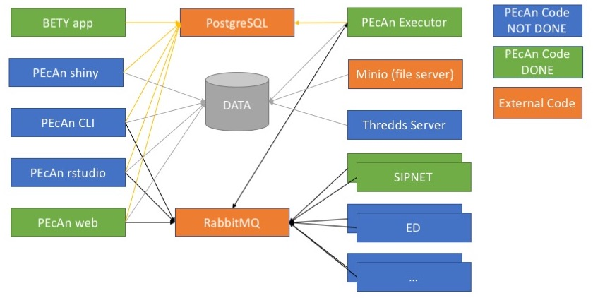

## PEcAn Docker Architecture {#pecan-docker}

### Overview {#pecan-docker-overview}

The PEcAn docker architecture consists of many containers (see figure below) that will communicate with each other. The goal of this architecture is to easily expand the PEcAn system by deploying new model containers and registering them with PEcAn. Once this is done the user can now use these new models in their work. The PEcAn framework will setup the configurations for the models, and send a message to the model containers to start execution. Once the execution is finished the PEcAn framework will continue. This is exactly as if the model is running on a HPC machine. Models can be executed in parallel by launching multiple model containers.



As can be seen in the figure the architecture leverages of two standard containers (in orange). The first container is postgresql with postgis ([mdillon/postgis](https://hub.docker.com/r/mdillon/postgis/)) which is used to store the database used by both BETY and PEcAn. The second containers is a messagebus, more specifically RabbitMQ ([rabbitmq](https://hub.docker.com/_/rabbitmq/)). 

The BETY app container  ([pecan/bety](https://hub.docker.com/r/pecan/bety/)) is the front end to the BETY database and is connected to the postgresql container. A http server can be put in front of this container for SSL termination as well to allow for load balancing (by using multiple BETY app containers).

The PEcAn framework containers consist of multiple unique ways to interact with the PEcAn system (none of these containers will have any models installed):

- PEcAn shiny hosts the shiny applications developed and will interact with the database to get all information necessary to display
- PEcAn rstudio is a rstudio environment with the PEcAn libraries preloaded. This allows for prototyping of new algorithms that can be used as part of the PEcAn framework later.
- PEcAn web allows the user to create a new PEcAn workflow. The workflow is stored in the database, and the models are executed by the model containers.
- PEcAn cli will allow the user to give a pecan.xml file that will be executed by the PEcAn framework.  The workflow created from the XML file is stored in the database, and the models are executed by the model containers.

The model containers contain the actual models that are executed as well as small wrappers to make them work in the PEcAn framework. The containers will run the model based on the parameters received from the message bus and convert the outputs back to the standard PEcAn output format. Once the container is finished processing a message it will immediatly get the next message and start processing it.

### PEcAn's `docker-compose` {#pecan-docker-compose}

```{r comment='', echo = FALSE, results = 'hide'}
docker_compose_file <- file.path("..", "docker-compose.yml")
dc_yaml <- yaml::read_yaml(docker_compose_file)
```

The PEcAn Docker architecture is described in full by the PEcAn `docker-compose.yml` file.
For full `docker-compose` syntax, see the [official documentation](https://docs.docker.com/compose/).

This section describes the [top-level structure](#pecan-dc-structure) and each of the services, which are as follows:

- [`traefik`](#pecan-dc-traefik)
- [`minio`](#pecan-dc-minio)
- [`postgres`](#pecan-dc-postgres)
- [`rabbitmq`](#pecan-dc-rabbitmq)
- [`bety`](#pecan-dc-bety)
- [`web`](#pecan-dc-web)
- [`executor`](#pecan-dc-executor)
- [Model-specific services](#pecan-dc-models)

For reference, the complete `docker-compose` file is as follows:

```{r, echo = FALSE, comment = ''}
yaml::write_yaml(dc_yaml, stdout())
```

#### Top-level structure {#pecan-dc-structure}

The root of the `docker-compose.yml` file contains three sections:

- `services` -- This is a list of services provided by the application, with each service corresponding to a container.
When communicating with each other internally, the hostnames of containers correspond to their names in this section.
For instance, regardless of the "project" name passed to `docker-compose up`, the hostname for connecting to the PostgreSQL database of any given container is _always_ going to be `postgres` (e.g. you should be able to access the PostgreSQL database by calling the following from inside the container: `psql -d bety -U bety -h postgres`).
The services comprising the PEcAn application are described below.

- `networks` -- This is a list of networks used by the application.
We just provide the network name (`pecan`) and resort to Docker's default network configuration.
Note that the services we want connected to this network include a `networks: ... - pecan` tag.
For more details on Docker networks, see the [official documentation](https://docs.docker.com/network/).

- `volumes` -- Similarly to `networks`, this just contains a list of volume names we want.
Briefly, in Docker, volumes are directories containing files that are meant to be shared across containers.
Each volume corresponds to a directory, which can be mounted at a specific location by different containers.
For example, syntax like `volumes: ... - pecan:/data` in a service definition means to mount the `pecan` "volume" (including its contents) in the `/data` directory of that container.
For more details on Docker volumes, see the [official documentation](https://docs.docker.com/storage/volumes/).
Here, we define three volumes:

	- `postgres` -- This contains the data files underlying the PEcAn PostgreSQL database (BETY).
	Notice that it is mounted by the `postgres` container to `/var/lib/postgresql/data`.
	This is the data that we pre-populate when we run the Docker commands to [initialize the PEcAn database](#pecan-docker-quickstart-init).
	Note that these are the values stored _directly in the PostgreSQL database_.
	The default files to which the database points (i.e. `dbfiles`) are stored in the `pecan` volume, described below.
	
	- `rabbitmq` -- This volume contains persistent data for RabbitMQ.
	It is only used by the `rabbitmq` service.
	
	- `pecan` -- This volume contains PEcAn's `dbfiles`, which include downloaded and converted model inputs, processed configuration files, and outputs.
	It is used by almost all of the services in the PEcAn stack, and is typically mounted to `/data`.
 
#### `traefik` {#pecan-dc-traefik}

[Traefik](https://traefik.io/) manages communication among the different PEcAn services and between PEcAn and the web.
Among other things, `traefik` facilitates the setup of web access to each PEcAn service via common and easy-to-remember URLs.
For instance, the following lines in the `web` service configure access to the PEcAn web interface via the URL http://localhost:8000/pecan/ :

```{r, echo = FALSE, comment = ''}
yaml::write_yaml(dc_yaml$services$web["labels"], stdout())
```

(Further details in the works...)

The traefik service configuration looks like this:

```{r, echo = FALSE, comment = ''}
yaml::write_yaml(dc_yaml$services["traefik"], stdout())
```

#### `minio` {#pecan-dc-minio}

[Minio](https://github.com/minio/minio) is a browser-based file manager that facilitates exploration of PEcAn files without the need for CLI tools.

Our current configuration is as follows:

```{r, echo = FALSE, comment = ''}
yaml::write_yaml(dc_yaml$services["minio"], stdout())
```

(Further details in the works...)

#### `postgres` {#pecan-dc-postgres}

This service provides a working PostGIS database.
Our configuration is fairly straightforward:

```{r, echo = FALSE, comment = ''}
yaml::write_yaml(dc_yaml$services["postgres"], stdout())
```

Some additional details about our configuration:

- `image` -- This pulls a container with PostgreSQL + PostGIS pre-installed.
Note that by default, we use PostgreSQL version 9.5.
To experiment with other versions, you can change `9.5` accordingly.

- `networks` -- This allows PostgreSQL to communicate with other containers on the `pecan` network.
As mentioned above, the hostname of this service is just its name, i.e. `postgres`, so to connect to the database from inside a running container, use a command like the following: `psql -d bety -U bety -h postgres`

- `volumes` -- Note that the PostgreSQL data files (which store the values in the SQL database) are stored on a _volume_ called `postgres` (which is _not_ the same as the `postgres` _service_, even though they share the same name).

#### `rabbitmq` {#pecan-dc-rabbitmq}

[RabbitMQ](https://www.rabbitmq.com/) is a message broker service.
In PEcAn, RabbitMQ functions as a task manager and scheduler, coordinating the execution of different tasks (such as running models and analyzing results) associated with the PEcAn workflow.

Our configuration is as follows:

```{r, echo = FALSE, comment = ''}
yaml::write_yaml(dc_yaml$services["rabbitmq"], stdout())
```

Note that the `traefik.frontend.rule` indicates that browsing to http://localhost:8000 (with no further tags) leads to the RabbitMQ management console.

(Further details in the works...)

#### `bety` {#pecan-dc-bety}

This service operates the BETY web interface, which is effectively a web-based front-end to the PostgreSQL database.
Unlike the `postgres` service, which contains all the data needed to run PEcAn models, this service is not essential to the PEcAn workflow.
However, note that certain features of the PEcAn web interface do link to the BETY web interface and will not work if this container is not running.

Our configuration is as follows:

```{r, echo = FALSE, comment = ''}
yaml::write_yaml(dc_yaml$services["bety"], stdout())
```

The BETY container Dockerfile is located in the root directory of the [BETY GitHub repository](https://github.com/pecan/bety) ([direct link](https://github.com/PecanProject/bety/blob/master/Dockerfile)).

#### `web` {#pecan-dc-web}

This service runs the PEcAn web interface.
It is effectively a thin wrapper around a standard Apache web server container from Docker Hub that installs some additional dependencies and copies over the necessary files from the PEcAn source code.

Our configuration is as follows:

```{r, echo = FALSE, comment = ''}
yaml::write_yaml(dc_yaml$services["web"], stdout())
```

Its Dockerfile ships with the PEcAn source code, in [`docker/base/Dockerfile.web`](https://github.com/PecanProject/pecan/blob/develop/docker/base/Dockerfile.web).

In terms of [actively developing PEcAn using Docker](#pecan-docker-develop), this is the service to modify when making changes to the web interface (i.e. PHP, HTML, and JavaScript code located in the PEcAn `web` directory).

#### `executor` {#pecan-dc-executor}

This service is in charge of running the R code underlying the core PEcAn workflow.
However, it is _not_ in charge of executing the models themselves -- model binaries are located on their [own dedicated Docker containers](#pecan-dc-models), and model execution is coordinated by RabbitMQ.

Our configuration is as follows:

```{r, echo = FALSE, comment = ''}
yaml::write_yaml(dc_yaml$services["executor"], stdout())
```

Its Dockerfile is ships with the PEcAn source code, in [`docker/base/Dockerfile.executor`](https://github.com/PecanProject/pecan/blob/develop/docker/base/Dockerfile.executor).
Its image is built on top of the `pecan/base` image ([`docker/base/Dockerfile.base`](https://github.com/PecanProject/pecan/blob/develop/docker/base/Dockerfile.base)), which contains the actual PEcAn source.
To facilitate caching, the `pecan/base` image is itself built on top of the `pecan/depends` image ([`docker/base/Dockerfile.depends`](https://github.com/PecanProject/pecan/blob/develop/docker/base/Dockerfile.depends)), a large image that contains an R installation and PEcAn's many system and R package dependencies (which usually take ~30 minutes or longer to install from scratch).

In terms of [actively developing PEcAn using Docker](#pecan-docker-develop), this is the service to modify when making changes to the PEcAn R source code.
Note that, unlike changes to the `web` image's PHP code, changes to the R source code do not immediately propagate to the PEcAn container; instead, you have to re-compile the code by running `make` inside the container.

#### Model-specific containers {#pecan-dc-models}

Additional models are added as additional services.
In general, their configuration should be similar to the following configuration for SIPNET, which ships with PEcAn:

```{r, echo = FALSE, comment = ''}
yaml::write_yaml(dc_yaml$services["sipnet"], stdout())
```

The PEcAn source contains Dockerfiles for ED2 ([`docker/models/Dockerfile.ed2`](https://github.com/PecanProject/pecan/blob/develop/docker/models/Dockerfile.ed2)) and SIPNET ([`docker/models/Dockerfile.sipnet`](https://github.com/PecanProject/pecan/blob/develop/docker/models/Dockerfile.sipnet)) that can serve as references.
For additional tips on constructing a Dockerfile for your model, see [Dockerfiles for Models](#model-docker).
