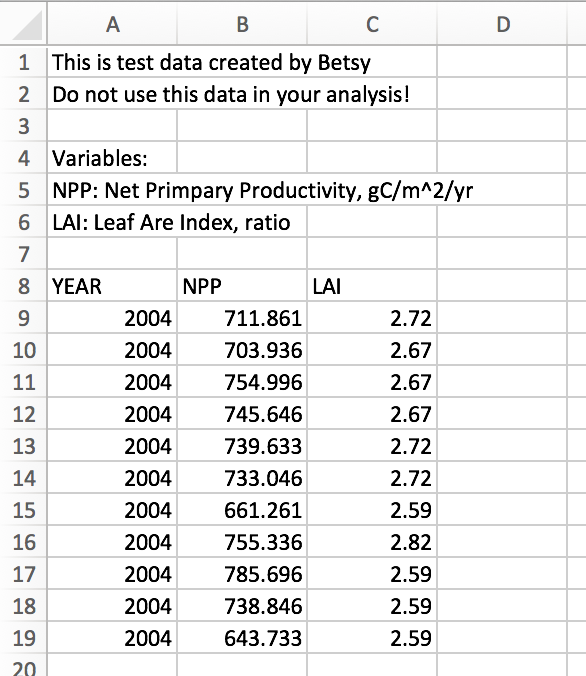
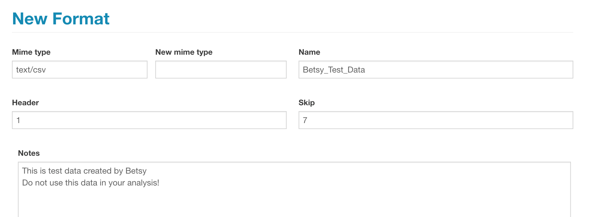
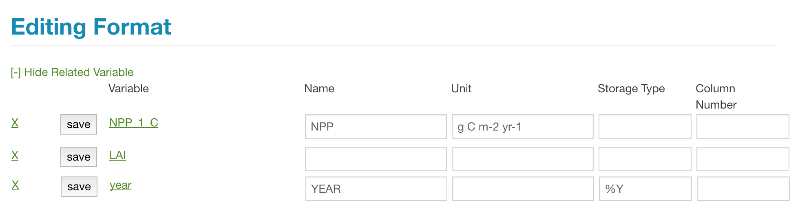
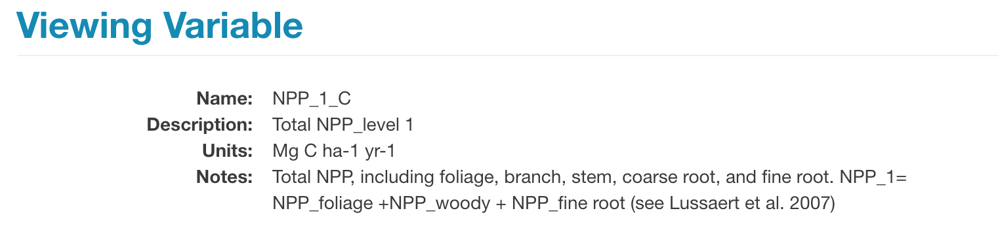

# Formats

The PEcAn database keep track of all the input files passed to models, as well as any data used in model validation or data assimilation. Before we start to register these files with PEcAn we need to define the format these files will be in.

The main goal is to take all the meta-data we have about a data file and create a record of it that pecan can use as a guide when parsing the data file. 

This information is stored in a format record in the bety database. Make sure to read through the current formats before deciding to make a new one. 

# Creating a new format record in BETY

If the format you are looking for is not available, you will need to create a new record. Before entering information into the database, you need to be able to answer the following questions about your data:

- What is the file type? We have a suit of functions for loading in data in open formats such as CSV, txt, netCDF, etc. 
  - If your file type is less common or a proprietary type, can you convert it into one of the previous types? If not, you will need to contact us about writing a data specific load function.
- What variables does the file contain?
  - What are the variables named?
  - What are the variable units?
- Is there a timestamp on the data? 
  - What are the units of time?

Here is an example using a fake dataset:

This data started out as an excel document, but was saved as a CSV file. 

To create a formats record for this data, in the web interface of BETY, select Runs > Formats and click _New Format_. 

You will need to fill out the following fields:

- Mime type: File type (you can search for other formats in the text field)
- Name: The name of your format (this can be whatever you want)
- Header: Boolean that denotes whether or not your data contains a header as the first line of the data. (1 = TRUE, 0 = FALSE)
- Skip: The number of lines above the data that should be skipped. For example, metadata that should not be included when reading in the data or blank spaces. 
- Notes: Any additional information about the data such as sources and citations.  

Here is the formats record for the example data:

When you have finished this section, hit Create. The final record will be displayed on the screen. 

## Formats -> Variables

After a Format entry has been created, you are encouraged to edit the entry to add relationships between the file's variables and the Variables table in PEcAn. Not only do these relationships provide meta-data describing the file format, but they also allow PEcAn to search and (for some mime types) read files.

To enter this data, select Edit Record and on the edit screen select View Related Variable. 

Here is the record for my data after I added related variables:

### Name and Unit

For each variable in the file you will want at a minimum to specify the NAME of the variable within your file and match that to the equivalent Variable in the pulldown.

Make sure to search for your variables under Data > Variables before suggesting that we create a new variable record. This may not always be a straightforward process. 

For example bety contains a record for Net Primary Productivity: 

This record does not have the same variable name or the same units as NPP in my data. However, I know that they are the same variable. I can account for their differences in the formats record. 

- Under Variable, select the variable as it is recorded in bety.
- Under Name, write the name the variable has in your data file.
- Under Unit, write the units the variable has in your data file. 

NOTE: All units must be written in a udunits compliant format. To check that your units can be read by udunits, in R, load the udunits2 package and run `udunits2::is.parseable("g C m-2 yr-1")`

**If the name or the units are the same**, you can leave the Name and Unit fields blank. This is what I did for the variable LAI. 

### Storage Type

_Storage Type_ only needs to be specified if the variable is stored in a format other than what would be expected (e.g. if numeric values are stored as quoted character strings).

One such example is *time variables*.

PEcAn converts all dates into POSIX format using functions such as `strptime`. These functions require that the user specify the format in which the date is written. 

The default is `"%Y-%m-%d %H:%M:%S"` which would look like `"2017-01-01 00:00:00"`

A list of date formats can be found in the R documentation for the function `strptime`	

Below are some commonly used codes:

| %d   | Day of the month as decimal number (01–31). |
| ---- | ---------------------------------------- |
| %D   | Date format such as %m/%d/%y.            |
| %H   | Hours as decimal number (00–23).         |
| %m   | Month as decimal number (01–12).         |
| %M   | Minute as decimal number (00–59).        |
| %S   | Second as integer (00–61), allowing for up to two leap-seconds  (but POSIX-compliant implementations will ignore leap seconds). |
| %T   | Equivalent to %H:%M:%S.                  |
| %y   | Year without century (00–99). On input, values 00 to 68 are  prefixed by 20 and 69 to 99 by 19 – that is the behaviour specified by the  2004 and 2008 POSIX standards, but they do also say ‘it is expected that in a  future version the default century inferred from a 2-digit year will change’. |
| %Y   | Year with century.                       |

### Column Number

If your data is in text format with variables in a standard order then you can specify the Column Number for the variable. This is particularly important for text files that lack headers.

