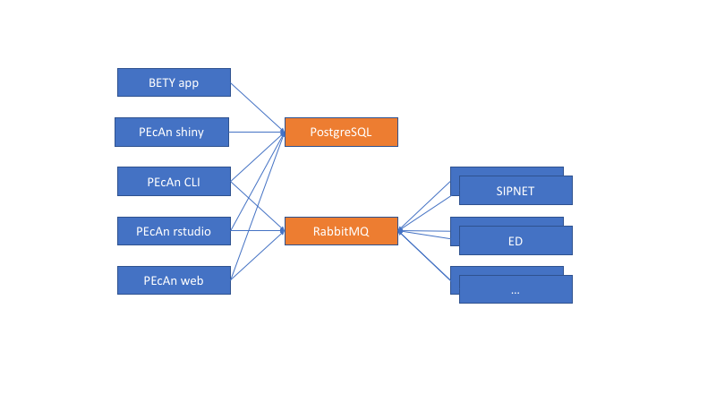

**THIS IS EXPERIMENTAL DO NOT USE THIS IN PRODUCTION SUBJECT TO CHANGE**

# Running PEcAn using Docker

This section will describe how to run PEcAn using docker. This will create the setup described in the [architecture](architecture.md) section. As a reference this will create the containers needed described in the following figure.



You will need to have [docker](http://docker.com) up and running on the machine(s) where you will run the application on. This section assumes a single docker machine. In the future there might be sections that go into more detail on how to run this in kubernetes.

All the docker images are retrieved (pulled) from a central server, the default for this is dockerhub, more specifically the images are part of the [PEcAn repository](https://hub.docker.com/u/pecan/dashboard/). In the future there might be other repositories where we will keep images that are not ready to be shared with the public.

When running the docker containers we need to create the connections between containers (represented by the arrows in the diagram) using the `--link` argument.

The rest of the document will assume you are running docker on your local machine. If you use a remote docker machine replace localhost with the name of the machine where docker is running.

## PostgreSQL

We leverage of two standard containers which need to be started first, PostgreSQL (with PostGIS extensions) and RabbitMQ. First container started is PostgreSQL, make sure you start them always from the same folder so you keep the data. To connect to the PostgreSQL container you can do this from the local machine using psql (`psql -h localhost`).

```bash
docker run \
	--detach \
	--rm \
	--name postgres \
	--publish 5432:5432 \
	--volume ${PWD}/postgres:/var/lib/postgresql/data \
	mdillon/postgis:9.6-alpine
```

## RabbitMQ

The next container we start is the RabbitMQ container. We will use the instance with the management console so we later can easily check and see how many jobs are waiting for each model. To login to the RabbitMQ console, you can use your web browser and connect to [http://localhost:15672](http://localhost:15672), the username/password is guest/guest.

```bash
docker run \
	--detach \
	--rm \
	--hostname rabbitmq \
	--name rabbitmq \
	--publish 5672:5672 \
	--publish 15672:15672 \
	--volume ${PWD}/rabbitmq:/var/lib/rabbitmq \
	rabbitmq:management-alpine
```

## BETY

To see be able to use the BETY web-app we will need to first initialize the database, this is a one time process (assuming you have the volume set up correctly). To initialize the database we need to run the following commands. This will assume that the local server id=99, this can be set with `LOCAL_SERVER`. **DO NOT CHANGE THIS RIGHT NOW**.

```bash
docker run \
	--rm \
	--tty \
	--interactive \
	--link postgres \
	pecan/bety:latest \
	initialize
```

Next we want to synchronize the database with the remote servers. The default is to synchronize is 0, 1, 2, and 5. This can be set using `REMOTE_SERVERS`. The initial  sync will produce an error because some rows coming from BU (id=1) depend on BNL (id=2) and vice versa. The second run of the command should not show any errors. To run and only sync BU you can add `--env REMOTE_SERVERS=1` to the docker run command.

```bash
docker run \
	--rm \
	--tty \
	--interactive \
	--link postgres \
	pecan/bety:latest \
	sync
```

To dump the database you can use the following command. The output from the dump can be found in the bety/dump folder on your local machine.

```bash
docker run \
	--rm \
	--tty \
	--interactive \
	--volume ${PWD}/bety/dump:/home/bety/dump \
	--link postgres \
	pecan/bety:latest \
	dump
```

You can run the sync/dump command at any point and does not require for the BETY containers to be shutdown.

Once the database is initialized you can start the BETY container in the background using the following command.

```bash
docker run \
	--detach \
	--rm \
	--name bety \
	--publish 3000:3000 \
	--link postgres \
	pecan/bety:latest
```

At this point you can connect to the BETY web-app at [http://localhost:3000/](http://localhost:3000/) and login using the default username and password.

## PEcAn

