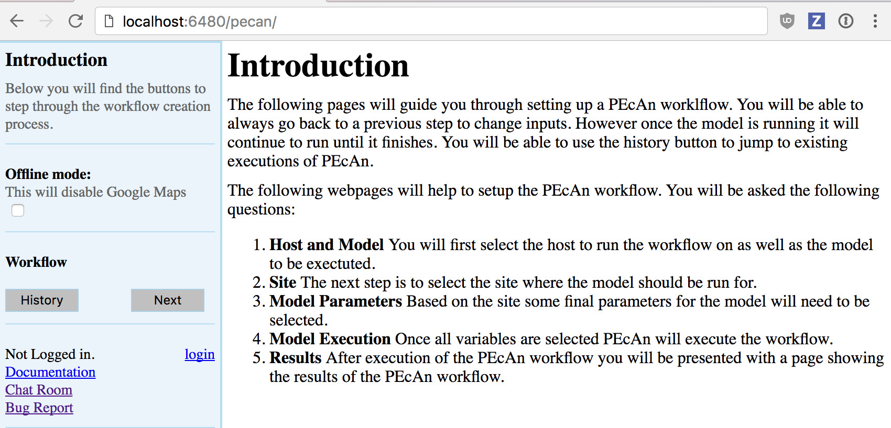

## Demo 01: Basic Run PEcAn {#demo-1}

```{r echo = FALSE,warning=FALSE}
library(knitr)
opts_chunk$set(echo = FALSE, message = FALSE, warning = FALSE,
               fig.align = 'center', out.width = '100%')
```

#### Objective

We will begin by exploring a set of web-based tools that are designed to run single-site model runs. A lot of the detail about what’s going on under the hood, and all the outputs that PEcAn produces, are left to Demo 2. This demo will also demonstrate how to use PEcAn outputs in additional analyses outside of PEcAn.

#### PEcAn URL {#url-def}

In the following demo, **URL** is the web address of a PEcAn server and will refer to one of the following:

*	If you are doing a live demo with the PEcAn team, **URL was provided**
*	If you are running the PEcAn [virtual machine](#pecanvm): **URL = localhost:6480**
*	If you are running PEcAn using [Amazon Web Services (AWS)](#awsvm), **URL is the Public IP**
* If you are running PEcAn using [Docker](#docker-index), **URL is pecan.localhost**
*	If you followed instructions found in [Install PEcAn by hand](#install-native), **URL is your server’s IP**


#### Start PEcAn:

1. **Enter [URL](#url-def) in your web browser**
2. **Click the link for the PEcAn web interface**
3. **Click the ‘Next’ button** in the sidebar to move to the “Site Selection” page.

```{r startpecan}

```

#### Site Selection

```{r mapmodel}
knitr::include_graphics('extfiles/mapmodel.png')
```

#### Host

**Select the local machine “pecan”**. Other options exist if you’ve read and followed instructions found in [Remote execution with PEcAn].

<!-- ERS: I installed via VirtualBox and the only options I see are "Any host", "docker", and "geo". -->

#### Model

Select **SIPNET** (r136) from the available models because it is quick & simple. Reference material can be found in [Models in PEcAn](#pecan-models)


#### Site Group

To filter sites, you can **select a specific group of sites**. For this tutorial we will use **Ameriflux**.


#### Conversion: 

**Select the conversion check box**, to show all sites that PEcAn is capable of generating model drivers for automatically. By default (unchecked), PEcAn only displays sites where model drivers already exist in the system database


#### Site:

**For this tutorial, type _US-NR1_ in the search box to display the Niwot Ridge Ameriflux site (US-NR1), and then click on the pin icon**. When you click on a site’s flag on the map, it will give you the name and location of the site and put that site in the “Site:” box on the left hand site, indicating your current selection. 

Once you are finished with the above steps, **click "Next"**.


#### Run Specification

```{r runspec}
knitr::include_graphics('extfiles/runspec.png')
```

Next we will specify settings required to run the model. Be aware that the inputs required for any particular model may vary somewhat so there may be addition optional or required input selections available for other models.


#### PFT (Plant Functional Type):

**Niwot Ridge is temperate coniferous**.  Available PFTs will vary by model and some models allow multiple competing PFTs to be selected. Also select **soil** to control the soil parameters


#### Start/End Date:

Select **2003/01/01** to **2006/12/31**. In general, be careful to select dates for which there is available driver data.


#### Weather Data: 

For Sipnet.climna **select “Use AmerifluxLBL”** from the [Available Meteorological Drivers](#met-drivers).

#### Optional Settings:

**Leave all blank for demo run**

1. **Email** sends a message when the run is complete.
2. **Use Brown Dog** will use the Brown Dog web services in order to do input file conversions. (**Note: Required if you select _Use NARR_ for Weather Data**) <!-- ERS: this doesn't show up as an option for me -->
3. **Edit pecan.xml** allows you to configure advanced settings via the PEcAn settings file 
4. **Edit model config** pauses the workflow after PEcAn has written all model specific settings but before the model runs are called and allows users to configure any additional settings internal to the model. 
5. **Advanced Setup** controls ensemble and sensitivity run settings discussed in Demo 2.

Finally, **click "Next"** to start the model run.


#### Data Use Policies

The last step before the run starts is to **read and agree** to AmeriFlux's data policy and **give a valid username**. If you don't already have an Ameriflux username, click "register here" and create one. If you selected a different data source, this step may or may not be needed: you will need to agree to a data policy if your source has one, but if it doesn't then the run will start immediately.


#### If you get an error in your run 

If you get an error in your run as part of a live demo or class activity, it is probably simplest to start over and try changing options and re-running (e.g. with a different site or PFT), as time does not permit detailed debugging. If the source of the error is not immediately obvious, you may want to take a look at the workflow.Rout to see the log of the PEcAn workflow or the logfile.txt to see the model execution output log and then refer to the [Documentation](http://pecanproject.github.io/documentation.html) or the [Chat Room](https://join.slack.com/t/pecanproject/shared_invite/enQtMzkyODUyMjQyNTgzLWEzOTM1ZjhmYWUxNzYwYzkxMWVlODAyZWQwYjliYzA0MDA0MjE4YmMyOTFhMjYyMjYzN2FjODE4N2Y4YWFhZmQ) for help.

#### Model Run Workflow

```{r execstatus}
knitr::include_graphics('extfiles/execstatus.jpg')
```

#### MET Process:

First, PEcAn will download meteorological data based on the type of the Weather Data you chose, and process it into the specific format for the chosen model


#### TRAIT / META:

PEcAn then estimates model parameters by performing a meta-analysis of the available trait data for a PFT. TRAIT will extract relevant trait data from the database. META performs a hierarchical Bayes meta-analysis of available trait data. The output of this analysis is a probability distribution for each model parameter. PEcAn selects the median value of this parameter as the default, but in Demo 2 we will see how PEcAn can use this parameter uncertainty to make probabilistic forecasts and assess model sensitivity and uncertainty. Errors at this stage usually indicate errors in the trait database or incorrectly specified PFTs (e.g. defining a variable twice).


#### CONFIG:

writes model-specific settings and parameter files


#### MODEL: 

runs model. 


#### OUTPUT:

All model outputs are converted to [standard netCDF format](http://nacp.ornl.gov/MsTMIP_variables.shtml)


#### ENSEMBLE & SENSITIVITY: 

If enabled post-process output for these analyses

If at any point a Stage Name has the **Status “ERROR”** please notify the PEcAn team member that is administering the demo or feel free to do any of the following:

* Refer to the PEcAn Documentation for documentation
* Post the end of your workflow log on our Slack Channel chat
* Post an issue on Github. 

The entire PEcAn team welcomes any questions you may have!

**If the Finished Stage has a Status of “DONE”, congratulations!** If you got this far, you have managed to run an ecosystem model without ever touching a line of code! Now it’s time to look at the results **click Finished**.

FYI, [adding a new model](https://pecanproject.github.io/pecan-documentation/latest/adding-an-ecosystem-model.html) to PEcAn does not require modification of the model’s code, just the implementation of a wrapper function.


#### Output and Visualization

**For now focus on graphs, we will explore all of PEcAn’s outputs in more detail in Demo 02.**


#### Graphs

1. **Select a Year and Y-axis Variable, and then click 'Plot run/year/variable'.** Initially leave the X-axis as time.
2. Within this figure the **points indicate the daily mean** for the variable while the **envelope encompasses the diurnal variability (max and min)**.
3. Variable names and units are based on a [standard netCDF format](http://nacp.ornl.gov/MsTMIP_variables.shtml).
4. Try looking at a number of different output variables over different years.
5. Try **changing the X-axis** to look at bivariate plots of how different output variables are related to one another. Be aware that PEcAn currently runs a moving min/mean/max through bivariate plots, just as it does with time series plots. In some cases this makes more sense than others.


#### Alternative Visualization: R Shiny

1. **Click on Open SHINY**, which will open a new browser window. The shiny app will automatically access your run’s output files and allow you to visualize all output variables as a function of time. 

```{r workflowshiny}

```

2. Use the pull down menu under **Variable Name** to choose whichever output variable you wish to plot.


#### Model Run Archive

**Return to the output window and Click on the HISTORY button. Click on any previous run in the “ID” column** to go to the current state of that run's execution -- you can always return to old runs and runs in-progress this way. The run you just did should be the more recent entry in the table. **For the next analysis, make note of the ID number from your run.** 


#### Next steps

##### Analyzing model output

Follow this tutorial, [Analyze Output] to learn how to **open model output in R and compare to observed data**


#### DEMO 02
[Demo 02: Sensitivity and Uncertainty Analysis](#demo-2) will show how to perform **Ensemble & Sensitivity Analyses** through the web interface and explore the PEcAn outputs in greater detail, including the **trait meta-analysis**
