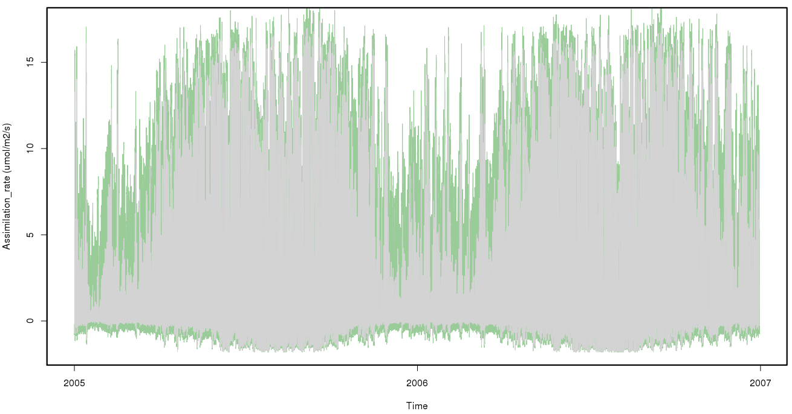

```{r echo=FALSE}

knitr::opts_chunk$set(message = FALSE, warnings = FALSE,  cache = FALSE, 
                      fig.height= 3, fig.width = 8)

```

# Overview
A simple example to show how to setup and run MAAT simulations within the PEcAn framework. Running the MAAT model within PEcAn provides access to additional tools such as the PEcAn met process functions that enable the creation of model-specific met driver files using various sources such as reanalysis products including CRU-NCEP and NARR, as well as site-level tower observations from AmerifluxLBL and FLUXNET.  In addition, the PEcAn framework provides the ability to define custom plant functional types (PFTs) for MAAT simulation and conduct multi-ensemble simulations using observationally-constrained MAAT parameter distributions based on a hierarchical Bayesian meta-analysis approach linked to the BETYdb trait database (betydb.org).

Presently the full MAAT process representation, functionality and tools are not yet fully enabled in the PEcAn framework but adding in more the MAAT functionality is planned in future updates to the PEcAn wrapper code.

## MAAT Installation and usage
**MAAT model source:** https://github.com/walkeranthonyp/MAAT <br>
Follow the instructions found here: https://github.com/walkeranthonyp/MAAT/blob/master/README.md <br>

## Installing the R packages

```{r install, eval = FALSE}
options(repos = c(getOption("repos"), PEcAn = "pecanproject.r-universe.dev"))
install.packages("PEcAn.MAAT")
```

```{r load-pkg}
library(PEcAn.MAAT)
```

## MAAT XML configuration

### E.g. Running without met drivers and using user-specified met conditions
```{cat maat_nomet}
<config>
  <mod_obj>leaf</mod_obj>
  <leaf>
    <fnames>
      <vcmax>'f_vcmax_constant'</vcmax>
      <jmax>'f_jmax_constant'</jmax>
      <rd>'f_rd_constant'</rd>
      <rs>'f_rs_ball1987'</rs>
      <etrans>'f_j_farquharwong1984'</etrans>
     </fnames>
     <env>
      <ca_conc>400</ca_conc>
      <temp>30</temp>
      <o2_conc>0.21</o2_conc>
      <par>1500</par>
      <water_l>0</water_l>
      <sphag_l>0</sphag_l>
      <vpd>1</vpd>
      <rh>0</rh>
      <atm_press>101325</atm_press>
      <wind>1</wind>
     </env>
  </leaf>
</config>
```

### E.g. Running with met drivers
```{cat maat_met}
<config>
  <mod_obj>leaf</mod_obj>
  <leaf>
    <fnames>
      <vcmax>'f_vcmax_constant'</vcmax>
      <jmax>'f_jmax_constant'</jmax>
      <rd>'f_rd_constant'</rd>
      <rs>'f_rs_ball1987'</rs>
      <etrans>'f_j_farquharwong1984'</etrans>
     </fnames>
  </leaf>
</config>
```

## Full PEcAn XML configuration with MAAT options

### E.g. pecan.xml file with MAAT configuration options.
In this example the MAAT model is configured for a temperate deciduous forest based on the temperate.deciduous PFT in the BETYdb database (https://www.betydb.org/pfts/2000000044).

```{cat pecan_xml}
<?xml version="1.0"?>
<pecan>
  <outdir>~/scratch/maat_pecan_test_run/</outdir>
  
  <database>
    <bety>
      <driver>PostgreSQL</driver>
      <user>bety</user>
      <password>bety</password>
      <host>localhost</host>
      <dbname>bety</dbname>
      <write>FALSE</write>
     </bety>
  </database>

  <pfts>
    <pft>
      <name>temperate.deciduous</name>
    </pft>
  </pfts>
  
  <meta.analysis>
    <iter>3000</iter>
    <random.effects>FALSE</random.effects>
    <threshold>1.2</threshold>
    <update>TRUE</update>
  </meta.analysis>
  
  <ensemble>
      <size>10</size>
      <variable>assimilation_rate</variable>
  </ensemble>
  
  <sensitivity.analysis>
      <quantiles>
          <sigma>-3</sigma>
          <sigma>-2</sigma>
          <sigma>-1</sigma>
          <sigma>0</sigma>
          <sigma>1</sigma>
          <sigma>2</sigma>
          <sigma>3</sigma>
      </quantiles>
      <variable>assimilation_rate</variable>
  </sensitivity.analysis>
  
  <model>
    <type>MAAT</type>
      <id>2000000010</id>
      <config>
        <mod_obj>leaf</mod_obj>
        <leaf>
          <fnames>
            <vcmax>'f_vcmax_constant'</vcmax>
            <jmax>'f_jmax_constant'</jmax>
            <rd>'f_rd_constant'</rd>
            <rs>'f_rs_ball1987'</rs>
            <etrans>'f_j_farquharwong1984'</etrans>
            <tcor_asc>
              <vcmax>'f_tcor_asc_Arrhenius'</vcmax>
              <jmax>'f_tcor_asc_Arrhenius'</jmax>
              <rd>'f_tcor_asc_Q10'</rd>
              <tpu>'f_tcor_asc_Arrhenius'</tpu>
            </tcor_asc>
            <tcor_des>
              <vcmax>'f_tcor_des_modArrhenius'</vcmax>
              <jmax>'f_tcor_des_modArrhenius'</jmax>
              <rd>'f_tcor_des_cox2001'</rd>
           </tcor_des>
          </fnames>
        </leaf>
    </config>
  </model>
  
  <run>
    <site>
      <id>1000000146</id>
        <met.start>2005/01/01</met.start>
        <met.end>2006/12/31</met.end>
     </site>
      <inputs>
        <met>
          <source>AmerifluxLBL</source>
            <output>MAAT</output>
            <username>pecan</username>
        </met>
      </inputs>
      <start.date>2005/01/01</start.date>
      <end.date>2006/12/31</end.date>
  </run>
  
  <host>
    <name>localhost</name>
  </host>
  
</pecan>
```

## Simple MAAT run in PEcAn
In this example we will run ten MAAT model ensembles in serial based on parameter values derived from the temperate.deciduous PFT in the BETYdb database (https://www.betydb.org/pfts/2000000044) and the PEcAn meta analysis step

This chunk is shown but is not currently executed at vignette build time, because running it requires a connection to the PEcAn database.

```{r run_maat, eval = FALSE}
rundir <- tempfile("maat_pecan_test_run")
dir.create(rundir)
setwd(rundir)
settings <- PEcAn.settings::read.settings(system.file("pecan.maat.xml", package="PEcAn.MAAT", mustWork = TRUE))
settings$outdir <- rundir
settings <- PEcAn.settings::prepare.settings(settings, force=FALSE)
PEcAn.logger::logger.info(paste0("Main output directory: ",settings$outdir))

# Write pecan.CHECKED.xml
PEcAn.settings::write.settings(settings, outputfile = "pecan.CHECKED.xml")

# start from scratch if no continue is passed in
statusFile <- file.path(settings$outdir, "STATUS")
if (length(which(commandArgs() == "--continue")) == 0 && file.exists(statusFile)) {
  file.remove(statusFile)
}

# Do conversions
settings <- PEcAn.workflow::do_conversions(settings)

# Query the trait database for data and priors
if (PEcAn.utils::status.check("TRAIT") == 0){
  PEcAn.utils::status.start("TRAIT")
  settings <- PEcAn.workflow::runModule.get.trait.data(settings)
  PEcAn.settings::write.settings(settings, outputfile='pecan.TRAIT.xml')
  PEcAn.utils::status.end()
} else if (file.exists(file.path(settings$outdir, 'pecan.TRAIT.xml'))) {
  settings <- PEcAn.settings::read.settings(file.path(settings$outdir, 'pecan.TRAIT.xml'))
}

# Run the PEcAn meta.analysis
if(!is.null(settings$meta.analysis)) {
  if (PEcAn.utils::status.check("META") == 0){
    PEcAn.utils::status.start("META")
    PEcAn.MA::runModule.run.meta.analysis(settings)
    PEcAn.utils::status.end()
  }
}

# Write model specific configs
if (PEcAn.utils::status.check("CONFIG") == 0){
  PEcAn.utils::status.start("CONFIG")
  settings <- PEcAn.workflow::runModule.run.write.configs(settings)
  PEcAn.settings::write.settings(settings, outputfile='pecan.CONFIGS.xml')
  PEcAn.utils::status.end()
} else if (file.exists(file.path(settings$outdir, 'pecan.CONFIGS.xml'))) {
  settings <- PEcAn.settings::read.settings(file.path(settings$outdir, 'pecan.CONFIGS.xml'))
}

# Start MAAT model runs
if (PEcAn.utils::status.check("MODEL") == 0) {
  PEcAn.utils::status.start("MODEL")
  PEcAn.workflow::runModule_start_model_runs(settings,stop.on.error=FALSE)
  PEcAn.utils::status.end()
}

PEcAn.logger::logger.info("*** Wait for model runs to finish. Since this is a serial execution of MAAT, it will take a few minutes ***")

# Get results of model runs
if (PEcAn.utils::status.check("OUTPUT") == 0) {
  PEcAn.utils::status.start("OUTPUT")
  runModule.get.results(settings)
  PEcAn.utils::status.end()
}

# Run ensemble analysis on model output.
if ('ensemble' %in% names(settings) & PEcAn.utils::status.check("ENSEMBLE") == 0) {
  PEcAn.utils::status.start("ENSEMBLE")
  runModule.run.ensemble.analysis(settings, TRUE)
  PEcAn.utils::status.end()
}

# Pecan workflow complete
if (PEcAn.utils::status.check("FINISHED") == 0) {
  PEcAn.utils::status.start("FINISHED")
  PEcAn.remote::kill.tunnel(settings)
  db.query(paste("UPDATE workflows SET finished_at=NOW() WHERE id=", settings$workflow$id, "AND finished_at IS NULL"), params=settings$database$bety)

  # Send email if configured
  if (!is.null(settings$email) && !is.null(settings$email$to) && (settings$email$to != "")) {
    sendmail(settings$email$from, settings$email$to,
             paste0("Workflow has finished executing at ", base::date()),
             paste0("You can find the results on ", settings$email$url))
  }
  PEcAn.utils::status.end()
}

db.print.connections()
print("---------- PEcAn Workflow Complete ----------")

print(" ")
print(" ")

print("---------- Simple ensemble plot ----------")
# create a simple timeseries plot of the ensemble output

# get output and calculate some stats
ensemble_output <- list.files(path = settings$outdir, pattern = "ensemble.ts.NOENSEMBLEID.*Rdata")
load(file.path(settings$outdir,ensemble_output))
timeseries_stats <- apply(ensemble.ts$assimilation_rate,2,quantile,probs=c(0.025,0.5,0.975))

# create timeseries X axis
x_axis <- seq(as.Date(settings$run$start.date), as.Date(settings$run$end.date), length.out=dim(timeseries_stats)[2])

# create a new plot window
dev.new(width=14, height=8, unit="in")

# create plot
plot(x_axis, PEcAn.utils::misc.convert(timeseries_stats[2,],"kg C m-2 s-1","umol C m-2 s-1"), type="l",cex=0.00001, col="white",
     xlab="Time", ylab="Assimilation_rate (umol/m2/s)")
polygon(c(x_axis ,rev(x_axis)),c(PEcAn.utils::misc.convert(timeseries_stats[3,],"kg C m-2 s-1","umol C m-2 s-1"), 
                                 rev(PEcAn.utils::misc.convert(timeseries_stats[1,],"kg C m-2 s-1","umol C m-2 s-1"))),
        col="#99CC99",border="#99CC99")
lines(x_axis,PEcAn.utils::misc.convert(timeseries_stats[2,],"kg C m-2 s-1","umol C m-2 s-1"),lwd=1, lty=1, col="light grey")

# close plot
dev.off()

```
Example output MAAT assimilation rate from the five PEcAn model esemble simulations.  The green shaded area represents the ensemble spread and the grey line shows the mean simulation.  


