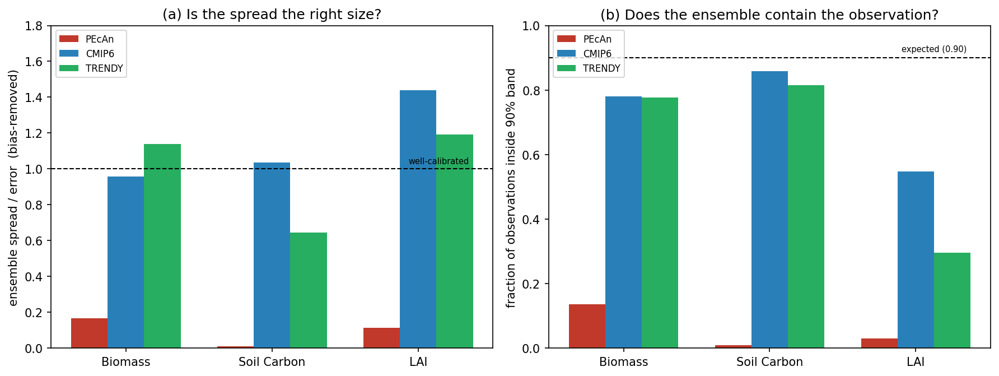

# Ensemble Calibration Diagnostics

Diagnostics for assessing whether an ensemble's *spread* is trustworthy, not
just whether its *mean* is accurate. This complements the ILAMB benchmarking
already in this directory, which scores ensemble-mean skill. Here we ask a
different question: when a model reports uncertainty through an ensemble, is that
uncertainty well calibrated against observations?

## Why this matters

Carbon reanalyses and multi-model ensembles increasingly report ensemble spread
as an uncertainty estimate. A skillful mean is not enough. If the spread is too
narrow the product is overconfident and the observation will routinely fall
outside the ensemble range. If it is too wide the product is underconfident.
These diagnostics quantify where an ensemble sits on that spectrum.

## The diagnostics

All functions take `members` (a NumPy array of shape `[n_members, ...]`) and
`obs` (an array matching the per-cell shape). Missing values in either are
handled by masking to cells where the observation and all members are present.

- **`rank_histogram(members, obs)`** — the histogram of where each observation
  falls within its sorted ensemble. A flat histogram indicates calibration, a
  U shape indicates overconfidence (the observation keeps landing outside the
  ensemble), and a dome indicates underconfidence.

- **`spread_skill(members, obs)`** — the ratio of ensemble spread to ensemble
  error, with a small-sample correction. A ratio near 1 indicates calibration,
  well below 1 indicates overconfidence, and above 1 indicates underconfidence.
  This ratio is the metric to use when comparing ensembles of different sizes,
  because it carries the sqrt((n+1)/n) correction (see the note below).

- **`coverage(members, obs, interval=None)`** — the fraction of observations
  that fall inside the ensemble range, or inside a central interval if one is
  given (for example `interval=0.9` for the central 90 percent). For a
  calibrated ensemble this should match the expected value, which for the full
  range is (n-1)/(n+1).

- **`reliability(members, obs, threshold)`** — for a chosen threshold, compares
  the ensemble's forecast probability of exceeding it against the observed
  frequency. A calibrated ensemble lies on the diagonal.

## A note on comparing ensembles of different sizes

Fixed-interval coverage is not directly comparable across ensembles with very
different member counts. A small ensemble cannot resolve, say, a 90 percent
central interval, so its coverage is legitimately below the nominal target even
when the ensemble is calibrated. When comparing a large ensemble against a small
one, prefer the bias-corrected `spread_skill` ratio, which is designed to be
fair across sizes. The test suite documents this behavior explicitly.

## Usage

```python
import numpy as np
import ensemble_calibration as ec

# members: shape [n_members, n_cells], obs: shape [n_cells]
ratio = ec.spread_skill(members, obs)["ratio"]
cov   = ec.coverage(members, obs, interval=0.9)["coverage"]
counts, edges = ec.rank_histogram(members, obs)

if ratio < 0.8:
    print("ensemble is overconfident relative to these observations")
elif ratio > 1.2:
    print("ensemble is underconfident")
else:
    print("ensemble spread is well sized")
```

See `example_calibration.py` for a full example that loads model output and
benchmark fields and reports the diagnostics for several variables.

## Testing

`test_ensemble_calibration.py` validates every diagnostic against synthetic
ensembles whose calibration is known by construction. An ensemble built to be
overconfident must be flagged as overconfident, a calibrated one must read as
calibrated, and so on. The suite also checks that the calibration verdict is
stable across member counts from 8 to 100, and that the diagnostics handle
ragged, partially missing model output without error. Run with:

```
python test_ensemble_calibration.py
```

## Visualizing the results

`plot_calibration.py` produces a two-panel figure summarizing the calibration
comparison: panel (a) the bias-corrected spread-to-error ratio per variable,
and panel (b) the fraction of observations inside the ensemble 90 percent band.
Both panels are comparable across ensembles of different sizes. An example of
the output is shown below.



The plotting script additionally requires matplotlib and xarray. The core
diagnostics in `ensemble_calibration.py` remain pure NumPy and have no plotting
or file-format dependencies.
