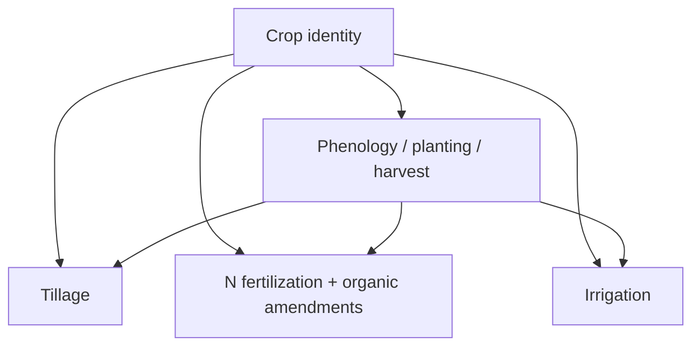

# California Cropland Monitoring

This is the **monitoring** part of the California Cropland Monitoring and Modeling Framework (CCMMF) -- specifically the **Management Tracking** pipeline inside [PEcAn](https://pecanproject.github.io).

CCMMF uses the ecosystem model SIPNET to simulate California cropland carbon stocks and greenhouse-gas fluxes. That modeling needs a consistent picture of each field over time: which crop was grown, and what management happened (planting, harvest, tillage, fertilizer, irrigation, and related timing). Management Tracking produces those **management events** as inputs to the MAGiC annual inventory and scenario projections.

The sections below list the products, how they fit together, and where to run each part of the workflow.

## Products

The workflow is built in layers across three sessions. Session 1 establishes crop identity: the fields and seasons. Session 2 uses that crop identity to define phenology for each season, and also produces tillage. Session 3 produces fertilization and irrigation. Tillage, fertilization, and irrigation are all conditional on crop identity and phenology.

| Product | Description | Main source | Session |
|---------|-------------|-------------|---------|
| Crop identity | Crop type of each field each season | LandIQ + CDL | 1 |
| Planting | Crop start date and initial C/N pools | HLS phenology + plant traits | 2 |
| Harvest | Biomass removal date and fractions | HLS phenology + plant traits | 2 |
| Phenology | Leaf-on / leaf-off timing | HLS phenology | 2 |
| Tillage | Soil/residue disturbance in fallow windows | HLS phenology + tillage index | 2 |
| N fertilization | Synthetic nitrogen applications by crop | California crop guidelines | 3 |
| Organic amendments | Manure, compost, biochar, and similar applications | Literature-derived amendment rates | 3 |
| Irrigation | Water applications over the season | Precip (CHIRPS), reference ET (CIMIS), soil water holding (SSURGO) | 3 |

## Run order by session

### Session 1 - Crop identity

Why: before we can say how a field was managed, we need to know which fields exist and what crop was grown on each one. LandIQ is California's statewide crop map. This session aligns successive LandIQ years onto stable field IDs and fills missing crop information so the rest of the pipeline can use them.

| Step | Output | Detail |
|------|--------|--------|
| Download LandIQ `TARGET_YEAR` | Shapefile under `$LANDIQ_RAW` | [Session 1](documentation/sessions/01-landiq.md) |
| Harmonize geometry | `$LANDIQ_HARMONIZED` (= cadwr `03-final`) | [cadwr-landuse](https://github.com/ccmmf/cadwr-landuse) |
| Gap-fill `PRIOR,TARGET` | `$LANDIQ_GAPFILLED` | [landiq-gapfill/README.md](landiq-gapfill/README.md) |

Commands and flags: [Session 1](documentation/sessions/01-landiq.md).

### Session 2 - Phenology, planting, harvest, tillage

Why: we also need to know when each field was planted, when leaves came on and off, when it was harvested, and when the soil was disturbed. This session extracts those dates from HLS phenology, sets planting C/N pools and harvest fractions from crop-specific literature, and detects tillage in the fallow period between crop seasons.

| Step | Output | Detail |
|------|--------|--------|
| Parcel-tile map (once) | `$HLS_PARCEL_TILEMAP` | [hls/README.md](hls/README.md) |
| MSLSP extract | under `$PRODUCTS_INVENTORY/phenology/` | [phenology/extract/README.md](phenology/extract/README.md) |
| Match LandIQ seasons to MSLSP cycles | `$MATCHED_DIR` | [phenology/match/README.md](phenology/match/README.md) |
| Date gap-fill | gapfill overlays | [phenology/gapfill/README.md](phenology/gapfill/README.md) |
| Trait lookups (one-time) | `$LOOKUPS_ROOT/plant_traits/` | [traits/README.md](traits/README.md) |
| Planting / harvest / phenology events | `$PRODUCTS_INVENTORY/event_files/` | [events/README.md](events/README.md) |
| NDTI extract + tillage events | tillage under inventory + `event_files/` | [tillage/](tillage/), [events/README.md](events/README.md) |

Commands and flags: [Session 2](documentation/sessions/02-phenology.md).

### Session 3 - Fertilizer, organic amendments, and irrigation

Why: finally, we need nitrogen fertilization, organic amendments, and irrigation on each field. Timing for these depends on the phenology from Session 2. This session sets N rates from California crop guidelines, sets organic amendment rates from literature-derived values, and computes irrigation with a simple water-bucket balance from precip, reference ET, and soil water holding capacity.

| Step | Output | Detail |
|------|--------|--------|
| N rate / fertilizer lookups | packaged tables in `PEcAn.data.land` | [Session 3](documentation/sessions/03-fertilizer-irrigation.md); PR [#4002](https://github.com/PecanProject/pecan/pull/4002) |
| Statewide N fertilization events | `$PRODUCTS_INVENTORY/fertilization/` | [Session 3](documentation/sessions/03-fertilizer-irrigation.md); PR [#4003](https://github.com/PecanProject/pecan/pull/4003) `fertilization-statewide` |
| Organic amendment (NCC) events | `$PRODUCTS_INVENTORY/fertilization/` | Same PR #4003 `ncc-statewide` |
| Stage CHIRPS / CIMIS / SSURGO | `$CHIRPS_DIR`, `$CIMIS_DIR`, `$SSURGO_DIR` | [Session 3](documentation/sessions/03-fertilizer-irrigation.md) |
| Parcel climate / soil extracts | preprocess outputs named in irrig YAML | `workflows/irrigation-statewide/preprocessing/` |
| Irrigation water-balance events | `$PRODUCTS_INVENTORY/irrigation/` | [Session 3](documentation/sessions/03-fertilizer-irrigation.md); `workflows/irrigation-statewide/` |

Commands and config: [Session 3](documentation/sessions/03-fertilizer-irrigation.md).

Together these products give MAGiC a wall-to-wall management record for California cropland: what grew on each field, when it was managed, and what was applied.
