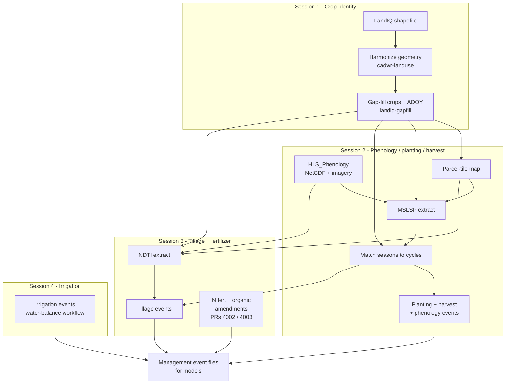

# CCMMF monitoring pipeline

California cropland monitoring for PEcAn: turn public crop maps and satellite
data into field-level **management events** (management inputs) for ecosystem
models.

For each new LandIQ release you process a **year pair**: the new year
(`TARGET_YEAR`, training default **2024**) and the prior year (`PRIOR_YEAR`,
**2023**). Gap-fill, extracts, matching, and events are refreshed for both.

## What you build

| Management event | Plain language | Main source |
|------------------|----------------|-------------|
| Crop identity | Which crop is on each field each season | LandIQ (+ CDL gap-fill) |
| Planting | When the model starts the crop | HLS phenology (green-up) + traits |
| Harvest | When biomass is removed | HLS phenology (senescence) + traits |
| Phenology | Leaf-on / leaf-off timing | HLS Multisource Land Surface Phenology (MSLSP) |
| Tillage | Soil/residue disturbance in fallow windows | Normalized Difference Tillage Index (NDTI) |
| N fertilization | Nitrogen applied to the crop | Crop guidelines / lookups (not satellites) |
| Organic amendments | Manure, compost, biochar, and similar | Material guidelines / lookups (not satellites) |
| Irrigation | Water applied over the season | Precip, ET, and soil water balance |

## Run order by session

Follow each session walkthrough; open the linked README for flags and schemas.
Machine setup (clone repos, source `setup_env.sh`): [Session 0](sessions/00-environment.md).

### Session 1 - Crop identity (LandIQ)

Why: models need a stable field map and a crop label for every parcel-year.

| Step | Output | Detail |
|------|--------|--------|
| Download LandIQ `TARGET_YEAR` | Shapefile under `landiq_shapefiles/` | [Session 1](sessions/01-landiq.md) |
| Harmonize geometry | `$CCMMF_LANDIQ_V4` | [cadwr-landuse](https://github.com/ccmmf/cadwr-landuse) |
| Gap-fill `PRIOR,TARGET` | `$CCMMF_LANDIQ_GAPFILL_PRODUCT` | [landiq-gapfill/README.md](../landiq-gapfill/README.md) |

```bash
$LANDIQ_GAPFILL_ROOT/run_gapfill.sh ${PRIOR_YEAR},${TARGET_YEAR}
export CCMMF_LANDIQ_V4=$CCMMF_LANDIQ_GAPFILL_PRODUCT
```

### Session 2 - Phenology, planting, and harvest

Why: green-up and senescence dates drive planting, harvest, and phenology events.

| Step | Output | Detail |
|------|--------|--------|
| Parcel-tile map (once) | `hls_parcel_tile_map_v4.1.rds` | [hls/README.md](../hls/README.md) |
| MSLSP extract | `phenology/raw_mslsp_v4.1.2/year=Y/` | [phenology/extract/README.md](../phenology/extract/README.md) |
| Match LandIQ seasons to MSLSP cycles | `assigned_year=Y.parquet` | [phenology/match/README.md](../phenology/match/README.md) |
| Trait lookups (one-time) | `plant_traits/*_lookup_long.rds` | [traits/README.md](../traits/README.md) |
| Date gap-fill | `gapfill_dates/` overlays | [phenology/gapfill/README.md](../phenology/gapfill/README.md) |
| Planting + harvest + phenology events | `event_files/*_statewide_Y*` | [events/README.md](../events/README.md) |

Walkthrough: [sessions/02-phenology.md](sessions/02-phenology.md)

Run MSLSP, match, date gap-fill, and events for **both** `PRIOR_YEAR` and
`TARGET_YEAR`. Date gap-fill is required before planting/harvest events.

```bash
$PHENOLOGY_ROOT/run_mslsp.sh $YEAR
$PHENOLOGY_ROOT/match_landiq_mslsp.sh $YEAR
$PHENOLOGY_ROOT/run_phenology_date_gapfill.sh $PRIOR_YEAR $TARGET_YEAR
$EVENTS_ROOT/make_events_statewide.sh $YEAR
```

### Session 3 - Tillage, N fertilization, and organic amendments

Why: tillage is inferred from residue/soil signals in fallow windows; fertilizer
and organic amendments are not visible from satellites, so they use rate lookups
and separate statewide workflows.

| Step | Output | Detail |
|------|--------|--------|
| NDTI extract | `tillage/ndti_v4.1/year=Y/` | [tillage/extract/README.md](../tillage/extract/README.md) |
| Tillage events | `event_files/tillage_statewide_Y*` | [events/README.md](../events/README.md) |
| N fertilization + organic amendments | Parcel N / amendment event parquets | [Session 3](sessions/03-tillage-fertilizer.md); [#4002](https://github.com/PecanProject/pecan/pull/4002), [#4003](https://github.com/PecanProject/pecan/pull/4003) |

```bash
$TILLAGE_ROOT/run_ndti.sh $YEAR
$EVENTS_ROOT/make_events_statewide.sh $YEAR tillage
```

### Session 4 - Irrigation

Why: soil water and irrigation timing strongly affect carbon and nitrogen
fluxes; irrigation is estimated with a water-balance model (plus LandIQ
irrigation type), not from the phenology event builder.

| Step | Output | Detail |
|------|--------|--------|
| Irrigation events | Irrigation event files / parquet | [Session 4](sessions/04-irrigation.md) |

## Picture of the flow



Planting, harvest, phenology, and tillage events are built in this tree
(`events/`). N fertilization, organic amendments, and irrigation use **parallel
workflows** that share the same LandIQ parcels (Sessions 3-4).

## Checklist (training: 2024 + re-run 2023)

| Session | Done | Checkpoint |
|---------|------|------------|
| 0 | [ ] | Env sourced; repos cloned |
| 1 | [ ] | 2024 in harmonized table; gap-fill `2023,2024`; `CCMMF_LANDIQ_V4` points at gap-filled product |
| 2 | [ ] | MSLSP + match + date gap-fill + planting/harvest/phenology events for 2023 and 2024 |
| 3 | [ ] | NDTI + tillage events; fert / organic-amendment workflows reviewed or run |
| 4 | [ ] | Irrigation workflow reviewed or run |

Code layout: [../README.md](../README.md).
Env template: [setup_env.sh](setup_env.sh) (see [Session 0](sessions/00-environment.md)).
