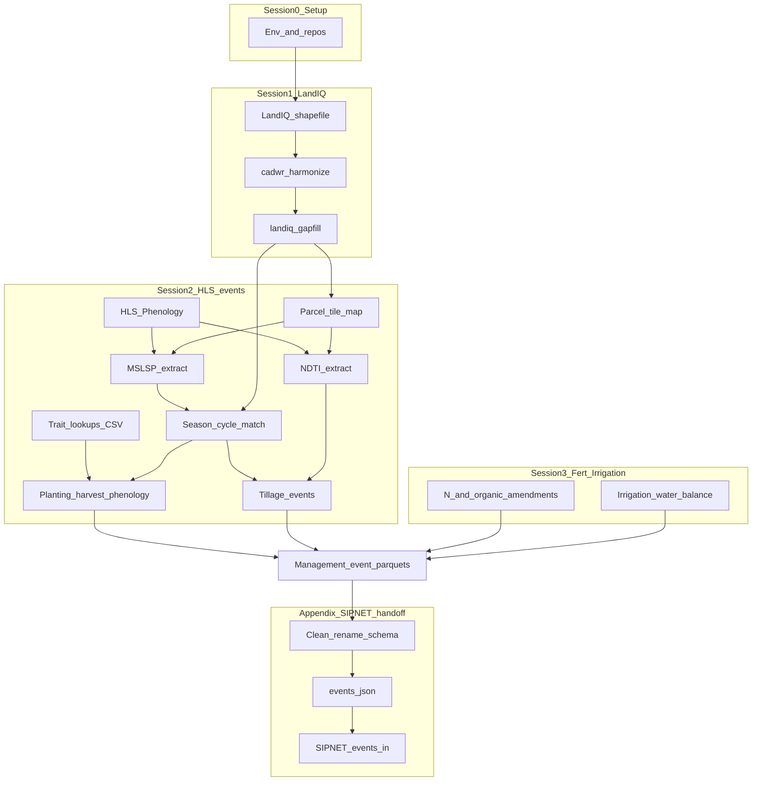

# CCMMF Management Tracking pipeline

**Purpose.** This pipeline produces the California Cropland Monitoring and
Modeling Framework (CCMMF) **Management Tracking** layers: parcel-scale records
of what was grown and how it was managed. Those layers are required inputs to
the MAGiC annual inventory and scenario projections (SIPNET driven through
PEcAn).

**Audience.** CARB technical staff and implementers who operate or review the
statewide update. Session walkthroughs below are the hands-on procedure;
this page is the product map and annual update SOP.

**Document control**

| Field | Value |
|-------|--------|
| Code tree | `modules/data.remote/inst/ccmmf` on branch `feature/ccmmf-statewide-monitoring-inst` |
| Related reports | CCMMF Monitoring Framework (Management Tracking); Conceptual and Modeling Framework reports |
| Env template | [setup_env.sh](setup_env.sh) |
| Column dictionaries | [metadata.md](metadata.md) |
| Component index | [../README.md](../README.md) |

## Coverage

| Dimension | Definition |
|-----------|------------|
| Domain | California agricultural LandIQ parcels (`is_agricultural == TRUE`) |
| Spatial grain | Parcel (`parcel_id`); crop seasons within a water year |
| Temporal rule | Inventory updates run on a **year pair** ([Year pair](#year-pair)) |
| Crop codes | Harmonized to the **2021** DWR remote-sensing legend (`legend_year == 2021`) |

Demo path (one HLS tile `10SDH`, optional parcel list) uses the same steps as statewide; omit `TILEWISE_ONE_TILE` / `ASSIGN_PARCEL_IDS_FILE` for full runs.

## Year pair

LandIQ publishes one statewide crop map per calendar year. Each Management Tracking update therefore has two years:

- **`TARGET_YEAR`** -- the new LandIQ release you are bringing in (example: **2024**).
- **`PRIOR_YEAR`** -- the previous inventory year (example: **2023**).

You download and harmonize `TARGET_YEAR`, then gap-fill and build events for **both** years together. The prior year is not re-downloaded; it is refreshed so it can use the new year as neighbor context (crop/ADOY fill, phenology matching, and related steps).

`setup_env.sh` exports `PRIOR_YEAR` and `TARGET_YEAR` (defaults 2023/2024). Override them before sourcing when a newer LandIQ year arrives. Session walkthroughs use `${PRIOR_YEAR}` and `${TARGET_YEAR}` with those defaults.

<a id="data-layout"></a>

## Data layout

Finished `$CCMMF_ROOT` workspace (defaults from [setup_env.sh](setup_env.sh)). Create dirs once in [Session 0](sessions/00-setup.md); this is the full picture.

```text
$CCMMF_ROOT/                          # CCMMF_ROOT
  LandIQ/                             # LANDIQ_ROOT
    raw/                              # LANDIQ_RAW
    work/cadwr-landuse/v4.1/          # CADWR_WORK_DIR
      03-final/                       # LANDIQ_HARMONIZED (cadwr finals; no copy)
    gapfilled/                        # LANDIQ_GAPFILLED
  HLS/
    imagery/                          # HLS_IMAGERY_ROOT
    MSLSP/                            # MSLSP_NETCDF_ROOT
  CDL/                                # CDL_DIR (GeoTIFF + parcel fraction parquets)
  climate/
    CHIRPS/                           # CHIRPS_DIR (raw download staging)
    CIMIS/                            # CIMIS_DIR (raw download staging)
  soils/
    SSURGO/                           # SSURGO_DIR (gdb + weights for irrigation)
  lookups/
    plant_traits/                     # PLANT_TRAITS_DIR
    fertilization/                    # FERTILIZATION_LOOKUPS (rate tables only)
  products/
    inventory/                        # PRODUCTS_INVENTORY
      phenology/                      # extract, match (MATCHED_DIR default under here)
      tillage/
      fertilization/                  # fert / NCC event outputs (when builders available)
      irrigation/                     # preferred irrig event_output_dir
      event_files/                    # planting / harvest / phenology / tillage
      demo/                           # optional parcel lists
    projections/                      # PRODUCTS_PROJECTIONS
```

Roles: inputs (`LandIQ/raw`, `HLS/`, `CDL/`, `climate/`, `soils/`), work (`LandIQ/work`), lookups, and inventory products under `products/inventory/`. Irrigation path keys in `workflows/irrigation-statewide/config_paths.yml` should point into this tree (parcel extracts from `preprocessing/` may live under `$CHIRPS_DIR` / `$CIMIS_DIR` / `$SSURGO_DIR` or another path you set in YAML).

### Product handoffs

| Product | Default location |
|---------|------------------|
| Gap-filled crops | `$LANDIQ_GAPFILLED/crops_all_years.parq` |
| Matched LandIQ-MSLSP | `$MATCHED_DIR` |
| Parcel-tile map | `$HLS_PARCEL_TILEMAP` |
| Planting / harvest / phenology / tillage events | `$PRODUCTS_INVENTORY/event_files/` |
| Fert / NCC events | `$PRODUCTS_INVENTORY/fertilization/` (statewide builders: PR #4003) |
| Irrigation events | Prefer `$PRODUCTS_INVENTORY/irrigation/` via irrig `event_output_dir` |

## Products (deliverables)

Aligned with the Monitoring Framework Management Tracking list. These layers
are **operational inventory** inputs (not projection scenarios). Maturity below
uses that framing; Session 3 tracks stay parallel / MVP until their workflows
ship on this tree.

| Product | Definition | Method class | Primary inputs | Output artifacts | Maturity | Session |
|---------|------------|--------------|----------------|------------------|----------|---------|
| Crop identity | CLASS/SUBCLASS (and PFT) per parcel-season | Map + gap-fill (provenance per row; see Session 1 observed vs filled) | LandIQ, CDL | Gap-filled LandIQ product (`$LANDIQ_GAPFILLED`) | Operational (inventory) | 1 |
| Planting | Crop start date; C/N pool initialization | Hybrid (RS + traits) | Matched MSLSP, trait CSV lookups | `planting_statewide_Y` under `event_files/` | Operational (inventory) | 2 |
| Harvest | Biomass removal date and rem/lit fractions | Hybrid (RS + traits) | Matched MSLSP, harvest CSV lookup | `harvest_statewide_Y` | Operational (inventory) | 2 |
| Phenology | Leaf-on / leaf-off timing | RS (MSLSP) | Matched MSLSP | `phenology_statewide_Y` | Operational (inventory) | 2 |
| Tillage | Soil/residue disturbance in fallow windows | RS (NDTI) | NDTI + matched phenology | `tillage_statewide_Y` | Operational (inventory; opt-in build) | 2 |
| N fertilization | Synthetic N applications by crop | Lookup | CA N-rate tables (`PEcAn.data.land`) | Fertilization event products (parallel workflow) | MVP / parallel | 3 |
| Organic amendments | Manure, compost, biochar, similar | Lookup | Organic amendment tables | NCC event products (parallel workflow) | MVP / parallel | 3 |
| Irrigation | Water applied over the season | Water balance | CHIRPS, CIMIS ETref, SSURGO AWC, LandIQ irrigation type | Irrigation event parquet / files | Parallel workflow | 3 |

Planting and harvest also depend on one-time trait builds:
`plant_traits/planting_lookup.csv` and `plant_traits/harvest_lookup.csv`
([traits/README.md](../traits/README.md)). Woody orchard clearing uses
`PFT=woody` with `destructive=TRUE` on the harvest lookup / event (not a
separate PFT).

## System overview



Planting, harvest, phenology, and tillage are built in this tree (`events/`).
N fertilization, organic amendments, and irrigation share LandIQ `parcel_id`
but run as **parallel** workflows (Session 3). Model-ready formatting is
documented in the [SIPNET handoff appendix](sessions/sipnet-handoff.md)
(unofficial).

## Annual update procedure

Each cycle uses the [year pair](#year-pair) (`TARGET_YEAR=2024`, `PRIOR_YEAR=2023` in the current example). Source [setup_env.sh](setup_env.sh) once per shell. Full finished tree: [Data layout](#data-layout).

1. **Setup** -- [Session 0](sessions/00-setup.md): repos, `$CCMMF_ROOT`, Earthdata for HLS.
2. **Crop identity** -- [Session 1](sessions/01-landiq.md): download LandIQ `TARGET_YEAR`, legend QC, harmonize geometry (finals at `$LANDIQ_HARMONIZED` = cadwr `03-final`), gap-fill `${PRIOR_YEAR},${TARGET_YEAR}`. Gap-fill reads `$LANDIQ_HARMONIZED` and writes `$LANDIQ_GAPFILLED`.
3. **HLS events** -- [Session 2](sessions/02-phenology.md): parcel-tile map (once), MSLSP extract and match for both years, date gap-fill (required before statewide planting/harvest), trait CSVs if missing, planting / harvest / phenology events; NDTI extract and tillage events (opt-in).
4. **Fertilizer and irrigation** -- [Session 3](sessions/03-fertilizer-irrigation.md): refresh N / organic lookups and irrigation water-balance for the year pair (parallel tracks; maturity as in the products table).
5. **SIPNET handoff** (when feeding models) --
   [Appendix](sessions/sipnet-handoff.md): clean / rename statewide parquet,
   build `events.json`, write SIPNET `events.in`.

<a id="data-sources-and-accounts"></a>

### Data sources and accounts

| Data | Session | Account? | Source / how obtained |
|------|---------|----------|----------------------|
| LandIQ statewide shapefile | 1 | No | CNRA public download ([Session 1](sessions/01-landiq.md)) |
| LandIQ legend PDF | 1 | No | Same portal |
| CDL GeoTIFF + parcel fractions | 1 | No | `landiq-gapfill/scripts/cdl/download_cdl_nass.R`, `extract_cdl_fractions_by_parcel.R` (CropScapeR; no API key for default statewide) |
| HLS imagery | 2 | **Yes -- Earthdata** | [HLS_Phenology](https://github.com/mrinareddy/HLS_Phenology); [Session 0](sessions/00-setup.md) section 0.5 |
| MSLSP NetCDF | 2 | **Yes -- Earthdata** | Same |
| NDTI (from HLS) | 2 | **Yes -- Earthdata** | `tillage/run_ndti.sh` |
| Plant trait CSVs | 2 | No | [traits/README.md](../traits/README.md); `$LOOKUPS_ROOT/plant_traits` |
| CA N / compost rate tables | 3 | No | Packaged `PEcAn.data.land` (`look_up_ca_n_rate`, data-raw CSVs) |
| Fertilizer composition | 3 | No | `modules/data.land/data-raw/create_fertilizer_data.R` |
| CHIRPS precip | 3 | No | [UCSB CHC](https://data.chc.ucsb.edu/products/CHIRPS-2.0/global_daily/netcdf/p05/); see `workflows/irrigation-statewide/preprocessing/README.md` |
| CIMIS ETref | 3 | No | [spatial CIMIS](https://spatialcimis.water.ca.gov/); same preprocess README |
| gSSURGO California gdb | 3 | No* | [NRCS Box soils folder](https://nrcs.app.box.com/v/soils/folder/233398887779); irrig uses local gdb via `config_paths.yml` (*Box may prompt a free login to download) |

**Earthdata is the only required account** for Sessions 1-3 as implemented on this tree. Climate, soils, fert lookups, LandIQ, and CDL are public downloads or packaged data.

### Session 1 commands (summary)

```bash
# CDL download + extract for each year, then:
$LANDIQ_GAPFILL_ROOT/run_gapfill.sh ${PRIOR_YEAR},${TARGET_YEAR}
```

Detail: [Session 1](sessions/01-landiq.md),
[cadwr-landuse](https://github.com/ccmmf/cadwr-landuse),
[landiq-gapfill/README.md](../landiq-gapfill/README.md).

### Session 2 commands (summary)

```bash
# Demo (one tile):
TILEWISE_ONE_TILE=10SDH $PHENOLOGY_ROOT/run_mslsp.sh $YEAR
ASSIGN_PARCEL_IDS_FILE=$PRODUCTS_INVENTORY/demo/parcels_10SDH.csv \
  $PHENOLOGY_ROOT/match_landiq_mslsp.sh $YEAR
export MATCHED_DIR=$PRODUCTS_INVENTORY/phenology/matched_landiq_mslsp_v4.1.2/subsample_n400
$EVENTS_ROOT/make_events_statewide.sh $YEAR

TILEWISE_ONE_TILE=10SDH $TILLAGE_ROOT/run_ndti.sh $YEAR
$EVENTS_ROOT/make_events_statewide.sh $YEAR tillage

# Statewide:
$PHENOLOGY_ROOT/run_mslsp.sh $YEAR
$PHENOLOGY_ROOT/match_landiq_mslsp.sh $YEAR
$PHENOLOGY_ROOT/run_phenology_date_gapfill.sh $PRIOR_YEAR $TARGET_YEAR
$EVENTS_ROOT/make_events_statewide.sh $YEAR
$TILLAGE_ROOT/run_ndti.sh $YEAR
$EVENTS_ROOT/make_events_statewide.sh $YEAR tillage
```

Detail: [Session 2](sessions/02-phenology.md).

## Session index

| Session | Role |
|---------|------|
| [0 - Setup](sessions/00-setup.md) | Operating environment for Management Tracking |
| [1 - LandIQ](sessions/01-landiq.md) | Crop identity (harmonize + gap-fill) |
| [2 - HLS events](sessions/02-phenology.md) | Planting, harvest, phenology, tillage |
| [3 - Fertilization and irrigation](sessions/03-fertilizer-irrigation.md) | Parallel N / organic / irrigation workflows |
| [Appendix - SIPNET handoff](sessions/sipnet-handoff.md) | *(Unofficial)* parquet -> `events.json` -> SIPNET `events.in` |

## QC and acceptance gates

| Gate | Check |
|------|--------|
| Legend / codes | New LandIQ year matches `LandIQ_cropCode_lookup_table.csv`; `legend_year == 2021` after harmonization |
| Year-pair product | Gap-filled table contains `PRIOR_YEAR` and `TARGET_YEAR`; `$LANDIQ_GAPFILLED` holds the gap-filled product |
| LandIQ provenance | Season-2 `subclass_source` / `adoy_source` counted for shipped years; operators know observed vs modelled share ([Session 1](sessions/01-landiq.md#observed-vs-filled-be-explicit); [qc_gapfill_report.md](../landiq-gapfill/outputs/qc_gapfill_report.md)) |
| Phenology coverage | MSLSP extract and match outputs present for both years; date gap-fill run before statewide planting/harvest |
| Event files | Expected `*_statewide_Y` parquet + JSON open; required columns per [metadata.md](metadata.md) |
| Tillage | If tillage requested: NDTI year partitions exist; tillage events join matched phenology fallow windows |
| Year-over-year | Spot-check parcel counts and event rates vs prior published year |
| Handoff (if modeling) | Clean scripts succeed; `validate_events_json` (or schema check) passes before `write.events.SIPNET` |

## Known gaps and residual risk

| Area | Risk |
|------|------|
| LandIQ fill fraction | On shipped v4.1.2 season 2: 2023 modelled subclass 6.58%, gap-filled ADOY 62.43%; 2016 gap-filled ADOY 90.46%; 2017 crop identity 100% modelled. Use `subclass_source` / `adoy_source` for skill and sensitivity work. |
| N fertilization / organic amendments | Lookups: `PEcAn.data.land` on this tree. Statewide fert/NCC events: PEcAn PR [#4003](https://github.com/PecanProject/pecan/pull/4003) (not under `workflows/` here). |
| Irrigation | Parallel `irrigation-statewide` water-balance track; confirm config paths before statewide runs. |
| SIPNET handoff cleaners | Some preprocess scripts still use lab-absolute paths and assume monitoring column names; re-run after any event-schema change. |
| Trait lookups | Must be rebuilt if LandIQ legend or literature/TRY inputs change; products are CSV under `plant_traits/`. |

## Pointers

| Need | Where |
|------|--------|
| Env / layout / accounts | [Session 0](sessions/00-setup.md), [setup_env.sh](setup_env.sh), [Data layout](#data-layout), [Data sources and accounts](#data-sources-and-accounts) |
| Geometry harmonization | [ccmmf/cadwr-landuse](https://github.com/ccmmf/cadwr-landuse) |
| HLS / MSLSP NetCDF | [HLS_Phenology](https://github.com/mrinareddy/HLS_Phenology) |
| Events schemas | [events/README.md](../events/README.md) |
| Traits | [traits/README.md](../traits/README.md) |
| PEcAn event validation / tillage map | `PEcAn.data.land` (`validate_events_json`, `ndti_to_sipnet_tillage`) |
| SIPNET `events.in` | `PEcAn.SIPNET::write.events.SIPNET` |

## Checklist (operational example: 2024 + re-run 2023)

| Session | Done | Checkpoint |
|---------|------|------------|
| 0 | [ ] | Env sourced; repos cloned; Earthdata for HLS; know [Data layout](#data-layout) |
| 1 | [ ] | Harmonized table; gap-fill `2023,2024`; `$LANDIQ_GAPFILLED` gap-filled product ready |
| 2 | [ ] | MSLSP + match + date gap-fill + planting/harvest/phenology; NDTI + tillage as required |
| 3 | [ ] | Fert / organic and irrigation workflows reviewed or run for the year pair |
| Appendix | [ ] | If modeling: cleaned parquet -> `events.json` -> SIPNET `events.in` |
