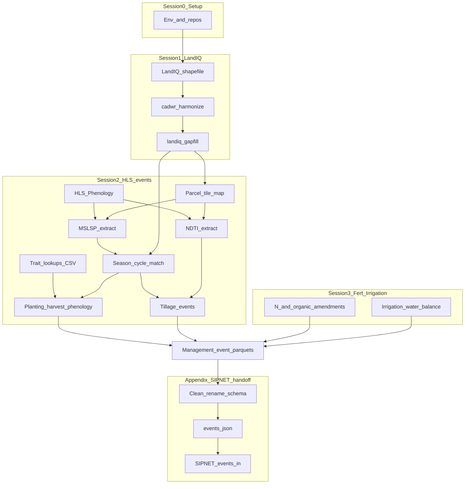

# CCMMF Management Tracking pipeline

**Purpose.** This pipeline produces the California Cropland Monitoring and
Modeling Framework (CCMMF) **Management Tracking** layers: parcel-scale records
of what was grown and how it was managed. Those layers are required inputs to
the MAGIC annual inventory and scenario projections (SIPNET driven through
PEcAn).

**Audience.** CARB technical staff and implementers who operate or review the
statewide update. Session walkthroughs below are the hands-on procedure;
this page is the product map and annual update SOP.

**Document control**

| Field | Value |
|-------|--------|
| Code tree | `modules/data.remote/inst/ccmmf` on branch `feature/ccmmf-statewide-monitoring-inst` |
| Related reports | CCMMF Monitoring Framework (Management Tracking); Conceptual and Modeling Framework reports |
| Env template | [setup_env.sh](setup_env.sh) |
| Column dictionaries | [metadata.md](metadata.md) |
| Component index | [../README.md](../README.md) |

## Coverage

| Dimension | Definition |
|-----------|------------|
| Domain | California agricultural LandIQ parcels (`is_agricultural == TRUE`) |
| Spatial grain | Parcel (`parcel_id`); crop seasons within a water year |
| Temporal rule | Each new LandIQ release updates a **year pair**: `TARGET_YEAR` (example **2024**) and `PRIOR_YEAR` (example **2023**) |
| Crop codes | Harmonized to the **2021** DWR remote-sensing legend (`legend_year == 2021`) |

Demo path (one HLS tile `10SDH`, optional parcel list) uses the same steps as
statewide; omit `TILEWISE_ONE_TILE` / `ASSIGN_PARCEL_IDS_FILE` for full runs.

## Products (deliverables)

Aligned with the Monitoring Framework Management Tracking list. Maturity is
stated honestly so incomplete tracks are not mistaken for finished production.

| Product | Definition | Method class | Primary inputs | Output artifacts | Maturity | Session |
|---------|------------|--------------|----------------|------------------|----------|---------|
| Crop identity | CLASS/SUBCLASS (and PFT) per parcel-season | Map + gap-fill | LandIQ, CDL | Gap-filled LandIQ product (`$CCMMF_LANDIQ_GAPFILL_PRODUCT`) | Production | 1 |
| Planting | Crop start date; C/N pool initialization | Hybrid (RS + traits) | Matched MSLSP, trait CSV lookups | `planting_statewide_Y` under `event_files/` | Production | 2 |
| Harvest | Biomass removal date and rem/lit fractions | Hybrid (RS + traits) | Matched MSLSP, harvest CSV lookup | `harvest_statewide_Y` | Production | 2 |
| Phenology | Leaf-on / leaf-off timing | RS (MSLSP) | Matched MSLSP | `phenology_statewide_Y` | Production | 2 |
| Tillage | Soil/residue disturbance in fallow windows | RS (NDTI) | NDTI + matched phenology | `tillage_statewide_Y` | Production (opt-in build) | 2 |
| N fertilization | Synthetic N applications by crop | Lookup | CA N-rate tables (`PEcAn.data.land`) | Fertilization event products (parallel workflow) | MVP / parallel | 3 |
| Organic amendments | Manure, compost, biochar, similar | Lookup | Organic amendment tables | NCC event products (parallel workflow) | MVP / parallel | 3 |
| Irrigation | Water applied over the season | Water balance | CHIRPS, CIMIS ETref, SSURGO AWC, LandIQ irrigation type | Irrigation event parquet / files | Parallel workflow | 3 |

Planting and harvest also depend on one-time trait builds:
`plant_traits/planting_lookup.csv` and `plant_traits/harvest_lookup.csv`
([traits/README.md](../traits/README.md)). Woody orchard clearing uses
`PFT=woody` with `destructive=TRUE` on the harvest lookup / event (not a
separate PFT).

## System overview



Planting, harvest, phenology, and tillage are built in this tree (`events/`).
N fertilization, organic amendments, and irrigation share LandIQ `parcel_id`
but run as **parallel** workflows (Session 3). Model-ready formatting is
documented in the [SIPNET handoff appendix](sessions/sipnet-handoff.md)
(unofficial).

## Annual update procedure

Operational example uses `TARGET_YEAR=2024` and `PRIOR_YEAR=2023`. Replace years
when a newer LandIQ release arrives. Source [setup_env.sh](setup_env.sh) once
per shell.

1. **Setup** -- [Session 0](sessions/00-setup.md): repos, `$CCMMF_ROOT`, Earthdata
   for HLS.
2. **Crop identity** -- [Session 1](sessions/01-landiq.md): download LandIQ
   `TARGET_YEAR`, legend QC, harmonize geometry, gap-fill
   `${PRIOR_YEAR},${TARGET_YEAR}`, point `CCMMF_LANDIQ_V4` at the gap-filled
   product.
3. **HLS events** -- [Session 2](sessions/02-phenology.md): parcel-tile map
   (once), MSLSP extract and match for both years, date gap-fill (required
   before statewide planting/harvest), trait CSVs if missing, planting /
   harvest / phenology events; NDTI extract and tillage events (opt-in).
4. **Fertilizer and irrigation** -- [Session 3](sessions/03-fertilizer-irrigation.md):
   refresh N / organic lookups and irrigation water-balance for the year pair
   (parallel tracks; maturity as in the products table).
5. **SIPNET handoff** (when feeding models) --
   [Appendix](sessions/sipnet-handoff.md): clean / rename statewide parquet,
   build `events.json`, write SIPNET `events.in`.

### Data sources and accounts

| Session | Data | Account |
|---------|------|---------|
| 1 | LandIQ (CNRA) | Public download |
| 1 | CDL (CropScape / `CropScapeR`) | No API key for default statewide download |
| 2 | HLS / MSLSP / NDTI ([HLS_Phenology](https://github.com/mrinareddy/HLS_Phenology)) | [NASA Earthdata Login](https://urs.earthdata.nasa.gov/) |
| 3 | Fertilization lookups; CHIRPS, CIMIS, SSURGO | Usually public / preprocessed; follow Session 3 |

### Session 1 commands (summary)

```bash
$LANDIQ_GAPFILL_ROOT/run_gapfill.sh ${PRIOR_YEAR},${TARGET_YEAR}
export CCMMF_LANDIQ_V4=$CCMMF_LANDIQ_GAPFILL_PRODUCT
```

Detail: [Session 1](sessions/01-landiq.md),
[cadwr-landuse](https://github.com/ccmmf/cadwr-landuse),
[landiq-gapfill/README.md](../landiq-gapfill/README.md).

### Session 2 commands (summary)

```bash
# Demo (one tile):
TILEWISE_ONE_TILE=10SDH $PHENOLOGY_ROOT/run_mslsp.sh $YEAR
ASSIGN_PARCEL_IDS_FILE=$CCMMF_MANAGEMENT/demo/parcels_10SDH.csv \
  $PHENOLOGY_ROOT/match_landiq_mslsp.sh $YEAR
export CCMMF_MATCHED_DIR=$CCMMF_MANAGEMENT/phenology/matched_landiq_mslsp_v4.1.2/subsample_n400
$EVENTS_ROOT/make_events_statewide.sh $YEAR

TILEWISE_ONE_TILE=10SDH $TILLAGE_ROOT/run_ndti.sh $YEAR
$EVENTS_ROOT/make_events_statewide.sh $YEAR tillage

# Statewide:
$PHENOLOGY_ROOT/run_mslsp.sh $YEAR
$PHENOLOGY_ROOT/match_landiq_mslsp.sh $YEAR
$PHENOLOGY_ROOT/run_phenology_date_gapfill.sh $PRIOR_YEAR $TARGET_YEAR
$EVENTS_ROOT/make_events_statewide.sh $YEAR
$TILLAGE_ROOT/run_ndti.sh $YEAR
$EVENTS_ROOT/make_events_statewide.sh $YEAR tillage
```

Detail: [Session 2](sessions/02-phenology.md).

## Session index

| Session | Role |
|---------|------|
| [0 - Setup](sessions/00-setup.md) | Operating environment for Management Tracking |
| [1 - LandIQ](sessions/01-landiq.md) | Crop identity (harmonize + gap-fill) |
| [2 - HLS events](sessions/02-phenology.md) | Planting, harvest, phenology, tillage |
| [3 - Fertilization and irrigation](sessions/03-fertilizer-irrigation.md) | Parallel N / organic / irrigation workflows |
| [Appendix - SIPNET handoff](sessions/sipnet-handoff.md) | *(Unofficial)* parquet -> `events.json` -> SIPNET `events.in` |

## QC and acceptance gates

| Gate | Check |
|------|--------|
| Legend / codes | New LandIQ year matches `LandIQ_cropCode_lookup_table.csv`; `legend_year == 2021` after harmonization |
| Year-pair product | Gap-filled table contains `PRIOR_YEAR` and `TARGET_YEAR`; `CCMMF_LANDIQ_V4` points at gap-filled path |
| Phenology coverage | MSLSP extract and match outputs present for both years; date gap-fill run before statewide planting/harvest |
| Event files | Expected `*_statewide_Y` parquet (and CSV companions where used) open; required columns per [metadata.md](metadata.md) |
| Tillage | If tillage requested: NDTI year partitions exist; tillage events join matched phenology fallow windows |
| Year-over-year | Spot-check parcel counts and event rates vs prior published year |
| Handoff (if modeling) | Clean scripts succeed; `validate_events` (or schema check) passes before `write.events.SIPNET` |

## Known gaps and residual risk

| Area | Risk |
|------|------|
| N fertilization / organic amendments | Parallel MVP workflows; not produced by `make_events_statewide.sh`. Prefer durable `PEcAn.data.land` helpers and workflow READMEs over PR numbers alone. |
| Irrigation | Parallel `irrigation-statewide` water-balance track; confirm config paths before statewide runs. |
| SIPNET handoff cleaners | Some preprocess scripts still use lab-absolute paths and assume monitoring column names; re-run after any event-schema change. |
| Trait lookups | Must be rebuilt if LandIQ legend or literature/TRY inputs change; products are CSV under `plant_traits/`. |

## Pointers

| Need | Where |
|------|--------|
| Env | [setup_env.sh](setup_env.sh), [Session 0](sessions/00-setup.md) |
| Geometry harmonization | [ccmmf/cadwr-landuse](https://github.com/ccmmf/cadwr-landuse) |
| HLS / MSLSP NetCDF | [HLS_Phenology](https://github.com/mrinareddy/HLS_Phenology) |
| Events schemas | [events/README.md](../events/README.md) |
| Traits | [traits/README.md](../traits/README.md) |
| PEcAn event validation / tillage map | `PEcAn.data.land` (`validate_events`, `ndti_to_sipnet_tillage`) |
| SIPNET `events.in` | `PEcAn.SIPNET::write.events.SIPNET` |

## Checklist (operational example: 2024 + re-run 2023)

| Session | Done | Checkpoint |
|---------|------|------------|
| 0 | [ ] | Env sourced; repos cloned; `$CCMMF_ROOT` layout ready; Earthdata for HLS |
| 1 | [ ] | Harmonized table; gap-fill `2023,2024`; `CCMMF_LANDIQ_V4` -> gap-filled product |
| 2 | [ ] | MSLSP + match + date gap-fill + planting/harvest/phenology; NDTI + tillage as required |
| 3 | [ ] | Fert / organic and irrigation workflows reviewed or run for the year pair |
| Appendix | [ ] | If modeling: cleaned parquet -> `events.json` -> SIPNET `events.in` |
