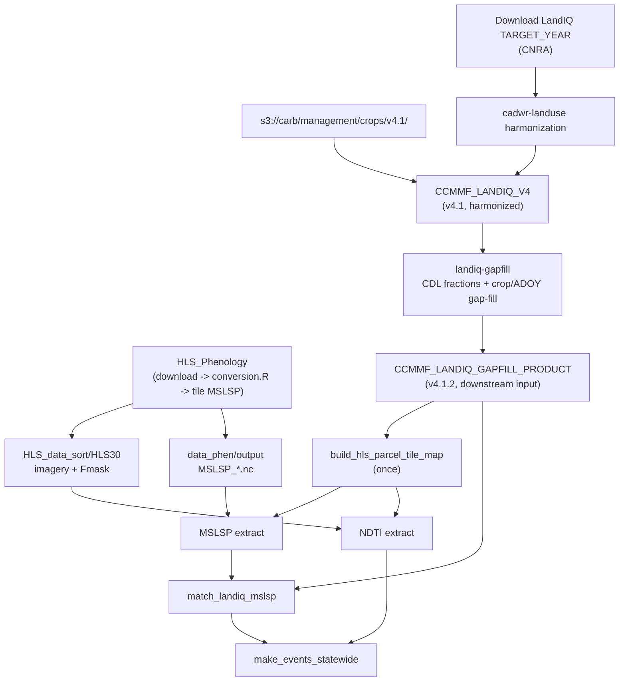

# CCMMF pipeline

**Spine doc** - order of operations for LandIQ v4.1 -> gap-fill (v4.1.2) through MSLSP,
NDTI, match, and events. **Draft (local outputs only).**

**Start with environment:** [Session 0 - portable setup](sessions/00-environment.md)
and [ccmmf_env.example.sh](ccmmf_env.example.sh). Do not use BU `/projectnb` paths on
user machines.

**Training year:** examples use `TARGET_YEAR=2024` and gap-fill / downstream for the
**year pair `2023,2024`** (new release + prior year). The historical **2016-2023**
gap-filled series is the delivered lab product; see [README.md](README.md).

**PEcAn:** [PR #3913](https://github.com/PecanProject/pecan/pull/3913) -
`feature/ccmmf-statewide-monitoring-inst`.

**Users:** start at [documentation/README.md](README.md) for training sessions.
This file is the full-year technical runbook.

**Schedulers:** prefer `run_*.sh` / `Rscript` off-site. Lab SCC wrappers use
`#$ -l buyin`; translate to your batch system if needed.

Nested workflows (harmonization, CDL, gap-fill, HLS extract, match, events) have their own READMEs; this file gives env vars, sequencing, and commands. Each step below links to its component README. For the developer repo index, see [management/README.md](../README.md).

---

## Configuration

Copy [ccmmf_env.example.sh](ccmmf_env.example.sh) -> `$CCMMF_ROOT/ccmmf_env.sh`, edit, and
`source` it. Illustrative block (paths are examples - replace with yours):

```bash
# --- Workspace (PORTABLE - edit) ---
export CCMMF_ROOT="$HOME/ccmmf"
export CCMMF_CODE="$HOME/pecan/modules/data.remote/inst/ccmmf"
export CCMMF_MANAGEMENT="$CCMMF_ROOT/management"
export LANDIQ_DIR="LandIQ-harmonized-v4.1"    # before gap-fill
# export LANDIQ_DIR="LandIQ-harmonized-v4.1.2"  # after gap-fill

# --- S3 (optional; lab CARB bucket - read-only in tutorials) ---
export S3_ENDPOINT="https://s3.garage.ccmmf.ncsa.cloud"
export S3_BUCKET="carb"
export LANDIQ_S3_PREFIX="management/crops/v4.1"
export MSLSP_S3_PREFIX="management/mslsp/v1.0.0"

# --- Years ---
export YEAR_MIN=2016
export YEAR_MAX=2024
export TARGET_YEAR=2024
export PRIOR_YEAR=2023
export GAPFILL_YEAR=2017
export GAPFILL_NEIGHBOR_LO=2016
export GAPFILL_NEIGHBOR_HI=2018
export NDTI_DEMO_MONTH=3
export NDTI_SMOKE_TILE="10SDH"

# --- Derived paths ---
export CCMMF_LANDIQ_V4="$CCMMF_ROOT/$LANDIQ_DIR"
export CCMMF_LANDIQ_GAPFILL_PRODUCT="$CCMMF_ROOT/LandIQ-harmonized-v4.1.2"
export LANDIQ_GAPFILL_ROOT="$CCMMF_CODE/landiq-gapfill"
export PARCEL_MAP="$CCMMF_MANAGEMENT/hls_parcel_tile_map_v4.1.rds"
export TILE_TO_PARCELS="$CCMMF_MANAGEMENT/hls_tile_to_parcels_v4.1.rds"
```

> **Lab SCC only:** `CCMMF_ROOT=/projectnb/dietzelab/ccmmf` and
> `CCMMF_MANAGEMENT=$CCMMF_ROOT/management`. Users must override.

| Variable | Role |
|----------|------|
| `PARCEL_MAP` | Geometry-only parcel -> HLS tiles (built once) |
| `TILE_TO_PARCELS` | Inverted map for tile-centric job scheduling |
| `TARGET_YEAR` | New LandIQ year to harmonize, extract, match, events |
| `PRIOR_YEAR` | Previous year to gap-fill / rematch with the new release |
| `CCMMF_LANDIQ_GAPFILL_PRODUCT` | Gap-filled product (v4.1.2); downstream input after section 5 |
| `GAPFILL_YEAR` | Historical full-gap LandIQ year (e.g. 2017) |
| `GAPFILL_NEIGHBOR_LO/HI` | Flanking years for that full-gap fill |

> **Read-only S3:** This tutorial downloads from the CARB bucket only. It does not upload outputs.

---

## Overview



| Env var | Used by |
|---------|---------|
| `CCMMF_LANDIQ_V4` | Gap-fill input (harmonized v4.1) |
| `CCMMF_LANDIQ_GAPFILL_PRODUCT` | Gap-fill output (v4.1.2); downstream input for NDTI, MSLSP, match |
| `CCMMF_MANAGEMENT` | All scripts |
| `NDTI_PARCEL_TILEMAP` / `mslsp_parcel_tilemap` | NDTI, MSLSP |

> **Downstream reads the gap-filled product.** The v4.1.2 product is a drop-in for the
> harmonized dir (same `crops_all_years.parq` + `parcels-consolidated.gpkg`). After section 5,
> point `CCMMF_LANDIQ_V4` at `$CCMMF_LANDIQ_GAPFILL_PRODUCT` so section 6-section 10 consume the
> filled table.

### Nested workflows

Each numbered step below links to its component README. For the consolidated step -> doc -> code index, see the [repo index](../README.md#pipeline-workflows).

---

## 1. Paths and output layout

After sourcing the configuration block above:

| Path | Contents |
|------|----------|
| `$CCMMF_LANDIQ_V4/parcels-consolidated.gpkg` | Harmonized parcel geometry |
| `$CCMMF_LANDIQ_V4/crops_all_years.parq` | Long-format crop attributes |
| `$CCMMF_MANAGEMENT/LandIQ_cropCode_lookup_table.csv` | PFT / ag filter |
| `$PARCEL_MAP` | Parcel -> HLS tiles |
| `$CCMMF_MANAGEMENT/phenology/raw_mslsp_v4.1.2/year=$TARGET_YEAR/` | MSLSP outputs |
| `$CCMMF_MANAGEMENT/tillage/ndti_v4.1/year=$TARGET_YEAR/` | NDTI outputs |
| `$CCMMF_MANAGEMENT/phenology/matched_landiq_mslsp_v4.1.2/assigned_year=$TARGET_YEAR.parquet` | Match output |
| `$CCMMF_MANAGEMENT/event_files/` | Statewide event parquets |

### Scaffold output directories

```bash
for y in $(seq "$YEAR_MIN" "$YEAR_MAX"); do
  mkdir -p "$CCMMF_MANAGEMENT/phenology/raw_mslsp_v4.1.2/year=$y/tilepieces_year=$y"
  mkdir -p "$CCMMF_MANAGEMENT/tillage/ndti_v4.1/year=$y"
  for mo in $(seq 1 12); do
    mkdir -p "$CCMMF_MANAGEMENT/tillage/ndti_v4.1/year=$y/tilepieces_year=${y}_month=$(printf '%02d' "$mo")"
  done
done
mkdir -p "$CCMMF_MANAGEMENT/phenology/raw_mslsp_v4.1.2/sge_logs"
mkdir -p "$CCMMF_MANAGEMENT/tillage/ndti_v4.1/sge_logs"
mkdir -p "$CCMMF_MANAGEMENT/phenology/matched_landiq_mslsp_v4.1.2/sge_logs"
mkdir -p "$CCMMF_MANAGEMENT/event_files"
```

Example outputs for `TARGET_YEAR`:

```text
$CCMMF_MANAGEMENT/
  phenology/raw_mslsp_v4.1.2/year=$TARGET_YEAR/mslsp_year=$TARGET_YEAR.parquet
  tillage/ndti_v4.1/year=$TARGET_YEAR/ndti_year=${TARGET_YEAR}_month=MM.parquet
  phenology/matched_landiq_mslsp_v4.1.2/assigned_year=$TARGET_YEAR.parquet
  event_files/*_statewide_$TARGET_YEAR.parquet
```

---

## 2. Load LandIQ v4.1 from S3

Progress Report 2: `s3://$S3_BUCKET/$LANDIQ_S3_PREFIX/` - `parcels-consolidated.gpkg`, `crops_all_years.parq`.

### AWS CLI

```bash
export AWS_ENDPOINT_URL="$S3_ENDPOINT"
export AWS_DEFAULT_REGION="garage"
export LANDIQ_ROOT="$CCMMF_LANDIQ_V4"

aws s3 ls "s3://${S3_BUCKET}/${LANDIQ_S3_PREFIX}/" --endpoint-url "$AWS_ENDPOINT_URL"

mkdir -p "$LANDIQ_ROOT"
aws s3 sync "s3://${S3_BUCKET}/${LANDIQ_S3_PREFIX}/" "$LANDIQ_ROOT/" \
  --endpoint-url "$AWS_ENDPOINT_URL"
```

### rclone

```ini
# ~/.config/rclone/rclone.conf - keys from your data access contact
[ccmmf]
type = s3
provider = Other
endpoint = https://s3.garage.ccmmf.ncsa.cloud
region = garage
force_path_style = true
```

```bash
rclone copy "${S3_BUCKET}:${LANDIQ_S3_PREFIX}/" "$CCMMF_LANDIQ_V4/" --progress
```

### Optional - prefetch MSLSP NetCDF for `TARGET_YEAR`

```bash
aws s3 cp \
  "s3://${S3_BUCKET}/${MSLSP_S3_PREFIX}/MSLSP_${NDTI_SMOKE_TILE}_${TARGET_YEAR}.nc" \
  "$CCMMF_ROOT/data_phen/output/${NDTI_SMOKE_TILE}/phenoMetrics/" \
  --endpoint-url "$AWS_ENDPOINT_URL"
```

---

## 3. Session env file (local only)

Save and source before `qsub` or interactive R:

```bash
cat > "$CCMMF_ROOT/ccmmf_hls_env.sh" << EOF
# Generated from pipeline.md
export CCMMF_MANAGEMENT="$CCMMF_MANAGEMENT"
export CCMMF_LANDIQ_V4="$CCMMF_LANDIQ_V4"
export NDTI_PARCEL_TILEMAP="$PARCEL_MAP"
export mslsp_parcel_tilemap="$PARCEL_MAP"
export mslsp_new_base="$CCMMF_ROOT/data_phen/output"
export mslsp_legacy_dir="$CCMMF_ROOT/HLS_data"
export HLS_IMAGERY_ROOT="$CCMMF_ROOT/data_phen/HLS_data_sort/HLS30"
export CCMMF_TARGET_YEAR=$TARGET_YEAR
EOF

source "$CCMMF_ROOT/ccmmf_hls_env.sh"
module load R/4.4.0
```

---

## 4. Verify LandIQ loads

```r
library(arrow)
library(dplyr)

landiq <- Sys.getenv("CCMMF_LANDIQ_V4")
crops  <- file.path(landiq, "crops_all_years.parq")
gpkg   <- file.path(landiq, "parcels-consolidated.gpkg")

ds <- open_dataset(crops)
ds |>
  filter(season == 2L) |>
  group_by(year) |>
  summarize(n_rows = n(), .groups = "drop") |>
  collect() |>
  arrange(year) |>
  print()

target <- as.integer(Sys.getenv("CCMMF_TARGET_YEAR", "2024"))
message("Rows with year=", target, ": ",
        ds |> filter(year == target) |> summarize(n = n()) |> collect() |> pull(n))

if (requireNamespace("sf", quietly = TRUE)) {
  meta <- sf::st_layers(gpkg)
  message("GPKG ", meta$name[1], ": ", meta$features[1], " features")
}
```

---

## 5. Add or update a LandIQ year (`TARGET_YEAR`)

Use when CADWR releases a new annual map. Training target: **`TARGET_YEAR=2024`**.
Skip harmonization if that year is already in `crops_all_years.parq`.

Full click-by-click: [sessions/01-landiq.md section 1.3](sessions/01-landiq.md).

### Download raw shapefile (manual)

1. Open [CNRA statewide crop mapping](https://data.cnra.ca.gov/dataset/statewide-crop-mapping).
2. Download **PROVISIONAL - 2024 Statewide Crop Mapping GIS Shapefile**
   ([direct ZIP](https://data.cnra.ca.gov/dataset/6c3d65e3-35bb-49e1-a51e-49d5a2cf09a9/resource/1a1c259c-4279-4868-a25f-b1f71665ca25/download/i15_crop_mapping_2024_provisional.zip)).
3. Unzip. Files already use stem `i15_Crop_Mapping_2024_Provisional.*` - put them in a folder
   ending in `_SHP`:

```text
$CCMMF_ROOT/data_raw/cadwr_land_use/landiq_shapefiles/
  i15_Crop_Mapping_2024_Provisional_SHP/
    i15_Crop_Mapping_2024_Provisional.shp   # + .dbf .shx .prj ...
```

4. On SCC, either mirror/symlink into `$CCMMF_ROOT/LandIQ_data/LandIQ_shapefiles/`
   (cadwr-landuse default) **or** always pass
   `--landiq-root-dir "$CCMMF_ROOT/data_raw/cadwr_land_use/landiq_shapefiles"`
   (required if you cannot write `LandIQ_data`).
5. Verify: `test -f .../i15_Crop_Mapping_2024_Provisional.shp`.

Compare the legend for `TARGET_YEAR`; update `LandIQ_cropCode_lookup_table.csv` if new codes appear.

### Harmonize into v4.1

Clone [ccmmf/cadwr-landuse](https://github.com/ccmmf/cadwr-landuse) (geometry
harmonization). It iteratively overlays annual shapefiles; years under
`--landiq-root-dir` are **auto-discovered**. Adding a year regenerates **both**
geometry and the long crop table.

**Full command sequence (SCC quirks, tile array size, publish path):**
[Session 1 section 1.5 operator runbook](sessions/01-landiq.md).
Algorithm detail stays in the cadwr-landuse README / `docs/` (do not replace).

```bash
git clone https://github.com/ccmmf/cadwr-landuse.git
cd cadwr-landuse
export LANDIQ_ROOT_DIR=$CCMMF_ROOT/data_raw/cadwr_land_use/landiq_shapefiles
export OUTDIR_ROOT=_results/v4.1-with-${TARGET_YEAR}
# Then 01-split -> 02 array -> 03a/03b as in Session 1 section 1.5
```

Copy or symlink `03-final` outputs to `$CCMMF_LANDIQ_V4` (a directory you can write).

### CDL + crop/ADOY gap-fill

Run the orchestrator (includes CDL download/extract when fractions are missing). For a
**new year**, always gap-fill the **year pair** (prior + new) so the prior year can
borrow from the new release - e.g. `2023,2024`. See
[landiq-gapfill/README.md](../landiq-gapfill/README.md).

```bash
module load R/4.4.3
export LANDIQ_GAPFILL_ROOT="${LANDIQ_GAPFILL_ROOT:-$CCMMF_CODE/landiq-gapfill}"

# Training / ops: PRIOR_YEAR + TARGET_YEAR together
$LANDIQ_GAPFILL_ROOT/run_gapfill.sh "${PRIOR_YEAR},${TARGET_YEAR}"
# SGE (buyin is in the .sge wrapper):
# qsub -v "GAPFILL_ARGS=${PRIOR_YEAR},${TARGET_YEAR}" $LANDIQ_GAPFILL_ROOT/sge/run_gapfill.sge
```

This writes the gap-filled product to `$CCMMF_LANDIQ_GAPFILL_PRODUCT/crops_all_years.parq`
(plus a `parcels-consolidated.gpkg` symlink). Point downstream steps at it:

```bash
export CCMMF_LANDIQ_V4="$CCMMF_LANDIQ_GAPFILL_PRODUCT"
```

---

## 6. Parcel-tile map (one-time)

Required before NDTI or MSLSP. The map is **geometry-only** (parcel -> HLS tiles) and
**year-agnostic**. Re-run only if `parcels-consolidated.gpkg` changes. Which parcels are
agricultural **in a given year** is decided later in extract `prep_static` from
`crops_all_years.parq`.

```bash
source "$CCMMF_ROOT/ccmmf_hls_env.sh"
module load R/4.4.3

# If missing: Rscript $CCMMF_MANAGEMENT/scripts/hls/build_hls_tile_extent.R

Rscript "$CCMMF_MANAGEMENT/scripts/hls/build_hls_parcel_tile_map.R" overwrite
```

Outputs: `hls_parcel_tile_map_v4.1.rds`, `hls_tile_to_parcels_v4.1.rds`.

---

## 7. MSLSP extraction (`TARGET_YEAR`)

Pipeline steps 1-6 must be done first. Product details:
[`mslsp-extract/README.md`](../mslsp-extract/README.md).

```bash
source "$CCMMF_ROOT/ccmmf_hls_env.sh"
module load gcc/12.2.0 gdal/3.11.5 geos/3.14.1 proj/9.7.1 netcdf/4.9.2 udunits/2.2.28 R/4.4.0

YEAR=$TARGET_YEAR
MSLSP_EXTRACT_ROOT="$CCMMF_MANAGEMENT/mslsp-extract"

# Production (parallel tiles + held combine):
"$MSLSP_EXTRACT_ROOT/run_mslsp_submit_tiles.sh" $YEAR

# Interactive / smoke test:
# "$MSLSP_EXTRACT_ROOT/run_mslsp.sh" --tile "$NDTI_SMOKE_TILE" --no-combine $YEAR
# "$MSLSP_EXTRACT_ROOT/run_mslsp.sh" $YEAR

# Serial one job/year on SCC:
# qsub -v "MSLSP_ARGS=$YEAR" "$MSLSP_EXTRACT_ROOT/sge/run_mslsp.sge"
```

Prep writes `year=$YEAR/sge_tiles.txt` (tiles with ag parcels). Upstream NetCDF must
exist under `$CCMMF_ROOT/data_phen/output/`. Training walkthrough:
[sessions/02-phenology.md](sessions/02-phenology.md) section 2.4.

---

## 8. NDTI extraction (`TARGET_YEAR`)

Pipeline steps 1-4 must be done first (see [`scripts/hls/README.md`](../scripts/hls/README.md#pipeline-order)).
Product details: [`ndti-extract/README.md`](../ndti-extract/README.md).

```bash
YEAR=$TARGET_YEAR
NDTI_EXTRACT_ROOT="$CCMMF_MANAGEMENT/ndti-extract"
# Point at gap-filled product; buyin is in the .sge wrapper
qsub -v "NDTI_ARGS=$YEAR,CCMMF_LANDIQ_V4=$CCMMF_LANDIQ_GAPFILL_PRODUCT" \
  "$NDTI_EXTRACT_ROOT/sge/run_ndti.sge"

# Smoke test - one month, one tile:
TILEWISE_ONE_TILE="$NDTI_SMOKE_TILE" \
  "$NDTI_EXTRACT_ROOT/run_ndti.sh" --months "$NDTI_DEMO_MONTH" $YEAR
```

For **pre-2020** years, phenology-layout HLS under `data_phen/HLS_data_sort/HLS30` may be
incomplete; use flat XinyuanJi trees:
`HLS_IMAGERY_LAYOUT=flat` with `HLSL_BASE` / `HLSS_BASE` (see [ndti-extract/README.md](../ndti-extract/README.md)).
**2024** training uses the phenology layout (default).

---

## 9. Match LandIQ -> MSLSP (`TARGET_YEAR`)

Pipeline steps 1-5 must be done first (see [`scripts/hls/README.md`](../scripts/hls/README.md#pipeline-order)).
Product details: [`scripts/phenology/match/README.md`](../scripts/phenology/match/README.md).

After gap-fill for `${PRIOR_YEAR},${TARGET_YEAR}`, rematch **both** years.

```bash
module load R/4.4.3
Rscript -e "YEAR <- $TARGET_YEAR; source('$CCMMF_MANAGEMENT/scripts/phenology/match_landiq_mslsp.R')"
Rscript -e "YEAR <- $PRIOR_YEAR; source('$CCMMF_MANAGEMENT/scripts/phenology/match_landiq_mslsp.R')"

qsub -v YEAR=$TARGET_YEAR "$CCMMF_MANAGEMENT/scripts/phenology/match_landiq_mslsp.sge"
qsub -v YEAR=$PRIOR_YEAR "$CCMMF_MANAGEMENT/scripts/phenology/match_landiq_mslsp.sge"
# QC report: Rscript $CCMMF_MANAGEMENT/scripts/phenology/build_qc_report.R
```

---

## 10. Trait lookups (one-time)

See [`scripts/traits/README.md`](../scripts/traits/README.md). Build before first event run:

```bash
module load R/4.4.3
Rscript "$CCMMF_MANAGEMENT/scripts/traits/build_planting_lookup.R"
Rscript "$CCMMF_MANAGEMENT/scripts/traits/build_harvest_lookup.R"
```

---

## 11. Phenology date gap-fill (optional, after match)

Fills missing planting/harvest dates (MSLSP -> `lm(ADOY x CLASS)` -> crop-class mean).
Writes overlays under `matched_landiq_mslsp_v4.1.2/gapfill_dates/` - does **not**
overwrite canonical `assigned_year=Y.parquet`. See
[`scripts/phenology/gapfill/README.md`](../scripts/phenology/gapfill/README.md).

```bash
qsub "$CCMMF_MANAGEMENT/scripts/phenology/run_phenology_date_gapfill.sge"
# or interactively:
# Rscript .../fit_phenology_gapfill_models.R
# Rscript .../apply_phenology_gapfill.R $PRIOR_YEAR $TARGET_YEAR
```

Events load the overlay when present (helps `no_mslsp` harvest dates). Phenology
leaf-on/off events still require matched MSLSP.

---

## 12. Event files (`TARGET_YEAR`)

Match (section 9) and lookups (section 10) must be done first. Prefer running after section 11 if you want
LM-filled planting/harvest dates.
Details: [`scripts/events/README.md`](../scripts/events/README.md).

```bash
module load R/4.4.3
Rscript "$CCMMF_MANAGEMENT/scripts/events/make_events_statewide.R" "$TARGET_YEAR"
Rscript "$CCMMF_MANAGEMENT/scripts/events/make_events_statewide.R" "$PRIOR_YEAR"

# Tillage (heavy; needs NDTI for year +/- buffer):
Rscript "$CCMMF_MANAGEMENT/scripts/events/make_events_statewide.R" "$TARGET_YEAR" tillage

qsub -v YEAR=$TARGET_YEAR "$CCMMF_MANAGEMENT/scripts/events/make_events_statewide.sge"
qsub -v YEAR=$PRIOR_YEAR "$CCMMF_MANAGEMENT/scripts/events/make_events_statewide.sge"
```

Tillage algorithm: [`scripts/tillage/README.md`](../scripts/tillage/README.md).

Outputs: `$CCMMF_MANAGEMENT/event_files/*_statewide_${TARGET_YEAR}*`

---

## 13. Missing LandIQ year (`GAPFILL_YEAR`) - automatic

When `GAPFILL_YEAR` has no CADWR release (e.g. 2017), there is **no separate branch and no
stub.** Gap-fill detects full-gap years automatically (`LANDIQ_GAPFILL_FULL_GAP_YEARS`,
default `2017`): it predicts the full crop identity (`CLASS` **and** `SUBCLASS`) for
season 2, fills `ADOY`, pads the parcel to the four-season grid, and writes the year into
`crops_all_years.parq` with the **same columns and long shape as every other year**. See
[landiq-gapfill/README.md](../landiq-gapfill/README.md#special-case-no-landiq-year-2017).

Just include the year in a normal gap-fill run - no extra flags:

```bash
$CCMMF_MANAGEMENT/landiq-gapfill/run_gapfill.sh $GAPFILL_YEAR
# or SGE: qsub -v "GAPFILL_ARGS=$GAPFILL_YEAR" $CCMMF_MANAGEMENT/landiq-gapfill/sge/run_gapfill.sge
```

Downstream then reads `GAPFILL_YEAR` from `$CCMMF_LANDIQ_GAPFILL_PRODUCT` like any other
year. The parcel-tile map is geometry-only (no per-year rows); ag filtering for 2017
happens in extract prep from the gap-filled crop table. Full-gap CLASS fill uses
county/state transition matrices - county CSVs live at
`/projectnb/dietzelab/ananyak/county_crop_matrices` (`*_crop_matrix.csv`; symlinked under
`landiq-gapfill/data/county_transition_matrices/`).

---

## 14. Checklist

| [ ] | Step | Key output |
|---|------|------------|
| [ ] | Session 0: clone PEcAn branch + `source ccmmf_env.sh` (portable paths) | env OK |
| [ ] | Set `TARGET_YEAR=2024`, `PRIOR_YEAR=2023` | - |
| [ ] | Download LandIQ shapefile for `TARGET_YEAR` -> `$CCMMF_ROOT/data_raw/.../landiq_shapefiles/` | year folder |
| [ ] | Harmonized v4.1 baseline (S3 or local) | `$CCMMF_ROOT/LandIQ-harmonized-v4.1` |
| [ ] | Harmonize `TARGET_YEAR` (cadwr-landuse auto-discovers years) | year in crops parquet |
| [ ] | Gap-fill year pair `${PRIOR_YEAR},${TARGET_YEAR}` + set `CCMMF_LANDIQ_V4` -> v4.1.2 | `$CCMMF_LANDIQ_GAPFILL_PRODUCT` |
| [ ] | HLS phenology (imagery + MSLSP NetCDF) for both years via HLS_Phenology | `data_phen/` |
| [ ] | `build_hls_parcel_tile_map.R` if geometry changed | `hls_parcel_tile_map_v4.1.rds` |
| [ ] | MSLSP extract (`TARGET_YEAR` + `PRIOR_YEAR`) | `mslsp_year=*.parquet` |
| [ ] | NDTI extract (12 months) for both years as needed | `ndti_year=*_month=*.parquet` |
| [ ] | `match_landiq_mslsp` for both years | `assigned_year=*.parquet` |
| [ ] | Phenology date gap-fill (optional) | `gapfill_dates/assigned_year=*_gapfilled.parquet` |
| [ ] | Trait lookups (one-time) | `plant_traits/*_lookup_long.rds` |
| [ ] | `make_events_statewide` for both years | `event_files/*_statewide_*` |
| [ ] | Tillage events (optional) | `tillage_statewide_*.parquet` - [Session 3](sessions/03-tillage-fertilizer.md) |
| [ ] | Irrigation events (parallel workflow) | [Session 4](sessions/04-irrigation.md) |
| [ ] | *(future)* publish to S3 | `s3://carb/management/...` |

---

## References

- [Documentation index](README.md) - training sessions + this pipeline
- [Session 1 - LandIQ](sessions/01-landiq.md) - [Session 2 - Phenology](sessions/02-phenology.md) - [Session 3 - Tillage & fertilizer](sessions/03-tillage-fertilizer.md) - [Session 4 - Irrigation](sessions/04-irrigation.md)
- Progress Report 2 - S3 prefixes under `s3://carb/management/`
- [Repo index](../README.md) - directory layout + per-step operator README index
