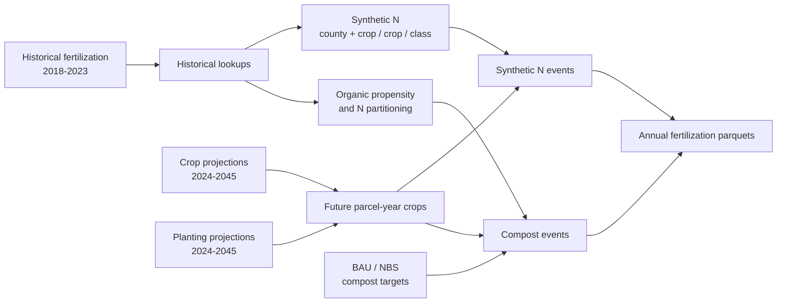

# Projection Session - Fertilization

What this session is for: This workflow projects fertilization events from 2024-2045 using the derived historical fertilization product, projected crop identity, projected planting dates, and the MAGiC BAU/NBS scenario tables.
it starts from the completed historical monitoring product and learns historical fertilization behavior from those derived events.

The projection has two main components:

1. **Synthetic N fertilization**
   - estimated from historical synthetic fertilizer events;
   - conditioned on crop identity and county when data are available;
   - shared between BAU and NBS.

2. **Organic amendment / compost**
   - statewide adoption and N/C application rates come from the BAU/NBS MAGiC scenario tables;
   - historical monitoring determines which parcels are more likely to receive compost and how amendment N is partitioned.

Final annual output columns are:

```text
event_type
parcel_id
date
nh4_n_kg_m2
org_n_kg_m2
org_c_kg_m2
```

The workflow assumes that crop and planting projections have already been completed.



---

## Paths for this session

Most users should only need to change `work_root`:

```r
work_root = "/path/to/your/folder"
```

Shared CCMMF data remain under:

```r
ccmmf_root = "/projectnb/dietzelab/ccmmf"
```

The expected user directory is:

```text
<work_root>/
├── crops_full_counties.csv
│   OR crop_year_states_cleaned.csv
│
├── crop_predictions/
│   ├── crop_identity_statewide_2024.parquet
│   ├── ...
│   └── crop_identity_statewide_2045.parquet
│
├── planting_projections/
│   ├── planting_statewide_2024.parquet
│   ├── ...
│   └── planting_statewide_2045.parquet
│
├── MAGiC_scenarios_FINAL/
│   ├── BAU_Targets.csv
│   └── NBS_Targets.csv
│
└── fertilization_projections/
    ├── BAU_Targets/
    └── NBS_Targets/
```

The main shared inputs are:

```text
/projectnb/dietzelab/ccmmf/
├── LandIQ-harmonized-v4.1.2/
│   └── crops_all_years.parq
├── management/
│   └── LandIQ_cropCode_lookup_table.csv
└── usr/akash/event_files/combined/v2.0/_output/
    └── fertilization.parquet
```

---

## 1. Setup and required inputs

The script uses:

```r
hist_years = 2018:2023
pred_years = 2024:2045
```

Required R packages are:

```text
data.table
arrow
bit64
dplyr
PEcAn.utils
```

Before running, confirm that the following exist:

```bash
ls "<work_root>/crop_predictions"
ls "<work_root>/planting_projections"
ls "<work_root>/MAGiC_scenarios_FINAL"
```

There should be one crop prediction and one planting projection for every year from 2024 through 2045.

The script also requires parcel acreage from either:

```text
<work_root>/crops_full_counties.csv
```

or:

```text
<work_root>/crop_year_states_cleaned.csv
```

If both exist, the first available file is used.

Parcel acreage is estimated as the median positive historical acreage for each parcel. Acreage is important because compost targets are allocated by **acres**, not by number of parcels.

Historical county assignment comes from:

```text
LandIQ-harmonized-v4.1.2/crops_all_years.parq
```

For each parcel, the latest county assignment available through 2023 is used.

County names are normalized to avoid future formatting errors. For example, values such as:

```text
Fresno County
Fresno
```

both become:

```text
fresno
```

---

## 2. Historical fertilization product

The historical reference product is:

```text
/projectnb/dietzelab/ccmmf/usr/akash/event_files/combined/v2.0/_output/fertilization.parquet
```

This is the **derived monitoring product** used as the basis for the future projection.

The script reads the required historical fields and accepts several common aliases:

```text
parcel_id OR site_id
crop_code OR code
event_member_id OR ens_id
```

Historical event fields are standardized to:

```text
parcel_id
date
crop_code
event_member_id
nh4_n_kg_m2
no3_n_kg_m2
org_n_kg_m2
org_c_kg_m2
```

Historical events are classified as organic if either:

```text
org_n_kg_m2 > 0
```

or:

```text
org_c_kg_m2 > 0
```

Otherwise they are treated as synthetic fertilization.

During the run, inspect:

```text
Historical fertilization rows: ...
Historical county match: ...%
```

The county-match percentage should be high. A low match usually indicates that the fertilization and LandIQ products are using incompatible parcel identifiers.

---

## 3. Historical fertilization lookups

Three pieces of historical information are carried into the future projection:

1. synthetic N amount;
2. probability of historical organic amendment use;
3. partitioning of amendment N between mineral and organic N.

### Synthetic N

Historical synthetic fertilizer can contain both:

```text
nh4_n_kg_m2
no3_n_kg_m2
```

The projection first reconstructs total historical inorganic N:

```r
inorg_n = nh4_n_kg_m2 + no3_n_kg_m2
```

For example:

```text
NH4 = 0.010 kg N/m2
NO3 = 0.010 kg N/m2

total inorganic N = 0.020 kg N/m2
```

Historical mean synthetic N is then calculated using the following fallback hierarchy:

```text
county + crop_code
        ↓
crop_code
        ↓
crop CLASS
        ↓
statewide/global mean
```

The most specific available value is used for each future crop.

This allows the projection to retain spatial and crop-specific historical behavior without failing when a particular county/crop combination is sparse.

### Organic amendment propensity

Historical records are also used to estimate how often a fertilized crop received an organic amendment.

The same fallback hierarchy is used:

```text
county + crop
    ↓
crop
    ↓
class
    ↓
global
```

This probability does **not** determine statewide compost adoption. It only helps determine which future parcels are more likely to receive compost once the scenario target is known.

### Organic N partitioning

For historical organic events, the script calculates:

```r
pan_frac = nh4 / (nh4 + org_n)
```

bounded between 0 and 1.

This historical fraction is later used to divide scenario compost N into:

```text
mineral N
organic N
```

using the same county/crop → crop → class → global fallback structure.

---

## 4. Future crop and planting design

Future crop identity comes from:

```text
<work_root>/crop_predictions/
```

Each annual crop file must contain:

```text
parcel_id
COUNTY
CLASS
SUBCLASS
```

If a `season` column is present, the current workflow requires:

```text
season = 2
```

because the current projection represents the dominant annual crop cycle.

`CLASS` and `SUBCLASS` are combined to recreate the LandIQ crop code used in the historical fertilization product.

Examples:

```text
CLASS = D
SUBCLASS = 1
-> D1
```

and:

```text
CLASS = D
SUBCLASS = NA
-> D
```

The current fertilization projection excludes:

```text
X
I
```

and missing crop classes.

There must be only one active future crop per:

```text
parcel_id + year
```

The script stops if duplicate parcel-year crop predictions are found.

### Planting anchors

Future planting dates come from:

```text
<work_root>/planting_projections/
```

with one file per year.

The planting lookup is matched using:

```text
parcel_id
year
crop_code
```

and provides:

```text
anchor = projected planting date
```

Every active future crop must have a valid planting anchor.

The crop lookup table is also used to classify crops broadly as:

```text
annual
perennial
```

for compost timing.

---

## 5. Synthetic N projection

Synthetic N is projected once and shared between BAU and NBS.

For each future parcel-year:

```text
future crop identity
+
county
+
historical synthetic-N lookup
+
projected planting date
```

produces one synthetic fertilization event.

The event date is:

```text
date = planting anchor
```

The historical total inorganic N amount is stored in:

```text
nh4_n_kg_m2
```

while:

```text
org_n_kg_m2 = 0
org_c_kg_m2 = 0
```

The final projection does not carry a separate NO3 column. Historical NH4 + NO3 are combined before projection so that the total historical inorganic N amount is retained.

Synthetic N is currently **not scenario-specific**.

For the same future parcel, crop, and year:

```text
BAU synthetic N = NBS synthetic N
```

Scenario differences enter through compost rather than synthetic fertilizer.

---

## 6. BAU/NBS compost projection

The scenario files are:

```text
BAU_Targets.csv
NBS_Targets.csv
```

The script reads these columns:

```text
Year
Acres_Total
Compost acres (CPS 808)
Compost N (lbs per acre)
Compost C (lbs per acre)
```

For each year, it calculates:

```r
compost_share =
  total compost acres /
  total scenario acres
```

Compost N and C rates are acreage-weighted when multiple scenario rows contribute to the annual target, then converted from:

```text
lb/acre
```

to:

```text
kg/m2
```

### Selecting parcels

The scenario controls the amount of acreage receiving compost.

Historical organic-amendment propensity controls which parcels are more likely to be selected.

Each future parcel receives a reproducible weighted random ranking:

```r
rank_key = -log(rand) / p_org
```

Higher historical organic propensity generally makes a parcel more likely to appear earlier in the ranking.

The script orders parcels by this ranking and adds parcel acreage until the scenario target acreage is reached.

Because parcels cannot be divided, realized compost acreage may be slightly larger than the exact target.

During the run the script reports:

```text
target=...% | realized=...% | organic parcels=...
```

### Compost timing and chemistry

Compost timing is relative to the projected planting date.

Current timing ranges are:

| Crop type | Compost timing |
|---|---:|
| Annual | 14-180 days before planting |
| Perennial | 30-210 days before planting |

For each selected parcel:

```r
date = planting anchor - offset_days
```

The scenario provides total compost N and C.

Historical `pan_frac` divides compost N into:

```r
nh4_n_kg_m2 =
  compost_n_kg_m2 * pan_frac

org_n_kg_m2 =
  compost_n_kg_m2 * (1 - pan_frac)

org_c_kg_m2 =
  compost_c_kg_m2
```

Therefore:

```text
Scenario table
    -> statewide compost acreage + total N/C rates

Historical monitoring
    -> parcel propensity + N partitioning
```

---

## 7. Run the workflow

After setting:

```r
work_root
```

run the script from the PEcAn/CCMMF environment.

For example:

```bash
Rscript fertilization_projection.R
```

Replace the filename if the script is stored under another name.

A successful run should look approximately like:

```text
Historical fertilization rows: ...
Historical county match: ...%

Shared synthetic events/year average: ...

Processing BAU_Targets
2024: target=...% | realized=...% | organic parcels=...
...
2045: target=...% | realized=...% | organic parcels=...
Finished BAU_Targets

Processing NBS_Targets
2024: target=...% | realized=...% | organic parcels=...
...
2045: target=...% | realized=...% | organic parcels=...
Finished NBS_Targets

Fertilization projection complete: ...
```

The random seed is fixed in the configuration:

```r
seed = 42L
```

so the same inputs and seed should reproduce the same parcel allocation and event timing.

---

## 8. Outputs

Outputs are written separately by scenario:

```text
fertilization_projections/
├── BAU_Targets/
│   ├── fertilization_statewide_2024.parquet
│   ├── ...
│   └── fertilization_statewide_2045.parquet
│
└── NBS_Targets/
    ├── fertilization_statewide_2024.parquet
    ├── ...
    └── fertilization_statewide_2045.parquet
```

There should be:

```text
22 BAU files
22 NBS files
```

Each annual file contains:

| Column | Description |
|---|---|
| `event_type` | `"fertilization"` |
| `parcel_id` | Harmonized parcel ID stored as int64 |
| `date` | Projected fertilization event date |
| `nh4_n_kg_m2` | Mineral N addition |
| `org_n_kg_m2` | Organic N addition |
| `org_c_kg_m2` | Organic C addition |

Internal projection variables such as:

```text
year
crop_code
p_org
pan_frac
rank_key
```

are intentionally not written to the final event files.

A parcel-year can have more than one row. For example, the same parcel can receive:

```text
one synthetic fertilizer event
+
one compost event
```

These are separate management events and should remain separate rows.

---

## 9. Quality control

After the workflow finishes, inspect both scenarios before handing the products downstream.

### File count

```r
length(list.files(
  file.path(
    work_root,
    "fertilization_projections",
    "BAU_Targets"
  ),
  pattern = "\\.parquet$"
))

length(list.files(
  file.path(
    work_root,
    "fertilization_projections",
    "NBS_Targets"
  ),
  pattern = "\\.parquet$"
))
```

Expected:

```text
22
22
```

### Inspect one year

```r
library(arrow)
library(dplyr)

x = read_parquet(
  file.path(
    work_root,
    "fertilization_projections",
    "BAU_Targets",
    "fertilization_statewide_2030.parquet"
  )
)

glimpse(x)
summary(x)
```

Check that:

```text
parcel_id is int64
dates are valid
N/C values are non-negative
required columns contain no NA values
```

### Synthetic vs compost rows

Synthetic rows should normally have:

```text
org_n_kg_m2 = 0
org_c_kg_m2 = 0
```

Compost rows should contain organic N and/or organic C.

For example:

```r
x |>
  mutate(
    type = if_else(
      org_n_kg_m2 > 0 | org_c_kg_m2 > 0,
      "compost",
      "synthetic"
    )
  ) |>
  count(type)
```

### BAU/NBS synthetic N

Synthetic N is intended to be shared between scenarios.

For the same year, synthetic-only rows should therefore be identical between BAU and NBS.

### Compost target vs realized share

Watch the console output:

```text
target = ...
realized = ...
```

The realized value should be close to the scenario target.

A small overshoot is expected because acreage is allocated using whole parcels.

A large difference should be investigated.

### Calendar dates

Compost events are assigned before planting.

For crops planted early in a year, a compost event can therefore occur in the previous calendar year even though it belongs to that projected crop year's output file.

This is expected and should not automatically be treated as an error.

---

## 10. Common problems

### `object 'work_root' not found`

Set the required user path at the top of the script:

```r
work_root = "/path/to/your/folder"
```

---

### `Could not find crops_full_counties.csv or crop_year_states_cleaned.csv`

The workflow cannot find parcel acreage.

Confirm that one of those files exists directly under:

```text
<work_root>/
```

---

### `No historical synthetic fertilizer events found`

No usable synthetic events were found in the historical 2018-2023 product.

Check:

```text
historical year range
fertilization product path
NH4/NO3 columns
organic-event classification
```

---

### `No historical organic amendment events found`

The historical product contains no rows with positive organic N or C.

The current compost projection needs historical organic events to estimate:

```text
organic propensity
N partitioning
```

---

### `Future crop predictions contain duplicate parcel-year rows`

The current projection expects one dominant future crop for each parcel-year.

Inspect the crop projection before continuing.

---

### `Future crop parcels are missing valid acreage`

Projected parcel IDs could not be matched to positive historical acreage.

Check parcel-ID consistency between crop projections and the acreage table.

---

### `Active future crop rows missing planting anchors`

The crop projection could not be matched to the planting projection using:

```text
parcel_id
year
crop_code
```

Check crop-code formatting and whether the planting projection contains the affected parcel/year.

---

### `invalid STATEWIDE annual compost share`

At least one scenario year produced:

```text
compost acres / total acres
```

outside the range 0-1.

Inspect the source MAGiC scenario table.

---

### `<scenario> missing target year <year>`

The scenario CSV does not contain all years required by:

```text
2024:2045
```

---

### `<scenario> <year> contains incomplete events`

One or more final events contain missing required values.

Trace the affected row back through:

```text
future crop
planting anchor
historical lookup
scenario target
```

rather than filling missing values after event generation.

---

## 11. Current assumptions and future extensions

The current fertilization projection is intended to be a transparent MVP rather than a deterministic prediction of management on individual farms.

Important current assumptions are:

- future crop identity is based on the dominant projected crop cycle;
- synthetic N is estimated from the derived historical fertilization product;
- historical means are used rather than drawing a new fertilizer-rate ensemble;
- synthetic N is shared between BAU and NBS;
- BAU/NBS scenario tables directly control compost adoption and compost N/C rates;
- historical organic-amendment behavior influences spatial allocation of compost;
- one reproducible parcel-level realization is generated using a fixed random seed.

The projected parcel assignments should therefore be interpreted as a plausible downscaling ofaggregate future management behavior, not as predictions 
that individual farms will follow a specific future fertilization schedule.

Future versions could add ensemble realizations for uncertainty in:

```text
crop identity
synthetic N amount
organic amendment probability
N partitioning
compost timing
```

The broader projection principle is:

```text
derived monitoring product
        +
future crop / timing products
        +
scenario constraints
        ↓
future management events
```

This keeps the projection workflows consistent with the monitoring products while avoiding duplication of the full upstream Inventory algorithms.