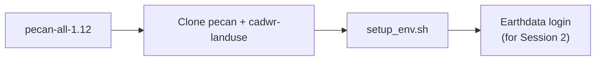

# Session 0 - Setup

**What this session is for.** Before downloading LandIQ or running HLS extracts, you need a working software stack, the pipeline code on disk, a data workspace with known path names, and (for Session 2) a NASA Earthdata login. This session gets that environment ready; it does not build inventory products yet.

**Prerequisite:** install `pecan-all-1.12` before this walkthrough if you do not already have it.

**Where to go deeper:** finished data layout and accounts in [pipeline.md](../pipeline.md); path names in [setup_env.sh](../setup_env.sh).

---

## Context

This is the inventory workflow: build the monitoring products used in MAGiC modeling and in the management projections.


Session 0 steps:



---

## 0.1 Environment

Log into the head node, activate `pecan-all-1.12`, and confirm the R and Python package checks pass. Examples below use `$HOME` -- change them if the environment lives somewhere else.

```bash
# SSH to your cluster head node.
# Default install path from setup-pecan-env.sh:
#   conda activate "$HOME/.conda/envs/pecan-all"
which conda
conda activate <ENV_PATH_OR_NAME>

which Rscript
Rscript -e 'stopifnot(
  requireNamespace("arrow"),
  requireNamespace("dplyr"),
  requireNamespace("data.table"),
  requireNamespace("sf"),
  requireNamespace("terra"),
  requireNamespace("exactextractr"),
  requireNamespace("readr"),
  requireNamespace("stringr"),
  requireNamespace("lubridate"),
  requireNamespace("jsonlite"),
  requireNamespace("units"),
  requireNamespace("CropScapeR")
)'

python - <<'PY'
import dask
import fiona
import geopandas
import numpy
import pandas
import pyarrow
import shapely
import tqdm
print("Python GIS dependencies: OK")
PY
```

Confirm both checks pass. If either fails, stop and fix the environment before continuing.

---

## 0.2 Repos

Clone the PEcAn monitoring branch. Pipeline scripts live under `modules/data.remote/inst/ccmmf` in that clone. Export that path as `$CCMMF_CODE`.

```bash
mkdir -p "$HOME/src" && cd "$HOME/src"

git clone https://github.com/sarahkanee/pecan.git
cd pecan
git fetch origin feature/ccmmf-statewide-monitoring-inst
git checkout feature/ccmmf-statewide-monitoring-inst

# Until merged to develop:
export CCMMF_CODE="$(pwd)/modules/data.remote/inst/ccmmf"
ls "$CCMMF_CODE"
# landiq-gapfill  phenology  events  hls  tillage  traits  ...
```

Geometry harmonization for Session 1 uses a separate repo, not under `$CCMMF_CODE`:

```bash
cd "$HOME/src"
git clone https://github.com/ccmmf/cadwr-landuse.git
```

---

## 0.3 `setup_env.sh`

Create a data workspace and source `setup_env` once per shell. That sets the inventory year pair, `$CCMMF_ROOT` defaults, and component roots under `$CCMMF_CODE`.

```bash
# Optional overrides before sourcing (defaults: 2023/2024, $HOME/ccmmf):
# export PRIOR_YEAR=2023 TARGET_YEAR=2024
# export CCMMF_ROOT=/path/to/data
source "$CCMMF_CODE/documentation/setup_env.sh"
```

---

## 0.4 Data directories

Finished layout and product handoffs: [Data layout](../pipeline.md). Data sources and accounts: [Data sources and accounts](../pipeline.md).

`setup_env` exports the path names; create the workspace once here. Later sessions only refer to these vars (no per-session mkdir).

```bash
mkdir -p "$LANDIQ_ROOT"/{raw,gapfilled}
mkdir -p "$CADWR_WORK_DIR"   # LANDIQ_HARMONIZED -> $CADWR_WORK_DIR/03-final after cadwr
mkdir -p "$HLS_ROOT"/{imagery,MSLSP}
mkdir -p "$CDL_DIR"
mkdir -p "$CLIMATE_ROOT"/{CHIRPS,CIMIS}
mkdir -p "$SOILS_ROOT"/SSURGO
mkdir -p "$LOOKUPS_ROOT"/{plant_traits,fertilization}
mkdir -p "$PRODUCTS_INVENTORY"/{phenology,tillage,fertilization,irrigation,event_files,demo}
mkdir -p "$PRODUCTS_PROJECTIONS"
```

---

## 0.5 NASA Earthdata

Create an Earthdata Login account and store credentials in `~/.netrc` for HLS downloads (Session 2).

1. Create a free account at [https://urs.earthdata.nasa.gov/](https://urs.earthdata.nasa.gov/)
2. Store credentials in `~/.netrc`:

```bash
# Replace USERNAME and PASSWORD with your Earthdata Login values
echo "machine urs.earthdata.nasa.gov login USERNAME password PASSWORD" > ~/.netrc
chmod 0600 ~/.netrc
```

---

## 0.6 Checklist

- [ ] `pecan-all-1.12` already installed
- [ ] Activated conda env; R and Python checks pass
- [ ] Cloned PEcAn monitoring branch; `$CCMMF_CODE` points at `inst/ccmmf`
- [ ] Cloned `cadwr-landuse` on `main`
- [ ] Sourced `setup_env.sh`; `$CCMMF_ROOT` and product/input roots set
- [ ] Created `$CCMMF_ROOT` workspace dirs (Sec. 0.4); know the finished layout ([Data layout](../pipeline.md))
- [ ] Earthdata account + `~/.netrc` ready (for Session 2)

**Next:** [Session 1 - LandIQ crop identity](01-landiq.md).

**Spine:** [pipeline.md](../pipeline.md).
