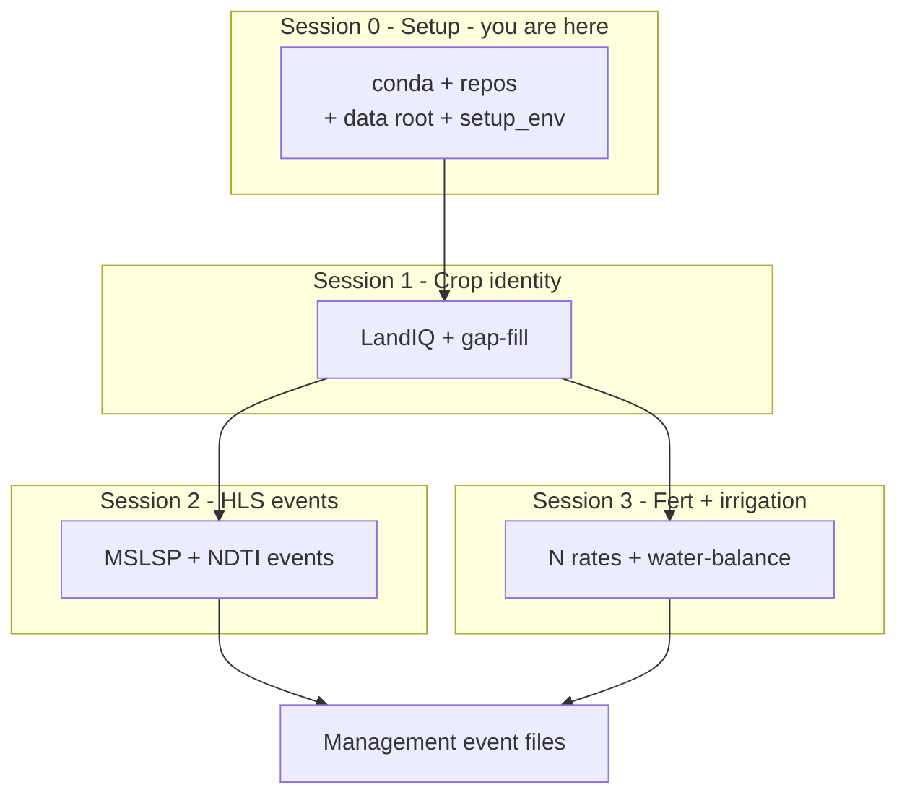

# Session 0 - Setup

**Deliverable:** a ready operating environment for the CCMMF Management Tracking
pipeline (inputs to the MAGIC annual inventory).

**Goal:** prepare a machine to run the operational year pair
(`TARGET_YEAR=2024`, `PRIOR_YEAR=2023`) for the California Cropland Monitoring
and Modeling Framework (CCMMF).

**Method / maturity:** environment and repository setup (not a data product).

**Prerequisite:** install `pecan-all-1.12` before this walkthrough if you do
not already have it. This session assumes that environment is already installed.

Paths below use `$HOME` as an example; replace them with writable locations on
your system.

---

## Where you are

Same flow as [pipeline.md](../pipeline.md). This session prepares the machine
before Session 1.



This session = Session 0 (env, repos, `$CCMMF_ROOT`, Earthdata).

---

## 0.1 Environment

Log into the head node, activate `pecan-all-1.12`, and confirm the R and Python
package checks pass.

```bash
# SSH to your cluster head node.
# Default install path from setup-pecan-env.sh:
#   conda activate "$HOME/.conda/envs/pecan-all"
which conda
conda activate <ENV_PATH_OR_NAME>

which Rscript
Rscript -e 'stopifnot(
  requireNamespace("arrow"),
  requireNamespace("dplyr"),
  requireNamespace("data.table"),
  requireNamespace("sf"),
  requireNamespace("terra"),
  requireNamespace("exactextractr"),
  requireNamespace("readr"),
  requireNamespace("stringr"),
  requireNamespace("lubridate"),
  requireNamespace("jsonlite"),
  requireNamespace("units"),
  requireNamespace("CropScapeR")
)'

python - <<'PY'
import dask
import fiona
import geopandas
import numpy
import pandas
import pyarrow
import shapely
import tqdm
print("Python GIS dependencies: OK")
PY
```

Confirm both checks pass. If either fails, stop and fix the environment before
continuing.

---


## 0.2 Repos

Clone the PEcAn monitoring branch and `cadwr-landuse`. Set `CCMMF_CODE` to
`modules/data.remote/inst/ccmmf` inside the PEcAn clone.

```bash
# Pick a writable code directory (e.g. $HOME):
mkdir -p "$HOME/src" && cd "$HOME/src"

git clone https://github.com/sarahkanee/pecan.git
cd pecan
git fetch origin feature/ccmmf-statewide-monitoring-inst
git checkout feature/ccmmf-statewide-monitoring-inst

# Scripts live here (until merged to develop):
export CCMMF_CODE="$(pwd)/modules/data.remote/inst/ccmmf"
ls "$CCMMF_CODE"
# landiq-gapfill  phenology  events  hls  tillage  traits  ...
```

After merge into `PecanProject/pecan`, clone upstream `develop` and use the same
`inst/ccmmf` path.

Geometry harmonization for LandIQ (Session 1) is a separate repository. Run its
Python scripts from the same activated conda environment.

```bash
cd "$HOME/src"
git clone https://github.com/ccmmf/cadwr-landuse.git
cd cadwr-landuse
```

---


## 0.3 Data root

Create `$CCMMF_ROOT` and `management/` for large inputs and pipeline outputs.
Runnable code stays in `$CCMMF_CODE`.

```bash
export CCMMF_ROOT="${CCMMF_ROOT:-$HOME/ccmmf}"
mkdir -p "$CCMMF_ROOT"/{data_raw/cadwr_land_use/landiq_shapefiles,data_phen/output,data_phen/HLS_data_sort/HLS30,CDL_data,LandIQ-harmonized-v4.1,LandIQ-harmonized-v4.1.2}

export CCMMF_MANAGEMENT="${CCMMF_MANAGEMENT:-$CCMMF_ROOT/management}"
mkdir -p "$CCMMF_MANAGEMENT"/{phenology,plant_traits,tillage,fertilization,irrigation,event_files}
```

**Layout:**

```text
$CCMMF_ROOT/
  data_raw/cadwr_land_use/landiq_shapefiles/   # LandIQ shapefiles by year
  LandIQ-harmonized-v4.1/                     # harmonized geometry + crops
  LandIQ-harmonized-v4.1.2/                   # gap-filled crop product
  data_phen/HLS_data_sort/HLS30/              # HLS reflectance (phenology layout)
  data_phen/output/                           # MSLSP_*.nc per tile
  CDL_data/                                   # cdl_YYYY.tif
  management/                                 # data hub for pipeline outputs
    phenology/raw_mslsp_v4.1.2/
    phenology/matched_landiq_mslsp_v4.1.2/
    plant_traits/
    tillage/ndti_v4.1/
    fertilization/                            # N / amendment lookups (Session 3)
    irrigation/                               # CHIRPS/CIMIS/SSURGO extracts + events (Session 3)
    event_files/
```

| Item | Path / format | Notes |
|------|---------------|--------|
| Code | `$CCMMF_CODE` -> `modules/data.remote/inst/ccmmf` | Runnable scripts |
| Data root | `$CCMMF_ROOT` (default `$HOME/ccmmf`) | Large inputs + products |
| Management hub | `$CCMMF_MANAGEMENT` | Phenology, tillage, traits, event_files |

---

## 0.4 `setup_env.sh`

Source once per shell so years and paths match Sec. 0.2-0.3. Defaults are
`PRIOR_YEAR=2023`, `TARGET_YEAR=2024`, data root `$HOME/ccmmf`.

```bash
source "$CCMMF_CODE/documentation/setup_env.sh"
```

That keeps years and component roots (`PHENOLOGY_ROOT`, `TILLAGE_ROOT`,
`EVENTS_ROOT`, ...) consistent for later sessions.

For a later year pair, or if you change directory layout, set years and/or paths
**before** sourcing:

```bash
export PRIOR_YEAR=2024
export TARGET_YEAR=2025
# export CCMMF_ROOT=...   # only if not using $HOME/ccmmf
source "$CCMMF_CODE/documentation/setup_env.sh"
```

---


## 0.5 NASA Earthdata

Create an Earthdata Login account and store credentials in `~/.netrc` for HLS
downloads (Session 2).

1. Create a free account at [https://urs.earthdata.nasa.gov/](https://urs.earthdata.nasa.gov/)
2. Store credentials in `~/.netrc`:

```bash
# Replace USERNAME and PASSWORD with your Earthdata Login values
echo "machine urs.earthdata.nasa.gov login USERNAME password PASSWORD" > ~/.netrc
chmod 0600 ~/.netrc
```

---


## 0.6 Checklist

- [ ] `pecan-all-1.12` already installed
- [ ] Activated conda env; R and Python checks pass
- [ ] Cloned PEcAn monitoring branch; `CCMMF_CODE` points at `inst/ccmmf` (`ls` shows landiq-gapfill, phenology, events, ...)
- [ ] Cloned `cadwr-landuse` on `main`
- [ ] `$CCMMF_ROOT` layout exists (`data_raw/`, `management/`, LandIQ dirs)
- [ ] Sourced `setup_env.sh`; `$PHENOLOGY_ROOT`, `$TILLAGE_ROOT`, `$EVENTS_ROOT` set
- [ ] Earthdata account + `~/.netrc` ready (for Session 2)

**Next:** [Session 1 - LandIQ crop identity](01-landiq.md).

**Spine:** [pipeline.md](../pipeline.md).