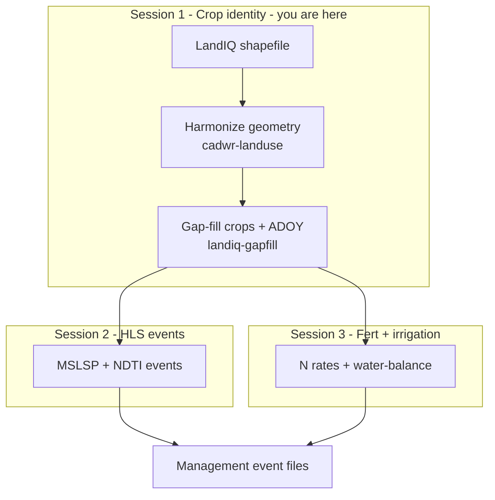

# Session 1 - LandIQ crop identity

**Deliverable:** gap-filled LandIQ crop identity for the year pair (stable
`parcel_id`, CLASS/SUBCLASS under the 2021 RS legend) for MAGIC Management
Tracking.

**Goal:** add a new LandIQ year to the existing CCMMF inventory product.
Harmonize field boundaries and crop labels with the existing parcel history so
the same field retains a stable parcel ID, then fill missing main-season crop
information. Together, harmonization and gap-filling create the crop identity
layer on which all downstream management products depend.

**Method class:** map + gap-fill. **Maturity:** production.

**Prerequisite:** complete [Session 0](00-setup.md), including activating
`pecan-all-1.12`, cloning both repos, creating the data root, and sourcing
`setup_env.sh`.

---

## Where you are

Same flow as [pipeline.md](../pipeline.md). This session builds crop identity.



This session = Session 1 box.

---

## 1.1 Download LandIQ 2024

LandIQ is California's field-level crop mapping product and the main source of
**crop identity** for CCMMF inventory modeling. It includes crop class,
subclass, and peak-greenness timing.

This is the only manual download on the LandIQ path. Later steps expect the
shapefile under `landiq_shapefiles/`.


| Item       | Value                                                                                                                                                                                                         |
| ---------- | ------------------------------------------------------------------------------------------------------------------------------------------------------------------------------------------------------------- |
| Portal     | [CNRA - Statewide Crop Mapping](https://data.cnra.ca.gov/dataset/statewide-crop-mapping) (California Natural Resources Agency)                                                                                |
| Resource   | **PROVISIONAL - 2024 Statewide Crop Mapping GIS Shapefile**                                                                                                                                                   |
| Direct ZIP | `[i15_crop_mapping_2024_provisional.zip](https://data.cnra.ca.gov/dataset/6c3d65e3-35bb-49e1-a51e-49d5a2cf09a9/resource/1a1c259c-4279-4868-a25f-b1f71665ca25/download/i15_crop_mapping_2024_provisional.zip)` |


Prefer the **shapefile** ZIP. From the same CNRA page, also download the current
**Land Use Legend** PDF (needed for Sec. 1.2). Unpack so files land here:

```text
$CCMMF_ROOT/data_raw/cadwr_land_use/landiq_shapefiles/
  i15_Crop_Mapping_2024_Provisional_SHP/
    i15_Crop_Mapping_2024_Provisional.shp   # + .dbf .shx .prj ...
```

You can unpack by hand into that layout, or run:

```bash
source "$CCMMF_CODE/documentation/setup_env.sh"

STAGING=$CCMMF_ROOT/data_raw/cadwr_land_use/_staging_${TARGET_YEAR}
DROP=$CCMMF_ROOT/data_raw/cadwr_land_use/landiq_shapefiles
FOLDER=i15_Crop_Mapping_${TARGET_YEAR}_Provisional_SHP
STEM=i15_Crop_Mapping_${TARGET_YEAR}_Provisional

mkdir -p "$STAGING" "$DROP/$FOLDER"
cd "$STAGING"

curl -L -o i15_crop_mapping_2024_provisional.zip \
  'https://data.cnra.ca.gov/dataset/6c3d65e3-35bb-49e1-a51e-49d5a2cf09a9/resource/1a1c259c-4279-4868-a25f-b1f71665ca25/download/i15_crop_mapping_2024_provisional.zip'

unzip -o i15_crop_mapping_2024_provisional.zip -d unpack
cp -a unpack/${STEM}.* "$DROP/$FOLDER/"
test -f "$DROP/$FOLDER/${STEM}.shp" && echo "OK: $DROP/$FOLDER/${STEM}.shp"
```

Sec. 1.3 points cadwr-landuse at this same `landiq_shapefiles/` folder.

---


## 1.2 Crop class/subclass harmonization (legend QC)

LandIQ legend codes differ by year (**2014**, **2016-2020**, **2021+**). The
crop-code lookup maps each stored `(CLASS, SUBCLASS)` pair onto one harmonized
set so later years stay comparable. Compare the legend PDF from Sec. 1.1 to the
lookup and add rows only if codes changed.

**For this training run, 2024 is unchanged** - no lookup edits.

Lookup: `[LandIQ_cropCode_lookup_table.csv](../../landiq-gapfill/data/LandIQ_cropCode_lookup_table.csv)`

---


## 1.3 Harmonize geometry

cadwr-landuse assigns stable `parcel_id`s across years and writes the multi-year
crop table plus geometry. Point it at the shapefiles from Sec. 1.1. Use the
default (`main`) branch; it auto-discovers years including **2024**.

Harmonization currently runs across all available years in the shapefile
directory. Future work will support adding one year without re-running the full
history.

**Note:** A full re-harmonization can be slow. Plan time for Sec. 1.3 before a
live walkthrough, or run it ahead and show the resulting product paths.

Use the current Python workflow in the
[cadwr-landuse README](https://github.com/ccmmf/cadwr-landuse#core-harmonization-workflow).
Keep the Session 0 conda environment active.

Point the workflow directories as follows:


| Directory                    | Value                                                   |
| ---------------------------- | ------------------------------------------------------- |
| Annual LandIQ shapefiles     | `$CCMMF_ROOT/data_raw/cadwr_land_use/landiq_shapefiles` |
| Harmonization working files  | `$CCMMF_ROOT/work/cadwr-landuse/v4.1`                   |
| Published harmonized product | `$CCMMF_ROOT/LandIQ-harmonized-v4.1`                    |


From the cadwr-landuse clone:

```bash
cd "$HOME/src/cadwr-landuse"

export LANDIQ_ROOT_DIR="$CCMMF_ROOT/data_raw/cadwr_land_use/landiq_shapefiles"
export CADWR_WORK_DIR="$CCMMF_ROOT/work/cadwr-landuse/v4.1"
mkdir -p "$CADWR_WORK_DIR"

# 1. Split all discovered years into tiles.
python scripts/01-split.py \
  --landiq-root-dir "$LANDIQ_ROOT_DIR" \
  --outdir-root "$CADWR_WORK_DIR"

# 2. Process all tiles on a compute node. Set workers to allocated cores.
python scripts/process-tiles-local.py \
  --ntasks 8 \
  --outdir-root "$CADWR_WORK_DIR" \
  --crs EPSG:3310 \
  --precision 10

# 3. Combine parcel geometry and finalize the multi-year crop table.
python scripts/03a-combine-parcels.py \
  --outdir-root "$CADWR_WORK_DIR"
python scripts/03b-finalize-crops.py \
  --landiq-root-dir "$LANDIQ_ROOT_DIR" \
  --outdir-root "$CADWR_WORK_DIR"
```

When finished, publish the generated `03-final/` output and point env at it:

```bash
mkdir -p "$CCMMF_ROOT/LandIQ-harmonized-v4.1"
cp -a "$CADWR_WORK_DIR/03-final/." \
  "$CCMMF_ROOT/LandIQ-harmonized-v4.1/"
export CCMMF_LANDIQ_V4=$CCMMF_ROOT/LandIQ-harmonized-v4.1
```

Confirm the required files and target year before gap-fill:

```bash
test -f "$CCMMF_LANDIQ_V4/parcels.gpkg"
test -f "$CCMMF_LANDIQ_V4/crops_all_years.parq"
Rscript -e 'd <- arrow::open_dataset(file.path(Sys.getenv("CCMMF_LANDIQ_V4"), "crops_all_years.parq")); target <- as.integer(Sys.getenv("TARGET_YEAR")); x <- dplyr::collect(dplyr::summarise(dplyr::filter(d, year == target), n = dplyr::n())); stopifnot(x$n[[1]] > 0); message("Found year ", target, ": ", x$n[[1]], " rows")'
```

---


## 1.4 Gap-fill 2023 + 2024

Some parcels lack crop information (`CLASS` / `SUBCLASS`) or peak-greenness day
(`ADOY`, adjusted day of year). Gap-fill focuses on **season 2** (the main
growing season) so every parcel has a usable main-crop record for phenology and
events.

Run the prior year and the new year together
(`${PRIOR_YEAR},${TARGET_YEAR}`). The prior year can then use the new series as
neighbor context. One command does both fills and includes USDA Cropland Data
Layer (CDL) download and extract for those years:

1. **CLASS / SUBCLASS** from CDL parcel fractions plus LandIQ history.
2. **ADOY** from the same parcel in other years, or typical peak day for that
  crop and county.

```bash
$LANDIQ_GAPFILL_ROOT/run_gapfill.sh ${PRIOR_YEAR},${TARGET_YEAR}
export CCMMF_LANDIQ_V4=$CCMMF_LANDIQ_GAPFILL_PRODUCT
```

Details (flags, provenance, rebuilds):
[landiq-gapfill/README.md](../../landiq-gapfill/README.md).

| Item | Path / format | Key columns / metadata |
|------|---------------|------------------------|
| Input | `$CCMMF_ROOT/data_raw/.../landiq_shapefiles/` | Annual shapefiles |
| Harmonized | `$CCMMF_ROOT/LandIQ-harmonized-v4.1/` (`parcels.gpkg`, `crops_all_years.parq`) | [metadata.md](../metadata.md) |
| Gap-filled | `$CCMMF_LANDIQ_GAPFILL_PRODUCT` (v4.1.2) | `CLASS`, `SUBCLASS`, `ADOY`; [crops_all_years_metadata.csv](../../landiq-gapfill/data/crops_all_years_metadata.csv) |

---

## 1.5 Checklist

- [ ] Sourced `setup_env.sh` from the clone
- [ ] Downloaded and unpacked 2024 provisional shapefile under `landiq_shapefiles/` (`.shp` present)
- [ ] Confirmed 2024 legend QC against `LandIQ_cropCode_lookup_table.csv` (harmonized codes use `legend_year == 2021`)
- [ ] Harmonized geometry; published to `$CCMMF_LANDIQ_V4` (`parcels.gpkg` + `crops_all_years.parq`)
- [ ] Confirmed `year == 2024` rows in `crops_all_years.parq`
- [ ] Ran `$LANDIQ_GAPFILL_ROOT/run_gapfill.sh ${PRIOR_YEAR},${TARGET_YEAR}`
- [ ] Pointed `CCMMF_LANDIQ_V4` at `$CCMMF_LANDIQ_GAPFILL_PRODUCT`; product opens as parquet
- [ ] Acceptance: gap-filled product is the crop-identity input for Sessions 2-3 and MAGIC Management Tracking

**Next:** [Session 2 - HLS events](02-phenology.md).

**Spine:** [pipeline.md](../pipeline.md).