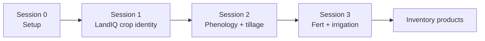
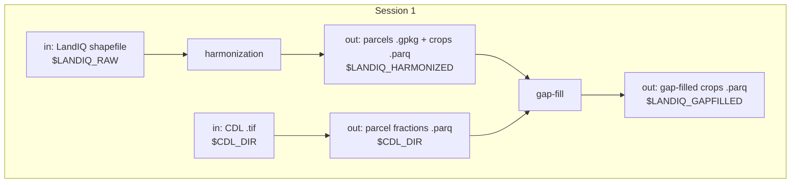

# Session 1 - LandIQ crop identity

**What this session is for.** Management Tracking needs a stable map of *which parcels exist* and *what they grew* for the inventory year pair. California's official field-level crop map is **LandIQ** (DWR / CADWR Statewide Crop Mapping -- same program, often called LandIQ). Each year DWR publishes a new statewide shapefile; parcel boundaries and crop attributes can change year to year. This session turns that annual release into two products every later session joins on:

1. **Harmonized LandIQ** -- one geometry layer with a stable `parcel_id` across years, plus a multi-year crop attribute table.
2. **Gap-filled LandIQ** -- the same table with missing season-2 crop identity and peak-greenness day (`ADOY`) filled where LandIQ is incomplete, so phenology matching and events can run statewide. (Within-year ADOY fill can also touch other seasons; see the gap-fill README.)

You are updating for **`TARGET_YEAR`** (this training example: **2024**, often still provisional) and refreshing **`PRIOR_YEAR`** (example: **2023**) so the prior year can use the new year as neighbor context in gap-fill. Geometry harmonization (Sec. 1.2) still rebuilds the full multi-year panel under `$LANDIQ_RAW` -- there is no "add one year" path yet.

**How to use this page.** This session is the guided inventory workflow: purpose, inputs/outputs, checks, and caveats for a routine year-pair update. Geometry harmonization is owned by a separate repo, [cadwr-landuse](https://github.com/ccmmf/cadwr-landuse) (branch `main`) -- Sec. 1.2 is the CCMMF integration step, not a second copy of that tutorial. Gap-fill methodology lives in [landiq-gapfill/README.md](../../landiq-gapfill/README.md). You should be able to place every step in the larger workflow from this page alone; open cadwr-landuse or the gap-fill README when you need to run, debug, or change the method.

**Prerequisite:** [Session 0](00-setup.md) (conda, `$CCMMF_CODE`, `cadwr-landuse` clone, sourced `setup_env.sh`, workspace dirs). If `$LANDIQ_RAW` (or other `$LANDIQ_*` vars) is empty in a new shell, re-run `source "$CCMMF_CODE/documentation/setup_env.sh"`.

**Where else to look:** product map [tree README](../../README.md); geometry method [cadwr-landuse](https://github.com/ccmmf/cadwr-landuse).





## Paths for this session

Expect Session 0 done. Paths come from [setup_env.sh](../setup_env.sh). Finished tree: [Data layout](00-setup.md#data-layout).

`$LANDIQ_HARMONIZED` **is** `$CADWR_WORK_DIR/03-final` (cadwr-landuse published finals -- not a second copy).

| Role | Path | Notes |
|------|------|-------|
| In | `$LANDIQ_RAW` | Annual LandIQ shapefiles |
| Work | `$CADWR_WORK_DIR` | cadwr-landuse intermediates |
| Out | `$LANDIQ_HARMONIZED` | `= $CADWR_WORK_DIR/03-final` (`parcels-consolidated.gpkg`, `crops_all_years.parq`) |
| In / out | `$CDL_DIR` | USDA Cropland Data Layer `.tif` + parcel fraction `.parq` |
| Out | `$LANDIQ_GAPFILLED` | Gap-filled `crops_all_years.parq` (includes `COVER` after Sec. 1.5) |

Walk Secs. 1.1–1.6 in order the first time. A one-shot shortcut for 1.4–1.6 is noted at the end -- use it only after you know what those steps do.

---

## 1.1 Download LandIQ

Source: [CNRA Statewide Crop Mapping](https://data.cnra.ca.gov/dataset/statewide-crop-mapping). Use the **GIS Shapefile** ZIP for each year. Also grab the current **Land Use Legend PDF** for Sec. 1.3.

On a routine update, download **two** years and put them under `$LANDIQ_RAW`:

| Year | Typical portal status | Action |
|------|----------------------|--------|
| `TARGET_YEAR` | Provisional | Add its folder under `$LANDIQ_RAW` |
| `PRIOR_YEAR` | Final (was provisional last cycle) | Replace the old provisional folder; drop `_Provisional` from the name |

Older years (2016+, as available) should already be under `$LANDIQ_RAW` from earlier inventory runs. Do not re-download them on a routine update -- only `PRIOR_YEAR` and `TARGET_YEAR` need a fresh ZIP. If `$LANDIQ_RAW` is empty, download the full historical series from the portal, not just the year pair.

For the training pair `PRIOR_YEAR=2023` / `TARGET_YEAR=2024`, the refreshed folders look like:

```text
$LANDIQ_RAW/
  ...
  i15_Crop_Mapping_2023_SHP/
    i15_Crop_Mapping_2023.shp
  i15_Crop_Mapping_2024_Provisional_SHP/
    i15_Crop_Mapping_2024_Provisional.shp
```

```bash
ls "$LANDIQ_RAW"/i15_Crop_Mapping_${PRIOR_YEAR}*/*.shp \
   "$LANDIQ_RAW"/i15_Crop_Mapping_${TARGET_YEAR}*/*.shp
```

---

## 1.2 Harmonize geometry

DWR publishes LandIQ as a separate statewide shapefile each year. Each field polygon in a given year has a year-specific identifier (`UniqueID` in the attribute table), but those IDs are not stable across years, and field boundaries also move (merge, split, grow, or shrink). Harmonization builds one consolidated parcel map with a stable **`parcel_id`** that tracks the same ground through time, and attaches each year's crop attributes to those parcels. Everything downstream (gap-fill, HLS phenology, fert, irrigation) joins on that `parcel_id`.

This work lives in a separate repo, **[cadwr-landuse](https://github.com/ccmmf/cadwr-landuse)** (clone from Session 0). Its README is the runbook for scripts, flags, and environment.

The two files produced by the harmonization workflow:

| File | Role |
|------|------|
| `parcels-consolidated.gpkg` | One geometry per `parcel_id`, with each year's native LandIQ UniqueID |
| `crops_all_years.parq` | Tidy crop attributes: rows for `parcel_id` x `year` x `season` (up to four seasons) |

**For this session:** you will not run cadwr-landuse. Download the provided finals from the lab S3 bucket and place them under `$LANDIQ_HARMONIZED`, then continue to legend QC.

```bash
# Replace with the bucket path shown in the session
aws s3 --profile magic cp s3://carb/management/crops/v4.2/parcels-consolidated.gpkg "$LANDIQ_HARMONIZED/"
aws s3 --profile magic cp s3://carb/management/crops/v4.2/crops_all_years.parq "$LANDIQ_HARMONIZED/"

ls "$LANDIQ_HARMONIZED/parcels-consolidated.gpkg" "$LANDIQ_HARMONIZED/crops_all_years.parq"
```

**To rebuild yourself later:** follow the cadwr-landuse README with `--landiq-root-dir "$LANDIQ_RAW"` and `--outdir-root "$CADWR_WORK_DIR"` so outputs land in `$LANDIQ_HARMONIZED`.

---

## 1.3 Legend QC

DWR has revised crop `CLASS` / `SUBCLASS` codes over time (legend versions: 2014, 2016-2020, 2021+). Our inventory standardizes on the **2021** remote-sensing legend (`legend_year == 2021` after harmonization / merge).

**How to check:**

1. Open the Land Use Legend PDF from Sec. 1.1 and our lookup [LandIQ_cropCode_lookup_table.csv](../../landiq-gapfill/data/LandIQ_cropCode_lookup_table.csv) (columns include `CLASS`, `SUBCLASS`, `CLASS_desc`, `SUBCLASS_desc`, `legend_year`).
2. Spot-check several crop types from the new PDF (especially any marked new or revised) against rows with `legend_year == 2021` in the CSV.
3. If the PDF has a `CLASS`/`SUBCLASS` pair that is missing from the 2021 rows, add a row (copy an existing 2021-style row and edit). If nothing new, leave the CSV alone.

**For this training run, 2024 is unchanged** -- no lookup edits. For a future year that does change codes, update the CSV and note it before gap-fill.

---

## 1.4 Gap-fill

Even after harmonization, LandIQ is incomplete on some parcels: the main-season crop may be missing, or the day when vegetation peaked (`ADOY`) may be missing or zero. We fill those gaps using the USDA **Cropland Data Layer (CDL)** -- a yearly national crop map -- so later sessions can run statewide.

You refresh both years in the pair here: the prior year is now final (updated in Sec. 1.1) and can use the new LandIQ year as neighbor context.

**Three different inputs (do not confuse them):**

| Piece | Description | Routine year-pair run |
|-------|-------------|------------------------|
| CDL GeoTIFF + parcel **fractions** | Per-parcel CDL composition for each year | Download/extract below if missing |
| CDL and LandIQ **probability** tables | `P(CDL \| CLASS)`, `P(CDL \| CLASS::SUBCLASS)`, and `P(SUBCLASS \| CLASS)` prior | Already under `landiq-gapfill/outputs/`; leave alone unless missing |
| **ADOY reference** tables | County/statewide average observed peak-greenness day (`ADOY`) by crop | Already under `landiq-gapfill/outputs/`; leave alone unless missing |

**Exact algorithms, fallbacks, training years, and full-gap-year behavior (e.g. 2017):** [landiq-gapfill/README.md](../../landiq-gapfill/README.md).

```bash
YEARS=${PRIOR_YEAR},${TARGET_YEAR}
CDL=$LANDIQ_GAPFILL_ROOT/scripts/cdl
GF=$LANDIQ_GAPFILL_ROOT/scripts/gapfill.R

Rscript $CDL/download_cdl_nass.R $YEARS
Rscript $CDL/extract_cdl_fractions_by_parcel.R $YEARS

# Rebuild shared tables only if missing or stale (usually leave commented):
# Rscript $GF cdl-landiq-probs
# Rscript $GF adoy-ref

Rscript $GF crop $YEARS
Rscript $GF adoy $YEARS
Rscript $GF merge $YEARS
```

On a routine update, leave the commented `cdl-landiq-probs` / `adoy-ref` rebuilds alone. Only uncomment them if `crop` or `adoy` errors that those tables are missing, or after a deliberate method/training-year change.

Gap-fill output after merge: `$LANDIQ_GAPFILLED/crops_all_years.parq`.

---

## 1.5 Cover flag

`COVER` marks seasons that look like **cover crops** (candidate CLASS/SUBCLASS and alternating from the previous cropped season on the same parcel). It is a derived flag for inventory/modeling, not a fill for missing LandIQ. Downstream steps expect this column. Run after merge (Sec. 1.4). Candidate codes and semantics: [landiq-gapfill/README.md](../../landiq-gapfill/README.md) (COVER section).

```bash
Rscript $LANDIQ_GAPFILL_ROOT/scripts/R/cover_crop_landiq.R
```

---

## 1.6 Inspect / QC

After gap-fill and COVER, skim the product, then summarize provenance for the year pair.

```bash
Rscript -e 'dplyr::glimpse(arrow::read_parquet(file.path(Sys.getenv("LANDIQ_GAPFILLED"), "crops_all_years.parq")))'

YEARS=${PRIOR_YEAR},${TARGET_YEAR}
Rscript $LANDIQ_GAPFILL_ROOT/scripts/gapfill.R qc $YEARS
```

Open `$LANDIQ_GAPFILL_ROOT/outputs/qc_gapfill_report.md`. For **season 2** in both `PRIOR_YEAR` and `TARGET_YEAR`, note the share of rows with `subclass_source` / `adoy_source` = `observed` vs modelled fill labels. Prefer high observed share; know the modelled % before shipping -- there is no single pass/fail threshold, but you should be able to state those fractions. How to read every provenance label: [landiq-gapfill/README.md](../../landiq-gapfill/README.md).

---

**Next:** [Session 2 - HLS events](02-phenology.md) -- expects `$LANDIQ_GAPFILLED/crops_all_years.parq`.

**Spine:** [tree README](../../README.md).

---

**Note (shortcut after you know the steps):** Secs. 1.4–1.6 can be run in one shot with `run_gapfill.sh` (CDL fraction ensure + crop + adoy + merge + `cover_crop_landiq.R` + qc). Walk 1.4–1.6 by hand the first time. The shell does **not** rebuild the probability / ADOY-ref tables unless you pass the flags.

```bash
$LANDIQ_GAPFILL_ROOT/run_gapfill.sh ${PRIOR_YEAR},${TARGET_YEAR}

# If outputs/ is missing CDL x LandIQ probs and/or ADOY refs:
# $LANDIQ_GAPFILL_ROOT/run_gapfill.sh --cdl-landiq-probs --adoy-ref ${PRIOR_YEAR},${TARGET_YEAR}
```
