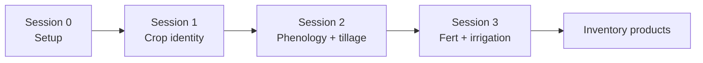
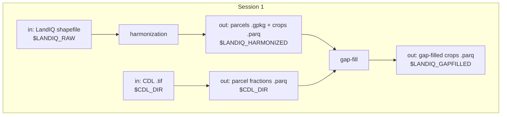

# Session 1 - LandIQ crop identity

**What this session is for.** Management Tracking needs a stable map of *which parcels exist* and *what they grew* for the inventory year pair. California's official field-level crop map is **LandIQ** (DWR / CADWR Statewide Crop Mapping -- same program, often called LandIQ). Each year DWR publishes a new statewide shapefile; parcel boundaries and crop attributes can change year to year. This session turns that annual release into two products every later session joins on:

1. **Harmonized LandIQ** -- one geometry layer with a stable `parcel_id` across years, plus a multi-year crop attribute table.
2. **Gap-filled LandIQ** -- the same table with missing main season crop identity and peak-greenness day (`ADOY`) filled where LandIQ is incomplete, so phenology matching and events can run statewide.

You are updating for `TARGET_YEAR` (this training example: **2024**, often still provisional) and refreshing `PRIOR_YEAR` (example: **2023**). The prior year is moving from provisional to final, and it can now use the new LandIQ year as neighbor context in gap-fill. 

Harmonization details live in [cadwr-landuse](https://github.com/ccmmf/cadwr-landuse) and gap-fill method lives in [landiq-gapfill/README.md](../../landiq-gapfill/README.md). Open those when you need flags, debugging, or a method change.







## Paths for this session

Expect Session 0 done. Paths come from [setup_env.sh](../setup_env.sh). Full tree: [Data layout](00-setup.md#data-layout).

```text
$CCMMF_ROOT/
  LandIQ/
    raw/                              # LANDIQ_RAW -- annual shapefiles
    work/                             # CADWR_WORK_DIR -- cadwr tiles + overlays
      03-final/                       # LANDIQ_HARMONIZED -- parcels-consolidated.gpkg + crops_all_years.parq
    gapfilled/                        # LANDIQ_GAPFILLED -- gap-filled crops_all_years.parq
  CDL/                                # CDL_DIR -- CDL .tif + parcel fraction .parq
```

Walk Secs. 1.1-1.6 in order the first time. A one-shot shortcut for 1.4-1.6 is noted at the end -- use it only after you know what those steps do.

---

> [!IMPORTANT]
> New terminal? Run [Session 0 Sec. 0.3](00-setup.md) first.


## 1.1 Download LandIQ

Get the statewide shapefiles from the [CNRA Statewide Crop Mapping](https://data.cnra.ca.gov/dataset/statewide-crop-mapping) portal (**GIS Shapefile** ZIP). `$LANDIQ_RAW` needs the full series (2016 on), not just the inventory pair. For this training run, pull the stack from the S3 bucket, then update the pair from the portal.

From the same portal, also download two PDFs:

- **Land Use Legend** -- crop `CLASS` / `SUBCLASS` codes (used in Sec. 1.3).
- **Metadata** -- in-depth description of the dataset itself, including what each column in the shapefile attribute table means (`UniqueID`, `CLASS`, `ADOY`, etc).

```bash
aws s3 --profile magic sync s3://carb/data/landiq_shapefiles/ "$LANDIQ_RAW/"
```

Then from the portal, put two years under `$LANDIQ_RAW`:


| Year                 | Typical portal status | Action                                                                                                              |
| -------------------- | --------------------- | ------------------------------------------------------------------------------------------------------------------- |
| `PRIOR_YEAR` (2023)  | Final                 | Replace `i15_Crop_Mapping_2023_Provisional_SHP/` with the final folder if needed; drop `_Provisional` from the name |
| `TARGET_YEAR` (2024) | Provisional           | Add `i15_Crop_Mapping_2024_Provisional_SHP/`                                                                        |


After that the tree should look like:

```text
$LANDIQ_RAW/
  i15_Crop_Mapping_2016_SHP/
  ...
  i15_Crop_Mapping_2023_SHP/
    i15_Crop_Mapping_2023.shp
  i15_Crop_Mapping_2024_Provisional_SHP/
    i15_Crop_Mapping_2024_Provisional.shp
```

```bash
ls "$LANDIQ_RAW"/i15_Crop_Mapping_*/*.shp
```

---


## 1.2 Harmonize geometry

Overlay every year in `$LANDIQ_RAW` into one parcel map and a multi-year crop table: split the state into tiles, track which polygons persist or change across years under a stable `parcel_id`, then join each year's crop attributes.

The two files that land in `$LANDIQ_HARMONIZED`:


| File                        | Role                                                                                       |
| --------------------------- | ------------------------------------------------------------------------------------------ |
| `parcels-consolidated.gpkg` | One geometry per `parcel_id`, with each year's native LandIQ UniqueID                      |
| `crops_all_years.parq`      | Long-format crop attributes: rows for `parcel_id` x `year` x `season` (up to four seasons) |


```bash
cd "$CCMMF_BASE/src/cadwr-landuse"

python scripts/01-split.py \
  --landiq-root-dir "$LANDIQ_RAW" \
  --outdir-root "$CADWR_WORK_DIR"

python scripts/process-tiles-local.py \    # ~3 hours
  --outdir-root "$CADWR_WORK_DIR" \
  --ntasks 8 \
  --crs EPSG:3310 \
  --precision 10.0

# Or, if you want to submit this step as a batch job:
# export OUTDIR_ROOT="$CADWR_WORK_DIR"
# sbatch scripts/process-tiles-local.sh

python scripts/03a-combine-parcels.py \
  --outdir-root "$CADWR_WORK_DIR"

python scripts/03b-finalize-crops.py \
  --landiq-root-dir "$LANDIQ_RAW" \
  --outdir-root "$CADWR_WORK_DIR"
```

`01-split.py` logs the discovered year list (expect 2016, 2018-2024). If a year you staged is missing from that log, fix `$LANDIQ_RAW` and re-run.

If this section was not run in advance, a current version is already on S3. Put those two files in `$LANDIQ_HARMONIZED` (same directory cadwr would have written -- `$CADWR_WORK_DIR/03-final` after Session 0). CDL extract and gap-fill look for `parcels-consolidated.gpkg` there.

```bash
aws s3 --profile magic cp s3://carb/management/crops/v4.2/parcels-consolidated.gpkg "$LANDIQ_HARMONIZED/"
aws s3 --profile magic cp s3://carb/management/crops/v4.2/crops_all_years.parq "$LANDIQ_HARMONIZED/"
ls "$LANDIQ_HARMONIZED/parcels-consolidated.gpkg" "$LANDIQ_HARMONIZED/crops_all_years.parq"
```

---


## 1.3 Legend QC

DWR has revised crop `CLASS` / `SUBCLASS` codes over time (legend versions: 2014, 2016-2020, 2021+). Our inventory standardizes on the **2021** remote-sensing legend (`legend_year == 2021` after harmonization / merge).

**How to check:**

1. Open the Land Use Legend PDF from Sec. 1.1 and our lookup [LandIQ_cropCode_lookup_table.csv](../../landiq-gapfill/data/LandIQ_cropCode_lookup_table.csv) (columns include `CLASS`, `SUBCLASS`, `CLASS_desc`, `SUBCLASS_desc`, `legend_year`).
2. Spot-check several crop types from the new PDF (especially any marked new or revised) against rows with `legend_year == 2021` in the CSV.
3. If the PDF has a `CLASS`/`SUBCLASS` pair that is missing from the 2021 rows, add a row (copy an existing 2021-style row and edit). If nothing new, leave the CSV alone.

**For this training run, 2024 is unchanged** -- no lookup edits. For a future year that does change codes, update the CSV and note it before gap-fill.

---


## 1.4 Gap-fill

Even after harmonization, LandIQ is incomplete on some parcels: the main-season crop may be missing, or the day when vegetation peaked (`ADOY`) may be missing or zero. We fill those gaps using the USDA **[Cropland Data Layer (CDL)](https://croplandcros.scinet.usda.gov/)** -- a yearly national crop map.

### CDL rasters and fractions

Two steps:

1. **Download** the statewide CDL GeoTIFF for each inventory year (NASS national 30 m, clipped to California) into `$CDL_DIR`.
2. **Extract parcel fractions.** Using `$LANDIQ_HARMONIZED/parcels-consolidated.gpkg`, overlay each parcel on that year's CDL raster and record the **area fraction** of every CDL crop code inside the polygon (not just the majority class). Write one parquet per year: `CDL_DIR/cdl_fractions_year=YYYY.parquet`.

```bash
CDL=$LANDIQ_GAPFILL_ROOT/scripts/cdl
GF=$LANDIQ_GAPFILL_ROOT/scripts/gapfill.R

Rscript $CDL/download_cdl_nass.R ${PRIOR_YEAR},${TARGET_YEAR}

# each year takes ~1 hour
Rscript $CDL/extract_cdl_fractions_by_parcel.R $PRIOR_YEAR    
Rscript $CDL/extract_cdl_fractions_by_parcel.R $TARGET_YEAR 

# Or, if you want to submit this step as a batch job:
# export CDL_YEAR=$PRIOR_YEAR
# sbatch $CDL/extract_cdl_fractions_by_parcel.sh
# export CDL_YEAR=$TARGET_YEAR
# sbatch $CDL/extract_cdl_fractions_by_parcel.sh

Rscript -e 'dplyr::glimpse(arrow::read_parquet(file.path(Sys.getenv("CDL_DIR"), paste0("cdl_fractions_year=", Sys.getenv("TARGET_YEAR"), ".parquet"))))'
```


### Probability and ADOY tables

Lookup tables are in `$LANDIQ_GAPFILL_ROOT/outputs/`. On a routine update, leave them alone.

For a given field, LandIQ reports a crop in CLASS / SUBCLASS codes and CDL reports a crop in its own integer codes. The tables count those pairs (row-normalized co-occurrence) and become the map between the two legends. Gap-fill uses that map when LandIQ is missing but CDL is present to look up which LandIQ crop usually goes with the CDL mix on that field.


| Table                      | File                                  | What it answers                                              |
| -------------------------- | ------------------------------------- | ------------------------------------------------------------ |
| `P(CDL \| CLASS)`           | `cdl_prob_by_class_*.parquet`         | Given LandIQ CLASS, which CDL codes usually appear           |
| `P(CDL \| CLASS::SUBCLASS)` | `cdl_prob_by_subclass_*.parquet`      | Given LandIQ CLASS::SUBCLASS, which CDL codes usually appear |
| `P(SUBCLASS \| CLASS)`      | `landiq_subclass_frequency_*.parquet` | Given LandIQ CLASS, which subclasses are most common         |


ADOY reference tables are county and statewide mean observed peak-greenness day by crop, plus a parcel-level history of observed `ADOY`. Gap-fill uses them when `ADOY` is missing or zero.


| File                                           | What it is                            |
| ---------------------------------------------- | ------------------------------------- |
| `adoy_mean_county_class_subclass_*.parquet`    | County x CLASS x SUBCLASS x season    |
| `adoy_mean_county_class_*.parquet`             | County x CLASS x season               |
| `adoy_mean_statewide_class_subclass_*.parquet` | Statewide x CLASS x SUBCLASS x season |
| `adoy_mean_statewide_class_*.parquet`          | Statewide x CLASS x season            |
| `adoy_observed_history_*.parquet`              | Parcel-level observed ADOY            |


The current tables were built from 2016-2023 for the CDL x LandIQ map (except 2017, which has no LandIQ) and from 2018-2023 for the ADOY means (those are the years with a usable observed peak day). That window already covers the crop mix and typical greenness dates we need, so a later inventory year just reads them -- there is nothing to recount unless you change the method or legend, or you want newer observed years in the training window. Rebuild only then, or if fill errors that a table is missing.

```bash
# Rscript $GF cdl-landiq-probs
# Rscript $GF adoy-ref
```


### Crop and ADOY fill

With those tables on disk, the next three commands do the actual fill: crop identity where LandIQ is missing, then peak-greenness day where `ADOY` is missing or zero, then merge both into the product. Run the pair together -- the prior year is now final (updated in Sec. 1.1) and can use the new LandIQ year as neighbor context.

```bash
YEARS=${PRIOR_YEAR},${TARGET_YEAR}
Rscript $GF crop $YEARS    # missing season-2 crop
Rscript $GF adoy $YEARS    # missing or zero ADOY
Rscript $GF merge $YEARS   # write $LANDIQ_GAPFILLED product
```

Output after merge: `$LANDIQ_GAPFILLED/crops_all_years.parq`.

---


## 1.5 Cover flag

`COVER` marks **cover-crop seasons**. LandIQ has no dedicated cover-crop class (it names cover crops under **G6** among other grain/hay uses; we also include mixed pasture and miscellaneous grasses, **P3** and **P6**). A season is flagged when that code is in a **non-dominant season** (not season 2), that year's **dominant** crop is not hay, grass, or pasture (CLASS not `G` or `P`), and the crop **differs from the previous cropped season** on the parcel (or this is the first cropped season). Derived for inventory/modeling, not a fill. Downstream steps expect this column. Run after merge (Sec. 1.4).

```bash
Rscript $LANDIQ_GAPFILL_ROOT/scripts/R/cover_crop_landiq.R
```

---


## 1.6 Inspect / QC

After gap-fill and COVER, run QC, glimpse the inventory-year product, then read the report.

```bash
YEARS=${PRIOR_YEAR},${TARGET_YEAR}
Rscript $LANDIQ_GAPFILL_ROOT/scripts/gapfill.R qc $YEARS

Rscript -e '
gapfilled <- arrow::open_dataset(
    file.path(Sys.getenv("LANDIQ_GAPFILLED"), "crops_all_years.parq")
) |>
    dplyr::filter(year %in% as.integer(c(
        Sys.getenv("PRIOR_YEAR"), Sys.getenv("TARGET_YEAR")
    ))) |>
    dplyr::collect()
dplyr::glimpse(gapfilled)
'

cat $LANDIQ_GAPFILL_ROOT/outputs/qc_gapfill_report.md
```

For **season 2** in both `PRIOR_YEAR` and `TARGET_YEAR`, note the share of rows with `subclass_source` / `adoy_source` = `observed` vs modelled fill labels. There is no single pass/fail threshold, but you should be able to state those fractions.

---

**Next:** [Session 2 - HLS events](02-phenology.md) -- expects `$LANDIQ_GAPFILLED/crops_all_years.parq`.

**Spine:** [tree README](../../README.md).

---

**Note (shortcut after you know the steps):** Secs. 1.4-1.6 can be run in one shot with `run_gapfill.sh` (CDL fraction ensure + crop + adoy + merge + cover + qc). Walk 1.4-1.6 by hand the first time. The shell does **not** rebuild the probability / ADOY-ref tables unless you pass the flags.

```bash
$LANDIQ_GAPFILL_ROOT/run_gapfill.sh ${PRIOR_YEAR},${TARGET_YEAR}

# If outputs/ is missing CDL x LandIQ probs and/or ADOY refs:
# $LANDIQ_GAPFILL_ROOT/run_gapfill.sh --cdl-landiq-probs --adoy-ref ${PRIOR_YEAR},${TARGET_YEAR}
```

