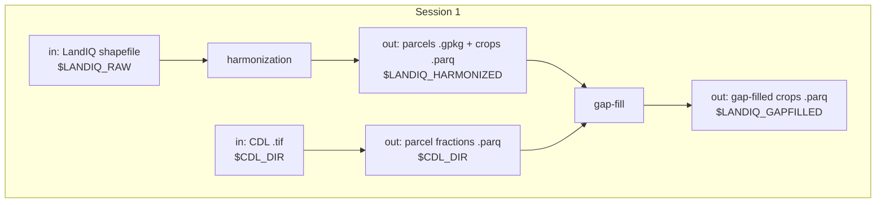

# Session 1 - LandIQ crop identity

**What this session is for.** Management Tracking needs a stable map of *which parcels exist* and *what they grew* for the inventory year pair. California's official field-level crop map is **LandIQ** (DWR / CADWR Statewide Crop Mapping -- same program, often called LandIQ). Each year DWR publishes a new statewide shapefile; parcel boundaries and crop attributes can change year to year. This session turns that annual release into two products every later session joins on:

1. **Harmonized LandIQ** -- one geometry layer with a stable `parcel_id` across years, plus a multi-year crop attribute table.
2. **Gap-filled LandIQ** -- the same table with missing season-2 crop identity and peak-greenness day (`ADOY`) filled where LandIQ is incomplete, so phenology matching and events can run statewide.

You are updating for **`TARGET_YEAR`** (this training example: **2024**, often still provisional) and refreshing **`PRIOR_YEAR`** (example: **2023**) in the same run so the prior year can use the new year as neighbor context. You do not re-download the prior year's shapefile.

**Prerequisite:** [Session 0](00-setup.md) (conda, `$CCMMF_CODE`, `cadwr-landuse` clone, sourced `setup_env.sh`, workspace dirs). If `$LANDIQ_RAW` (or other `$LANDIQ_*` vars) is empty in a new shell, re-run `source "$CCMMF_CODE/documentation/setup_env.sh"`.

**Where to go deeper:** product map [pipeline.md](../pipeline.md); geometry method [cadwr-landuse](https://github.com/ccmmf/cadwr-landuse); gap-fill method [landiq-gapfill/README.md](../../landiq-gapfill/README.md).




## Paths for this session

Expect Session 0 done. Paths come from [setup_env.sh](../setup_env.sh). Finished tree: [Data layout](../pipeline.md).

`$LANDIQ_HARMONIZED` **is** `$CADWR_WORK_DIR/03-final` (cadwr's published finals -- not a second copy).

| Role | Path | Notes |
|------|------|-------|
| In | `$LANDIQ_RAW` | Annual LandIQ shapefiles |
| Work | `$CADWR_WORK_DIR` | cadwr-landuse intermediates |
| Out | `$LANDIQ_HARMONIZED` | `= $CADWR_WORK_DIR/03-final` (`parcels-consolidated.gpkg`, `crops_all_years.parq`) |
| In / out | `$CDL_DIR` | USDA Cropland Data Layer `.tif` + parcel fraction `.parq` |
| Out | `$LANDIQ_GAPFILLED` | Gap-filled `crops_all_years.parq` |

Walk Secs. 1.1–1.6 in order the first time. A one-shot shortcut for 1.4–1.6 is noted at the end -- use it only after you know what those steps do.

---

## 1.1 Download LandIQ

LandIQ is published on the CNRA open-data portal as a statewide GIS package (shapefile or geodatabase). For this workflow we use the **shapefile** ZIP and place it under `$LANDIQ_RAW` in a year-specific folder so `cadwr-landuse` can discover every year that is present.

Also download the current **Land Use Legend PDF** from the same portal (needed in Sec. 1.2).

**Training example = 2024.** Portal links and the `curl` URL below are for the 2024 provisional release (`TARGET_YEAR=2024`). For a later year, pick that year's shapefile ZIP from the same portal and keep folder names consistent with `${TARGET_YEAR}`.

| Item | Value |
|------|-------|
| Portal | [CNRA - Statewide Crop Mapping](https://data.cnra.ca.gov/dataset/statewide-crop-mapping) |
| Resource | PROVISIONAL - 2024 Statewide Crop Mapping GIS Shapefile |
| ZIP | [i15_crop_mapping_2024_provisional.zip](https://data.cnra.ca.gov/dataset/6c3d65e3-35bb-49e1-a51e-49d5a2cf09a9/resource/1a1c259c-4279-4868-a25f-b1f71665ca25/download/i15_crop_mapping_2024_provisional.zip) |

Expected layout after unpack:

```text
$LANDIQ_RAW/
  i15_Crop_Mapping_2024_Provisional_SHP/
    i15_Crop_Mapping_2024_Provisional.shp   # + .dbf .shx .prj ...
```

Optional unpack helper (or download in a browser and copy the shapefile sidecars into place):

```bash
source "$CCMMF_CODE/documentation/setup_env.sh"

STAGING=$LANDIQ_ROOT/_staging_${TARGET_YEAR}
DROP=$LANDIQ_RAW
FOLDER=i15_Crop_Mapping_${TARGET_YEAR}_Provisional_SHP
STEM=i15_Crop_Mapping_${TARGET_YEAR}_Provisional

mkdir -p "$STAGING" "$DROP/$FOLDER"
cd "$STAGING"

# 2024 training URL -- replace for other years:
curl -L -o i15_crop_mapping_2024_provisional.zip \
  'https://data.cnra.ca.gov/dataset/6c3d65e3-35bb-49e1-a51e-49d5a2cf09a9/resource/1a1c259c-4279-4868-a25f-b1f71665ca25/download/i15_crop_mapping_2024_provisional.zip'

unzip -o i15_crop_mapping_2024_provisional.zip -d unpack
cp -a unpack/${STEM}.* "$DROP/$FOLDER/"
test -f "$DROP/$FOLDER/${STEM}.shp" && echo "OK: $DROP/$FOLDER/${STEM}.shp"
```

```bash
ls "$LANDIQ_RAW"/i15_Crop_Mapping_${TARGET_YEAR}_Provisional_SHP/*.shp
```

---

## 1.2 Legend QC

LandIQ crop `CLASS` / `SUBCLASS` codes are not frozen forever. DWR has used different legend eras (2014, 2016-2020, 2021+). Our inventory standardizes on the **2021** remote-sensing legend (`legend_year == 2021` after harmonization).

**How to check (training):**

1. Open the Land Use Legend PDF from Sec. 1.1 and our lookup [LandIQ_cropCode_lookup_table.csv](../../landiq-gapfill/data/LandIQ_cropCode_lookup_table.csv) (columns include `CLASS`, `SUBCLASS`, `CLASS_desc`, `SUBCLASS_desc`, `legend_year`).
2. Spot-check several crop types from the new PDF (especially any marked new or revised) against rows with `legend_year == 2021` in the CSV.
3. If the PDF has a `CLASS`/`SUBCLASS` pair that is missing from the 2021 rows, add a row (copy an existing 2021-style row and edit). If nothing new, leave the CSV alone.

**For this training run, 2024 is unchanged** -- no lookup edits. For a future year that does change codes, update the CSV and note it before gap-fill.

```bash
ls "$LANDIQ_GAPFILL_ROOT/data/LandIQ_cropCode_lookup_table.csv"
```

---

## 1.3 Harmonize geometry

### Why this step exists

Raw LandIQ is a separate shapefile each year. Field boundaries move: parcels merge, split, grow, or shrink. Year-specific `UniqueID`s therefore do not line up for time series work. Harmonization builds a single consolidated parcel map with a stable **`parcel_id`**, and attaches each year's crop attributes to those parcels. Everything downstream (gap-fill, HLS extract, fert, irrigation) joins on that `parcel_id`.

That work lives in a separate repo, [cadwr-landuse](https://github.com/ccmmf/cadwr-landuse) (clone from Session 0; use branch `main`). Algorithm detail: that repo's README.

### What you get

| Output | Role |
|--------|------|
| `parcels-consolidated.gpkg` | One geometry per `parcel_id`, plus links to each year's native LandIQ UniqueID |
| `crops_all_years.parq` | Tidy crop attributes: rows for `parcel_id` x `year` x `season` (up to four seasons) |

Finals appear under `$LANDIQ_HARMONIZED` (`$CADWR_WORK_DIR/03-final`).

### Runtime note

A full re-harmonization overlays hundreds of thousands of polygons across **all** years present under `$LANDIQ_RAW`. The tile overlay (`process-tiles-local.py`) is the expensive step -- typically on the order of **several hours on a multi-core compute node** (not the login node); wall time depends on cores and I/O. Plan an interactive or batch compute job, or **run cadwr ahead of the training** and bring an existing `$LANDIQ_HARMONIZED` (`03-final` with both files) into the session so you can continue at Sec. 1.4.

Future tooling may support adding one year without replaying the full history; today, a new LandIQ year means a full cadwr run that discovers every year folder under `$LANDIQ_RAW`.

**Environment:** prefer the [cadwr-landuse](https://github.com/ccmmf/cadwr-landuse) **pixi** env for the Python scripts below (`pixi run` as in that README). The Session 0 conda env can work if it has the same GIS stack (geopandas, pyarrow, etc.); if imports fail, use pixi for this section only, then return to conda for gap-fill (R).

### Run the pipeline

Inputs: shapefiles under `$LANDIQ_RAW`. Work: `$CADWR_WORK_DIR`.

Steps, in order:

1. **`01-split.py`** -- discover years, align CRS, split California into tiles (fast; not parallel).
2. **`process-tiles-local.py`** -- per-tile iterative overlay across years (slow; compute node; set `--ntasks` to allocated cores). Snaps vertices in California Albers (`EPSG:3310`) at `--precision 10` meters to limit slivers.
3. **`03a-combine-parcels.py`** -- stack tiles, dissolve duplicates split by tiling, write the consolidated parcel GeoPackage.
4. **`03b-finalize-crops.py`** -- join parcel IDs back to original LandIQ attributes and write `crops_all_years.parq`.

```bash
cd "$HOME/src/cadwr-landuse"

export LANDIQ_ROOT_DIR="$LANDIQ_RAW"

python scripts/01-split.py \
  --landiq-root-dir "$LANDIQ_ROOT_DIR" \
  --outdir-root "$CADWR_WORK_DIR"

# Compute node: set --ntasks to allocated cores
python scripts/process-tiles-local.py \
  --ntasks 8 \
  --outdir-root "$CADWR_WORK_DIR" \
  --crs EPSG:3310 \
  --precision 10

python scripts/03a-combine-parcels.py \
  --outdir-root "$CADWR_WORK_DIR"
python scripts/03b-finalize-crops.py \
  --landiq-root-dir "$LANDIQ_ROOT_DIR" \
  --outdir-root "$CADWR_WORK_DIR"

ls "$LANDIQ_HARMONIZED/parcels-consolidated.gpkg" "$LANDIQ_HARMONIZED/crops_all_years.parq"
```

---

## 1.4 Gap-fill

Harmonization preserves observed LandIQ attributes; it does not invent missing crops. For inventory use we still need the main growing season (**season 2**) **crop identity** (`CLASS` / `SUBCLASS`) and **peak greenness day** (`ADOY`) as complete as practical. Gap-fill patches those gaps for both years in the pair using the USDA **Cropland Data Layer (CDL)** and shipped lookup tables. Geometry and `parcel_id` are unchanged; provenance columns (`subclass_source`, `adoy_source`) record observed vs modelled fills.

You refresh the prior year here so it can use the new LandIQ year as neighbor context; you do not re-download the prior shapefile. Methods, flags, and data model: [landiq-gapfill/README.md](../../landiq-gapfill/README.md).

**Three different inputs (do not confuse them):**

| Piece | Role | Routine year-pair run |
|-------|------|------------------------|
| CDL GeoTIFF + parcel **fractions** | Per-parcel CDL composition for each year | Download/extract below if missing |
| CDL x LandIQ **probability** tables | Crop-identity fill model | Already under `outputs/`; leave alone unless missing |
| **ADOY reference** tables | Peak-greenness fill model | Already under `outputs/`; leave alone unless missing |

On a routine update, leave the commented `cdl-landiq-probs` / `adoy-ref` rebuilds alone. Only uncomment them if `crop` or `adoy` errors that those tables are missing, or after a deliberate method/training-year change.

```bash
YEARS=${PRIOR_YEAR},${TARGET_YEAR}
CDL=$LANDIQ_GAPFILL_ROOT/scripts/cdl
GF=$LANDIQ_GAPFILL_ROOT/scripts/gapfill.R

Rscript $CDL/download_cdl_nass.R $YEARS
Rscript $CDL/extract_cdl_fractions_by_parcel.R $YEARS

# Rebuild shared tables only if missing or stale (usually leave commented):
# Rscript $GF cdl-landiq-probs
# Rscript $GF adoy-ref

Rscript $GF crop $YEARS
Rscript $GF adoy $YEARS
Rscript $GF merge $YEARS
```

Gap-fill output: `$LANDIQ_GAPFILLED/crops_all_years.parq` (after merge). Continue with Sec. 1.5–1.6.

Confirm CDL inputs and the merged product exist:

```bash
ls "$CDL_DIR/cdl_${PRIOR_YEAR}.tif" "$CDL_DIR/cdl_${TARGET_YEAR}.tif" \
   "$CDL_DIR/cdl_fractions_year=${PRIOR_YEAR}.parquet" \
   "$CDL_DIR/cdl_fractions_year=${TARGET_YEAR}.parquet" \
   "$LANDIQ_GAPFILLED/crops_all_years.parq"
```

---

## 1.5 Cover flag (required; not gap-fill)

`COVER` marks seasons that look like **cover crops** (candidate CLASS/SUBCLASS and alternating from the previous cropped season on the same parcel). It is a derived flag for inventory/modeling, not a fill for missing LandIQ. Downstream steps expect this column. Run after merge (Sec. 1.4).

```bash
Rscript $LANDIQ_GAPFILL_ROOT/scripts/R/cover_crop_landiq.R
```

---

## 1.6 Inspect / QC

After gap-fill and COVER, skim the product, then summarize provenance for the year pair.

```bash
Rscript -e 'dplyr::glimpse(arrow::read_parquet(file.path(Sys.getenv("LANDIQ_GAPFILLED"), "crops_all_years.parq")))'

YEARS=${PRIOR_YEAR},${TARGET_YEAR}
Rscript $LANDIQ_GAPFILL_ROOT/scripts/gapfill.R qc $YEARS
```

Open `$LANDIQ_GAPFILL_ROOT/outputs/qc_gapfill_report.md`. For **season 2** in both `PRIOR_YEAR` and `TARGET_YEAR`, note the share of rows with `subclass_source` / `adoy_source` = `observed` vs modelled (or equivalent fill labels in the report). Prefer high observed share; know the modelled % before shipping -- there is no single pass/fail threshold, but you should be able to state those fractions.

---

## 1.7 Checklist

- [ ] Env from Session 0 still active (or re-sourced `setup_env.sh`; `$LANDIQ_*` set)
- [ ] 2024 shapefile under `$LANDIQ_RAW/` (`.shp` present)
- [ ] Legend QC done (2024: no CSV edits; know how you would add a row if needed)
- [ ] Cadwr finals at `$LANDIQ_HARMONIZED` (`03-final` gpkg + parq)
- [ ] CDL + fractions + gap-filled parq present
- [ ] Glimpsed product; recorded season-2 observed vs modelled shares from the QC report for both years

**Next:** [Session 2 - HLS events](02-phenology.md).

**Spine:** [pipeline.md](../pipeline.md).

---

**Note (shortcut after you know the steps):** Secs. 1.4–1.6 can be run in one shot with `run_gapfill.sh` (CDL fraction ensure + crop + adoy + merge + `cover_crop_landiq.R` + qc). Walk 1.4–1.6 by hand the first time. The shell does **not** rebuild the probability / ADOY-ref tables unless you pass the flags.

```bash
$LANDIQ_GAPFILL_ROOT/run_gapfill.sh ${PRIOR_YEAR},${TARGET_YEAR}

# If outputs/ is missing CDL x LandIQ probs and/or ADOY refs:
# $LANDIQ_GAPFILL_ROOT/run_gapfill.sh --cdl-landiq-probs --adoy-ref ${PRIOR_YEAR},${TARGET_YEAR}
```
