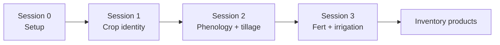
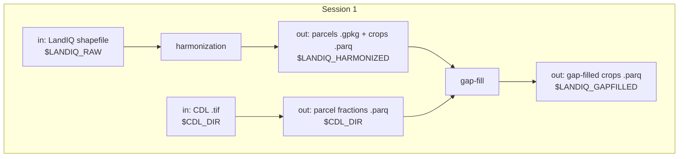

# Session 1 - LandIQ crop identity

**What this session is for.** Management Tracking needs a stable map of *which parcels exist* and *what they grew* for the inventory year pair. California's official field-level crop map is **LandIQ** (DWR / CADWR Statewide Crop Mapping -- same program, often called LandIQ). Each year DWR publishes a new statewide shapefile; parcel boundaries and crop attributes can change year to year. This session turns that annual release into two products every later session joins on:

1. **Harmonized LandIQ** -- one geometry layer with a stable `parcel_id` across years, plus a multi-year crop attribute table.
2. **Gap-filled LandIQ** -- the same table with missing season-2 crop identity and peak-greenness day (`ADOY`) filled where LandIQ is incomplete, so phenology matching and events can run statewide. (Within-year ADOY fill can also touch other seasons; see the gap-fill README.)

You are updating for **`TARGET_YEAR`** (this training example: **2024**, often still provisional) and refreshing **`PRIOR_YEAR`** (example: **2023**) so the prior year can use the new year as neighbor context in gap-fill. Geometry harmonization (Sec. 1.2) still rebuilds the full multi-year panel under `$LANDIQ_RAW` -- there is no "add one year" path yet.

**How to use this page.** This session is the guided inventory workflow: purpose, inputs/outputs, checks, and caveats for a routine year-pair update. Geometry harmonization is owned by a separate repo, [cadwr-landuse](https://github.com/ccmmf/cadwr-landuse) (branch `main`) -- Sec. 1.2 is the CCMMF integration step, not a second copy of that tutorial. Gap-fill methodology lives in [landiq-gapfill/README.md](../../landiq-gapfill/README.md). You should be able to place every step in the larger workflow from this page alone; open cadwr-landuse or the gap-fill README when you need to run, debug, or change the method.





## Paths for this session

Expect Session 0 done. Paths come from [setup_env.sh](../setup_env.sh). Full tree: [Data layout](00-setup.md#data-layout).

```text
$CCMMF_ROOT/
  LandIQ/
    raw/                              # LANDIQ_RAW -- annual shapefiles
    work/                             # CADWR_WORK_DIR -- cadwr tiles + overlays
      03-final/                       # LANDIQ_HARMONIZED -- parcels-consolidated.gpkg + crops_all_years.parq
    gapfilled/                        # LANDIQ_GAPFILLED -- gap-filled crops_all_years.parq
  CDL/                                # CDL_DIR -- CDL .tif + parcel fraction .parq
```

Walk Secs. 1.1–1.6 in order the first time. A one-shot shortcut for 1.4–1.6 is noted at the end -- use it only after you know what those steps do.

---

## 1.1 Download LandIQ

Each year DWR publishes a statewide LandIQ shapefile on the [CNRA Statewide Crop Mapping](https://data.cnra.ca.gov/dataset/statewide-crop-mapping) portal (use the **GIS Shapefile** ZIP). The newest year is usually **provisional**; the previous year's provisional is typically replaced by a **final** on the same cycle.

Sec. 1.2 builds one parcel map by overlaying **all** of those annual shapefiles, so `$LANDIQ_RAW` needs the full series, not just the inventory year pair. For this training run you do not download history from the portal: pull last year's stack from the lab S3 cache (2016-2022 finals plus **2023 provisional**), then update the year pair the way an operational inventory would -- replace 2023 provisional with the new final, and add **2024** provisional.

From the same portal, also download two PDFs:

- **Land Use Legend** -- crop `CLASS` / `SUBCLASS` codes (used in Sec. 1.3).
- **Metadata** -- in-depth description of the dataset itself, including what each column in the shapefile attribute table means (`UniqueID`, `CLASS`, `ADOY`, acreage, and the rest).

```bash
aws s3 --profile magic sync s3://carb/data/landiq_shapefiles/2016-2023/ "$LANDIQ_RAW/"
```

Then from the portal, put two years under `$LANDIQ_RAW`:

| Year | Typical portal status | Action |
|------|----------------------|--------|
| `PRIOR_YEAR` (2023) | Final (was provisional on S3) | Replace `i15_Crop_Mapping_2023_Provisional_SHP/` with the final folder; drop `_Provisional` from the name |
| `TARGET_YEAR` (2024) | Provisional | Add `i15_Crop_Mapping_2024_Provisional_SHP/` |

After that the tree should look like:

```text
$LANDIQ_RAW/
  i15_Crop_Mapping_2016_SHP/
  ...
  i15_Crop_Mapping_2023_SHP/
    i15_Crop_Mapping_2023.shp
  i15_Crop_Mapping_2024_Provisional_SHP/
    i15_Crop_Mapping_2024_Provisional.shp
```

```bash
ls "$LANDIQ_RAW"/i15_Crop_Mapping_*/*.shp
```

---

## 1.2 Harmonize geometry

Each field polygon in a given year has a year-specific identifier (`UniqueID` in the attribute table), but those IDs are not stable across years, and field boundaries also move (merge, split, grow, or shrink). Harmonization builds one consolidated parcel map with a stable **`parcel_id`** that tracks the same ground through time, and attaches each year's crop attributes to those parcels. Everything downstream (gap-fill, HLS phenology/tillage, fert, irrigation) joins on that `parcel_id`.

This work lives in a separate repo, **[cadwr-landuse](https://github.com/ccmmf/cadwr-landuse)** (clone from Session 0). Its README is the runbook for scripts, flags, and environment.

The two files produced by the harmonization workflow:

| File | Role |
|------|------|
| `parcels-consolidated.gpkg` | One geometry per `parcel_id`, with each year's native LandIQ UniqueID |
| `crops_all_years.parq` | Tidy crop attributes: rows for `parcel_id` x `year` x `season` (up to four seasons) |

From the cadwr-landuse clone, with the Session 0 conda env active:

```bash
cd "$CCMMF_BASE/src/cadwr-landuse"

python scripts/01-split.py \
  --landiq-root-dir "$LANDIQ_RAW" \
  --outdir-root "$CADWR_WORK_DIR"

python scripts/process-tiles-local.py \
  --outdir-root "$CADWR_WORK_DIR" \
  --ntasks 8 \
  --crs EPSG:3310 \
  --precision 10.0

python scripts/03a-combine-parcels.py \
  --outdir-root "$CADWR_WORK_DIR"

python scripts/03b-finalize-crops.py \
  --landiq-root-dir "$LANDIQ_RAW" \
  --outdir-root "$CADWR_WORK_DIR"
```

This takes about 3 hours (the tile overlays dominate). If it was not run in advance, a current version is already on S3 -- pull that into `$LANDIQ_HARMONIZED` and continue on:

```bash
aws s3 --profile magic cp s3://carb/management/crops/v4.2/parcels-consolidated.gpkg "$LANDIQ_HARMONIZED/"
aws s3 --profile magic cp s3://carb/management/crops/v4.2/crops_all_years.parq "$LANDIQ_HARMONIZED/"
```

---

## 1.3 Legend QC

DWR has revised crop `CLASS` / `SUBCLASS` codes over time (legend versions: 2014, 2016-2020, 2021+). Our inventory standardizes on the **2021** remote-sensing legend (`legend_year == 2021` after harmonization / merge).

**How to check:**

1. Open the Land Use Legend PDF from Sec. 1.1 and our lookup [LandIQ_cropCode_lookup_table.csv](../../landiq-gapfill/data/LandIQ_cropCode_lookup_table.csv) (columns include `CLASS`, `SUBCLASS`, `CLASS_desc`, `SUBCLASS_desc`, `legend_year`).
2. Spot-check several crop types from the new PDF (especially any marked new or revised) against rows with `legend_year == 2021` in the CSV.
3. If the PDF has a `CLASS`/`SUBCLASS` pair that is missing from the 2021 rows, add a row (copy an existing 2021-style row and edit). If nothing new, leave the CSV alone.

**For this training run, 2024 is unchanged** -- no lookup edits. For a future year that does change codes, update the CSV and note it before gap-fill.

---

## 1.4 Gap-fill

Even after harmonization, LandIQ is incomplete on some parcels: the main-season crop may be missing, or the day when vegetation peaked (`ADOY`) may be missing or zero. We fill those gaps using the USDA **[Cropland Data Layer (CDL)](https://croplandcros.scinet.usda.gov/)** -- a yearly national crop map.

### CDL rasters and fractions

Download both years of CDL, then extract per-parcel fractions on the new harmonized parcels.

```bash
YEARS=${PRIOR_YEAR},${TARGET_YEAR}
CDL=$LANDIQ_GAPFILL_ROOT/scripts/cdl
GF=$LANDIQ_GAPFILL_ROOT/scripts/gapfill.R

Rscript $CDL/download_cdl_nass.R $YEARS
Rscript $CDL/extract_cdl_fractions_by_parcel.R $YEARS

Rscript -e 'dplyr::glimpse(arrow::read_parquet(file.path(Sys.getenv("CDL_DIR"), paste0("cdl_fractions_year=", Sys.getenv("TARGET_YEAR"), ".parquet"))))'
```

### Probability and ADOY tables

These already live under `landiq-gapfill/outputs/`. Leave them alone on a routine update.

| Table | What it is |
|-------|------------|
| CDL and LandIQ probability | `P(CDL \| CLASS)`, `P(CDL \| CLASS::SUBCLASS)`, and `P(SUBCLASS \| CLASS)` prior |
| ADOY reference | County/statewide average observed peak-greenness day by crop |

Rebuild only if `crop` or `adoy` errors that a table is missing, or after a deliberate method/training-year change:

```bash
# Rscript $GF cdl-landiq-probs
# Rscript $GF adoy-ref
```

### Crop and ADOY fill

Run both years in the pair. The prior year is now final (updated in Sec. 1.1) and can use the new LandIQ year as neighbor context.

```bash
Rscript $GF crop $YEARS
Rscript $GF adoy $YEARS
Rscript $GF merge $YEARS
```

Output after merge: `$LANDIQ_GAPFILLED/crops_all_years.parq`.

**Exact algorithms, fallbacks, training years, and full-gap-year behavior (e.g. 2017):** [landiq-gapfill/README.md](../../landiq-gapfill/README.md).

---

## 1.5 Cover flag

`COVER` marks seasons that look like **cover crops** (candidate CLASS/SUBCLASS and alternating from the previous cropped season on the same parcel). It is a derived flag for inventory/modeling, not a fill for missing LandIQ. Downstream steps expect this column. Run after merge (Sec. 1.4). Candidate codes and semantics: [landiq-gapfill/README.md](../../landiq-gapfill/README.md) (COVER section).

```bash
Rscript $LANDIQ_GAPFILL_ROOT/scripts/R/cover_crop_landiq.R
```

---

## 1.6 Inspect / QC

After gap-fill and COVER, skim the product, then summarize provenance for the year pair.

```bash
Rscript -e 'dplyr::glimpse(arrow::read_parquet(file.path(Sys.getenv("LANDIQ_GAPFILLED"), "crops_all_years.parq")))'

YEARS=${PRIOR_YEAR},${TARGET_YEAR}
Rscript $LANDIQ_GAPFILL_ROOT/scripts/gapfill.R qc $YEARS
```

Open `$LANDIQ_GAPFILL_ROOT/outputs/qc_gapfill_report.md`. For **season 2** in both `PRIOR_YEAR` and `TARGET_YEAR`, note the share of rows with `subclass_source` / `adoy_source` = `observed` vs modelled fill labels. Prefer high observed share; know the modelled % before shipping -- there is no single pass/fail threshold, but you should be able to state those fractions. How to read every provenance label: [landiq-gapfill/README.md](../../landiq-gapfill/README.md).

---

**Next:** [Session 2 - HLS events](02-phenology.md) -- expects `$LANDIQ_GAPFILLED/crops_all_years.parq`.

**Spine:** [tree README](../../README.md).

---

**Note (shortcut after you know the steps):** Secs. 1.4–1.6 can be run in one shot with `run_gapfill.sh` (CDL fraction ensure + crop + adoy + merge + `cover_crop_landiq.R` + qc). Walk 1.4–1.6 by hand the first time. The shell does **not** rebuild the probability / ADOY-ref tables unless you pass the flags.

```bash
$LANDIQ_GAPFILL_ROOT/run_gapfill.sh ${PRIOR_YEAR},${TARGET_YEAR}

# If outputs/ is missing CDL x LandIQ probs and/or ADOY refs:
# $LANDIQ_GAPFILL_ROOT/run_gapfill.sh --cdl-landiq-probs --adoy-ref ${PRIOR_YEAR},${TARGET_YEAR}
```
