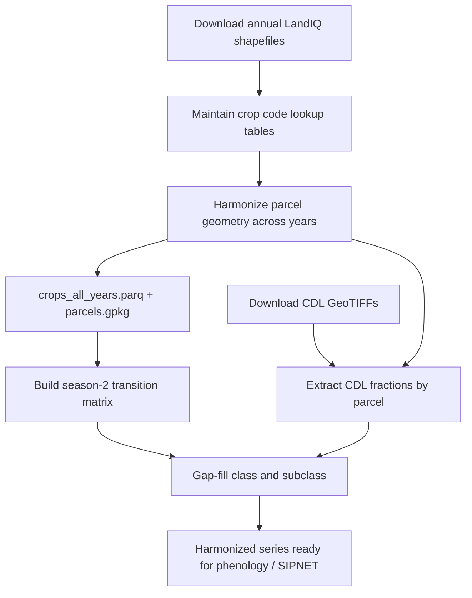

# Training Session 1 — LandIQ crop mapping and gap-fill

This session documents how CCMMF builds **harmonized statewide parcel crop data** from
California DWR LandIQ, fills missing years and incomplete rows, and produces the tabular
and spatial products used downstream (HLS phenology, NDTI, SIPNET inputs).

**Audience:** CARB staff or contractors reproducing or extending the workflow (2016–2023
production series; 2024+ as a test case).

**Operator reference (run commands, QC, troubleshooting):**
[landiq-gapfill/README.md](../../landiq-gapfill/README.md) and
[landiq-gapfill/scripts/cdl/README.md](../../landiq-gapfill/scripts/cdl/README.md).

**Navigation:** [Documentation index](../README.md) · [Session 0 — Environment](00-environment.md) ·
[Full pipeline](../pipeline.md) · [Session 2 — Phenology](02-phenology.md)

**Canonical code locations (BU / NCSA):**

| Topic | Path |
|-------|------|
| Harmonized LandIQ v4.1 (geometry + tabular) | `/projectnb/dietzelab/ccmmf/LandIQ-harmonized-v4.1/` |
| Gap-filled product (downstream input) | `/projectnb/dietzelab/ccmmf/LandIQ-harmonized-v4.1.2/` |
| Geometry harmonization pipeline | `/projectnb/dietzelab/ccmmf/usr/ashiklom/cadwr-landuse/` |
| Crop lookup, gap-fill orchestrator | `/projectnb/dietzelab/ccmmf/management/landiq-gapfill/` |

---

## 1.1 Background

The CCMMF workflow uses **freely available** LandIQ (DWR statewide crop mapping) and **Harmonized Landsat Sentinel-2 (HLS)** imagery to build field-level inputs for the open ecosystem model **SIPNET**.

**LandIQ** provides statewide **parcels** as the unit of analysis. For each parcel and water year, LandIQ reports:

- **CLASS** / **SUBCLASS** — crop type (hierarchical codes)
- **season** (1–4) — up to four crop cycles per water year (season 2 is the main summer crop for gap-fill)
- **PCNT** — percent of parcel area for that crop row
- **ADOY** — adjusted day-of-year for peak NDVI (when available)
- Irrigation, multi-cropping (**MULTIUSE**), and other attributes

**Years available from DWR:** 2014, 2016, 2018–2024 (2023–2024 often provisional until finalized).

**Why the workflow starts in 2016**

1. **UniqueID** — stable parcel identifiers across years begin in 2016.
2. **Sentinel-2** — adequate revisit for phenology begins ~2015; the remote-sensing stack assumes post-2015 cadence.

**Why 2017 is special**

DWR did **not** release a 2017 statewide LandIQ product. We **gap-fill 2017** using:

- LandIQ in **2016** and **2018** (neighboring years)
- USDA **Cropland Data Layer (CDL)** for 2017 (external crop labels)
- A **class transition matrix** (season-2 crop changes year-to-year)
- **CDL ↔ LandIQ emission** tables for subclass assignment

**Within-year gap-fill**

For years that *do* have LandIQ, some parcel-years still lack season-2 class/subclass. The same statistical machinery fills **season 2 only** (with documented exceptions for 2016 and 2023). SIPNET and matching scripts expect **complete** crop labels up front; missingness is handled in preprocessing, not in the model.

---

## 1.2 End-to-end workflow (overview)



| Step | Product | Primary outputs |
|------|---------|-----------------|
| 1. Download LandIQ | Raw annual shapefiles | One folder per water year |
| 2. Crop mappings | Lookup tables | `LandIQ_cropCode_lookup_table.csv` (+ harmonize CSVs under `cdl/`) |
| 3. Harmonize geometry | Cross-year **parcel_id** | `parcels.gpkg`, `parcels-consolidated.gpkg`, `crops_all_years.parq` |
| 4. Transition matrix | P(next crop \| prior crop), season 2 | Ananya's `/projectnb/dietzelab/ananyak/transition_matrix.csv` (used as-is) |
| 5. Gap-fill (+ CDL) | CDL rasters/fractions, then filled class/subclass/ADOY | `CDL_data/cdl_YYYY.tif`, `cdl/cdl_fractions_year=YYYY.parquet`, `landiq-gapfill/outputs/` |

---

## 1.3 Step 1 — Download LandIQ from DWR

**Source:** [California Natural Resources Agency — Statewide Crop Mapping](https://data.cnra.ca.gov/dataset/statewide-crop-mapping) (Land Use Mapping program, partnership with DWR).

**What to download:** Statewide **shapefile** (or geodatabase) for each water year you need.

**Where to put it on SCC:**

```text
/projectnb/dietzelab/ccmmf/data_raw/cadwr_land_use/landiq_shapefiles/
  i15_Crop_Mapping_2024_SHP/                    # or ..._2024_Provisional_SHP/
    i15_Crop_Mapping_2024.shp                   # (+ .dbf .shx .prj …)
```

Match the naming style of existing year folders (e.g. `i15_Crop_Mapping_2023_Provisional_SHP/`).
After upload, wire the path into `cadwr-landuse` (`01-split.py`, `03b-finalize-crops.py`, …)
— those scripts currently hardcode years through 2023.

**Legend:** On the dataset page, use the **Land Use Legend** to see DWR class groupings and which **CLASS/SUBCLASS** each LandIQ code represents.

**Code set versions (important for new years):**

| Era | Years | Notes |
|-----|-------|-------|
| Early | 2014 | Not used in CCMMF 2016+ series |
| Middle | 2016–2020 | Mostly stable; some subclass differences vs later years |
| Current | 2021–2024 | RS legend updates (e.g. 2023 harmonized subclasses); check legend before assuming codes match 2016 |

For each new release year, **compare the published legend to** `management/LandIQ_cropCode_lookup_table.csv` and update rows when DWR adds or renames codes.

**Intake (tabular, per year):** Legacy R helpers that convert a shapefile to long format live under:

`/projectnb/dietzelab/ccmmf/usr/ashiklom/cadwr-landuse/scripts/CARB_LandIQ_intake_script.R`

These functions (`get_CARB_data`, `shapefile_grab`) pivot wide season columns to long `season` rows. The **v4.1 harmonized pipeline** (below) replaces ad-hoc CSV builds for production.

---

## 1.4 Step 2 — Crop mapping tables

Two CSV files in `management/` drive almost all downstream logic.

### `LandIQ_cropCode_lookup_table.csv` (single source of truth)

**One file** for crop metadata and cross-year harmonization. DWR legends: `management/documentation/2016_DWR Standard Land Use Legend Comparison.pdf` and `2023_DWR_Legend.pdf` (Nov **2021** RS legend for WY 2021+).

| Column | Purpose |
|--------|---------|
| `CLASS`, `SUBCLASS` | Codes as stored in `crops_all_years.parq` (CLASS is not harmonized) |
| `legend_year` | DWR legend vintage for this stored pair: **2016** or **2021** |
| `harmonized_SUBCLASS` | **Use downstream** — target subclass on the 2021 RS legend (e.g. `T15`→`32`, `F6`→`16`) |
| `is_agricultural`, `PFT`, descriptions | Matching, gap-fill ag filter, traits |

CDL disambiguation for grouped RS codes **`T31`** and **`D16`** lives in `management/LandIQ_grouped_subclass_cdl_split.csv` (not in the crop lookup).

**Do not edit the parquet by hand.** Scripts apply harmonization at read time via `landiq-gapfill/scripts/_lib/landiq_rs_harmonize.R` (loads this CSV only).

### `cdl_to_landiq_lookup.csv` (optional — not production gap-fill)

- Used only for **QC** and legacy **`build_landiq_from_cdl.R`**. All gap-fill steps (full-year and within-year) use emission tables from `01_build_lookup.R` / `02_build_probs.R`.

Reference: `management/scripts/phenology/gapfill/GAPFILL_LOOKUP_AND_LEGEND.md`

---

## 1.5 Step 3 — Harmonize parcel geometry across years

**Goal:** Assign a stable **`parcel_id`** to each field polygon even when DWR **UniqueID** boundaries merge, split, or shift between years.

**Implementation:** Python **tile-based polygon overlay** (not a single `harmonizeGeometry.R` script). Full documentation:

`/projectnb/dietzelab/ccmmf/usr/ashiklom/cadwr-landuse/README.md`

**Pipeline summary:**

| Script | Action |
|--------|--------|
| `scripts/01-split.py` | Tile California; write per-year geoparquet tiles |
| `scripts/02-process-tile.py` | Iterative overlay per tile (parallel array job on HPC) |
| `scripts/03a-combine-parcels.py` | Merge tiles → **`parcels.gpkg`** |
| `scripts/03b-finalize-crops.py` | Join attributes → **`crops_all_years.parq`** |

**Published v4.1 directory:**

```
/projectnb/dietzelab/ccmmf/LandIQ-harmonized-v4.1/
  parcels.gpkg                 # All parcel geometries + yearly UniqueID columns
  parcels-consolidated.gpkg    # Subset used for heavy raster extraction (CDL, HLS)
  crops_all_years.parq         # Long table: parcel_id × year × season (+ crop attributes)
```

**Environment variable used everywhere:**

```bash
export CCMMF_LANDIQ_V4=/projectnb/dietzelab/ccmmf/LandIQ-harmonized-v4.1
```

**Note:** The writing-retreat draft mentioned `parcels-metadata.parquet`; v4.1 uses the GPKG + `crops_all_years.parq` pair above. Column-level documentation is in `cadwr-landuse/metadata.md`.

**Adding a new LandIQ year (e.g. 2024 test case):**

1. Download provisional shapefile from CNRA.
2. Re-run or extend the harmonization pipeline through `03b-finalize-crops.py` (or incremental update if your team has one).
3. Refresh lookup tables for any new codes.
4. Re-run transition matrix and gap-fill (including CDL fractions for that year) if needed.

---

## 1.6 Step 4 — Season-2 transition matrix

**Goal:** A table of **P(crop_next | crop_from)** for the **same parcel** and **season 2**, for consecutive calendar years. Rows sum to 1 within each `crop_from`. Used for **class gap-fill** (forward message from neighboring year) and scenario work.

**Source:** Ananya's pre-computed matrix on SCC, used as-is. Do not rebuild.

```text
/projectnb/dietzelab/ananyak/transition_matrix.csv
```

The gap-fill class step reads this path by default (overridable via `EXTERNAL_TRANSITION_MATRIX_CSV`). Rows and columns are the ag CLASS labels in `LandIQ_cropCode_lookup_table.csv`.

---

## 1.7 Step 5 — Gap-fill crop class and subclass

Two tasks:

1. **Entire missing year (2017)** — no LandIQ file; fill season 2 for parcels that have a season-2 ag CLASS in **both** neighboring years (2016 and 2018). See "Parcel coverage" below.
2. **Within-year gap fill** — LandIQ exists but season-2 class/subclass missing on some parcels. Handled by `landiq-gapfill/scripts/run_gapfill_crop_year.R` using the same emission tables as the full-year pipeline.

Gap-fill needs **USDA CDL** as parcel-level **fractions** (native integer codes, not pre-mapped to LandIQ). Download and extract are part of this step, not a separate workflow.

### Parcel coverage — what the 2017 fill does (and doesn't) cover

The geometry comes from step 3 (`parcels-consolidated.gpkg`). Alexey's overlay is **seeded from 2018** and accumulates 2019–2023, so each `parcel_id` is a real or refined 2018 field boundary. There is no separate "2017 polygon set."

For the 2017 fill, `run_gapfill_crop_year.R` (full-year mode) operates on the **intersection** of three sets, all keyed by `parcel_id`:

1. parcels with a season-2 **ag CLASS in 2016**, **and**
2. parcels with a season-2 **ag CLASS in 2018**, **and**
3. parcels with **nonzero 2017 CDL mass** in the lookup's training code set.

Concretely, this means:

- Parcels surveyed in only one of 2016 / 2018 (e.g. a field that first appears in 2018) are **not filled** — they have no neighboring-year pair, so the forward/backward transition signals don't exist.
- Non-ag neighbor labels (e.g. urban, water) also drop the parcel from the 2017 fill.
- Parcels with no overlapping CDL training codes in 2017 (rare) are dropped.

In short: the workflow inherits whatever polygons Alexey's 2018-seeded overlay produced, and then only fills the subset that has valid ag neighbors on both sides. Bounding years may use a single neighbor until an adjacent LandIQ year is available (`gapfill_config.R`).

### CDL inputs (download and fractions)

**USDA Cropland Data Layer (CDL)** is a statewide 30 m crop map. For 2017 we have no LandIQ; for all gap-fill years we compare **native CDL codes** on each parcel to LandIQ classes learned from other years (see emission build below). You need harmonized **`parcels-consolidated.gpkg`** before extracting.

**Years:** at minimum **2017**; production training uses **2016–2023** excluding 2017 (controlled by the `CDL_LANDIQ_TRAINING_YEAR_MIN/MAX/EXCLUDE_YEARS` env vars consumed by `01_build_lookup.R`).

CDL download and parcel-fraction extraction are part of the gap-fill package. For current
commands and paths, see [landiq-gapfill/scripts/cdl/README.md](../../landiq-gapfill/scripts/cdl/README.md).

Rasters: `/projectnb/dietzelab/ccmmf/CDL_data/cdl_YYYY.tif`. Fraction parquets are written
under the gap-fill package data layout (see CDL README).

### Run gap-fill (`landiq-gapfill`)

**Use the orchestrator** — one command chains CDL (if needed), crop fill, ADOY, product
build, and QC. Full step-by-step:

[landiq-gapfill/README.md](../../landiq-gapfill/README.md)

```bash
export LANDIQ_GAPFILL_ROOT=/projectnb/dietzelab/ccmmf/management/landiq-gapfill
export CCMMF_LANDIQ_V4=/projectnb/dietzelab/ccmmf/LandIQ-harmonized-v4.1
export CCMMF_LANDIQ_GAPFILL_PRODUCT=/projectnb/dietzelab/ccmmf/LandIQ-harmonized-v4.1.2

module load R/4.4.3
$LANDIQ_GAPFILL_ROOT/run_gapfill.sh 2023,2024    # new year + rerun prior year

# Cluster:
qsub -l buyin -l h_rt=8:00:00 -v 'GAPFILL_ARGS=2023,2024' \
  $LANDIQ_GAPFILL_ROOT/sge/run_gapfill.sge
```

| Step | Script | Writes |
|------|--------|--------|
| 1 | `run_gapfill_crop_year.R <Y>` | subclass assignment + within-year fill parquets |
| 2 | `run_gapfill_adoy_year.R <Y>` | `landiq_adoy_gapfill_year=<Y>.parquet` |
| 3 | `build_landiq_gapfill_product.R` | gap-filled `crops_all_years.parq` |
| 4 | `build_landiq_stub_year.R <Y>` | `stubs/landiq_stub_year=<Y>/` (full-gap years) |

Emission lookup/probability tables are built automatically on first run. **Outputs in `landiq-gapfill/outputs/`.** Lookup and probability filenames
carry a suffix encoding the training-year span (default `2016-2023_excl2017`):

- `cdl_landiq_subclass_lookup_<suffix>.parquet` — fraction-weighted CDL × `CLASS::SUBCLASS` (raw mass)
- `cdl_landiq_subclass_lookup_dominant_<suffix>.parquet` — dominant-CDL-per-parcel version
- `landiq_subclass_frequency_<suffix>.parquet` — subclass priors within each class
- `cdl_prob_by_class_<suffix>.parquet` — P(CDL code \| CLASS)
- `cdl_prob_by_subclass_<suffix>.parquet` — P(CDL code \| CLASS::SUBCLASS)
- `cdl_landiq_subclass_coverage_<suffix>.csv`, `..._dominant_<suffix>.csv` — coverage QC
- `cdl_codes_seen_<suffix>.csv` — native CDL codes that showed up in training

### Class gap-fill (concept)

For gap year **t** between known neighboring years **t−1** and **t+1**:

1. **Forward:** transition matrix from class at **t−1**
2. **Backward:** transition from class at **t+1**
3. **CDL likelihood:** gap-year **native** CDL fractions × emission matrix **E** (P(native CDL code | LandIQ class), learned from training years — not `cdl_to_landiq_lookup.csv`)

Average the three class belief vectors (**equal weights**), take **MAP** → `map_class_avg_mean3`.

Implementation: `landiq-gapfill/scripts/_lib/gapfill_class.R` (reads `cdl_prob_by_class_<suffix>.parquet`)

### Subclass gap-fill (concept)

Given MAP class at **t**:

1. **Plurality** from LandIQ history on the panel (ag season 2)
2. Else **CDL evidence** conditional on class (native CDL codes, harmonized subclasses)
3. Else subclass **frequency** within the predicted class
4. Else `"**"` (unspecified subclass)

Implementation: `landiq-gapfill/scripts/_lib/gapfill_subclass.R` (reads `cdl_prob_by_subclass_<suffix>.parquet` and `landiq_subclass_frequency_<suffix>.parquet`)

### Rebuild emission tables only

```bash
GAPFILL_REBUILD_EMISSION=1 Rscript landiq-gapfill/scripts/01_build_lookup.R
Rscript landiq-gapfill/scripts/02_build_probs.R
```

Training years default to **2016-2023 excluding 2017**. Writes lookup parquets and QC CSVs into `landiq-gapfill/outputs/`.

### Simple 2017 pseudo-LandIQ (dominant CDL only)

For phenology matching when you need a minimal LandIQ-shaped table (single dominant CDL → one season-2 row):

For the **2017 full-gap year**, `run_gapfill.sh 2017` writes the year into the standard
product. See [Special case: no LandIQ year 2017](../../landiq-gapfill/README.md#special-case-no-landiq-year-2017)
in the gap-fill README.

---

## 1.8 Code reference (1.2 in outline)

### Prerequisites

| Item | Path or command |
|------|-----------------|
| R (SCC) | `module load R/4.4.3` |
| Harmonized parcels + crops | `$CCMMF_LANDIQ_V4` |
| Management root | `export CCMMF_MANAGEMENT=/projectnb/dietzelab/ccmmf/management` |
| Crop lookup | `$CCMMF_MANAGEMENT/LandIQ_cropCode_lookup_table.csv` |

### 1.2.1 Geometry

| Step | Script | Output |
|------|--------|--------|
| Tile + overlay + finalize | `usr/ashiklom/cadwr-landuse/scripts/01-split.py` … `03b-finalize-crops.py` | `LandIQ-harmonized-v4.1/` |
| HPC array | `cadwr-landuse/scripts/scc02-process-tiles.sh` | Per-tile parquets → combined GPKG |

### 1.2.2 Transition matrices

| Step | Source | Path |
|------|--------|------|
| Statewide CLASS transitions | Ananya (used as-is) | `/projectnb/dietzelab/ananyak/transition_matrix.csv` |
| County CLASS transitions | Ananya (used as-is) | `/projectnb/dietzelab/ananyak/county_crop_matrices/*_crop_matrix.csv` |

Full-gap (2017) CLASS fill reads these via `landiq-gapfill/data/` symlinks (or
`COUNTY_TRANSITION_MATRICES_DIR` / `EXTERNAL_TRANSITION_MATRIX_CSV`).

### 1.2.3 Gap-fill — CDL

| Step | Script | Output |
|------|--------|--------|
| Download CDL | `landiq-gapfill/scripts/cdl/download_cdl_nass.R` | `CDL_data/cdl_YYYY.tif` |
| Extract fractions | `landiq-gapfill/scripts/cdl/extract_cdl_fractions_by_parcel.R` | gap-fill data layout (see CDL README) |

### 1.2.4 Gap-fill — production (`landiq-gapfill/`)

See [landiq-gapfill/README.md](../../landiq-gapfill/README.md).

| Step | Script | Output |
|------|--------|--------|
| Emission lookup | `_lib/gapfill_lookup_build.R` (via `01_build_lookup.R`) | `cdl_landiq_subclass_lookup_<suffix>.parquet`, priors, QC CSVs |
| Emission probs | `_lib/gapfill_lookup_probs.R` (via `02_build_probs.R`) | `cdl_prob_by_{class,subclass}_<suffix>.parquet` |
| Crop | `run_gapfill_crop_year.R` | class prob + subclass assignment / within-year parquets |
| ADOY | `run_gapfill_adoy_year.R` | `landiq_adoy_gapfill_year=*.parquet` |
| Product | `build_landiq_gapfill_product.R` | `LandIQ-harmonized-v4.1.2/crops_all_years.parq` |
| Batch | `run_gapfill.sh` / `sge/run_gapfill.sge` | chains years + optional product/stub |

---

## 1.9 QC and further reading

| Task | Script / doc |
|------|----------------|
| LandIQ vs CDL mapping agreement | `scripts/cdl/qc_cdl_landiq_mapping_agreement.R` |
| 2017 CDL vs other LandIQ years | `scripts/cdl/cdl_2017_vs_landiq_years_class_shares.R` |
| Gap-fill vs assigned MSLSP needs | `scripts/phenology/gapfill_phase0_audit.R` |
| Gap-fill QC report | `landiq-gapfill/outputs/qc_gapfill_report.md` |
| RS legend / lookup notes | `scripts/phenology/gapfill/GAPFILL_LOOKUP_AND_LEGEND.md` |

---

## 1.10 Checklist — reproduce 2016–2023 LandIQ products

Use this when onboarding CARB staff or validating a new environment.

- [ ] Download LandIQ shapefiles (2016, 2018–2023) from CNRA; note provisional vs final for recent years.
- [ ] Update `LandIQ_cropCode_lookup_table.csv` if legend changed.
- [ ] Confirm harmonized `LandIQ-harmonized-v4.1` exists (or run `cadwr-landuse` pipeline).
- [ ] Set `CCMMF_LANDIQ_V4` and `CCMMF_MANAGEMENT`.
- [ ] Confirm `/projectnb/dietzelab/ananyak/transition_matrix.csv` exists (no rebuild step; used as-is).
- [ ] For gap-fill: download CDL and run `extract_cdl_fractions_by_parcel.R` for **2016–2023** (at minimum **2017** + training/neighboring years).
- [ ] Run `$LANDIQ_GAPFILL_ROOT/run_gapfill.sh` for target years (include **2017** for full-gap; pair new year with prior year, e.g. `2023,2024`).
- [ ] Point downstream steps at `$CCMMF_LANDIQ_GAPFILL_PRODUCT` (`LandIQ-harmonized-v4.1.2`).
- [ ] Review `landiq-gapfill/outputs/qc_gapfill_report.md`.

**2024 test case:** Repeat download + lookup review + harmonization increment; then CDL extract and gap-fill only where LandIQ rows are missing or for holdout evaluation.

---

## 1.11 What comes next

Harmonized and gap-filled LandIQ feeds **[Session 2 — Phenology](02-phenology.md)**
(MSLSP extraction, `match_landiq_mslsp.R`, statewide event files). Later sessions:
[Session 3 — Tillage & fertilizer](03-tillage-fertilizer.md),
[Session 4 — Irrigation](04-irrigation.md).
