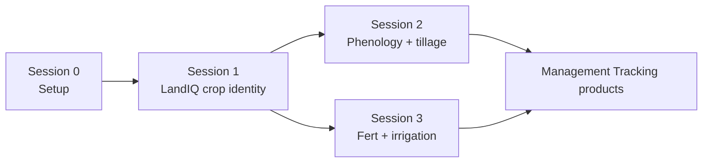
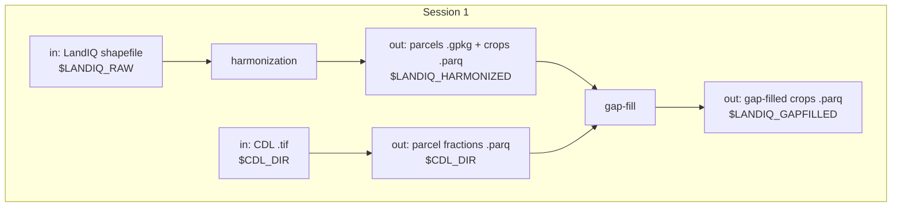

# Session 1 - LandIQ crop identity

**Prerequisite:** [Session 0](00-setup.md) finished and `setup_env.sh` sourced so the LandIQ and gap-fill paths resolve.

This session adds a new LandIQ year: download the statewide map, check the legend, harmonize parcels across years, then fill gaps in crop identity and peak greenness. Method detail lives in [landiq-gapfill/README.md](../../landiq-gapfill/README.md).

The walkthrough uses the inventory **year pair** from `setup_env.sh`: bring in `TARGET_YEAR` (default **2024**), then gap-fill both `PRIOR_YEAR` and `TARGET_YEAR` (default **2023,2024**) so the prior year can use the new map as neighbor context. See [pipeline.md](../pipeline.md#year-pair) for why the update is always a pair.

---

## Context

Same flow as [pipeline.md](../pipeline.md).



Session 1 steps:



---

## 1.1 Download LandIQ

Manual download of the statewide shapefile into `$LANDIQ_RAW`. Also grab the current Land Use Legend PDF (needed in Sec. 1.2).

| Item | Value |
|------|-------|
| Portal | [CNRA - Statewide Crop Mapping](https://data.cnra.ca.gov/dataset/statewide-crop-mapping) |
| Resource | PROVISIONAL - 2024 Statewide Crop Mapping GIS Shapefile |
| ZIP | [i15_crop_mapping_2024_provisional.zip](https://data.cnra.ca.gov/dataset/6c3d65e3-35bb-49e1-a51e-49d5a2cf09a9/resource/1a1c259c-4279-4868-a25f-b1f71665ca25/download/i15_crop_mapping_2024_provisional.zip) |

Prefer the **shapefile** ZIP. Expected layout:

```text
$LANDIQ_RAW/
  i15_Crop_Mapping_2024_Provisional_SHP/
    i15_Crop_Mapping_2024_Provisional.shp   # + .dbf .shx .prj ...
```

Or unpack with:

```bash
source "$CCMMF_CODE/documentation/setup_env.sh"

STAGING=$LANDIQ_ROOT/_staging_${TARGET_YEAR}
DROP=$LANDIQ_RAW
FOLDER=i15_Crop_Mapping_${TARGET_YEAR}_Provisional_SHP
STEM=i15_Crop_Mapping_${TARGET_YEAR}_Provisional

mkdir -p "$STAGING" "$DROP/$FOLDER"
cd "$STAGING"

curl -L -o i15_crop_mapping_2024_provisional.zip \
  'https://data.cnra.ca.gov/dataset/6c3d65e3-35bb-49e1-a51e-49d5a2cf09a9/resource/1a1c259c-4279-4868-a25f-b1f71665ca25/download/i15_crop_mapping_2024_provisional.zip'

unzip -o i15_crop_mapping_2024_provisional.zip -d unpack
cp -a unpack/${STEM}.* "$DROP/$FOLDER/"
test -f "$DROP/$FOLDER/${STEM}.shp" && echo "OK: $DROP/$FOLDER/${STEM}.shp"
```

---

## 1.2 Legend QC

LandIQ legend codes differ by year (2014, 2016-2020, 2021+). Compare the legend PDF from Sec. 1.1 to [LandIQ_cropCode_lookup_table.csv](../../landiq-gapfill/data/LandIQ_cropCode_lookup_table.csv) and add rows only if codes changed.

**For this training run, 2024 is unchanged** -- no lookup edits.

---

## 1.3 Harmonize geometry

[cadwr-landuse](https://github.com/ccmmf/cadwr-landuse) assigns stable `parcel_id`s across years and writes the multi-year crop table plus geometry. Use branch `main` (auto-discovers years including 2024). Keep the Session 0 conda env active.

A full re-harmonization can be slow -- plan time, or run ahead and show the published paths. Future work may support adding one year without re-running the full history.

| Directory | Value |
|-----------|-------|
| Annual shapefiles | `$LANDIQ_RAW` |
| Working files | `$CCMMF_ROOT/work/cadwr-landuse/v4.1` |
| Published product | `$LANDIQ_HARMONIZED` |

```bash
cd "$HOME/src/cadwr-landuse"

export LANDIQ_ROOT_DIR="$LANDIQ_RAW"
export CADWR_WORK_DIR="$CCMMF_ROOT/work/cadwr-landuse/v4.1"
mkdir -p "$CADWR_WORK_DIR"

python scripts/01-split.py \
  --landiq-root-dir "$LANDIQ_ROOT_DIR" \
  --outdir-root "$CADWR_WORK_DIR"

# Compute node: set --ntasks to allocated cores
python scripts/process-tiles-local.py \
  --ntasks 8 \
  --outdir-root "$CADWR_WORK_DIR" \
  --crs EPSG:3310 \
  --precision 10

python scripts/03a-combine-parcels.py \
  --outdir-root "$CADWR_WORK_DIR"
python scripts/03b-finalize-crops.py \
  --landiq-root-dir "$LANDIQ_ROOT_DIR" \
  --outdir-root "$CADWR_WORK_DIR"
```

Publish and confirm the target year:

```bash
mkdir -p "$LANDIQ_HARMONIZED"
cp -a "$CADWR_WORK_DIR/03-final/." "$LANDIQ_HARMONIZED/"

test -f "$LANDIQ_HARMONIZED/parcels-consolidated.gpkg"
test -f "$LANDIQ_HARMONIZED/crops_all_years.parq"
Rscript -e 'd <- arrow::open_dataset(file.path(Sys.getenv("LANDIQ_HARMONIZED"), "crops_all_years.parq")); target <- as.integer(Sys.getenv("TARGET_YEAR")); x <- dplyr::collect(dplyr::summarise(dplyr::filter(d, year == target), n = dplyr::n())); stopifnot(x$n[[1]] > 0); message("Found year ", target, ": ", x$n[[1]], " rows")'
```

---

## 1.4 Gap-fill

Fill missing season-2 `CLASS` / `SUBCLASS` and `ADOY` for both years in the pair (`YEARS=${PRIOR_YEAR},${TARGET_YEAR}`, defaults `2023,2024`). The prior year is refreshed against the new LandIQ series as neighbor context; you do not re-download it. Methods and flags: [landiq-gapfill/README.md](../../landiq-gapfill/README.md).

**Prerequisites** under `$LANDIQ_GAPFILL_ROOT/outputs/` (usually shipped; rebuild only when logic or training years change):

- CDL x LandIQ probability tables -- used by `crop` (`gapfill.R cdl-landiq-probs`)
- ADOY reference tables -- used by `adoy` (`gapfill.R adoy-ref`)

Crop/adoy stop with a rebuild hint if either set is missing. CDL *fraction* files are different: download/extract runs when those parquets are missing (Option A below, or automatically inside `run_gapfill.sh`).

**Option A -- each command:**

```bash
YEARS=${PRIOR_YEAR},${TARGET_YEAR}
CDL=$LANDIQ_GAPFILL_ROOT/scripts/cdl
GF=$LANDIQ_GAPFILL_ROOT/scripts/gapfill.R

Rscript $CDL/download_cdl_nass.R $YEARS
Rscript $CDL/extract_cdl_fractions_by_parcel.R $YEARS

# Rebuild prerequisites only if missing or stale (check outputs/ first):
# Rscript $GF cdl-landiq-probs
# Rscript $GF adoy-ref

Rscript $GF crop $YEARS
Rscript $GF adoy $YEARS
Rscript $GF merge $YEARS
Rscript $GF cover
Rscript $GF qc $YEARS
```

**Option B -- front door** (ensures CDL fractions if missing, then crop -> adoy -> merge -> cover -> qc). Does **not** rebuild the prerequisite tables unless you pass the flags:

```bash
$LANDIQ_GAPFILL_ROOT/run_gapfill.sh ${PRIOR_YEAR},${TARGET_YEAR}

# If outputs/ is missing CDL x LandIQ probs and/or ADOY refs:
# $LANDIQ_GAPFILL_ROOT/run_gapfill.sh --cdl-landiq-probs --adoy-ref ${PRIOR_YEAR},${TARGET_YEAR}
```

Output: `$LANDIQ_GAPFILLED/crops_all_years.parq`. Review season-2 `subclass_source` / `adoy_source` in [qc_gapfill_report.md](../../landiq-gapfill/outputs/qc_gapfill_report.md) (prefer `observed`).

---

## 1.5 Checklist

- [ ] Sourced `setup_env.sh`
- [ ] 2024 shapefile under `$LANDIQ_RAW/` (`.shp` present)
- [ ] Legend QC against `LandIQ_cropCode_lookup_table.csv` (no 2024 edits)
- [ ] Published `$LANDIQ_HARMONIZED` (`parcels-consolidated.gpkg` + `crops_all_years.parq`)
- [ ] Confirmed `year == TARGET_YEAR` rows in harmonized crops
- [ ] CDL download + extract for prior and target years
- [ ] Ran `run_gapfill.sh ${PRIOR_YEAR},${TARGET_YEAR}`
- [ ] Refreshed QC (`gapfill.R qc`); reviewed season-2 provenance for all product years
- [ ] Gap-filled product opens at `$LANDIQ_GAPFILLED`

**Next:** [Session 2 - HLS events](02-phenology.md).

**Spine:** [pipeline.md](../pipeline.md).
