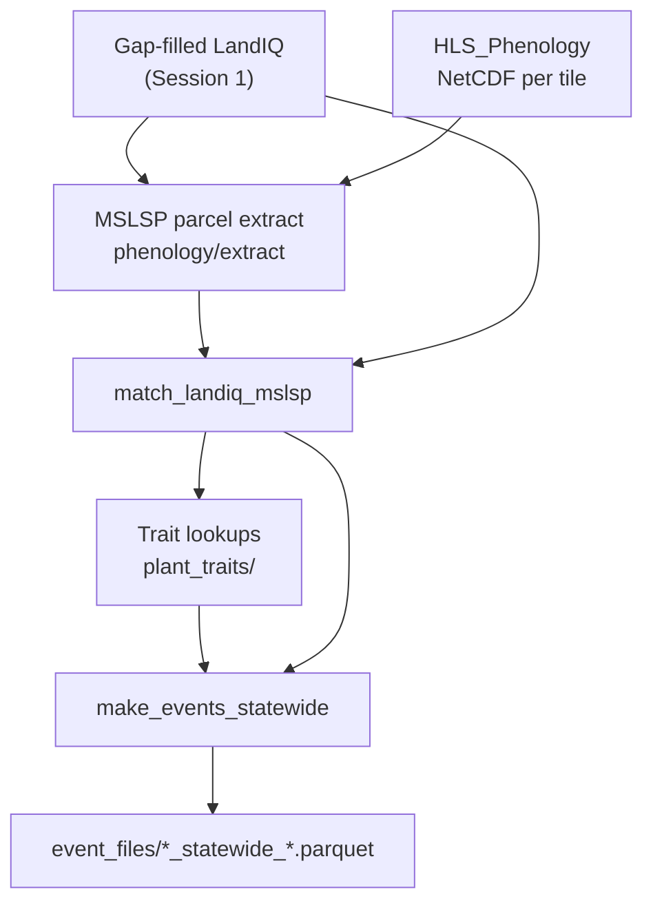

# Training Session 2 - Phenology, planting, and harvest

This session walks the chain from **Harmonized Landsat Sentinel-2 (HLS)** /
**Multi-Source Land Surface Phenology (MSLSP)** through LandIQ matching to
statewide **planting**, **harvest**, and **phenology** event files.

Those three event types are **one slice** of the full management set in
[pipeline.md](../pipeline.md). Sessions 3-4 cover tillage, fertilization /
organic amendments, and irrigation.

**Navigation:** [Pipeline](../pipeline.md) | [Session 1](01-landiq.md) | [Session 3](03-tillage-fertilizer.md)

**Prerequisites:**

- Gap-filled product at `$CCMMF_LANDIQ_GAPFILL_PRODUCT` (v4.1.2) with `crops_all_years.parq`
- MSLSP NetCDF tiles under `$CCMMF_ROOT/data_phen/output/` (from
  [HLS_Phenology](https://github.com/mrinareddy/HLS_Phenology))
- Parcel-tile map: `hls_parcel_tile_map_v4.1.rds` (geometry-only, built once)

**Operator docs** (full runbooks - use during hands-on):

| Step | README |
|------|--------|
| Pipeline map | [pipeline.md](../pipeline.md) |
| Parcel-tile map + shared HLS helpers | [hls/README.md](../../hls/README.md) |
| MSLSP parcel extraction | [phenology/extract/README.md](../../phenology/extract/README.md) |
| LandIQ <-> MSLSP matching | [phenology/match/README.md](../../phenology/match/README.md) |
| Date gap-fill (required) | [phenology/gapfill/README.md](../../phenology/gapfill/README.md) |
| Trait lookups | [traits/README.md](../../traits/README.md) |
| Statewide events | [events/README.md](../../events/README.md) |

**After this session you can:**

- Explain how tile-level MSLSP NetCDF differs from CCMMF parcel extraction
- Confirm or rebuild the one-time parcel-tile map
- Run MSLSP extract and match for a target year (commands in the operator READMEs)
- Interpret `assigned_by` / `match_outcome` and generate planting / harvest / phenology events

---

## 2.1 Background

**LandIQ** says *what* is growing on each parcel and when peak greenness occurred
(**ADOY** = adjusted day-of-year of peak NDVI for that season). **MSLSP** gives
satellite-observed green-up, peak, and senescence timing for up to **two
phenological cycles** per parcel-year.

Session 2 links those sources, then builds three management event types:

| Event type | Typical date source | What SIPNET gets |
|------------|---------------------|------------------|
| **Phenology** | MSLSP 50% green-up / 50% senescence | Leaf-on / leaf-off dates |
| **Planting** | MSLSP onset of greenness (OGI) | C/N pool initialization (LAI from MSLSP EVI) |
| **Harvest** | MSLSP senescence metrics (PFT-specific) | Biomass removal fractions |



---

## 2.2 Upstream MSLSP vs CCMMF extract

MSLSP is computed **per HLS tile** from Landsat + Sentinel-2 reflectance. The
CCMMF tree **consumes** pre-computed NetCDF; it does not re-run the tile algorithm.

| Layer | Where | Role |
|-------|-------|------|
| Core MSLSP algorithm | [aliceni7/MSLSP](https://github.com/aliceni7/MSLSP) | Tile phenology |
| California HLS workflow | [HLS_Phenology](https://github.com/mrinareddy/HLS_Phenology) | Download, conversion, CA tile list |
| NetCDF on disk | `$CCMMF_ROOT/data_phen/output/<tile>/phenoMetrics/MSLSP_<tile>_<year>.nc` | Input to extract |
| Parcel extract | [phenology/extract/README.md](../../phenology/extract/README.md) | Area-weight to LandIQ parcels |

Each parcel-year can have up to two cycles (`cycle = 1` dominant, `cycle = 2`
secondary) with timing metrics such as **OGI** (onset of greenness), **Peak**,
**OGMn** (onset of minimum greenness), and **50PCGI** / **50PCGD** (50% green-up /
senescence), plus EVI metrics (**EVImax**, **EVIamp**).

---

## 2.3 Hands-on walkthrough

Source the env once, then follow the operator READMEs for flags and schemas.
Default training years: `TARGET_YEAR=2024`, `PRIOR_YEAR=2023`.

```bash
source "$CCMMF_CODE/documentation/setup_env.sh"
export CCMMF_LANDIQ_V4=$CCMMF_LANDIQ_GAPFILL_PRODUCT
```

### A. Parcel-tile map (once)

Required before MSLSP or NDTI extract. Geometry-only; ag filtering happens later
inside each extract. Rebuild only if harmonized parcel geometry changed.

```bash
Rscript $CCMMF_CODE/hls/build_hls_parcel_tile_map.R overwrite
```

Details: [hls/README.md](../../hls/README.md).

### B. MSLSP parcel extraction

Why: turn tile NetCDF into one Parquet per year under
`phenology/raw_mslsp_v4.1.2/`.

```bash
$PHENOLOGY_ROOT/run_mslsp.sh 2024
# smoke test one tile: $PHENOLOGY_ROOT/run_mslsp.sh --tile 10SDH --no-combine 2024
```

Full runbook (prep cache, parallel tiles, verify): [phenology/extract/README.md](../../phenology/extract/README.md).

### C. Match LandIQ seasons to MSLSP cycles

Why: each LandIQ row is **parcel x year x season**; MSLSP is **parcel x year x
cycle**. Matching assigns seasons to cycles using ADOY inside `[OGI, OGMn]`.

```bash
$CCMMF_CODE/phenology/match_landiq_mslsp.sh 2024
```

Output: `phenology/matched_landiq_mslsp_v4.1.2/assigned_year=2024.parquet`.
Rules, verify, QC: [phenology/match/README.md](../../phenology/match/README.md).

### D. Date gap-fill (after match, required)

Fill missing planting/harvest dates into overlays under `gapfill_dates/`
(canonical assigned files unchanged). Required before planting/harvest events.

```bash
$CCMMF_CODE/phenology/run_phenology_date_gapfill.sh 2023 2024
```

Details: [phenology/gapfill/README.md](../../phenology/gapfill/README.md).

### E. Trait lookups (one-time)

Needed before the first event run; rebuild when TRY or LandIQ mappings change.

```bash
Rscript $CCMMF_CODE/traits/build_planting_lookup.R
Rscript $CCMMF_CODE/traits/build_harvest_lookup.R
```

Details: [traits/README.md](../../traits/README.md).

### F. Statewide planting / harvest / phenology events

```bash
export CCMMF_MATCHED_DIR=$CCMMF_MANAGEMENT/phenology/matched_landiq_mslsp_v4.1.2
$CCMMF_CODE/events/make_events_statewide.sh 2024
```

Default run writes phenology + planting + harvest under `event_files/`. Tillage
is Session 3. Details: [events/README.md](../../events/README.md).

---

## 2.4 Checklist - process TARGET_YEAR=2024

After Session 1 gap-fill for `2023,2024`:

- [ ] Point `CCMMF_LANDIQ_V4` at `$CCMMF_LANDIQ_GAPFILL_PRODUCT`
- [ ] Confirm MSLSP NetCDF for 2024 under `$CCMMF_ROOT/data_phen/output/`
- [ ] Confirm or build parcel-tile map if geometry changed ([hls/README.md](../../hls/README.md))
- [ ] Run `$PHENOLOGY_ROOT/run_mslsp.sh 2024`; verify cycle counts
- [ ] Run `match_landiq_mslsp.sh 2024`; review `assigned_by` counts
- [ ] Run date gap-fill for 2023 and 2024
- [ ] Build trait lookups if missing
- [ ] Run `make_events_statewide.sh 2024`; confirm planting / harvest / phenology parquets
- [ ] After LandIQ gap-fill improves 2023 labels, rerun 2023 MSLSP + match + date gap-fill + events as needed

Cross-reference: [pipeline.md](../pipeline.md) checklist.

---

## 2.5 What comes next

- **[Session 3 - Tillage and fertilization](03-tillage-fertilizer.md):** NDTI,
  tillage events, N-rate lookups, organic amendments.
- **[Session 4 - Irrigation](04-irrigation.md):** water-balance irrigation events
  and combining all event types for SIPNET.
- **Full pipeline spine:** [pipeline.md](../pipeline.md)
