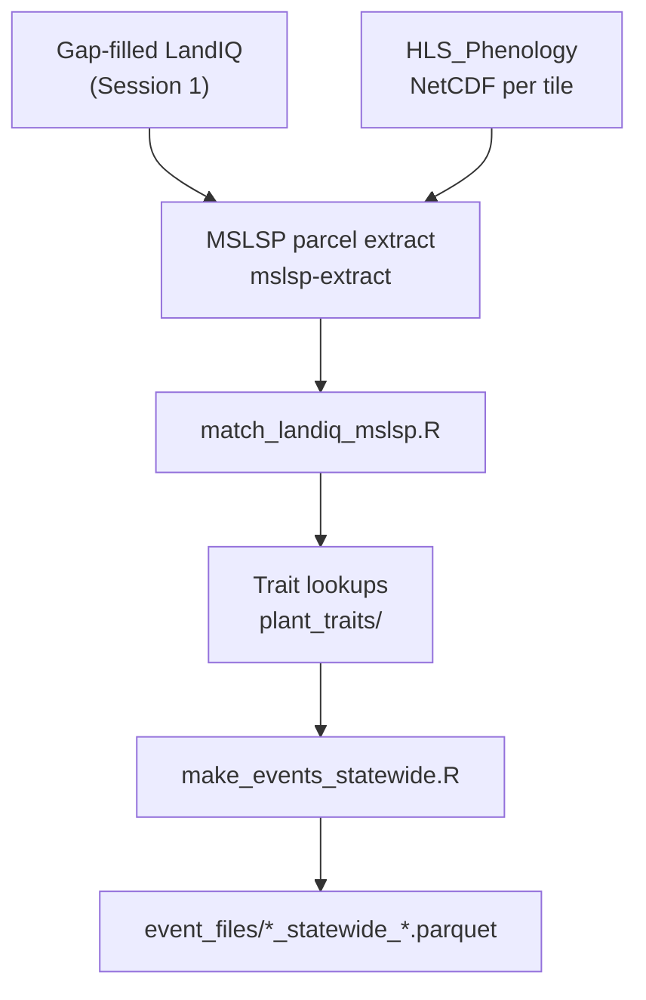

# Training Session 2 — Phenology, traits, and events

This session covers how CCMMF turns **Harmonized Landsat Sentinel-2 (HLS)** phenology
and gap-filled **LandIQ** crop seasons into statewide **planting**, **harvest**, and
**phenology** event files for SIPNET.

**Navigation:** [Documentation index](../README.md) · [Session 1 — LandIQ](01-landiq.md) ·
[Full pipeline](../pipeline.md)

**Audience:** CARB staff or contractors who completed [Session 1](01-landiq.md) and have
the gap-filled LandIQ product available.

**Prerequisites:**

- Gap-filled product at `$CCMMF_LANDIQ_GAPFILL_PRODUCT` (v4.1.2) with `crops_all_years.parq`
- MSLSP NetCDF tiles under `$CCMMF_ROOT/data_phen/output/` (from [HLS_Phenology](https://github.com/mrinareddy/HLS_Phenology))
- Parcel–tile map: `hls_parcel_tile_map_v4.1.rds` (geometry-only, built once)

**Operator references** (commands, schemas, troubleshooting — use during hands-on):

| Step | README |
|------|--------|
| HLS overview + pipeline order | [scripts/hls/README.md](../../scripts/hls/README.md) |
| MSLSP parcel extraction | [mslsp-extract/README.md](../../mslsp-extract/README.md) |
| LandIQ ↔ MSLSP matching | [scripts/phenology/match/README.md](../../scripts/phenology/match/README.md) |
| Trait lookups + LAI | [scripts/traits/README.md](../../scripts/traits/README.md) |
| Statewide events | [scripts/events/README.md](../../scripts/events/README.md) |

Full cross-session run order: [pipeline.md](../pipeline.md) §6–11.

**After this session you can:**

- Explain how upstream **MSLSP NetCDF** (per HLS tile) differs from CCMMF **parcel extraction**
- Build or refresh the one-time **parcel–tile map**
- Run **MSLSP extraction** locally or on SCC (smoke test → full year)
- **Match** LandIQ seasons to MSLSP cycles and interpret `assigned_by` / `match_outcome`
- Build **trait lookups** and generate statewide **planting / harvest / phenology** event files

**Session outline**

| Section | Topic |
|---------|--------|
| §2.1 | Background — LandIQ + MSLSP + events |
| §2.2 | MSLSP algorithm (upstream vs CCMMF extract) |
| §2.3 | Parcel–tile map (one-time) |
| §2.4 | MSLSP parcel extraction |
| §2.5 | Match LandIQ ↔ MSLSP |
| §2.6 | Trait lookups (one-time) |
| §2.7 | Statewide event files |
| §2.8 | Code locations (reference) |
| §2.9 | Hands-on checklist |
| §2.10 | QC and troubleshooting |

---

## 2.1 Background

**LandIQ** tells us *what* is growing on each parcel and *when peak greenness* occurred
(`ADOY`). **MSLSP** (Multi-Source Land Surface Phenology) tells us the *satellite-observed*
green-up, peak, and senescence timing for up to **two phenological cycles** per parcel-year.

Session 2 links those two sources, then builds **management events**:

| Event type | Date source | What SIPNET gets |
|------------|-------------|------------------|
| **Phenology** | MSLSP 50% green-up / 50% senescence | Leaf-on / leaf-off dates |
| **Planting** | MSLSP onset of greenness (OGI) | C/N pool initialization (LAI from MSLSP EVI) |
| **Harvest** | MSLSP senescence metrics (PFT-specific) | Biomass removal fractions |



---

## 2.2 MSLSP algorithm (concept)

MSLSP is computed **per HLS tile** from harmonized Landsat + Sentinel-2 surface reflectance.
The CCMMF monitoring repo **consumes** pre-computed NetCDF files; it does not re-run the
tile algorithm here.

**What each parcel-year can contain:**

- Up to **two cycles** per year (`cycle = 1` dominant amplitude, `cycle = 2` secondary).
- Timing metrics as day-of-year: **OGI** (onset of green-up), **Peak**, **OGMn** (onset of
  minimum greenness), **50PCGI** / **50PCGD** (half green-up / senescence complete), etc.
- EVI metrics: **EVImax**, **EVIamp**, integrated seasonal EVI.

**Where the algorithm lives:**

| Layer | Repo / path | Role |
|-------|-------------|------|
| Core MSLSP (BU-LCSC) | [aliceni7/MSLSP](https://github.com/aliceni7/MSLSP) | Tile algorithm, `SCC/MSLSP_runTile_SCC.sh` |
| California HLS workflow | [HLS_Phenology](https://github.com/mrinareddy/HLS_Phenology) | Download, `conversion.R`, CA `tileids.txt` |
| NetCDF on disk | `$CCMMF_ROOT/data_phen/output/<tile>/phenoMetrics/MSLSP_<tile>_<year>.nc` | Input to CCMMF extract |

See [scripts/hls/README.md](../../scripts/hls/README.md) step 3 for paths under `$CCMMF_ROOT/data_phen/`.

**CCMMF's role:** area-weighted extraction from tile NetCDF to LandIQ parcels
(`mslsp-extract/run_mslsp.sh` → `phenology/raw_mslsp_v4.1.2/year=Y/mslsp_year=Y.parquet`). The
extract package does **not** re-run the tile phenology algorithm. Operator details:
[mslsp-extract/README.md](../../mslsp-extract/README.md).

---

## 2.3 Parcel–tile map (one-time)

Required before MSLSP or NDTI extraction. The map is **geometry-only** (all harmonized
parcels × HLS tiles). **Agricultural filtering happens per year** inside each extract
package's prep step — you do not rebuild the map when adding a new calendar year.

Re-run only when harmonized parcel geometry changes (new harmonization release).

```bash
export CCMMF_ROOT=/projectnb/dietzelab/ccmmf
export CCMMF_MANAGEMENT=$CCMMF_ROOT/management
export CCMMF_LANDIQ_V4=$CCMMF_ROOT/LandIQ-harmonized-v4.1.2

module load R/4.4.0
Rscript $CCMMF_MANAGEMENT/scripts/hls/build_hls_parcel_tile_map.R overwrite
```

Outputs:

| File | Contents |
|------|----------|
| `hls_parcel_tile_map_v4.1.rds` | `parcel_id`, `tileIDs`, `n_tiles` |
| `hls_tile_to_parcels_v4.1.rds` | Inverted list (tile → parcels) |
| `hls_parcel_tile_map_removed_v4.1.csv` | Parcels dropped (empty geometry, etc.) |

---

## 2.4 MSLSP extraction

MSLSP extract reads pre-computed NetCDF per tile, area-weights phenology metrics onto
agricultural parcels for the target year, and writes one Parquet per year.

### Environment

```bash
export CCMMF_ROOT=/projectnb/dietzelab/ccmmf
export CCMMF_MANAGEMENT=$CCMMF_ROOT/management
export MSLSP_EXTRACT_ROOT=$CCMMF_MANAGEMENT/mslsp-extract
export CCMMF_LANDIQ_V4=$CCMMF_ROOT/LandIQ-harmonized-v4.1.2   # gap-filled product

export mslsp_new_base=$CCMMF_ROOT/data_phen/output
export mslsp_legacy_dir=$CCMMF_ROOT/HLS_data
export HLS_PARCEL_TILEMAP=$CCMMF_MANAGEMENT/hls_parcel_tile_map_v4.1.rds
export mslsp_parcel_tilemap=$HLS_PARCEL_TILEMAP
export MSLSP_TILE_LIST=$CCMMF_ROOT/data_phen/tileLists/tileids.txt
```

### Prep cache (automatic)

Before extracting, each year builds or loads a **prep cache**:

| File | Purpose |
|------|---------|
| `year=Y/mslsp_prep_static_year=Y.rds` | Ag parcel IDs per tile (no geometry in cache) |
| `year=Y/sge_tiles.txt` | Tiles to schedule on SCC — `tileids.txt` ∩ tiles with ag parcels |

Prep runs automatically on first extract; you can build it alone with:

```bash
$MSLSP_EXTRACT_ROOT/run_mslsp.sh --prep-only 2024
```

### Run locally (interactive / smoke test)

```bash
# Full year, serial tiles on one node
$MSLSP_EXTRACT_ROOT/run_mslsp.sh 2024

# Rerun after gap-fill label fixes
$MSLSP_EXTRACT_ROOT/run_mslsp.sh --overwrite 2023

# Smoke test — one tile
$MSLSP_EXTRACT_ROOT/run_mslsp.sh --tile 10SDH --no-combine 2024
```

### Run on SCC (recommended for production)

**Parallel tiles** — prep locally, then tile array + held combine:

```bash
$MSLSP_EXTRACT_ROOT/run_mslsp_submit_tiles.sh 2024
$MSLSP_EXTRACT_ROOT/run_mslsp_submit_tiles.sh --overwrite 2023
```

**Serial one job/year** — fine for smoke tests or small reruns:

```bash
qsub -v 'MSLSP_ARGS=2024' $MSLSP_EXTRACT_ROOT/sge/run_mslsp.sge
```

The submit script writes `sge_tiles.txt` after prep. Not every tile in
[HLS_Phenology `tileids.txt`](https://github.com/mrinareddy/HLS_Phenology/blob/main/tileids.txt)
has agricultural parcels — only tiles with ag land for that year get a cluster task.

### Verify

```r
library(arrow); library(dplyr)
ds <- open_dataset(file.path(Sys.getenv("CCMMF_MANAGEMENT"), "phenology/raw_mslsp_v4.1.2"))
ds |> filter(year == 2024) |> count(cycle) |> collect()
```

Per-tile timing: `phenology/raw_mslsp_v4.1.2/year=2024/tilepieces_year=2024/_tile_timing.csv`.

Full schema, outputs, and troubleshooting: [mslsp-extract/README.md](../../mslsp-extract/README.md).

---

## 2.5 Matching LandIQ seasons to MSLSP cycles

Each LandIQ row is **parcel × year × season**. MSLSP gives **parcel × year × cycle**.
`match_landiq_mslsp.R` assigns seasons to cycles (or marks unmatched).

### Why ADOY, not emergence/senescence columns

LandIQ **ADOY** is the adjusted day-of-year for **peak NDVI** for that season — not
emergence (OGI) or senescence (OGMn). Matching uses:

1. **Primary:** ADOY falls inside the MSLSP cycle window `[OGI, OGMn]`.
2. **Tie-break:** nearest MSLSP Peak to ADOY; prefer cycle 1 over cycle 2.
3. **Season priority:** season 2 first when `CLASS` is present; season 1 for `MULTIUSE` D/M.

Rows with `assigned_by == "matched"` feed event generation. LandIQ does **not** provide
OGI/OGMn analogs in `ADOY_EMRG` / `ADOY_SEN` for the same cycle — those are peaks of
adjacent-year crops. See internal notes in
`scripts/phenology/LANDIQ_ADOY_SEN_EMRG_notes.md` if you need column-level detail.

### Run

```bash
export CCMMF_ROOT=/projectnb/dietzelab/ccmmf
export CCMMF_MANAGEMENT=$CCMMF_ROOT/management
export CCMMF_LANDIQ_V4=$CCMMF_ROOT/LandIQ-harmonized-v4.1.2

module load R/4.4.0
Rscript -e "YEAR <- 2024; source('$CCMMF_MANAGEMENT/scripts/phenology/match_landiq_mslsp.R')"

qsub -v YEAR=2024 $CCMMF_MANAGEMENT/scripts/phenology/match_landiq_mslsp.sge
```

Output: `phenology/matched_landiq_mslsp_v4.1.2/assigned_year=2024.parquet`

### Verify

```r
library(arrow); library(dplyr)
p <- file.path(Sys.getenv("CCMMF_MANAGEMENT"),
               "phenology/matched_landiq_mslsp_v4.1.2/assigned_year=2024.parquet")
assigned <- read_parquet(p)
assigned |> count(assigned_by, match_outcome) |> arrange(desc(n))
```

Optional narrative QC across years:

```bash
Rscript $CCMMF_MANAGEMENT/scripts/phenology/build_qc_report.R
```

Full matching rules and schema: [match/README.md](../../scripts/phenology/match/README.md).

---

## 2.6 Trait lookups (one-time)

Trait tables initialize **C/N pools at planting** and **harvest removal fractions**.
Build once before the first event run; rebuild when TRY or LandIQ mappings change.

```bash
cd $CCMMF_MANAGEMENT
module load R/4.4.0
Rscript scripts/traits/build_planting_lookup.R
Rscript scripts/traits/build_harvest_lookup.R
# optional: scripts/traits/build_harvest_lookup_faostat.R
```

Outputs in `plant_traits/`: `planting_lookup_long.rds`, `harvest_lookup_long.rds`.

**Fallback order:** subclass → class → PFT → global.

**LAI at planting** uses matched MSLSP `EVImax` / `EVIamp` (Mourad et al. 2020 rules in
`scripts/traits/lai_from_mslsp.R`). Full API and examples:
[traits/README.md](../../scripts/traits/README.md).

---

## 2.7 Phenology date gap-fill (after match)

Optional but recommended before planting/harvest events: fill missing dates with
MSLSP → `lm(ADOY × CLASS)` → crop-class mean. Overlays land in
`matched_landiq_mslsp_v4.1.2/gapfill_dates/` (canonical assigned files unchanged).

```bash
qsub $CCMMF_MANAGEMENT/scripts/phenology/run_phenology_date_gapfill.sge
# or: Rscript .../fit_phenology_gapfill_models.R
#     Rscript .../apply_phenology_gapfill.R 2023 2024
```

Details: [gapfill/README.md](../../scripts/phenology/gapfill/README.md).

---

## 2.8 Statewide event files

`make_events_statewide.R` reads **matched** rows (and the gap-filled overlay when
present) plus trait lookups to write Parquet + PEcAn JSON under `event_files/`.

### Run (phenology + planting + harvest — default)

```bash
export CCMMF_ROOT=/projectnb/dietzelab/ccmmf
export CCMMF_MANAGEMENT=$CCMMF_ROOT/management
export CCMMF_LANDIQ_V4=$CCMMF_ROOT/LandIQ-harmonized-v4.1.2
export CCMMF_MATCHED_DIR=$CCMMF_MANAGEMENT/phenology/matched_landiq_mslsp_v4.1.2

module load R/4.4.3
Rscript $CCMMF_MANAGEMENT/scripts/events/make_events_statewide.R 2024
Rscript $CCMMF_MANAGEMENT/scripts/events/make_events_statewide.R 2023   # after re-match

qsub -v YEAR=2024 $CCMMF_MANAGEMENT/scripts/events/make_events_statewide.sge
qsub -v YEAR=2023 $CCMMF_MANAGEMENT/scripts/events/make_events_statewide.sge
```

(`#$ -l buyin` is in the `.sge` wrapper.)

### Event date rules (summary)

| Type | Date column | Rule |
|------|-------------|------|
| Phenology | `mslsp_50PCGI`, `mslsp_50PCGD` | Leaf-on / leaf-off; requires matched MSLSP |
| Planting | `mslsp_OGI` (or LM-filled) | Pools via `initialize_planting()` + MSLSP EVI → LAI |
| Harvest | `mslsp_OGMn` / `mslsp_OGD` (or LM-filled) | Fractions via harvest lookup; can use filled dates for `no_mslsp` |

Tillage events are **not** in the default run (Session 3 topic). See
[events/README.md](../../scripts/events/README.md).

### Verify

```r
library(arrow)
od <- file.path(Sys.getenv("CCMMF_MANAGEMENT"), "event_files")
for (kind in c("planting", "harvest", "phenology")) {
  f <- file.path(od, paste0(kind, "_statewide_2024.parquet"))
  if (file.exists(f)) message(kind, ": ", nrow(read_parquet(f)), " rows")
}
```

---

## 2.9 Code locations (reference)

| Step | Script / package | Output |
|------|------------------|--------|
| Parcel–tile map | `scripts/hls/build_hls_parcel_tile_map.R` | `hls_parcel_tile_map_v4.1.rds` |
| MSLSP extract | `mslsp-extract/run_mslsp.sh` | `phenology/raw_mslsp_v4.1.2/year=Y/mslsp_year=Y.parquet` |
| MSLSP SCC array | `mslsp-extract/run_mslsp_submit_tiles.sh` | tilepieces → combine |
| Match | `scripts/phenology/match_landiq_mslsp.R` | `matched_landiq_mslsp_v4.1.2/assigned_year=Y.parquet` |
| Date gap-fill | `scripts/phenology/fit_phenology_gapfill_models.R` + `apply_*.R` | `gapfill_dates/assigned_year=Y_gapfilled.parquet` |
| Planting traits | `scripts/traits/build_planting_lookup.R` | `plant_traits/planting_lookup_long.rds` |
| Harvest traits | `scripts/traits/build_harvest_lookup.R` | `plant_traits/harvest_lookup_long.rds` |
| Events | `scripts/events/make_events_statewide.R` | `event_files/*_statewide_Y.parquet` |

Shared HLS framework (tilewise extract/combine): `scripts/hls/_lib/tilewise_core.R`.

---

## 2.10 Hands-on checklist — process TARGET_YEAR=2024

Use this when onboarding CARB staff or validating a new environment (after Session 1
gap-fill for `2023,2024`):

- [ ] Point `CCMMF_LANDIQ_V4` at `$CCMMF_LANDIQ_GAPFILL_PRODUCT` (`LandIQ-harmonized-v4.1.2`).
- [ ] Confirm MSLSP NetCDF exists for 2024 under `$CCMMF_ROOT/data_phen/output/` (HLS_Phenology
  or S3 prefetch — [pipeline.md](../pipeline.md) §2).
- [ ] Confirm or build parcel–tile map (§2.3) if geometry changed.
- [ ] Set MSLSP environment (§2.4); run `$MSLSP_EXTRACT_ROOT/run_mslsp_submit_tiles.sh 2024`
  (or local `run_mslsp.sh 2024` for a smoke test).
- [ ] Verify `mslsp_year=2024.parquet` and cycle counts (§2.4).
- [ ] Run `match_landiq_mslsp.R` for 2024 (§2.5); review `assigned_by` counts.
- [ ] Optional: phenology date gap-fill (§2.7) for 2023 and 2024.
- [ ] Build trait lookups if not already present (§2.6).
- [ ] Run `make_events_statewide.R 2024` (§2.8); confirm planting / harvest / phenology parquets.
- [ ] After gap-fill improves 2023 labels, rerun 2023 MSLSP + match + events as needed.

Cross-reference: [pipeline.md](../pipeline.md) §14 checklist.

**2024 test case:** Treat 2024 as the holdout year — run the full Session 2 chain once
LandIQ 2024 and MSLSP NetCDF are available; compare match rates to prior years via
`build_qc_report.R`.

---

## 2.11 QC and troubleshooting

| Symptom | Likely cause | Fix |
|---------|--------------|-----|
| No MSLSP rows for year | NetCDF missing | Run HLS_Phenology / BU MSLSP tile jobs |
| `SGE tile list not found` | Prep not run before array | `run_mslsp.sh --prep-only Y` or use `run_mslsp_submit_tiles.sh` |
| All `mslsp_cycles_filtered_out` | High `na_frac` or no cycles | Check raw MSLSP parquet; parcel ag filter |
| Low match rate | ADOY outside cycle windows | Review `match_outcome` counts; see ADOY notes |
| Missing planting pools | Trait lookup fallback to global | `diagnostics = TRUE` in pool functions |
| Events empty for year | No `assigned_by == "matched"` rows | Fix upstream match or MSLSP |
| `curl_multi_poll` / arrow error on login node | Library mismatch | Submit via SGE or set `LD_PRELOAD` (see mslsp-extract README) |

Filter examples: `scripts/phenology/qc_filter_examples.R`

---

## 2.12 What comes next

- **[Session 3 — Tillage and fertilization](03-tillage-fertilizer.md):** NDTI extraction,
  tillage events, and California N-rate lookups (Akash).
- **[Session 4 — Irrigation](04-irrigation.md):** statewide water-balance irrigation
  events (Alexey) and combining all event types for SIPNET.
- **Full pipeline spine:** [pipeline.md](../pipeline.md)
