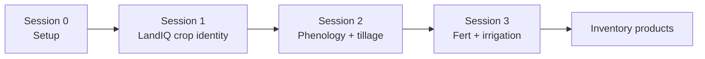
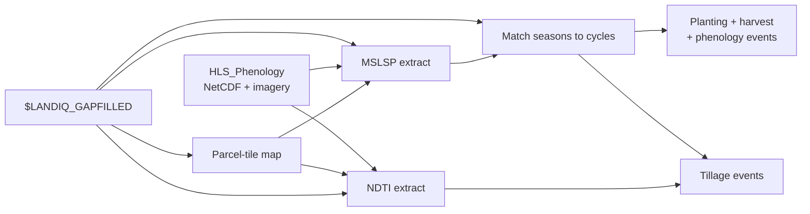

# Session 2 - HLS events (phenology and tillage)

**What this session is for.** Session 1 gave you stable parcels and gap-filled crop identity. This session adds *when* management happened on those parcels for the same year pair: planting, harvest, and phenology from satellite land-surface phenology, and tillage in fallow windows. Each event type is opt-in; run only what you need for the update.

The satellite stack is Harmonized Landsat Sentinel-2 (**HLS**). Multi-Source Land Surface Phenology (**MSLSP**) NetCDF products drive planting, harvest, and phenology events (with crop trait CSVs for date windows). Normalized Difference Tillage Index (**NDTI**) drives tillage. You will extract HLS metrics to LandIQ parcels, match seasons to phenology cycles, then write statewide (or demo-tile) event files that MAGiC / SIPNET consume.

Live training path uses one HLS tile (`10SDH`). Statewide uses the same steps without the tile / parcel-list filters.

**Prerequisite:** [Session 0](00-setup.md) (incl. Earthdata `.netrc`); [Session 1](01-landiq.md) gap-filled product at `$LANDIQ_GAPFILLED`.

**Where to go deeper:** [tree README](../../README.md); step READMEs in the table below; [metadata.md](../metadata.md) for event columns.



Session 2 steps:



**Demo vs statewide:** omit `TILEWISE_ONE_TILE` / `ASSIGN_PARCEL_IDS_FILE` for full statewide runs.

**Operator docs** (algorithms and flags -- read when a step fails or you need parameters):

| Step | README |
|------|--------|
| Parcel-tile map + shared HLS helpers | [hls/README.md](../../hls/README.md) |
| MSLSP parcel extraction | [phenology/extract/README.md](../../phenology/extract/README.md) |
| LandIQ <-> MSLSP matching | [phenology/match/README.md](../../phenology/match/README.md) |
| Date gap-fill (required statewide) | [phenology/gapfill/README.md](../../phenology/gapfill/README.md) |
| Trait lookups | [traits/README.md](../../traits/README.md) |
| NDTI parcel extraction | [tillage/extract/README.md](../../tillage/extract/README.md) |
| Statewide events | [events/README.md](../../events/README.md) |

## Paths for this session

Expect `$LANDIQ_GAPFILLED/crops_all_years.parq` from [Session 1](01-landiq.md) and Earthdata from [Session 0](00-setup.md) section 0.5. Paths come from [setup_env.sh](../setup_env.sh). Finished tree: [Data layout](00-setup.md#data-layout).

To **produce** MSLSP NetCDF / HLS imagery (not only consume existing files), clone [HLS_Phenology](https://github.com/mrinareddy/HLS_Phenology) and follow that repo's download steps into `$MSLSP_NETCDF_ROOT` / `$HLS_IMAGERY_ROOT`.

| Role | Path | Notes |
|------|------|-------|
| In | `$LANDIQ_GAPFILLED` | Gap-filled crops from Session 1 |
| In | `$HLS_IMAGERY_ROOT`, `$MSLSP_NETCDF_ROOT` | HLS imagery / MSLSP NetCDF (Earthdata) |
| Out | `$HLS_PARCEL_TILEMAP` | Parcel-tile map |
| Out | `$MATCHED_DIR` | Matched LandIQ-MSLSP (under phenology/) |
| Out | `$PRODUCTS_INVENTORY/tillage/` | NDTI extracts |
| Out | `$PRODUCTS_INVENTORY/event_files/` | Planting / harvest / phenology / tillage |
| Lookups | `$LOOKUPS_ROOT/plant_traits` (`$PLANT_TRAITS_DIR`) | Trait CSVs for planting/harvest |

---

## 2.1 Env and demo parcel list

```bash
source "$CCMMF_CODE/documentation/setup_env.sh"
export DEMO_TILE=10SDH
export ASSIGN_PARCEL_IDS_FILE=$PRODUCTS_INVENTORY/demo/parcels_${DEMO_TILE}.csv
```

| Item | Path / format | Notes |
|------|---------------|--------|
| Input | `$LANDIQ_GAPFILLED/crops_all_years.parq` | Gap-filled LandIQ (Session 1) |
| Input | `$MSLSP_NETCDF_ROOT/<tile>/phenoMetrics/MSLSP_<tile>_<year>.nc` | Tile MSLSP NetCDF ([HLS_Phenology](https://github.com/mrinareddy/HLS_Phenology)) |
| Output (once) | `$PRODUCTS_INVENTORY/hls_parcel_tile_map_v4.1.csv` | Parcel -> tiles; see [hls/README.md](../../hls/README.md) |
| Demo list | `$PRODUCTS_INVENTORY/demo/parcels_10SDH.csv` | CSV header `parcel_id` |

Build the demo CSV after the tile map exists (or run `scripts/demo/write_demo_parcel_list.R`):

```r
tp <- read_tile_to_parcels()  # from hls/R/parcel_tilemap.R
tile <- "10SDH"
ids <- sort(unique(as.character(tp[[tile]])))
out <- file.path(Sys.getenv("PRODUCTS_INVENTORY"), "demo", paste0("parcels_", tile, ".csv"))
dir.create(dirname(out), recursive = TRUE, showWarnings = FALSE)
write.csv(data.frame(parcel_id = ids), out, row.names = FALSE)
```

Parcel-tile map (once, when geometry changes):

```bash
Rscript "$CCMMF_CODE/hls/build_hls_parcel_tile_map.R" overwrite
```

---

## 2.2 MSLSP extract and match

LandIQ says *what* grows and peak greenness (**ADOY**). MSLSP gives satellite
green-up, peak, and senescence for up to two cycles per parcel-year.

### MSLSP timing (aligned with proposal 15% / 50% greenness)

MSLSP defines thresholds on the cycle EVI2 curve. We use those product metrics
directly; they implement the same greenness fractions the proposal named, under
MSLSP names:

| Metric | MSLSP meaning | Inventory use |
|--------|---------------|---------------|
| **OGI** | ~15% of peak greenness (onset of greenness) | Planting date |
| **50PCGI** | 50% of peak on green-up | Phenology leaf-on |
| **Peak** | Cycle peak | Match tie-break / year of phenology event |
| **50PCGD** | 50% of peak on green-down | Phenology leaf-off |
| **OGD / OGMn** | Senescence / onset of minimum (PFT rules) | Harvest date |

**Planting** is therefore an **RS effective plant**: canopy becoming visible
(~seedling / early greenness), not calendar seed-in-ground. That matches OGI
and is what satellite phenology can support statewide.

The extract keeps the **top two** MSLSP amplitude cycles per parcel-year. LandIQ
has up to four seasons, but seasons 1/3/4 are uncommon (see
[landiq-gapfill README](../../landiq-gapfill/README.md#data-model)); matching
extra cycles for those seasons is future work, not blocked by the product
format.

| Event type | Typical date source | What SIPNET gets |
|------------|---------------------|------------------|
| Phenology | MSLSP 50PCGI / 50PCGD | Leaf-on / leaf-off |
| Planting | MSLSP OGI (~15% of peak) | C/N pools (LAI from MSLSP EVI) |
| Harvest | MSLSP senescence (PFT-specific) | Biomass removal fractions |

**A. Extract + combine (demo tile)**

```bash
TILEWISE_ONE_TILE=$DEMO_TILE $PHENOLOGY_ROOT/run_mslsp.sh 2024
TILEWISE_ONE_TILE=$DEMO_TILE $PHENOLOGY_ROOT/run_mslsp.sh 2023
```

| Item | Path / format | Key columns / metadata |
|------|---------------|------------------------|
| Input | MSLSP NetCDF under `HLS/MSLSP/` | Per-tile annual NetCDF |
| Output | `$PRODUCTS_INVENTORY/phenology/raw_mslsp_v4.1.2/year=Y/` | Hive parquet; [mslsp_year_metadata.csv](../../phenology/extract/data/mslsp_year_metadata.csv) |

Prefer `TILEWISE_ONE_TILE` (includes combine). Details:
[phenology/extract/README.md](../../phenology/extract/README.md).

**B. Match (demo parcels)**

```bash
ASSIGN_PARCEL_IDS_FILE=$ASSIGN_PARCEL_IDS_FILE \
  $PHENOLOGY_ROOT/match_landiq_mslsp.sh 2024
```

| Item | Path / format | Key columns / metadata |
|------|---------------|------------------------|
| Output | `phenology/matched_landiq_mslsp_v4.1.2/.../assigned_year=2024.parquet` | `assigned_by`, `match_outcome`; [assigned_year_metadata.csv](../../phenology/match/data/assigned_year_metadata.csv) |

**C. Trait lookups (once)** and **events**

```bash
# If missing under $PRODUCTS_INVENTORY/plant_traits/:
Rscript "$CCMMF_CODE/traits/build_planting_lookup.R"
Rscript "$CCMMF_CODE/traits/build_harvest_lookup.R"

export MATCHED_DIR=$PRODUCTS_INVENTORY/phenology/matched_landiq_mslsp_v4.1.2/subsample_n400
$EVENTS_ROOT/make_events_statewide.sh 2024
```

| Item | Path / format | Notes |
|------|---------------|--------|
| Lookups | `$PRODUCTS_INVENTORY/plant_traits/planting_lookup.csv`, `harvest_lookup.csv` | CSV; harvest has `destructive` (see [traits/README.md](../../traits/README.md)) |
| Events | `$PRODUCTS_INVENTORY/event_files/{planting,harvest,phenology}_statewide_Y.parquet` (+ `.json`) | [events metadata](../metadata.md) |

For the demo, skip statewide date gap-fill or gap-fill only the subsample. Statewide:

```bash
$PHENOLOGY_ROOT/run_mslsp.sh $YEAR
$PHENOLOGY_ROOT/match_landiq_mslsp.sh $YEAR
$PHENOLOGY_ROOT/run_phenology_date_gapfill.sh $PRIOR_YEAR $TARGET_YEAR
$EVENTS_ROOT/make_events_statewide.sh $YEAR
```

Date gap-fill is required before statewide planting/harvest events.

---

## 2.3 NDTI and tillage events

Like planting, harvest, and phenology, tillage is opt-in via
`make_events_statewide.sh` (pass `tillage` as the event type). Timing comes from
NDTI in each fallow window between one season's senescence (`OGMn`) and the next
green-up (`OGI`), using matched phenology from Sec. 2.2.

**A. NDTI extract (demo)**

```bash
TILEWISE_ONE_TILE=$DEMO_TILE $TILLAGE_ROOT/run_ndti.sh 2024
```

| Item | Path / format | Key columns / metadata |
|------|---------------|------------------------|
| Input | HLS reflectance under `HLS/imagery/$DEMO_TILE/` | Same imagery tree as phenology |
| Output | `$PRODUCTS_INVENTORY/tillage/ndti_v4.1/year=Y/` | Monthly hive parquet; [ndti_year_metadata.csv](../../tillage/extract/data/ndti_year_metadata.csv) |

**B. Tillage events**

```bash
export MATCHED_DIR=$PRODUCTS_INVENTORY/phenology/matched_landiq_mslsp_v4.1.2/subsample_n400
$EVENTS_ROOT/make_events_statewide.sh 2024 tillage
```

| Item | Path / format | Metadata |
|------|---------------|----------|
| Output | `$PRODUCTS_INVENTORY/event_files/tillage_statewide_Y.parquet` (+ `.json`) | [tillage_statewide_metadata.csv](../../events/data/tillage_statewide_metadata.csv) |

Algorithm detail: [events/README.md](../../events/README.md) (tillage section).

---

**Next:** [Session 3 - Fertilization and irrigation](03-fertilizer-irrigation.md).

**Spine:** [tree README](../../README.md).

**Downstream (unofficial):** [SIPNET handoff](sipnet-handoff.md).
