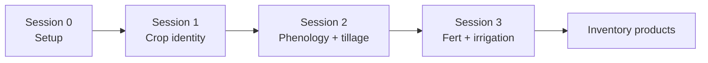
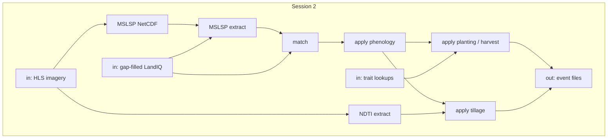

# Session 2 - Phenology, planting, harvest, tillage

**What this session is for.** Session 1 gave you stable parcels and gap-filled crop identity. This session uses Harmonized Landsat Sentinel-2 (**HLS**) to time each season and to detect tillage in the fallow between seasons. It writes four event products:

1. **Planting** -- green-up date and initial C/N pools
2. **Harvest** -- senescence date and biomass removal fractions
3. **Phenology** -- leaf-on / leaf-off (hay and woody)
4. **Tillage** -- residue/soil disturbance between harvest and the next planting

Same year pair as Session 1: refresh `$PRIOR_YEAR` (now complete) and write `$TARGET_YEAR` as provisional. Method, flags, and assumptions live in the component READMEs: [hls/](../../hls/README.md), [phenology/](../../phenology/README.md), [tillage/](../../tillage/README.md), [traits/](../../traits/README.md), [events/](../../events/README.md). Event columns: [metadata.md](../metadata.md).

**Prerequisite:** [Session 0](00-setup.md) (including Earthdata `.netrc`); [Session 1](01-landiq.md) gap-filled crops at `$LANDIQ_GAPFILLED` (or pull that table in Sec. 2.3).







## Paths for this session

Expect Session 0 done. Paths come from [setup_env.sh](../setup_env.sh). Full tree: [Data layout](00-setup.md#data-layout).

```text
$CCMMF_ROOT/
  LandIQ/gapfilled/                   # LANDIQ_GAPFILLED
  HLS/                                # HLS_ROOT -- imagery, MSLSP NetCDF, parcel_tiles.csv
  lookups/plant_traits/               # PLANT_TRAITS_DIR
  products/inventory/                 # PRODUCTS_INVENTORY
    phenology/                        # matched overlay + planting/harvest tables
    tillage/                          # NDTI hive + tillage_metrics
    event_files/                      # EVENT_OUTPUT_DIR
```

---

> [!IMPORTANT]
> New terminal? Run [Session 0 Sec. 0.3](00-setup.md) first.
>
> Training: `export DEMO_TILE=10TEK` and keep it set through 2.10.

## 2.1 HLS imagery and MSLSP NetCDF

NASA **Harmonized Landsat Sentinel-2 (HLS)** is 30 m Landsat and Sentinel-2 surface-reflectance imagery. This session uses it for phenology and tillage. A phenology algorithm ([MSLSP](https://www.earthdata.nasa.gov/data/catalog/lpcloud-mslsp30na-011)) takes those scenes and extracts annual phenology metrics (one NetCDF per tile). 

### Clones and CA grid (once)

HLS is tiled by MGRS. Clone the HLS download repo and the MSLSP algorithm repo, and put the California MGRS grid (`s2_mgrs_grid_ca.gpkg`) on `$HLS_ROOT`. This walk uses tile `10TEK` (`$DEMO_TILE`).

```bash
export DEMO_TILE=10TEK

cd "$CCMMF_BASE/src"
git clone https://github.com/mrinareddy/HLS_Phenology.git
git clone https://github.com/aliceni7/MSLSP.git

aws s3 --profile magic cp s3://carb/management/session2/s2_mgrs_grid_ca.gpkg "$HLS_ROOT/"
```

### Download and convert scenes

You download HLS for `$PRIOR_YEAR` and `$TARGET_YEAR`, plus 185 days on either side so the phenology algorithm has a buffer. Convert puts the scenes into the layout the algorithm expects. Water, DEM, slope, and aspect rasters for topographic correction are on S3.

```bash
export HLS_DOWNLOAD_TILE=$DEMO_TILE
Rscript "$CCMMF_CODE/hls/download_hls_earthdata.R" # ~15 mins

S2=s3://carb/management/session2
export HLS_WATER_DIR=$HLS_IMAGERY_ROOT/water
export HLS_DEM_DIR=$HLS_IMAGERY_ROOT/dem
export HLS_SLOPE_DIR=$HLS_IMAGERY_ROOT/slope
export HLS_ASPECT_DIR=$HLS_IMAGERY_ROOT/aspect
aws s3 --profile magic sync "$S2/water/"  "$HLS_WATER_DIR/"
aws s3 --profile magic sync "$S2/dem/"    "$HLS_DEM_DIR/"
aws s3 --profile magic sync "$S2/slope/"  "$HLS_SLOPE_DIR/"
aws s3 --profile magic sync "$S2/aspect/" "$HLS_ASPECT_DIR/"

export HLS_CONVERSION_TILE=$DEMO_TILE
Rscript "$CCMMF_CODE/hls/convert_hls_scenes.R"
```

```bash
ls -d "$HLS_IMAGERY_ROOT/$DEMO_TILE/images"/HLS.S30.* | wc -l
ls -d "$HLS_IMAGERY_ROOT/$DEMO_TILE/images"/HLS.L30.* | wc -l
ls "$HLS_IMAGERY_ROOT/$DEMO_TILE/images/water_${DEMO_TILE}.tif" \
  "$HLS_IMAGERY_ROOT/$DEMO_TILE/images/dem_${DEMO_TILE}.tif" \
  "$HLS_IMAGERY_ROOT/$DEMO_TILE/images/slope_${DEMO_TILE}.tif" \
  "$HLS_IMAGERY_ROOT/$DEMO_TILE/images/aspect_${DEMO_TILE}.tif"
```

### Run the phenology algorithm

MSLSP builds an EVI2 time series from the HLS on this tile for up to two cycles per year. Output is one NetCDF per year. Use a compute node; this takes hours.

```bash
bash "$CCMMF_CODE/hls/run_mslsp_tile.sh" "$DEMO_TILE"
# or: "$CCMMF_SUBMIT" -n mslsp-tile -c 4 -m 16G -t 5:00:00 -- \
#        "$CCMMF_CODE/hls/run_mslsp_tile.sh" "$DEMO_TILE"
```

If you skip the run, pull the training NetCDFs:

```bash
mkdir -p "$MSLSP_NETCDF_ROOT/$DEMO_TILE/phenoMetrics"
aws s3 --profile magic cp "s3://carb/management/session2/$DEMO_TILE/MSLSP_${DEMO_TILE}_${PRIOR_YEAR}.nc" "$MSLSP_NETCDF_ROOT/$DEMO_TILE/phenoMetrics/"
aws s3 --profile magic cp "s3://carb/management/session2/$DEMO_TILE/MSLSP_${DEMO_TILE}_${TARGET_YEAR}.nc" "$MSLSP_NETCDF_ROOT/$DEMO_TILE/phenoMetrics/"
```

```bash
ls "$MSLSP_NETCDF_ROOT/$DEMO_TILE/phenoMetrics/MSLSP_${DEMO_TILE}_${PRIOR_YEAR}.nc" \
  "$MSLSP_NETCDF_ROOT/$DEMO_TILE/phenoMetrics/MSLSP_${DEMO_TILE}_${TARGET_YEAR}.nc"
```

Output: `$MSLSP_NETCDF_ROOT/$DEMO_TILE/phenoMetrics/MSLSP_${DEMO_TILE}_Y.nc` for `$PRIOR_YEAR` and `$TARGET_YEAR`.

---

## 2.2 Map parcels to MGRS tiles

Extracts are tilewise, so every parcel needs a `tile_id`. Intersect Session 1 `parcels-consolidated.gpkg` with the CA grid. Rebuild when that gpkg is rebuilt.

```bash
# skip if already on $HLS_ROOT from Sec. 2.1
aws s3 --profile magic cp s3://carb/management/session2/s2_mgrs_grid_ca.gpkg "$HLS_ROOT/"
# skip if you already ran Session 1
aws s3 --profile magic cp s3://carb/management/session1/parcels-consolidated.gpkg "$LANDIQ_HARMONIZED/"

Rscript "$CCMMF_CODE/hls/build_hls_parcel_tile_map.R"
```

If you skip the build, pull the training copy:

```bash
aws s3 --profile magic cp s3://carb/management/session2/parcel_tiles.csv "$HLS_ROOT/"
```

Output: `$HLS_ROOT/parcel_tiles.csv` (`parcel_id`, `tile_id`) for every parcel. Extract (2.3, 2.8) then keeps year-Y agricultural parcels on `$DEMO_TILE`.

---

## 2.3 Extract MSLSP onto parcels

You extract MSLSP phenology metrics from the tile NetCDF onto agricultural parcels for the year, weighting pixels by how much of the parcel they cover, then write one parquet. Metrics in that extract:


| Metric | Meaning                                           | Represents                      |
| ------ | ------------------------------------------------- | ------------------------------- |
| OGI    | Onset Greenness Increase (15% greenness increase) | Planting                        |
| 50PCGI | 50 Percent Greenness Increase                     | Phenology leaf-on (hay, woody)  |
| Peak   | Date of cycle peak                                |                                 |
| OGD    | Onset Greenness Decrease (10% greenness decrease) | Harvest (hay, woody)            |
| 50PCGD | 50 Percent Greenness Decrease                     | Phenology leaf-off (hay, woody) |
| OGMn   | Onset Greenness Minimum (85% greenness decrease)  | Harvest (row, rice)             |


```bash
# skip if you already ran Session 1
aws s3 --profile magic cp s3://carb/management/session1/gapfilled/crops_all_years.parq "$LANDIQ_GAPFILLED/"

MS=$PHENOLOGY_ROOT/extract/scripts
Rscript "$MS/extract_tiles.R" "$PRIOR_YEAR" "$DEMO_TILE"
Rscript "$MS/combine_year.R" "$PRIOR_YEAR" "$DEMO_TILE"
Rscript "$MS/extract_tiles.R" "$TARGET_YEAR" "$DEMO_TILE"
Rscript "$MS/combine_year.R" "$TARGET_YEAR" "$DEMO_TILE"
```

```bash
Rscript -e 'print(names(arrow::read_parquet(commandArgs(TRUE)[1])))' "$MSLSP_EXTRACT_ROOT/year=${PRIOR_YEAR}/mslsp_year=${PRIOR_YEAR}.parquet"
```

Output: `$MSLSP_EXTRACT_ROOT/year=Y/mslsp_year=Y.parquet`.

---

## 2.4 Match LandIQ seasons to MSLSP cycles

Assign each LandIQ parcel x year x season to one of the two MSLSP cycles, or mark it unmatched. Season 2 is the main crop. `$DEMO_TILE` writes under `tile=$DEMO_TILE/`.

```bash
Rscript "$PHENOLOGY_ROOT/match/match_landiq_mslsp.R" "$PRIOR_YEAR"
Rscript "$PHENOLOGY_ROOT/match/match_landiq_mslsp.R" "$TARGET_YEAR"
```

Output: `$PRODUCTS_INVENTORY/phenology/matched_landiq_mslsp_v4.1.2/tile=$DEMO_TILE/assigned_year=Y.parquet`.

---

## 2.5 Gap-fill missing phenology dates

Match keeps observed MSLSP dates. Rows that have a LandIQ CLASS but no satellite dates still need planting and harvest timing. This step fills those dates (and EVI) from LandIQ ADOY and crop CLASS, using relationships already estimated from earlier matched years. 

You do not need to re-run the estimation. It is already trained statewide on 2018-2023 and lives in the clone at `$CCMMF_CODE/phenology/gapfill/outputs`. To re-estimate: [phenology/README.md](../../phenology/README.md).

This walk only runs apply on the demo-tile from Sec. 2.4. Keep `MATCHED_DIR` set through Session 3 irrigation (Sec. 3.8 `tar_make` reads `$MATCHED_DIR/gapfill_dates` via `config_paths.yml`).

```bash
export MATCHED_DIR=$PRODUCTS_INVENTORY/phenology/matched_landiq_mslsp_v4.1.2/tile=$DEMO_TILE
Rscript "$PHENOLOGY_ROOT/gapfill/apply_phenology_gapfill.R" "$PRIOR_YEAR" "$TARGET_YEAR"
```

Output: `$MATCHED_DIR/gapfill_dates/assigned_year=Y_gapfilled.parquet`.

---

## 2.6 Sync plant-trait lookups

Two CSVs. `planting_lookup.csv` has crop traits used to estimate leaf, stem, and root C and N at planting. `harvest_lookup.csv` has the fraction of aboveground and belowground biomass that is removed vs left as litter. Sync the directory; do not rebuild for training. Detail: [traits/README.md](../../traits/README.md).

```bash
aws s3 --profile magic sync s3://carb/management/plant_traits/ "$PLANT_TRAITS_DIR/"
```

---

## 2.7 Apply planting pools and harvest fractions

The gap-filled match file from Sec. 2.5 has dates. SIPNET still needs starting carbon and nitrogen in leaf, stem, and roots, and at harvest it needs how much of the standing biomass is removed vs left as residue.

Planting sizes those pools from canopy greenness: take peak EVI, scale it to 15% (OGI is not peak canopy), convert that to leaf area, then use the crop trait lookups (SLA, allocation, C:N) to get leaf, stem, and root C and N. Planting is for annuals (row, rice) only; hay and woody are not planted each year. Harvest does not use EVI; it applies crop-specific removal and residue fractions from the harvest lookup. Perennial harvest is dated at `OGD`; stand clearing (`destructive`) uses `OGMn`. 

```bash
Rscript "$CCMMF_CODE/traits/apply_planting.R" "$PRIOR_YEAR"
Rscript "$CCMMF_CODE/traits/apply_planting.R" "$TARGET_YEAR"
Rscript "$CCMMF_CODE/traits/apply_harvest.R" "$PRIOR_YEAR"
Rscript "$CCMMF_CODE/traits/apply_harvest.R" "$TARGET_YEAR"
```

```bash
Rscript -e 'print(names(arrow::read_parquet(commandArgs(TRUE)[1])))' "$MATCHED_DIR/assigned_year=${PRIOR_YEAR}_planting.parquet"
Rscript -e 'print(names(arrow::read_parquet(commandArgs(TRUE)[1])))' "$MATCHED_DIR/assigned_year=${PRIOR_YEAR}_harvest.parquet"
```

Output: `$MATCHED_DIR/assigned_year=Y_planting.parquet` and `assigned_year=Y_harvest.parquet`.

---

## 2.8 Extract NDTI onto parcels

You extract a monthly tillage index (NDTI) from the same HLS imagery as Sec. 2.1. NDTI uses shortwave infrared: lower values mean less residue / more bare soil. Clouds, shadow, and snow are masked with Fmask. Extract `$PRIOR_YEAR` and `$TARGET_YEAR` so the time series covers January of the prior year through the target year (fallows can start in the prior year). 

Fallow windows can cross January 1, so target-year scenes still include prior-year agricultural parcels (`NDTI_PARCEL_YEARS` in the commands). 

```bash
NT=$TILLAGE_ROOT/extract/scripts
export NDTI_MONTH_JOBS=12
export NDTI_PARCEL_YEARS=$PRIOR_YEAR,$TARGET_YEAR

Rscript "$NT/extract_tiles.R" "$PRIOR_YEAR" "$DEMO_TILE"
Rscript "$NT/combine_year.R" "$PRIOR_YEAR" "$DEMO_TILE"
Rscript "$NT/extract_tiles.R" "$TARGET_YEAR" "$DEMO_TILE"
Rscript "$NT/combine_year.R" "$TARGET_YEAR" "$DEMO_TILE"
```

```bash
Rscript -e 'print(names(arrow::read_parquet(commandArgs(TRUE)[1])))' "$PRODUCTS_INVENTORY/tillage/ndti_v4.1.2/year=${PRIOR_YEAR}/ndti_year=${PRIOR_YEAR}_month=03.parquet"
```

Output: `$PRODUCTS_INVENTORY/tillage/ndti_v4.1.2/year=Y/ndti_year=Y_month=MM.parquet`.

---

## 2.9 Compute tillage metrics

After harvest (`OGMn`) and before the next planting (`OGI`), tillage mixes residue into the soil. NDTI is high when residue covers the field and low when soil is bare, so a drop during that fallow is the tillage signal.

How large the drop is (peak NDTI down to the minimum) is the intensity. Row-crop studies often treat a ~70% drop as intensive tillage. This step maps that drop to `tillage_eff_0to1`: 0 below ~30% (no-till), 1 at ~70% (intensive), and a fraction of that range in between.

```bash
Rscript "$TILLAGE_ROOT/apply_tillage.R" "$TARGET_YEAR"
```

One call on `$TARGET_YEAR` also refreshes `$PRIOR_YEAR` (a harvest in the prior year can close on a planting in the target year). Fallows in the target year that still need next year's OGI stay partial.

```bash
Rscript -e 'print(names(arrow::read_parquet(commandArgs(TRUE)[1])))' "$PRODUCTS_INVENTORY/tillage/tillage_metrics/assigned_year=${PRIOR_YEAR}_tillage.parquet"
```

Output: `$PRODUCTS_INVENTORY/tillage/tillage_metrics/assigned_year=Y_tillage.parquet`.

---

## 2.10 Write event files

SIPNET takes management as events, not as the parquet tables we've produced in this session. This step puts phenology, planting, harvest, and tillage into the format SIPNET expects.

```bash
Rscript "$EVENTS_ROOT/make_events_statewide.R" "$PRIOR_YEAR" "$TARGET_YEAR" phenology
Rscript "$EVENTS_ROOT/make_events_statewide.R" "$PRIOR_YEAR" "$TARGET_YEAR" planting
Rscript "$EVENTS_ROOT/make_events_statewide.R" "$PRIOR_YEAR" "$TARGET_YEAR" harvest
Rscript "$EVENTS_ROOT/make_events_statewide.R" "$PRIOR_YEAR" "$TARGET_YEAR" tillage
```

```bash
ls -lh "$EVENT_OUTPUT_DIR"/assigned_year=${PRIOR_YEAR}_*.parquet
```

```bash
export DEMO_PARCEL=124019 # annual
# export DEMO_PARCEL=100829 # perennial
Rscript - <<'RS'
pid <- Sys.getenv("DEMO_PARCEL")
y <- Sys.getenv("PRIOR_YEAR")
root <- Sys.getenv("EVENT_OUTPUT_DIR")
for (t in c("phenology", "planting", "harvest", "tillage")) {
  f <- file.path(root, sprintf("assigned_year=%s_%s.parquet", y, t))
  d <- as.data.frame(arrow::read_parquet(f))
  cat("\n===", t, "===\n")
  print(d[as.character(d$site_id) == pid, , drop = FALSE])
}
RS
```

Parquet is the table; the `.json` next to it is the nested PEcAn copy.

Output: `$EVENT_OUTPUT_DIR/assigned_year=Y_{phenology,planting,harvest,tillage}.parquet` (+ `.json`).

---

**Next:** [Session 3 - Fertilization and irrigation](03-fertilizer-irrigation.md).

**Spine:** [tree README](../../README.md).

---

## Statewide

Same steps, no tile filter. `unset` `DEMO_TILE`, `HLS_DOWNLOAD_TILE`, `HLS_CONVERSION_TILE`, and `TILEWISE_ONE_TILE`. Wait for each job before the next step that reads its output. 

`-c` / `-m` / `-t` are starting guesses (still testing). Wrapper default is 4 CPUs / 16G / 12h. Raise them if a job is killed. Site flags (project, buyin, partition): `CCMMF_SUBMIT_EXTRA`.

```bash
unset DEMO_TILE HLS_DOWNLOAD_TILE HLS_CONVERSION_TILE TILEWISE_ONE_TILE
export MATCHED_DIR=$PRODUCTS_INVENTORY/phenology/matched_landiq_mslsp_v4.1.2
export NDTI_PARCEL_YEARS=$PRIOR_YEAR,$TARGET_YEAR

"$CCMMF_SUBMIT" -n hls-earthdata -c 4 -m 16G -t 48:00:00 -- \
  "$CCMMF_CODE/hls/download_hls_earthdata.sh"
# wait, then:
"$CCMMF_SUBMIT" -n hls-convert -c 4 -m 16G -t 12:00:00 -- \
  Rscript "$CCMMF_CODE/hls/convert_hls_scenes.R"
while read -r t; do
  [ -n "$t" ] || continue
  "$CCMMF_SUBMIT" -n "mslsp-$t" -c 4 -m 16G -t 24:00:00 -- \
    "$CCMMF_CODE/hls/run_mslsp_tile.sh" "$t"
done < "$MSLSP_TILE_LIST"

"$CCMMF_SUBMIT" -n parcel-tiles -c 4 -m 16G -t 08:00:00 -- \
  Rscript "$CCMMF_CODE/hls/build_hls_parcel_tile_map.R"

"$CCMMF_SUBMIT" -n mslsp-extract -c 4 -m 16G -t 24:00:00 -- \
  "$PHENOLOGY_ROOT/run_mslsp.sh" "$PRIOR_YEAR" "$TARGET_YEAR"

"$CCMMF_SUBMIT" -n match -c 4 -m 16G -t 08:00:00 -- \
  Rscript "$PHENOLOGY_ROOT/match/match_landiq_mslsp.R" "$PRIOR_YEAR"
"$CCMMF_SUBMIT" -n match -c 4 -m 16G -t 08:00:00 -- \
  Rscript "$PHENOLOGY_ROOT/match/match_landiq_mslsp.R" "$TARGET_YEAR"

"$CCMMF_SUBMIT" -n gapfill -c 4 -m 16G -t 08:00:00 -- \
  Rscript "$PHENOLOGY_ROOT/gapfill/apply_phenology_gapfill.R" "$PRIOR_YEAR" "$TARGET_YEAR"

aws s3 --profile magic sync s3://carb/management/plant_traits/ "$PLANT_TRAITS_DIR/"

"$CCMMF_SUBMIT" -n planting -c 4 -m 16G -t 08:00:00 -- \
  Rscript "$CCMMF_CODE/traits/apply_planting.R" "$PRIOR_YEAR"
"$CCMMF_SUBMIT" -n planting -c 4 -m 16G -t 08:00:00 -- \
  Rscript "$CCMMF_CODE/traits/apply_planting.R" "$TARGET_YEAR"
"$CCMMF_SUBMIT" -n harvest -c 4 -m 16G -t 08:00:00 -- \
  Rscript "$CCMMF_CODE/traits/apply_harvest.R" "$PRIOR_YEAR"
"$CCMMF_SUBMIT" -n harvest -c 4 -m 16G -t 08:00:00 -- \
  Rscript "$CCMMF_CODE/traits/apply_harvest.R" "$TARGET_YEAR"

"$CCMMF_SUBMIT" -n ndti -c 12 -m 64G -t 02:00:00 -- \
  "$TILLAGE_ROOT/run_ndti.sh" --jobs 12 "$PRIOR_YEAR" "$TARGET_YEAR"
# wait, then:
"$CCMMF_SUBMIT" -n tillage -c 4 -m 16G -t 08:00:00 -- \
  Rscript "$TILLAGE_ROOT/apply_tillage.R" "$PRIOR_YEAR"
# wait, then (partial TARGET table):
"$CCMMF_SUBMIT" -n tillage -c 4 -m 16G -t 08:00:00 -- \
  Rscript "$TILLAGE_ROOT/apply_tillage.R" "$TARGET_YEAR"

"$CCMMF_SUBMIT" -n events-phenology -c 4 -m 16G -t 08:00:00 -- \
  "$EVENTS_ROOT/make_events_statewide.sh" "$PRIOR_YEAR" "$TARGET_YEAR" phenology
"$CCMMF_SUBMIT" -n events-planting -c 4 -m 16G -t 08:00:00 -- \
  "$EVENTS_ROOT/make_events_statewide.sh" "$PRIOR_YEAR" "$TARGET_YEAR" planting
"$CCMMF_SUBMIT" -n events-harvest -c 4 -m 16G -t 08:00:00 -- \
  "$EVENTS_ROOT/make_events_statewide.sh" "$PRIOR_YEAR" "$TARGET_YEAR" harvest
"$CCMMF_SUBMIT" -n events-tillage -c 4 -m 16G -t 08:00:00 -- \
  "$EVENTS_ROOT/make_events_statewide.sh" "$PRIOR_YEAR" "$TARGET_YEAR" tillage
```

