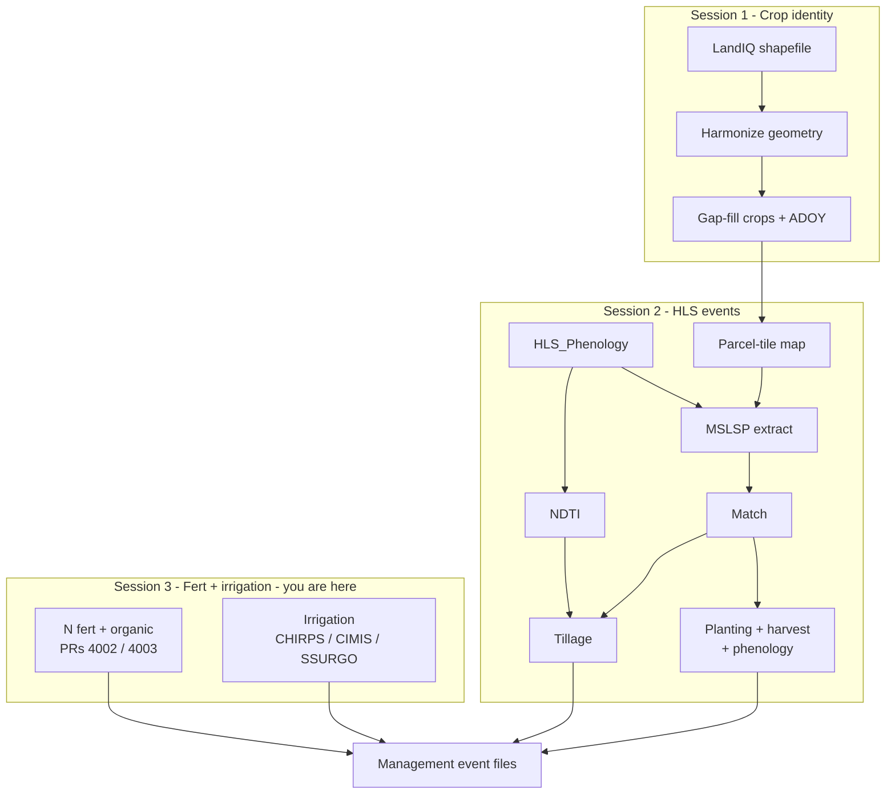

# Session 3 - Fertilization and irrigation

**Goal:** review how **nitrogen fertilization**, **organic amendments**, and
**irrigation** management events are produced for the same LandIQ parcels as
Sessions 1-2. These are parallel, non-HLS workflows (rate lookups and
water-balance), not part of `make_events_statewide.sh`.

**Prerequisite:** [Session 1](01-landiq.md) LandIQ product; optional same demo
parcel list as [Session 2](02-phenology.md) (`parcels_10SDH.csv`). Fert / organic
and irrigation are **review-oriented** in the live training unless the session
lead extends scope.

---

## Where you are

Same flow as [pipeline.md](../pipeline.md). This session is the non-HLS box.



This session = Session 3 box.

---

## Part A - Fertilization and organic amendments

N fertilization and non-crop C amendments (manure, compost, biochar, etc.) are
**not** remotely sensed. Crop guidelines are compiled into lookup tables;
statewide workflows sample those rates onto parcels.

**Canonical PEcAn work:**

| PR | What it adds |
|----|----------------|
| [#4002](https://github.com/PecanProject/pecan/pull/4002) | CA fertilization into `PEcAn.data.land` (`ca_n_application_rate`, organic amendment tables); `ncc` event type |
| [#4003](https://github.com/PecanProject/pecan/pull/4003) | Statewide workflows: `workflows/fertilization-statewide`, `workflows/ncc-statewide` |

Lab copies of source TSVs may live under `$CCMMF_MANAGEMENT/fertilization/`
(ask the session lead). Typical contents:

| File | Role |
|------|------|
| `CCMMF Fertilization - N_Fertilization.tsv` | N rates by crop and growth stage |
| `CCMMF Fertilization - Compost.tsv` / `Biochar.tsv` | Organic amendment properties and rates |
| `CCMMF_Fertilization_Crop_types.tsv` | Crop type crosswalk |
| `harmonize_fertilization_data.R` | Reads TSVs, writes harmonized CSVs |

### Inputs / Outputs

| Item | Path / format | Notes |
|------|---------------|--------|
| Input | Source TSVs under `$CCMMF_MANAGEMENT/fertilization/` (or shipped `data.land`) | Spreadsheet exports |
| Output | `ca_n_application_rate.csv`, `ca_organic_amendment_*.csv` | Harmonized rates |
| Runtime | `look_up_ca_n_rate()` in `PEcAn.data.land` | Per-crop min/max N |
| Events | `workflows/fertilization-statewide`, `workflows/ncc-statewide` | Not wired into `make_events_statewide.R` |

```bash
# From the fertilization folder the session lead provides:
Rscript harmonize_fertilization_data.R
```

```r
library(PEcAn.data.land)
look_up_ca_n_rate("Tomatoes, Processing")
look_up_ca_n_rate("corn", unit = "lbs_acre")
```

---

## Part B - Irrigation

Irrigation events come from a water-balance model using **CHIRPS** (precip),
**CIMIS ETref** (reference ET), and **SSURGO** (soil AWC).

| Track | Scope | Doc |
|-------|--------|-----|
| Statewide / demo | LandIQ parcels; `targets` pipeline | `workflows/irrigation-statewide/README.md` |

### Inputs / Outputs

| Item | Path / format | Notes |
|------|---------------|--------|
| Input | Parcel-level CHIRPS / CIMIS / SSURGO extracts | Preprocess: `workflows/irrigation-statewide/preprocessing/` |
| Config | `config_paths.yml` under the irrigation workflow | Point at `$CCMMF_ROOT` extracts |
| Demo filter | Same `parcels_10SDH.csv` as Session 2 | Parcel-based, not HLS-tile-native |
| Output | Irrigation event files / parquet | Combine with other types for SIPNET |

From the PEcAn root that contains `workflows/irrigation-statewide`:

```bash
# Point TAR_CONFIG / config_paths.yml at your extracts first.
TAR_PROJECT=demo Rscript -e "targets::tar_make()"
Rscript workflows/irrigation-statewide/check-result.R
```

Do **not** use default `TAR_PROJECT=small` (random 1k statewide) if you want the
same fields as the Landsat tile story.

### Combine with HLS-built events

After irrigation events exist for the demo parcels:

```bash
Rscript "$CCMMF_CODE/events/combine_management_events_pecan.R" \
  --planting events_planting.csv \
  --harvest events_harvest.csv \
  --tillage events_tillage.csv \
  --irrigation events_irrigation.csv \
  --out event_files/combined_events_pecanFormat.json
```

See [events/README.md](../../events/README.md). Fertilization / NCC come from
[#4003](https://github.com/PecanProject/pecan/pull/4003).

---

## 3.1 Checklist

**Fertilization / organic**

- [ ] Skim [#4002](https://github.com/PecanProject/pecan/pull/4002) and [#4003](https://github.com/PecanProject/pecan/pull/4003)
- [ ] Know where rates live (`data.land` and/or `$CCMMF_MANAGEMENT/fertilization/`)
- [ ] Spot-check a crop with `look_up_ca_n_rate()` (structure: returns min/max N)

**Irrigation**

- [ ] CHIRPS + CIMIS + SSURGO parcel extracts exist (or reviewed)
- [ ] Demo parcel list matches Session 2 when running the water balance
- [ ] Reviewed or ran `targets` water balance; output event file present

**Spine:** [pipeline.md](../pipeline.md).
