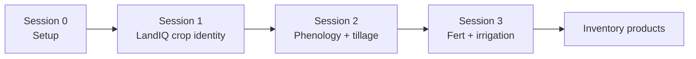
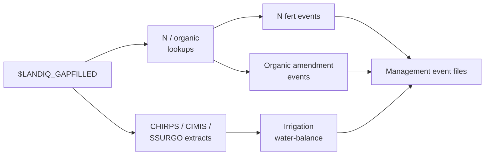

# Session 3 - Fertilization and irrigation

**What this session is for.** Sessions 1-2 built crop identity and HLS-based timing (planting, harvest, phenology, tillage) for the products you chose to run. This session adds **nitrogen fertilization**, **organic amendments** (manure, compost, biochar, and similar non-crop C), and **irrigation**. None of these are read from HLS the same way as phenology or tillage: N and organic rates come from California guideline lookups sampled onto LandIQ parcels; irrigation comes from a water-balance model using climate and soils. Each product is opt-in; Part A (fert / organic) and Part B (irrigation) are independent after LandIQ exists.

You can scope either track to a Session 2 demo parcel list when you have one.

**Prerequisite:** [Session 0](00-setup.md); [Session 1](01-landiq.md) gap-filled LandIQ product. For irrigation canopy cover, prefer [Session 2](02-phenology.md) matched phenology (`$MATCHED_DIR`) and optional demo `parcels_10SDH.csv`.

**Where to go deeper:** [tree README](../../README.md); fert lookups in `PEcAn.data.land`; statewide fert/NCC builders in PEcAn PR [#4003](https://github.com/PecanProject/pecan/pull/4003); irrigation under `workflows/irrigation-statewide/` (especially `preprocessing/README.md`).



Session 3 steps:



**Operator docs**

| Step | Where |
|------|--------|
| N rate / fertilizer component lookups | `PEcAn.data.land` (`look_up_ca_n_rate`, `look_up_fertilizer_components`); data-raw under `modules/data.land/data-raw/` |
| Packaged rate tables | PEcAn PR [#4002](https://github.com/PecanProject/pecan/pull/4002) (merged) |
| Statewide N fertilization events | PR [#4003](https://github.com/PecanProject/pecan/pull/4003) `workflows/fertilization-statewide` |
| Organic amendment (NCC) events | Same PR #4003 `workflows/ncc-statewide` |
| Climate / soils staging | `$CHIRPS_DIR`, `$CIMIS_DIR`, `$SSURGO_DIR`; [Session 3](03-fertilizer-irrigation.md) secs. 3.4-3.5 |
| Parcel climate / soil extracts | `workflows/irrigation-statewide/preprocessing/` |
| Irrigation water-balance | `workflows/irrigation-statewide/` (`README.md`, `config_paths.yml`) |

Combining Session 2 and Session 3 event files (optional handoff): [events/README.md](../../events/README.md).

Shared contract with Sessions 1-2: LandIQ `parcel_id` (and demo filter when used).

## Paths for this session

Expect `$LANDIQ_GAPFILLED` from [Session 1](01-landiq.md). For irrigation canopy, point YAML `mslsp_path` at `$MATCHED_DIR` (or the matched hive from [Session 2](02-phenology.md)). Paths come from [setup_env.sh](../setup_env.sh). Finished tree: [Data layout](00-setup.md#data-layout).

| Role | Path | Notes |
|------|------|-------|
| In | `$LANDIQ_GAPFILLED` | Crops table for fert / irrigation |
| In | `$MATCHED_DIR` | Prefer for irrig `mslsp_path` |
| Lookups | `$FERTILIZATION_LOOKUPS` | Optional TSV rate tables (`$LOOKUPS_ROOT/fertilization`) |
| Out | `$PRODUCTS_INVENTORY/fertilization/` | Fert / NCC **event** outputs when PR #4003 builders are available |
| Staging | `$CHIRPS_DIR`, `$CIMIS_DIR`, `$SSURGO_DIR` | Raw downloads / gdb |
| Work | irrig preprocess dirs (YAML) | Parcel extracts; may live under staging or another path |
| Out | Prefer `$PRODUCTS_INVENTORY/irrigation/` | Set as irrig `event_output_dir` |

---

## 3.1 N rate and fertilizer lookups

N fertilization and organic amendments are **not** remotely sensed. California crop guidelines are compiled into lookup tables that later statewide builders sample onto parcels.

On this monitoring tree you can **inspect** rates via `PEcAn.data.land`:

| Piece | Role |
|-------|------|
| `PEcAn.data.land::look_up_ca_n_rate()` | Per-crop min/max N from CA rate tables |
| `PEcAn.data.land::look_up_fertilizer_components()` | Fertilizer component helpers |
| Packaged rate tables (PR [#4002](https://github.com/PecanProject/pecan/pull/4002)) | Bundled reference data behind the lookups |

```r
library(PEcAn.data.land)
look_up_ca_n_rate("Tomatoes, Processing")
look_up_ca_n_rate("corn", unit = "lbs_acre")
```

Optional source TSVs for rebuilding packaged rates may live under `$FERTILIZATION_LOOKUPS` (not under `$PRODUCTS_INVENTORY/fertilization/`, which is for event outputs):

| File | Role |
|------|------|
| `CCMMF Fertilization - N_Fertilization.tsv` | N rates by crop and growth stage |
| `CCMMF Fertilization - Compost.tsv` / `Biochar.tsv` | Organic amendment properties and rates |
| `CCMMF_Fertilization_Crop_types.tsv` | Crop type crosswalk |

There is **no** `harmonize_fertilization_data.R` on this tree. Packaged tables are built via `modules/data.land/data-raw/create_n_rate_data.R`, `create_compost_data.R`, and `create_fertilizer_data.R`.

| Item | Path / format | Notes |
|------|---------------|--------|
| Runtime | `look_up_ca_n_rate()` / `look_up_fertilizer_components()` | Per-crop rates from packaged data |
| Optional TSV inputs | `$FERTILIZATION_LOOKUPS` | Spreadsheet exports for rebuilding package data |

---

## 3.2 Statewide N fertilization events

Parcel-level **N fertilization event** builders are in PEcAn PR
[#4003](https://github.com/PecanProject/pecan/pull/4003):
`workflows/fertilization-statewide`. Those directories are **not** under
`workflows/` on this monitoring branch -- use the PR for statewide event runs.

| Item | Path / format | Notes |
|------|---------------|--------|
| Input | `$LANDIQ_GAPFILLED` + packaged N lookups | Same `parcel_id` contract as Sessions 1-2 |
| Workflow | PR #4003 `workflows/fertilization-statewide` | Not shipped under `workflows/` here |
| Output | `$PRODUCTS_INVENTORY/fertilization/` | Prefer this inventory path for event products |

---

## 3.3 Organic amendment (NCC) events

Non-crop carbon amendments (manure, compost, biochar, and similar) use the same
guideline approach as N fert, with a separate statewide builder in the same PR:
`workflows/ncc-statewide`.

| Item | Path / format | Notes |
|------|---------------|--------|
| Input | `$LANDIQ_GAPFILLED` + organic amendment tables | Packaged via data-raw / `$FERTILIZATION_LOOKUPS` |
| Workflow | PR #4003 `workflows/ncc-statewide` | Not shipped under `workflows/` here |
| Output | `$PRODUCTS_INVENTORY/fertilization/` | Same inventory folder as N fert events unless you split by convention |

---

## 3.4 Climate and soils for irrigation

Irrigation needs parcel-level **precip** (CHIRPS), **reference ET** (CIMIS ETref),
and **available water capacity** (SSURGO), plus LandIQ irrigation type where
available. Stage raw downloads under `$CHIRPS_DIR`, `$CIMIS_DIR`, and
`$SSURGO_DIR`, then build parcel extracts with the irrig preprocessing scripts.

| Step | Role | Detail |
|------|------|--------|
| Download / stage raw | CHIRPS NetCDF, spatial CIMIS, gSSURGO CA gdb | Public sources; Box may prompt a free login for soils |
| Build parcel extracts | Area-weighted precip / ETref / soil weights | `workflows/irrigation-statewide/preprocessing/` (`README.md`) |
| Point config at extracts | `config_paths.yml` | Keys: `crops_path`, `mslsp_path`, `cimis_etref_path`, `chirps_precip_path`, `ssurgo_*`, `event_output_dir` |

Extracts do not have to live under the raw staging dirs -- point YAML at wherever preprocess wrote them.

---

## 3.5 Irrigation water-balance events

Irrigation events come from the `targets` pipeline in
`workflows/irrigation-statewide/`. The workflow does not take a tile id. It reads
the LandIQ crops table (and joined extracts) named in `config_paths.yml`, then
processes either a random sample or **every parcel in that table**. Scope the run
by what you put on those paths -- same idea as Session 2 restricting to parcels
in a demo tile.

| Item | Path / format | Notes |
|------|---------------|--------|
| Input | Parcel CHIRPS / CIMIS / SSURGO extracts (+ MSLSP canopy as configured) | From Sec. 3.4 |
| Config | `config.yml`, `config_paths.yml` | Prefer shared-tree paths under `$CCMMF_ROOT` |
| Output | Irrigation event files / parquet | Prefer `event_output_dir: $PRODUCTS_INVENTORY/irrigation` (absolute path in YAML) |

`TAR_PROJECT` must be one of the projects in
`workflows/irrigation-statewide/config.yml` (and `_targets.yaml`):

| `TAR_PROJECT` | Behavior |
|---------------|----------|
| `small` | Random 1,000 parcels from the configured crops table; local |
| `medium` | Random 10,000 parcels; cluster |
| `all` | Every parcel in the configured crops table; cluster |

**Demo tile (align with Session 2):** build or point `crops_path` (and matching
parcel-keyed extracts) at the Session 2 parcel list -- e.g. rows whose
`parcel_id` is in `$PRODUCTS_INVENTORY/demo/parcels_${DEMO_TILE}.csv`. Then run
`TAR_PROJECT=all` so the workflow uses that whole subset (do not use `small` /
`medium`, which would randomly subsample again). Keep other `config_paths.yml`
inputs consistent with those parcel ids.

**Full CA table:** leave paths on the statewide gap-filled product and use
`small` / `medium` / `all` as in the workflow README.

From the PEcAn root that contains `workflows/irrigation-statewide`:

```bash
# Point TAR_CONFIG and config_paths.yml at your extracts first.
export TAR_CONFIG=workflows/irrigation-statewide/_targets.yaml
# Demo-tile subset (crops_path already filtered to that parcel list):
TAR_PROJECT=all Rscript -e "targets::tar_make()"
# Or smoke on a full statewide table:
# TAR_PROJECT=small Rscript -e "targets::tar_make()"
Rscript workflows/irrigation-statewide/check-result.R
```

---

## Combining management events

Combine is not an irrigation step. After Session 2 and/or Session 3 event files exist for the parcels of interest, you can merge them for PEcAn / SIPNET:

```bash
Rscript "$CCMMF_CODE/events/combine_management_events_pecan.R" \
  --planting events_planting.csv \
  --harvest events_harvest.csv \
  --tillage events_tillage.csv \
  --irrigation events_irrigation.csv \
  --out event_files/combined_events_pecanFormat.json
```

See [events/README.md](../../events/README.md). For model drivers after combine, see the unofficial [SIPNET handoff](sipnet-handoff.md).

---

**Spine:** [tree README](../../README.md).

**Downstream (unofficial):** [SIPNET handoff](sipnet-handoff.md).
