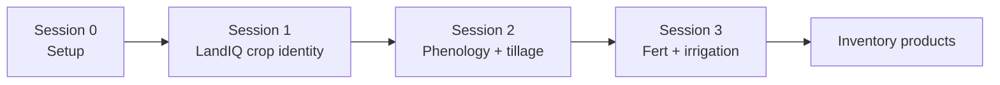
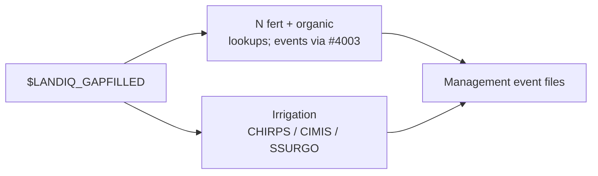

# Session 3 - Fertilization and irrigation

**What this session is for.** Sessions 1-2 built crop identity and HLS-based timing (planting, harvest, phenology, optional tillage). Fertilizer, organic amendments, and irrigation are **not** read from HLS the same way. They are parallel tracks onto the same LandIQ `parcel_id`s: N and organic rates come from California guideline lookups (and event builders when available); irrigation comes from a water-balance workflow using climate and soils.

Treat Part A (fert / organic) and Part B (irrigation) as independent after LandIQ exists. You can run a demo parcel list from Session 2 if you have one.

**Prerequisite:** [Session 0](00-setup.md); [Session 1](01-landiq.md) LandIQ product; optional [Session 2](02-phenology.md) matched phenology for irrig canopy (`$MATCHED_DIR`) and demo `parcels_10SDH.csv`.

**Where to go deeper:** [pipeline.md](../pipeline.md); fert lookups in `PEcAn.data.land`; statewide fert/NCC builders in PEcAn PR [#4003](https://github.com/PecanProject/pecan/pull/4003); irrigation under `workflows/irrigation-statewide/`.



Session 3 steps:



Shared contract with Sessions 1-2: LandIQ `parcel_id` (and demo filter when used).

## Paths for this session

Expect `$LANDIQ_GAPFILLED` from [Session 1](01-landiq.md). For irrigation canopy, point YAML `mslsp_path` at `$MATCHED_DIR` (or the matched hive from [Session 2](02-phenology.md)). Paths come from [setup_env.sh](../setup_env.sh). Finished tree: [Data layout](../pipeline.md). Accounts for CHIRPS/CIMIS/SSURGO: [accounts](../pipeline.md) (no API keys).

| Role | Path | Notes |
|------|------|-------|
| In | `$LANDIQ_GAPFILLED` | Crops table for fert/irrig |
| In | `$MATCHED_DIR` | Prefer for irrig `mslsp_path` |
| Lookups | `$FERTILIZATION_LOOKUPS` | Rate tables only (`$LOOKUPS_ROOT/fertilization`) |
| Out | `$PRODUCTS_INVENTORY/fertilization/` | Fert/NCC **event** outputs when PR #4003 builders are available |
| Staging | `$CHIRPS_DIR`, `$CIMIS_DIR`, `$SSURGO_DIR` | Raw downloads / gdb; parcel extracts from preprocess may live here or another path set in YAML |
| Out | Prefer `$PRODUCTS_INVENTORY/irrigation/` | Set as irrig `event_output_dir` |

Fert on this tree: `PEcAn.data.land::look_up_ca_n_rate()`, `look_up_fertilizer_components()`; package data-raw under `modules/data.land/data-raw/`. Statewide fert/NCC event workflows are **not** under `workflows/` here (PR [#4003](https://github.com/PecanProject/pecan/pull/4003)).

Irrigation: `workflows/irrigation-statewide/` (`config_paths.yml`, `_targets.R`, `preprocessing/README.md`).

---

## Part A - Fertilization and organic amendments

N fertilization and non-crop C amendments (manure, compost, biochar, etc.) are
**not** remotely sensed. Crop guidelines are compiled into lookup tables;
statewide workflows sample those rates onto parcels.

**Lookups (this tree)**


| Piece                                                                                            | Role                                      |
| ------------------------------------------------------------------------------------------------ | ----------------------------------------- |
| `PEcAn.data.land::look_up_ca_n_rate()`                                                           | Per-crop min/max N from CA rate tables    |
| `PEcAn.data.land::look_up_fertilizer_components()`                                               | Fertilizer component helpers              |
| Packaged rate tables (PEcAn PR [#4002](https://github.com/PecanProject/pecan/pull/4002), merged) | Bundled reference data behind the lookups |


**Statewide fert / NCC events**

Parcel-level event builders are in PEcAn PR
[#4003](https://github.com/PecanProject/pecan/pull/4003):


| Piece                               | Role                                       |
| ----------------------------------- | ------------------------------------------ |
| `workflows/fertilization-statewide` | Statewide N event generation               |
| `workflows/ncc-statewide`           | Non-crop carbon (organic amendment) events |


Those workflow directories are not under `workflows/` on this monitoring tree.
Use PR #4003 for fert/NCC statewide event runs; use `look_up_ca_n_rate()` here
to inspect rates.

Optional source TSVs for rebuilding packaged rates may live under `$FERTILIZATION_LOOKUPS` (not under `$PRODUCTS_INVENTORY/fertilization/`, which is for event outputs). Typical spreadsheet exports:

| File | Role |
|------|------|
| `CCMMF Fertilization - N_Fertilization.tsv` | N rates by crop and growth stage |
| `CCMMF Fertilization - Compost.tsv` / `Biochar.tsv` | Organic amendment properties and rates |
| `CCMMF_Fertilization_Crop_types.tsv` | Crop type crosswalk |

There is **no** `harmonize_fertilization_data.R` on this tree. Packaged tables are built via `modules/data.land/data-raw/create_n_rate_data.R`, `create_compost_data.R`, and `create_fertilizer_data.R` (see comments there for any external harmonization script).

### Inputs / Outputs

| Item | Path / format | Notes |
|------|---------------|--------|
| Runtime | `look_up_ca_n_rate()` / `look_up_fertilizer_components()` in `PEcAn.data.land` | Per-crop rates from packaged data |
| Optional TSV inputs | `$FERTILIZATION_LOOKUPS` | Spreadsheet exports for rebuilding package data |
| Event outputs | `$PRODUCTS_INVENTORY/fertilization/` | When using PR #4003 statewide builders |
| Events | PR [#4003](https://github.com/PecanProject/pecan/pull/4003) `workflows/fertilization-statewide`, `workflows/ncc-statewide` | Not present under `workflows/` on this tree |

```r
library(PEcAn.data.land)
look_up_ca_n_rate("Tomatoes, Processing")
look_up_ca_n_rate("corn", unit = "lbs_acre")
```

---

## Part B - Irrigation

Irrigation events come from a water-balance model using **CHIRPS** (precip),
**CIMIS ETref** (reference ET), and **SSURGO** (soil AWC), plus LandIQ
irrigation type where available.

| Track | Scope | Doc |
|-------|--------|-----|
| Statewide or subset | LandIQ parcels; `targets` pipeline | `workflows/irrigation-statewide/README.md` |

The irrig workflow does not take a tile id. It reads the LandIQ crops table (and
joined extracts) named in `config_paths.yml`, then processes either a random
sample or **every parcel in that table**. Scope the run by what you put on those
paths - same idea as Session 2 restricting to parcels in a demo tile.

### Inputs / Outputs

| Item | Path / format | Notes |
|------|---------------|--------|
| Input | Parcel-level CHIRPS / CIMIS / SSURGO extracts (+ MSLSP canopy as configured) | Preprocess: `workflows/irrigation-statewide/preprocessing/`; point YAML at those dirs (not necessarily `$CHIRPS_DIR` / `$CIMIS_DIR` raw staging) |
| Config | `config.yml`, `config_paths.yml` under the irrigation workflow | Keys: `crops_path`, `mslsp_path`, `cimis_etref_path`, `chirps_precip_path`, `ssurgo_*`, `event_output_dir`; prefer shared-tree paths |
| Output | Irrigation event files / parquet | Prefer `event_output_dir: $PRODUCTS_INVENTORY/irrigation` (expand to absolute path in YAML) |

`TAR_PROJECT` must be one of the projects in
`workflows/irrigation-statewide/config.yml` (and `_targets.yaml`):

| `TAR_PROJECT` | Behavior |
|---------------|----------|
| `small` | Random 1,000 parcels from the configured crops table; local |
| `medium` | Random 10,000 parcels; cluster |
| `all` | Every parcel in the configured crops table; cluster |

**Demo tile (align with Session 2):** build or point `crops_path` (and matching
parcel-keyed extracts) at the Session 2 parcel list - e.g. rows whose
`parcel_id` is in `$PRODUCTS_INVENTORY/demo/parcels_${DEMO_TILE}.csv`. Then run
`TAR_PROJECT=all` so the workflow uses that whole subset (do not use `small` /
`medium`, which would randomly subsample again). Keep other `config_paths.yml`
inputs consistent with those parcel ids.

**Full CA table:** leave paths on the statewide gap-filled product and use
`small` / `medium` / `all` as in the workflow README.

From the PEcAn root that contains `workflows/irrigation-statewide`:

```bash
# Point TAR_CONFIG and config_paths.yml at your extracts first.
export TAR_CONFIG=workflows/irrigation-statewide/_targets.yaml
# Demo-tile subset (crops_path already filtered to that parcel list):
TAR_PROJECT=all Rscript -e "targets::tar_make()"
# Or smoke on a full statewide table:
# TAR_PROJECT=small Rscript -e "targets::tar_make()"
Rscript workflows/irrigation-statewide/check-result.R
```

### Combine with HLS-built events

After irrigation events exist for the parcels of interest:

```bash
Rscript "$CCMMF_CODE/events/combine_management_events_pecan.R" \
  --planting events_planting.csv \
  --harvest events_harvest.csv \
  --tillage events_tillage.csv \
  --irrigation events_irrigation.csv \
  --out event_files/combined_events_pecanFormat.json
```

See [events/README.md](../../events/README.md). For model drivers after combine,
see the unofficial [SIPNET handoff](sipnet-handoff.md).

---

## 3.1 Checklist

**Fertilization / organic**

- [ ] Know lookups (`look_up_ca_n_rate`) vs statewide fert/NCC events (PR #4003; not under `workflows/` here)
- [ ] Rate tables: packaged `data.land` and/or `$FERTILIZATION_LOOKUPS`; event outs: `$PRODUCTS_INVENTORY/fertilization/`
- [ ] Spot-check a crop with `look_up_ca_n_rate()` (structure: returns min/max N)

**Irrigation**

- [ ] CHIRPS + CIMIS + SSURGO parcel extracts exist (or reviewed)
- [ ] `config_paths.yml` points at the intended parcel universe (statewide or Session 2 demo-tile subset)
- [ ] Chose `TAR_PROJECT` accordingly (`all` on a subset table; `small`/`medium`/`all` on full CA)
- [ ] Reviewed or ran `targets` water balance; output event file present

**Spine:** [pipeline.md](../pipeline.md).

**Downstream (unofficial):** [SIPNET handoff](sipnet-handoff.md).