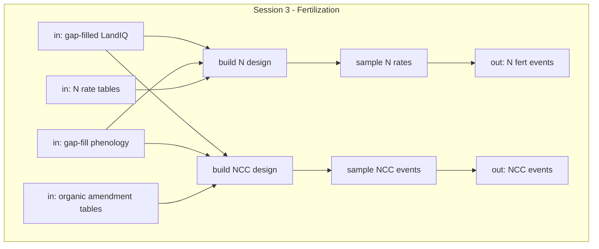
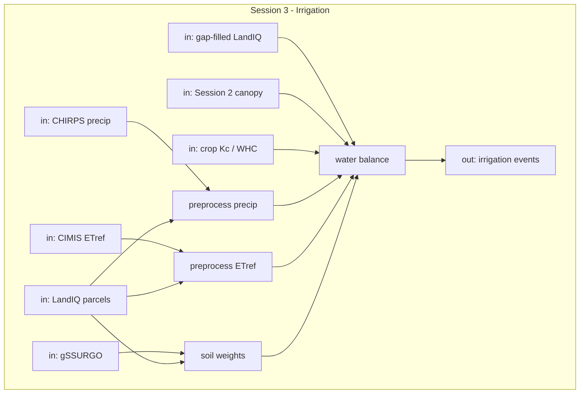
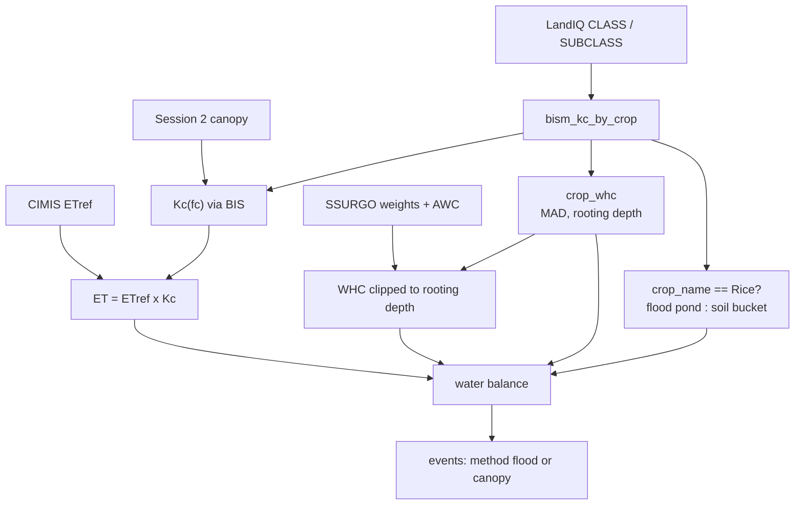

# Session 3 - Fertilization and irrigation

**What this session is for.** Sessions 1-2 built crop identity and HLS-based timing (planting, harvest, phenology, tillage) for the products you chose to run. This session adds **nitrogen fertilization**, **organic amendments** (manure, compost, biochar, and similar non-crop C), and **irrigation**. It writes three inventory event products:

1. **Synthetic N fertilization** -- date and mineral N
2. **Organic amendments (NCC)** -- date, material, and organic C and N
3. **Irrigation** -- date and applied water (`amount_mm`)

Same year pair as Sessions 1-2 (`$PRIOR_YEAR` / `$TARGET_YEAR`). Method and run details live in the workflow READMEs: [fertilization-statewide](../../../../../../workflows/fertilization-statewide/README.md), [ncc-statewide](../../../../../../workflows/ncc-statewide/README.md), and [irrigation-statewide](../../../../../../workflows/irrigation-statewide/README.md). Event columns: [metadata.md](../metadata.md).

**Prerequisite:** [Session 0](00-setup.md); [Session 1](01-landiq.md) gap-filled LandIQ product; [Session 2](02-phenology.md) gap-filled phenology.








## Paths for this session

Expect `$LANDIQ_GAPFILLED` from [Session 1](01-landiq.md) and `$MATCHED_DIR` from [Session 2](02-phenology.md). Paths come from [setup_env.sh](../setup_env.sh). Full tree: [Data layout](00-setup.md#data-layout).

```text
$CCMMF_ROOT/
  LandIQ/gapfilled/                   # LANDIQ_GAPFILLED (also CCMMF_CROPS_PATH)
  climate/CHIRPS/  climate/CIMIS/     # CHIRPS_DIR, CIMIS_DIR
  soils/SSURGO/                       # SSURGO_DIR -- gdb + weights
  lookups/fertilization/              # FERTILIZATION_LOOKUPS (optional TSVs)
  products/inventory/                 # PRODUCTS_INVENTORY
    phenology/.../gapfill_dates/      # MATCHED_DIR / CCMMF_PHEN_DIR
    fertilization/n_fert/  ncc/       # CCMMF_FERT_OUT, CCMMF_NCC_OUT
    event_files/                      # EVENT_OUTPUT_DIR (irrigation shards)
```

---

> [!IMPORTANT]
> New terminal? Run [Session 0 Sec. 0.3](00-setup.md) first (`setup_env` also writes irrigation `config_paths.yml`).
>
> Training: keep `$DEMO_TILE` from Session 2 (default `10TEK`).

## 3.1 Packaged tables

California guideline tables are inside `PEcAn.data.land`. N fert and organic amendments use these packaged lookups:


| Lookup                            | What is in it                                                          |
| --------------------------------- | ---------------------------------------------------------------------- |
| `ca_n_application_rate`           | Per-crop min/max annual N rate (lbs/acre and g/m2)                     |
| `ca_organic_amendment_properties` | Per material: C:N, %N, PAN, CalRecycle class                           |
| `ca_organic_amendment_app_rate`   | Application rate envelope by material and crop structure (row vs tree) |


```bash
Rscript -e 'library(PEcAn.data.land); dplyr::glimpse(ca_n_application_rate)'
Rscript -e 'library(PEcAn.data.land); dplyr::glimpse(ca_organic_amendment_properties)'
Rscript -e 'library(PEcAn.data.land); dplyr::glimpse(ca_organic_amendment_app_rate)'
```

You do not need to rebuild these. To refresh from source TSVs under `$FERTILIZATION_LOOKUPS`: `modules/data.land/data-raw/build_ca_fertilization_data.R`, then `create_ca_n_application_rate.R` and `create_ca_organic_amendment.R` (see that folder's README). 

## 3.2 N fertilization events

This builds mineral N events for the inventory: a date and N amount (kg/m2) per crop cycle. California N guidelines give a min and max rate per crop, not a single recommended value, so each parcel-cycle is expanded to 20 ensemble members (`ens_001` ... `ens_020`). Each member draws its annual N rate uniformly within that range. Detail: [fertilization-statewide](../../../../../../workflows/fertilization-statewide/README.md).

Run after Session 2 gap-fill (Sec. 2.5). If you skipped that step, pull the training tile gap-fill parquet from S3 first. Then source `setup_env` with the same tile `MATCHED_DIR` as Session 2 and use `FERT_PROJECT=all`.

```bash
export DEMO_TILE=10TEK
export MATCHED_DIR=$PRODUCTS_INVENTORY/phenology/matched_landiq_mslsp_v4.1.2/tile=$DEMO_TILE

mkdir -p "$MATCHED_DIR/gapfill_dates"
aws s3 --profile magic sync \
  "s3://carb/management/session2/$DEMO_TILE/gapfill_dates/" \
  "$MATCHED_DIR/gapfill_dates/"

source "$CCMMF_BASE/src/pecan/modules/data.remote/inst/ccmmf/documentation/setup_env.sh"
ls "$CCMMF_PHEN_DIR"/assigned_year=*_gapfilled.parquet
```

Timing comes from Session 2 phenology; the whole season N total goes on that anchor date.


| PFT        | Phenology metric | Used as  |
| ---------- | ---------------- | -------- |
| row, rice  | `mslsp_OGI`      | Planting |
| hay, woody | `mslsp_50PCGI`   | Leaf-on  |


```bash
cd "$CCMMF_BASE/src/pecan"

export FERT_PROJECT=all
Rscript workflows/fertilization-statewide/01-build-parcel-design.R
Rscript workflows/fertilization-statewide/02-sample-n-rates.R
Rscript workflows/fertilization-statewide/03-write-parquet.R
```

```bash
Rscript -e 'dplyr::glimpse(readRDS(file.path(Sys.getenv("CCMMF_FERT_OUT"), "_staging/_staging_01_design.rds")))'
Rscript -e 'dplyr::glimpse(readRDS(file.path(Sys.getenv("CCMMF_FERT_OUT"), "_staging/_staging_02_events.rds")))'
Rscript -e 'dplyr::glimpse(arrow::read_parquet(list.files(Sys.getenv("CCMMF_FERT_OUT"), pattern="\\.parquet$", full.names=TRUE)[1]))'
```

Output: `$CCMMF_FERT_OUT/{pid_min}_{pid_max}.parquet` (e.g. `282_526346.parquet`). One file per parcel-id batch. 

## 3.3 Organic amendment (NCC) events

NCC adds organic amendments (compost, manure, biochar, etc.) as events with organic C and N. It uses the same LandIQ and phenology inputs as Sec. 3.2. There is no statewide survey of organic amendment frequency, so the workflow uses a scenario assumption `p_apply_default = 0.10`, meaning each crop cycle and ensemble member has a 10% probability of receiving compost. Where compost is sampled, the workflow also draws material, application rate, C:N, and a date offset. Detail: [ncc-statewide](../../../../../../workflows/ncc-statewide/README.md).


| PFT   | Phenology metric | Offset window                |
| ----- | ---------------- | ---------------------------- |
| row   | `mslsp_OGI`      | 120 to 90 before (pre-plant) |
| rice  | `mslsp_OGI`      | 90 to 60 before              |
| woody | `mslsp_50PCGI`   | 30 before to 14 after        |
| hay   | `mslsp_OGD`      | 0 to 14 after (post-harvest) |


```bash
export NCC_PROJECT=all
Rscript workflows/ncc-statewide/01-build-parcel-design.R
Rscript workflows/ncc-statewide/02-sample-ncc-events.R
Rscript workflows/ncc-statewide/03-write-parquet.R
```

```bash
Rscript -e 'dplyr::glimpse(readRDS(file.path(Sys.getenv("CCMMF_NCC_OUT"), "_staging/_staging_01_design.rds")))'
Rscript -e 'dplyr::glimpse(readRDS(file.path(Sys.getenv("CCMMF_NCC_OUT"), "_staging/_staging_02_events.rds")))'
Rscript -e 'dplyr::glimpse(arrow::read_parquet(list.files(Sys.getenv("CCMMF_NCC_OUT"), pattern="\\.parquet$", full.names=TRUE)[1]))'
```

Output: `$CCMMF_NCC_OUT/{pid_min}_{pid_max}.parquet` (same batch naming as Sec. 3.2).

## 3.4 Water balance (concept)

Irrigation is modeled, not observed: daily water balance on each parcel from climate, soils, and canopy inputs. Most crops use a soil bucket; rice uses a flooded-pond balance. Implementation: [irrigation-statewide](../../../../../../workflows/irrigation-statewide/README.md). Preprocess: [preprocessing](../../../../../../workflows/irrigation-statewide/preprocessing/README.md).

#### Generic model (most crops)

Each parcel tracks soil-water storage in a single-layer bucket sized by water holding capacity (WHC). Each day, precipitation adds water and crop ET removes it. If storage falls below the management allowable depletion (MAD) threshold, irrigation refills toward field capacity; if storage exceeds WHC, the excess is runoff. State carries forward to the next day.

#### Flooded rice

Rice uses the same daily climate and ET drivers but tracks pond depth instead of soil storage. Seepage and ET draw the pond down. Irrigation refills when depth falls below a minimum, and runoff occurs when depth exceeds a maximum flood level. 

#### Inputs


| Piece             | Role                                 | Section                            |
| ----------------- | ------------------------------------ | ---------------------------------- |
| `P_t`             | precipitation                        | CHIRPS (3.5)                       |
| `ETref`           | reference ET                         | CIMIS (3.6)                        |
| `Kc`, canopy `fc` | crop coefficient from canopy cover   | BISm + Session 2 (3.7)             |
| WHC               | bucket size                          | gSSURGO + rooting depth (3.9, 3.8) |
| MAD               | irrigation trigger (fraction of WHC) | `crop_whc` (3.8)                   |


## 3.5 CHIRPS download and extract

CHIRPS is daily precipitation (`P_t`). Each inventory year is one **global** daily NetCDF (~0.05 deg); California is subsetted during parcel extract, not at download.

Download for `$PRIOR_YEAR` and `$TARGET_YEAR`, then extract onto LandIQ parcels. 

```bash
mkdir -p "$CHIRPS_DIR"
Rscript -e "PEcAn.data.remote::download.CHIRPS('$CHIRPS_DIR', c($PRIOR_YEAR, $TARGET_YEAR))"
ls "$CHIRPS_DIR"/chirps-v2.0.${PRIOR_YEAR}.days_p05.nc \
   "$CHIRPS_DIR"/chirps-v2.0.${TARGET_YEAR}.days_p05.nc
```

```bash
cd "$IRRIG_PREPROCESS"
Rscript chirps-preprocess.R
ls "$IRRIG_PREPROCESS/_results_chirps"/chirps-${PRIOR_YEAR}.parquet \
   "$IRRIG_PREPROCESS/_results_chirps"/chirps-${TARGET_YEAR}.parquet
```

Columns: `parcel_id`, `date`, `precip_mm_day`.

```bash
Rscript -e "arrow::read_parquet('_results_chirps/chirps-${TARGET_YEAR}.parquet') |> dplyr::glimpse()"
```

## 3.6 CIMIS download and extract

Spatial CIMIS is daily reference ET (`ETref`) on a **California** grid. That is not yet crop ET; Sec. 3.7-3.8 and 3.10 turn it crop-specific with `bism_kc_by_crop` and Session 2 canopy cover.

Download daily ETo for `$PRIOR_YEAR` and `$TARGET_YEAR` only. 

```bash
mkdir -p "$CIMIS_DIR"
Rscript -e "PEcAn.data.remote::download.CIMIS('$CIMIS_DIR', c($PRIOR_YEAR, $TARGET_YEAR))"
ls "$CIMIS_DIR/${PRIOR_YEAR}/01/01/ETo.asc.gz" \
   "$CIMIS_DIR/${TARGET_YEAR}/12/31/ETo.asc.gz"
```

```bash
cd "$IRRIG_PREPROCESS"
export CLUSTERMQ_N_JOBS=4
Rscript cimis-01-weights.R
Rscript cimis-02-extract.R
duckdb < cimis-03-combine.sql
ls "$IRRIG_PREPROCESS/_results_v2/cimis-extracted"
```

Columns: `parcel_id`, `date`, `etref_mm_day`.

```bash
Rscript -e "arrow::open_dataset('_results_v2/cimis-extracted') |> dplyr::glimpse()"
```

## 3.7 BISm crop coefficients (`Kc`)

The water balance uses **Basic Irrigation Scheduling** (BIS / BISm) crop coefficients from packaged `PEcAn.data.land::bism_kc_by_crop`: `ET[t] = ETref[t] * Kc[t]`, with `Kc` driven by canopy cover `fc` from Session 2 (Sec. 3.6).


| Piece                     | Role                                                                                  |
| ------------------------- | ------------------------------------------------------------------------------------- |
| `bism_kc_by_crop`         | Maps LandIQ `CLASS` / `SUBCLASS` to a BIS crop and `Kc(fc)` schedule                  |
| Session 2 `fc[t]`         | Canopy cover interpolated daily from MSLSP phenology dates (`mslsp_to_canopycover()`) |
| `PEcAn.data.land` helpers | `eto_to_etc` / BISm `Kc` curves used inside `tar_make`                                |


Inspect the table:

```bash
Rscript -e 'library(PEcAn.data.land); data(bism_kc_by_crop); dplyr::glimpse(bism_kc_by_crop)'
```

Rebuild path: `modules/data.land/data-raw/bism_kc_by_crop.R` from `bism_crop_coefficients.csv`.

## 3.8 MAD and rooting depth (`crop_whc`)

Per-crop rooting depth and MAD in `PEcAn.data.land::crop_whc` (FAO), joined on BIS `crop_name`:


| Column / concept  | Role                                                         |
| ----------------- | ------------------------------------------------------------ |
| `rooting_depth_m` | Maximum effective rooting depth (m) (FAO)                    |
| `whc_min_frac`    | MAD threshold (FAO): minimum soil water as a fraction of WHC |


```bash
Rscript -e 'library(PEcAn.data.land); data(crop_whc); dplyr::glimpse(crop_whc)'
```

`whc_min_frac` is the MAD threshold: irrigation triggers when soil storage falls below this fraction of WHC. `rooting_depth_m` sets the rooting zone depth.

Rebuild path: `modules/data.land/data-raw/crop_whc.R` from `crop_whc.csv`.

---

## 3.9 SSURGO weights (WHC)

**WHC** (water holding capacity) is the soil bucket in Sec. 3.4: plant-available water in the root zone. It comes from USGS/NRCS **gSSURGO** (available water by soil layer), clipped to the crop rooting depth from `crop_whc` (Sec. 3.8) and averaged onto each LandIQ parcel.

This section builds parcel-to-map-unit (`mukey`) area weights from the California gSSURGO geodatabase -- same idea as CIMIS weights, but for soil polygons. Crop-specific WHC is finished later in the water-balance run (Sec. 3.10) when rooting depth is known.

Get `gSSURGO_CA.gdb`. Pull from S3 or download from NRCS Box:

```bash
mkdir -p "$SSURGO_DIR"
aws s3 sync --profile magic \
  s3://carb/management/session3/ssurgo/gSSURGO_CA.gdb/ \
  "$SSURGO_DIR/gSSURGO_CA.gdb/"
ls "$SSURGO_DIR/gSSURGO_CA.gdb"
```

Build parcel weights:

```bash
cd "$IRRIG_PREPROCESS"
export CLUSTERMQ_N_JOBS=4
Rscript ssurgo-01-spatial-weights.R
Rscript ssurgo-02-combine.R
```

Or pull ready weights from S3:

```bash
mkdir -p "$SSURGO_DIR"
aws s3 cp --profile magic \
  s3://carb/management/session3/ssurgo/ssurgo-weights.parquet \
  "$SSURGO_DIR/ssurgo-weights.parquet"
```

Columns: `parcel_id`, `mukey`, area weights.

## 3.10 Derive irrigation events

This step joins every input above. For each parcel and crop season, the water balance (Sec. 3.4) turns precip, reference ET, soils, and canopy into irrigation amounts and dates. Detail: [irrigation-statewide](../../../../../../workflows/irrigation-statewide/README.md).




**Ensemble (default 20 members).** Applied water (`amount_mm`) is uncertain, so each parcel gets several copies of its irrigation schedule (`n_irr_ensemble`, default 20 in `config.yml`). For each parcel the workflow draws one random scale factor per member (normal distribution centered on 1.0, SD `frac_uncertainty` = 0.1) and multiplies every `amount_mm` on that parcel by the same factor.

```bash
export TAR_CONFIG="$CCMMF_BASE/src/pecan/workflows/irrigation-statewide/_targets.yaml"
export NSLOTS=4

cd "$CCMMF_BASE/src/pecan"
TAR_PROJECT=all Rscript -e "targets::tar_make()"
```

Output under `$EVENT_OUTPUT_DIR/irrigation_all/`.

```bash
Rscript -e 'arrow::open_dataset(file.path(Sys.getenv("EVENT_OUTPUT_DIR"), "irrigation_all")) |> dplyr::glimpse()'
```

Columns `parcel_id`, `ens_id`, `date`, `amount_mm`, and `method`. Rows with `amount_mm > 0` are irrigation events.

---

## Statewide

**Fert / NCC.** Same `FERT_PROJECT=all` / `NCC_PROJECT=all` as Sec. 3.2-3.3; point `MATCHED_DIR` at the statewide gap-filled phenology tree (not tile), re-source `setup_env.sh`, then:

```bash
unset DEMO_TILE
export MATCHED_DIR=$PRODUCTS_INVENTORY/phenology/matched_landiq_mslsp_v4.1.2
source "$CCMMF_BASE/src/pecan/modules/data.remote/inst/ccmmf/documentation/setup_env.sh"
cd "$CCMMF_BASE/src/pecan"
export FERT_PROJECT=all
export NCC_PROJECT=all
bash workflows/fertilization-statewide/run-statewide.sh
bash workflows/ncc-statewide/run-statewide.sh
```

**Irrigation.** Same steps as Sec. 3.5-3.11, no tile filter. `unset` `DEMO_TILE`, point `MATCHED_DIR` at the statewide phenology tree, and re-source `setup_env.sh` so `config_paths.yml` uses statewide paths. Wait for each job before the next step that reads its output. 

`-c` / `-m` / `-t` are starting guesses. Raise them if a job is killed. Site flags: `CCMMF_SUBMIT_EXTRA`.

```bash
unset DEMO_TILE
export MATCHED_DIR=$PRODUCTS_INVENTORY/phenology/matched_landiq_mslsp_v4.1.2
source "$CCMMF_BASE/src/pecan/modules/data.remote/inst/ccmmf/documentation/setup_env.sh"
```

Download as in Sec. 3.5-3.6, then:

```bash
cd "$IRRIG_PREPROCESS"
export CLUSTERMQ_N_JOBS=16
Rscript chirps-preprocess.R
Rscript cimis-01-weights.R
Rscript cimis-02-extract.R
duckdb < cimis-03-combine.sql
Rscript ssurgo-01-spatial-weights.R
Rscript ssurgo-02-combine.R
```

```bash
export TAR_CONFIG="$CCMMF_BASE/src/pecan/workflows/irrigation-statewide/_targets.yaml"
cd "$CCMMF_BASE/src/pecan"
"$CCMMF_SUBMIT" -n irrig-tar -c 8 -m 32G -t 24:00:00 -- \
  env TAR_PROJECT=all NSLOTS=8 Rscript -e "targets::tar_make()"
```

