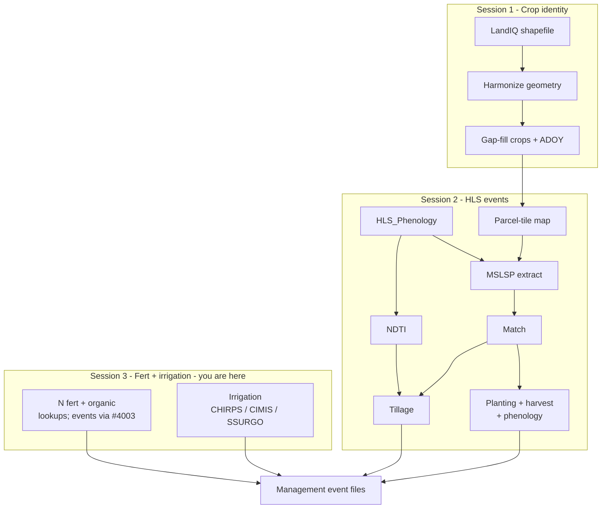

# Session 3 - Fertilization and irrigation

**Deliverable:** nitrogen fertilization, organic (NCC) amendment, and irrigation
management inputs for the same LandIQ parcels as Sessions 1-2 (parallel tracks
into MAGIC / SIPNET).

**Goal:** produce or review **nitrogen fertilization**, **organic amendments**,
and **irrigation** management events. These are parallel, non-HLS workflows
(rate lookups and water-balance).

**Method class:** lookup (N / organic); water balance (irrigation). Lookups are in
`PEcAn.data.land` on this tree; statewide fert/NCC event builders are in PEcAn PR
[#4003](https://github.com/PecanProject/pecan/pull/4003).

**Prerequisite:** [Session 1](01-landiq.md) LandIQ product; optional same demo
parcel list as [Session 2](02-phenology.md) (`parcels_10SDH.csv`).

---

## Where you are

Same flow as [pipeline.md](../pipeline.md). This session is the non-HLS box.




This session = Session 3 box. Shared contract with Sessions 1-2: LandIQ
`parcel_id` (and demo filter when used).

---

## Part A - Fertilization and organic amendments

N fertilization and non-crop C amendments (manure, compost, biochar, etc.) are
**not** remotely sensed. Crop guidelines are compiled into lookup tables;
statewide workflows sample those rates onto parcels.

**Lookups (this tree)**


| Piece                                                                                            | Role                                      |
| ------------------------------------------------------------------------------------------------ | ----------------------------------------- |
| `PEcAn.data.land::look_up_ca_n_rate()`                                                           | Per-crop min/max N from CA rate tables    |
| `PEcAn.data.land::look_up_fertilizer_components()`                                               | Fertilizer component helpers              |
| Packaged rate tables (PEcAn PR [#4002](https://github.com/PecanProject/pecan/pull/4002), merged) | Bundled reference data behind the lookups |


**Statewide fert / NCC events**

Parcel-level event builders are in PEcAn PR
[#4003](https://github.com/PecanProject/pecan/pull/4003):


| Piece                               | Role                                       |
| ----------------------------------- | ------------------------------------------ |
| `workflows/fertilization-statewide` | Statewide N event generation               |
| `workflows/ncc-statewide`           | Non-crop carbon (organic amendment) events |


Those workflow directories are not under `workflows/` on this monitoring tree.
Use PR #4003 for fert/NCC statewide event runs; use `look_up_ca_n_rate()` here
to inspect rates.

Source TSVs for harmonization may live under `$MANAGEMENT/fertilization/`.
Typical contents:


| File                                                | Role                                   |
| --------------------------------------------------- | -------------------------------------- |
| `CCMMF Fertilization - N_Fertilization.tsv`         | N rates by crop and growth stage       |
| `CCMMF Fertilization - Compost.tsv` / `Biochar.tsv` | Organic amendment properties and rates |
| `CCMMF_Fertilization_Crop_types.tsv`                | Crop type crosswalk                    |
| `harmonize_fertilization_data.R`                    | Reads TSVs, writes harmonized CSVs     |


### Inputs / Outputs


| Item    | Path / format                                                                                                              | Notes                                 |
| ------- | -------------------------------------------------------------------------------------------------------------------------- | ------------------------------------- |
| Input   | Source TSVs under `$MANAGEMENT/fertilization/` (or shipped `data.land`)                                              | Spreadsheet exports                   |
| Output  | `ca_n_application_rate.csv`, `ca_organic_amendment_*.csv`                                                                  | Harmonized rates                      |
| Runtime | `look_up_ca_n_rate()` in `PEcAn.data.land`                                                                                 | Per-crop min/max N                    |
| Events  | PR [#4003](https://github.com/PecanProject/pecan/pull/4003) `workflows/fertilization-statewide`, `workflows/ncc-statewide` | Statewide fert/NCC event builders |


```bash
# From $MANAGEMENT/fertilization/ (or the packaged data-raw path):
Rscript harmonize_fertilization_data.R
```

```r
library(PEcAn.data.land)
look_up_ca_n_rate("Tomatoes, Processing")
look_up_ca_n_rate("corn", unit = "lbs_acre")
```

---

## Part B - Irrigation

Irrigation events come from a water-balance model using **CHIRPS** (precip),
**CIMIS ETref** (reference ET), and **SSURGO** (soil AWC), plus LandIQ
irrigation type where available.

| Track | Scope | Doc |
|-------|--------|-----|
| Statewide or subset | LandIQ parcels; `targets` pipeline | `workflows/irrigation-statewide/README.md` |

The irrig workflow does not take a tile id. It reads the LandIQ crops table (and
joined extracts) named in `config_paths.yml`, then processes either a random
sample or **every parcel in that table**. Scope the run by what you put on those
paths - same idea as Session 2 restricting to parcels in a demo tile.

### Inputs / Outputs

| Item | Path / format | Notes |
|------|---------------|--------|
| Input | Parcel-level CHIRPS / CIMIS / SSURGO extracts (+ MSLSP canopy as configured) | Preprocess: `workflows/irrigation-statewide/preprocessing/` |
| Config | `config.yml`, `config_paths.yml` under the irrigation workflow | Paths select the parcel universe; `TAR_PROJECT` selects sample vs all-in-table |
| Output | Irrigation event files / parquet | Combine with other event types as needed |

`TAR_PROJECT` must be one of the projects in
`workflows/irrigation-statewide/config.yml` (and `_targets.yaml`):

| `TAR_PROJECT` | Behavior |
|---------------|----------|
| `small` | Random 1,000 parcels from the configured crops table; local |
| `medium` | Random 10,000 parcels; cluster |
| `all` | Every parcel in the configured crops table; cluster |

**Demo tile (align with Session 2):** build or point `crops_path` (and matching
parcel-keyed extracts) at the Session 2 parcel list - e.g. rows whose
`parcel_id` is in `$MANAGEMENT/demo/parcels_${DEMO_TILE}.csv`. Then run
`TAR_PROJECT=all` so the workflow uses that whole subset (do not use `small` /
`medium`, which would randomly subsample again). Keep other `config_paths.yml`
inputs consistent with those parcel ids.

**Full CA table:** leave paths on the statewide gap-filled product and use
`small` / `medium` / `all` as in the workflow README.

From the PEcAn root that contains `workflows/irrigation-statewide`:

```bash
# Point TAR_CONFIG and config_paths.yml at your extracts first.
export TAR_CONFIG=workflows/irrigation-statewide/_targets.yaml
# Demo-tile subset (crops_path already filtered to that parcel list):
TAR_PROJECT=all Rscript -e "targets::tar_make()"
# Or smoke on a full statewide table:
# TAR_PROJECT=small Rscript -e "targets::tar_make()"
Rscript workflows/irrigation-statewide/check-result.R
```

### Combine with HLS-built events

After irrigation events exist for the parcels of interest:

```bash
Rscript "$CCMMF_CODE/events/combine_management_events_pecan.R" \
  --planting events_planting.csv \
  --harvest events_harvest.csv \
  --tillage events_tillage.csv \
  --irrigation events_irrigation.csv \
  --out event_files/combined_events_pecanFormat.json
```

See [events/README.md](../../events/README.md). For model drivers after combine,
see the unofficial [SIPNET handoff](sipnet-handoff.md).

---

## 3.1 Checklist

**Fertilization / organic**

- [ ] Know lookups (`look_up_ca_n_rate`) vs statewide fert/NCC events (PR #4003)
- [ ] Know where rates live (`data.land` and/or `$MANAGEMENT/fertilization/`)
- [ ] Spot-check a crop with `look_up_ca_n_rate()` (structure: returns min/max N)

**Irrigation**

- [ ] CHIRPS + CIMIS + SSURGO parcel extracts exist (or reviewed)
- [ ] `config_paths.yml` points at the intended parcel universe (statewide or Session 2 demo-tile subset)
- [ ] Chose `TAR_PROJECT` accordingly (`all` on a subset table; `small`/`medium`/`all` on full CA)
- [ ] Reviewed or ran `targets` water balance; output event file present

**Spine:** [pipeline.md](../pipeline.md).

**Downstream (unofficial):** [SIPNET handoff](sipnet-handoff.md).