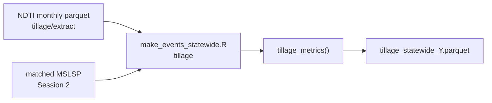

# Training Session 3 - Tillage and fertilization

This session covers **tillage event generation** from the Normalized Difference
Tillage Index (NDTI) + matched MSLSP phenology (Part A), and **California nitrogen /
organic-amendment rate lookups** for PEcAn fertilization events (Part B).

**Navigation:** [Pipeline](../pipeline.md) | [Session 2](02-phenology.md) | [Session 4](04-irrigation.md)

**Prerequisites (Part A):**

- Gap-filled LandIQ product (Session 1)
- Matched LandIQ-MSLSP assignments (`assigned_by == "matched"`) for the target year
  +/- buffer (Session 2)
- HLS reflectance available for NDTI extract (or existing monthly NDTI under
  `$CCMMF_MANAGEMENT/tillage/ndti_v4.1/`)

**Operator docs** (how the code works - use during hands-on):

| Step | README |
|------|--------|
| Pipeline map | [pipeline.md](../pipeline.md) |
| NDTI parcel extraction | [tillage/extract/README.md](../../tillage/extract/README.md) |
| Statewide events (incl. tillage) | [events/README.md](../../events/README.md) |

**After Part A you can:**

- Explain why NDTI (HLS SWIR) in fallow windows is used to infer tillage
- Run monthly NDTI parcel extraction for a year
- Generate opt-in tillage event files via `make_events_statewide.sh ... tillage`

---

## Part A - Tillage (NDTI)

Tillage is **not** in the default Session 2 event run. Timing is inferred from
**NDTI** in each **fallow window** between one season's senescence (`OGMn`) and the
next season's green-up (`OGI`), using matched phenology from Session 2.

Why: after harvest / senescence, SWIR-based NDTI responds to residue vs. bare soil.
The minimum smoothed NDTI date in the fallow window is the tillage timing signal;
percent drop from the pre-minimum peak is an intensity proxy. Operator detail:
[events/README.md](../../events/README.md) (tillage section).



### A.1 Run NDTI extraction (if not done)

Why: tillage events need monthly NDTI under `$CCMMF_MANAGEMENT/tillage/ndti_v4.1/`.

```bash
source "$CCMMF_CODE/documentation/setup_env.sh"
export TILLAGE_ROOT="${TILLAGE_ROOT:-$CCMMF_CODE/tillage}"

$TILLAGE_ROOT/run_ndti.sh 2024
```

For older flat imagery trees set `HLS_IMAGERY_LAYOUT=flat` - see
[tillage/extract/README.md](../../tillage/extract/README.md).

Output: `$CCMMF_MANAGEMENT/tillage/ndti_v4.1/year=2024/ndti_year=2024_month=MM.parquet`
(12 months). Confirm coverage with the verify snippet in that README.

### A.2 Run tillage events

Tillage is **opt-in** - heavier than phenology/planting/harvest (loads NDTI for
`year +/- TILLAGE_BUFFER_YEARS`, default 1).

```bash
$CCMMF_CODE/events/make_events_statewide.sh 2024 tillage
```

### A.3 Verify

```r
library(arrow)
f <- file.path(Sys.getenv("CCMMF_MANAGEMENT"), "event_files/tillage_statewide_2024.parquet")
if (file.exists(f)) message("tillage rows: ", nrow(read_parquet(f)))
```

Outputs land under `$CCMMF_MANAGEMENT/event_files/tillage_statewide_*.parquet` (and
optional JSON). Full schema: [events/README.md](../../events/README.md) and
[events/data/tillage_statewide_metadata.csv](../../events/data/tillage_statewide_metadata.csv).

### A.4 Algorithm (one paragraph)

Join NDTI scenes to phenology dates; build fallow periods (`OGMn` -> next `OGI`);
smooth NDTI (4-day moving average); take the minimum in each window as the tillage
date; record pre-minimum peak, percent change, and observation quality flags. Step
list and columns: [events/README.md](../../events/README.md).

---

## Part B - Fertilization and organic amendments

N fertilization and non-crop C amendments (manure, compost, biochar, etc.) are
**not** remotely sensed. Crop guidelines are compiled into lookup tables;
statewide event workflows sample those rates onto parcels.

**Canonical PEcAn work (read these first):**

| PR | What it adds |
|----|----------------|
| [#4002](https://github.com/PecanProject/pecan/pull/4002) | CA fertilization harmonization into `PEcAn.data.land` (`ca_n_application_rate`, organic amendment tables); `ncc` event type in the events schema |
| [#4003](https://github.com/PecanProject/pecan/pull/4003) | Statewide workflows: `workflows/fertilization-statewide`, `workflows/ncc-statewide` (+ cleaners for preprocess-event-parquet) |

Lab / training copies of source TSVs and the standalone harmonizer may still live
under `$CCMMF_MANAGEMENT/fertilization/` (ask the session lead). Typical contents:

| File | Role |
|------|------|
| `CCMMF Fertilization - N_Fertilization.tsv` | Source spreadsheet export - N rates by crop and growth stage |
| `CCMMF Fertilization - Compost.tsv` | Organic amendment properties and application rates |
| `CCMMF Fertilization - Biochar.tsv` | Biochar amendment data |
| `CCMMF_Fertilization_Crop_types.tsv` | Crop type crosswalk |
| **`harmonize_fertilization_data.R`** | **Main script** - reads TSVs, writes harmonized CSVs |
| `diagnose.R` | Audit tool comparing raw TSV to PEcAn harmonized output |

### Harmonize source data -> CSVs

```bash
# From the fertilization repo/folder the session lead provides:
Rscript harmonize_fertilization_data.R
```

**Outputs** (written alongside the TSVs):

| CSV | Contents |
|-----|----------|
| `ca_n_application_rate.csv` | Per-crop min/max N (lbs N/acre and g N/m2) |
| `ca_organic_amendment_properties.csv` | Material C:N, N%, PAN%, etc. |
| `ca_organic_amendment_app_rate.csv` | Application rates by material and crop structure (rows vs trees) |

The harmonizer aggregates within-year stage rows (preplant, sidedress, ...) or uses
envelope totals depending on how each crop is reported in the source TSV. See the
`build_n_rates()` logic in `harmonize_fertilization_data.R`.

### PEcAn `data.land` usage

Harmonized rates are consumed in PEcAn via **`look_up_ca_n_rate()`** and the
**`ca_n_application_rate`** dataset in `PEcAn.data.land`.

```r
library(PEcAn.data.land)
look_up_ca_n_rate("Tomatoes, Processing")
look_up_ca_n_rate("corn", unit = "lbs_acre")
?look_up_ca_n_rate
?ca_n_application_rate
```

Implementation lives in the `PEcAn.data.land` package
(`look_up_ca_n_rate.R` and its tests). A deployed copy of the harmonizer may also
exist under `$CCMMF_MANAGEMENT/fertilization/` once the session lead syncs it.

Statewide fertilization / NCC **event generation** is **not** wired into
`make_events_statewide.R` (unlike tillage). Use `look_up_ca_n_rate()` for lookups,
and run the statewide workflows from [#4003](https://github.com/PecanProject/pecan/pull/4003)
(`fertilization-statewide`, `ncc-statewide`) for parcel ensembles.

---

## 3.1 Hands-on checklist

**Tillage**

- [ ] Confirm NDTI parquet exists for target year +/- 1 under `$CCMMF_MANAGEMENT/tillage/ndti_v4.1/`.
- [ ] Confirm `assigned_year=TARGET_YEAR.parquet` from Session 2.
- [ ] Run `$CCMMF_CODE/events/make_events_statewide.sh TARGET_YEAR tillage`.
- [ ] Verify `$CCMMF_MANAGEMENT/event_files/tillage_statewide_TARGET_YEAR.parquet`.

**Fertilization / organic amendments**

- [ ] Skim [#4002](https://github.com/PecanProject/pecan/pull/4002) and [#4003](https://github.com/PecanProject/pecan/pull/4003).
- [ ] Review source fertilization TSVs (or shipped `data.land` tables).
- [ ] Spot-check crops with `look_up_ca_n_rate()` in R.
- [ ] Optional: run / review `workflows/fertilization-statewide` and `workflows/ncc-statewide`.

---

## 3.2 What comes next

- **[Session 4 - Irrigation](04-irrigation.md):** water-balance irrigation events
  (statewide parcel workflow + anchor-site prototype).
- **Combine event types for SIPNET:** [combine_management_events_pecan.R](../../events/combine_management_events_pecan.R)
  merges planting, harvest, tillage, and irrigation (and related types as available)
  into one PEcAn JSON bundle. Fertilization / NCC come from [#4003](https://github.com/PecanProject/pecan/pull/4003).
