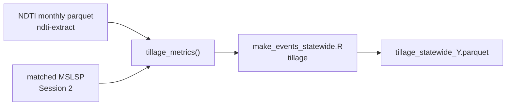

# Training Session 3 - Tillage and fertilization

This session covers **tillage event generation** from NDTI + matched MSLSP phenology,
and **California nitrogen / organic-amendment rate lookups** for PEcAn fertilization
events.

**Navigation:** [Pipeline](../pipeline.md) | [Session 2](02-phenology.md) | [Session 4](04-irrigation.md)

**Audience:** CARB staff or contractors who completed [Session 2](02-phenology.md)
(matched phenology and default planting/harvest events).

**Prerequisites:**

- NDTI monthly parquet for target year +/- buffer (`tillage/ndti_v4.1/`)
- Matched LandIQ-MSLSP assignments (`assigned_by == "matched"`)
- Gap-filled LandIQ product (Session 1)

---

## Part A - Tillage (NDTI)

Tillage timing is inferred from **NDTI** (Normalized Difference Tillage Index) in each
**fallow window** between one season's senescence (`OGMn`) and the next season's
green-up (`OGI`), using matched phenology from Session 2.



### Operator references

| Step | README |
|------|--------|
| NDTI parcel extraction | [ndti-extract/README.md](../../ndti-extract/README.md) |
| Tillage algorithm + smoke test | [scripts/tillage/README.md](../../scripts/tillage/README.md) |
| Event output schema | [scripts/events/README.md](../../scripts/events/README.md) (tillage section) |

### Run NDTI extraction (if not done)

```bash
export CCMMF_ROOT=/projectnb/dietzelab/ccmmf
export CCMMF_MANAGEMENT=$CCMMF_ROOT/management
export NDTI_EXTRACT_ROOT=$CCMMF_MANAGEMENT/ndti-extract
export CCMMF_LANDIQ_V4=$CCMMF_ROOT/LandIQ-harmonized-v4.1.2

$NDTI_EXTRACT_ROOT/run_ndti.sh 2024
qsub -v 'NDTI_ARGS=2024,CCMMF_LANDIQ_V4=/projectnb/dietzelab/ccmmf/LandIQ-harmonized-v4.1.2' \
  $NDTI_EXTRACT_ROOT/sge/run_ndti.sge
```

(`#$ -l buyin` is in the `.sge` wrapper. For pre-2020 years use `HLS_IMAGERY_LAYOUT=flat`
- see [ndti-extract/README.md](../../ndti-extract/README.md).)

Output: `tillage/ndti_v4.1/year=2024/ndti_year=2024_month=MM.parquet` (12 months).

### Run tillage events

Tillage is **opt-in** - heavier than phenology/planting/harvest (loads NDTI for
`year +/- TILLAGE_BUFFER_YEARS`, default 1).

```bash
module load R/4.4.3
Rscript $CCMMF_MANAGEMENT/scripts/events/make_events_statewide.R 2024 tillage

qsub -v YEAR=2024,EVENT_TYPE=tillage \
  $CCMMF_MANAGEMENT/scripts/events/make_events_statewide.sge
```

### Algorithm (summary)

1. Join NDTI scenes to phenology dates per parcel-year.
2. Build fallow periods: `fallow_start = OGMn`, `fallow_end = lead(OGI)`.
3. Smooth NDTI (4-day moving average); minimum NDTI date in window = tillage signal.
4. Record pre-minimum peak, percent change, and observation quality flags.

Smoke test on a small parcel sample:

```bash
Rscript $CCMMF_MANAGEMENT/scripts/tillage/smoke_tillage_metrics_year.R 2023 40
```

### Verify

```r
library(arrow)
f <- file.path(Sys.getenv("CCMMF_MANAGEMENT"), "event_files/tillage_statewide_2024.parquet")
if (file.exists(f)) message("tillage rows: ", nrow(read_parquet(f)))
```

Example statewide JSON outputs (historical): `usr/akash/management/tillage/tillage_statewide_*.json`.

---

## Part B - Fertilization (Akash)

There is **no standalone README** in Akash's fertilization folder yet. The canonical
workflow lives under:

```
/projectnb/dietzelab/ccmmf/usr/akash/management/fertilization/
```

| File | Role |
|------|------|
| `CCMMF Fertilization - N_Fertilization.tsv` | Source spreadsheet export - N rates by crop and growth stage |
| `CCMMF Fertilization - Compost.tsv` | Organic amendment properties and application rates |
| `CCMMF Fertilization - Biochar.tsv` | Biochar amendment data |
| `CCMMF_Fertilization_Crop_types.tsv` | Crop type crosswalk |
| **`harmonize_fertilization_data.R`** | **Main script** - reads TSVs, writes harmonized CSVs |
| `diagnose.R` | Audit tool comparing raw TSV to PEcAn harmonized output |
| `audit_n_rates.txt` | Example audit log from `diagnose.R` |

### Harmonize source data -> CSVs

```bash
module load R/4.4.3   # needs PEcAn.utils for unit conversion
cd /projectnb/dietzelab/ccmmf/usr/akash/management/fertilization
Rscript harmonize_fertilization_data.R
```

**Outputs** (written alongside the TSVs):

| CSV | Contents |
|-----|----------|
| `ca_n_application_rate.csv` | Per-crop min/max N (lbs N/acre and g N/m2) |
| `ca_organic_amendment_properties.csv` | Material C:N, N%, PAN%, etc. |
| `ca_organic_amendment_app_rate.csv` | Application rates by material and crop structure (rows vs trees) |

The harmonizer aggregates within-year stage rows (preplant, sidedress, ...) or uses
envelope totals depending on how each crop is reported in the source TSV. See the
`build_n_rates()` logic in `harmonize_fertilization_data.R`.

### PEcAn `data.land` usage

Harmonized rates are consumed in PEcAn via **`look_up_ca_n_rate()`** and the
**`ca_n_application_rate`** dataset in `PEcAn.data.land`.

```r
library(PEcAn.data.land)
look_up_ca_n_rate("Tomatoes, Processing")
look_up_ca_n_rate("corn", unit = "lbs_acre")
?look_up_ca_n_rate
?ca_n_application_rate
```

Reference implementation and tests:

```
/projectnb/dietzelab/ccmmf/usr/adey2/pecan/modules/data.land/R/look_up_ca_n_rate.R
/projectnb/dietzelab/ccmmf/usr/adey2/pecan/modules/data.land/tests/testthat/test.look_up_ca_n_rate.R
```

A copy of the harmonization script also exists at
`management/fertilization/harmonize_fertilization_data.R` (deployed outputs under
`management/fertilization/*.csv`). **Akash's folder is the working source** for TSVs
and the current harmonizer.

Statewide fertilization **event generation** (parcel-level application dates tied to
planting/phenology) is handled in the PEcAn workflow layer - not yet wired into
`make_events_statewide.R` the way tillage is. Use `look_up_ca_n_rate()` for lookups
and follow PEcAn fertilization event patterns for site-level runs until a statewide
generator is documented.

---

## 3.1 Hands-on checklist

**Tillage**

- [ ] Confirm NDTI parquet exists for target year +/- 1 (`ndti_v4.1/`).
- [ ] Confirm `assigned_year=TARGET_YEAR.parquet` from Session 2.
- [ ] Run `make_events_statewide.R TARGET_YEAR tillage`.
- [ ] Verify `event_files/tillage_statewide_TARGET_YEAR.parquet`.

**Fertilization**

- [ ] Review source TSVs in `usr/akash/management/fertilization/`.
- [ ] Run `harmonize_fertilization_data.R`; confirm three output CSVs.
- [ ] Spot-check crops with `look_up_ca_n_rate()` in R.
- [ ] Optional: run `diagnose.R` after syncing data into PEcAn `data.land`.

---

## 3.2 What comes next

- **[Session 4 - Irrigation](04-irrigation.md):** water-balance irrigation events
  (statewide parcel workflow + anchor-site prototype).
- **Combine event types for SIPNET:** [combine_management_events_pecan.R](../../scripts/events/combine_management_events_pecan.R)
  merges planting, harvest, tillage, and irrigation into one PEcAn JSON bundle.
