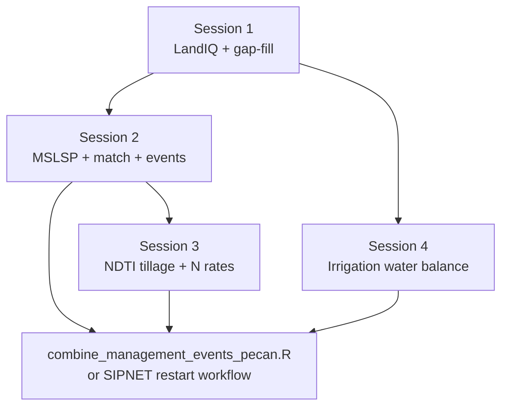

# Training Session 4 - Irrigation

This session covers how CCMMF derives **irrigation event files** from evapotranspiration,
precipitation, and soil water-balance logic, and how those events connect to the rest of
the monitoring pipeline (planting, harvest, phenology, tillage).

**Navigation:** [Documentation index](../README.md) - [Session 3 - Tillage & fertilizer](03-tillage-fertilizer.md) -
[Full pipeline](../pipeline.md)

**Audience:** CARB staff or contractors familiar with Sessions 1-3 outputs.

**Note:** Irrigation is a **parallel statewide workflow** (Alexey Shiklomanov), not a step
in `pipeline.md` section 7-11. It uses the same harmonized LandIQ **parcel_id** geometry as
the crop/phenology pipeline.

---

## 4.1 Two implementations

| Track | Scope | Canonical doc |
|-------|--------|---------------|
| **Statewide (production)** | ~600k LandIQ parcels; `targets` pipeline | [irrigation-statewide/README.md](../../../usr/ashiklom/pecan/sipnet-restart-workflow/workflows/irrigation-statewide/README.md) |
| **Anchor-site prototype** | Design points (`id`, `lat`, `lon`); OpenET API + CHIRPS | [irrigation Python README.txt](../../irrigation/pecan/modules/data.remote/inst/Python/README.txt) |

Use the **statewide workflow** for CARB-scale monitoring. The `management/irrigation/`
Python stack is an earlier site-based prototype (Katherine Rein, Spring 2025) useful for
understanding data sources and water-balance event file format.

---

## 4.2 Statewide irrigation (Alexey)

**Location:**

```
/projectnb/dietzelab/ccmmf/usr/ashiklom/pecan/sipnet-restart-workflow/workflows/irrigation-statewide/
```

**What it does:** Generates PEcAn-format **irrigation event files** for all California
agricultural parcels using a reproducible **`targets`** pipeline.

### Setup

Run from the PEcAn root (`sipnet-restart-workflow`). Set in `.Renviron`:

```
TAR_CONFIG=workflows/irrigation-statewide/_targets.yaml
```

On BU SCC, paths are preconfigured in `config_paths.yml`. Adjust if data roots move.

### Run

Three configurations in `config.yml`:

| Config | Parcels | Use case |
|--------|---------|----------|
| `small` (default) | 1,000 (batches of 100) | Local test |
| `medium` | 10,000 (batches of 1,000) | SGE array (~15 workers) |
| `all` | ~600,000 (batches of 5,000) | Full statewide (~60 SGE jobs) |

```bash
TAR_PROJECT=all Rscript -e "targets::tar_make()"
```

Full details: [irrigation-statewide/README.md](../../../usr/ashiklom/pecan/sipnet-restart-workflow/workflows/irrigation-statewide/README.md).

### Input preprocessing

Raster inputs (CHIRPS precipitation, CIMIS reference ET, SSURGO soil properties) are
preprocessed to parcel-level time series before the main workflow:

[irrigation-statewide/preprocessing/README.md](../../../usr/ashiklom/pecan/sipnet-restart-workflow/workflows/irrigation-statewide/preprocessing/README.md)

| Dataset | Scripts |
|---------|---------|
| CHIRPS daily precipitation | `preprocessing/chirps-preprocess.R` |
| CIMIS ETref | `cimis-01-weights.R` -> `cimis-02-extract.R` -> `cimis-03-combine.sql` |
| SSURGO soil AWC | `ssurgo-01-spatial-weights.R` -> `ssurgo-02-combine.R` |

CHIRPS raw files for the anchor-site prototype also live under
`management/irrigation/chirps-v2.0.*.days_p05.nc`.

### Verify

```bash
# from irrigation-statewide/
Rscript check-result.R
```

Statewide outputs are written under Alexey's event-outputs tree (see `config_paths.yml`);
preprocessed irrigation parquet is consumed by SIPNET restart workflows in the same PEcAn
fork.

---

## 4.3 Anchor-site prototype (`management/irrigation/`)

**Operator doc:** [README.txt](../../irrigation/pecan/modules/data.remote/inst/Python/README.txt)

**Data sources:**

- **Evapotranspiration:** [OpenET](https://openet.gitbook.io/docs) (API or Google Earth Engine)
- **Precipitation:** [CHIRPS](https://data.chc.ucsb.edu/products/CHIRPS-2.0/)

**Main Python entry points** (`irrigation/pecan/modules/data.remote/inst/Python/`):

| Script | Role |
|--------|------|
| `CCMMF_Irrigation_API.py` | Download + update water balance via OpenET API |
| `CCMMF_Irrigation_DataDownload.py` | ET, CHIRPS, and per-location download helpers |
| `CCMMF_Irrigation_CalcVis.py` | Water balance + time-series plots |
| `CCMMF_Irrigation_Events.py` | Weekly irrigation event txt files per location |

**Key folders under `management/irrigation/`:**

| Folder | Contents |
|--------|----------|
| `WaterBalanceCSV/` | Per-location CSV backups |
| `CCMMF_Irrigation_Parquet/` | Hive-partitioned parquet (location x year) |
| `CCMMF_Irrigation_EventFiles/` | `irrigation_eventfile_{location_id}.txt` |

**Scale up:** replace `design_points.csv` (columns `id`, `lat`, `lon`) with a parcel
location table. The statewide `targets` workflow supersedes this for production.

**Known open items** (from README.txt): time-series validation, weekly aggregation QA,
site-specific water holding capacity and crop rooting depth.

---

## 4.4 Connect to the rest of the monitoring pipeline

Sessions 1-3 produce **statewide** planting, harvest, phenology, and (optionally) tillage
events under `management/event_files/`. Irrigation events from the statewide workflow
are a **fourth event type** for SIPNET.

Merge arbitrary event tables into one PEcAn JSON bundle:

```bash
Rscript $CCMMF_MANAGEMENT/scripts/events/combine_management_events_pecan.R \
  --planting events_planting.csv \
  --harvest events_harvest.csv \
  --tillage events_tillage.csv \
  --irrigation events_irrigation.csv \
  --out event_files/combined_events_pecanFormat.json
```

See [scripts/events/README.md](../../scripts/events/README.md) and the header in
`combine_management_events_pecan.R` for input schemas.

Alexey's SIPNET restart workflow also loads irrigation parquet directly - see
`usr/ashiklom/pecan/sipnet-restart-workflow/workflows/sipnet-restart-workflow/01-prepare-events.R`.

---

## 4.5 Hands-on checklist

**Statewide (recommended)**

- [ ] Read [irrigation-statewide/README.md](../../../usr/ashiklom/pecan/sipnet-restart-workflow/workflows/irrigation-statewide/README.md).
- [ ] Confirm preprocessing inputs exist (CHIRPS, CIMIS, SSURGO - see preprocessing README).
- [ ] Run `TAR_PROJECT=small` smoke test locally.
- [ ] Inspect output with `check-result.R` before `TAR_PROJECT=all`.

**Anchor-site (optional)**

- [ ] Set up `ccmmf_env` conda env (see Python README.txt).
- [ ] Authenticate Google Earth Engine + OpenET.
- [ ] Run `CCMMF_Irrigation_API.py` for a design point; inspect `CCMMF_Irrigation_EventFiles/`.

---

## 4.6 Pipeline map (all four sessions)


