# CCMMF workflow review plan (step by step)

**Goal:** Walk the inventory workflow from start to finish. At each step,
review **documentation and code together**.

**Canonical tree:** [`inst/ccmmf`](..) (this plan is under `documentation/`)

**Findings:** [`workflow_code_review_findings.md`](workflow_code_review_findings.md)

**Out of scope:** refactoring, package lifts, pushes.

Links are **relative to this file** (Cmd/Ctrl-click in the editor).

---

## How each step works

1. Read listed **docs** first.
2. Read listed **code** in order.
3. Check claims vs behavior; confusing names; silent skips; duplication; missing *why*; overcomplication.
4. Append to the findings log; check the box when done.

### Full spine

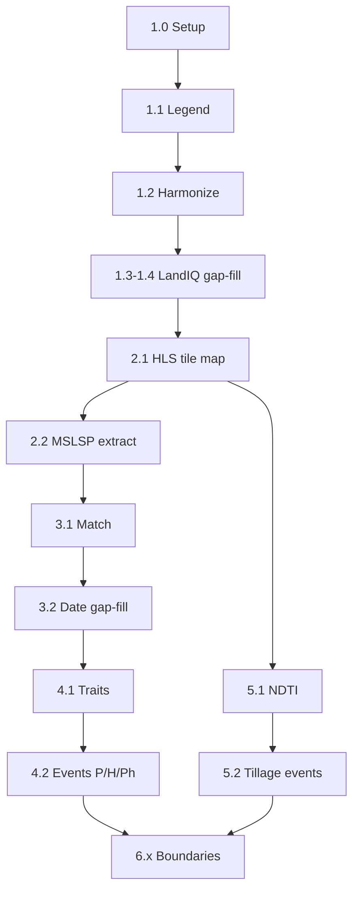

---

## Block 1 -- Setup through LandIQ gap-fill

### Step 1.0 -- Map and setup

**Schematic**

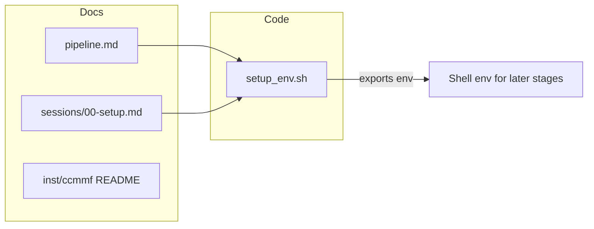

**Docs**

- [ ] [`documentation/pipeline.md`](pipeline.md) (spine + maturity; skim known gaps)
- [ ] [`documentation/sessions/00-setup.md`](sessions/00-setup.md)
- [ ] [`README.md`](../README.md) (what this tree claims to cover)

**Code**

- [ ] [`documentation/setup_env.sh`](setup_env.sh)

**Check:** Env vars in Session 0 / setup_env vs names used later.

### Step 1.1 -- LandIQ download + legend

**Schematic**

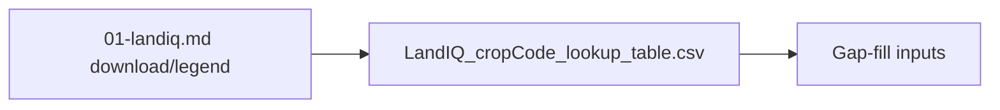

**Docs**

- [ ] [`documentation/sessions/01-landiq.md`](sessions/01-landiq.md) (through legend QC / download)

**Code**

- [ ] [`landiq-gapfill/data/LandIQ_cropCode_lookup_table.csv`](../landiq-gapfill/data/LandIQ_cropCode_lookup_table.csv) (columns / ownership vs management copy)

**Check:** Download/legend match gap-fill inputs; no invented in-tree download orchestrator.

### Step 1.2 -- Geometry harmonization contract

**Schematic**

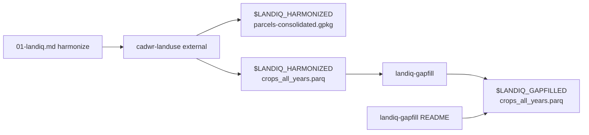

**Docs**

- [ ] [`documentation/sessions/01-landiq.md`](sessions/01-landiq.md) (harmonize / cadwr-landuse)
- [ ] [`landiq-gapfill/README.md`](../landiq-gapfill/README.md) (product inputs)

**Code**

- None in this clone (external `cadwr-landuse`). Confirm harmonized `parcels-consolidated.gpkg` + `crops_all_years.parq`, and gap-filled `$LANDIQ_GAPFILLED/crops_all_years.parq` (geometry stays under harmonized).

**Check:** Docs name the right paths/filenames; gap-fill scripts agree. Geometry is not copied/symlinked into gapfilled.

### Step 1.3 -- LandIQ gap-fill orchestration + CDL

**Schematic**

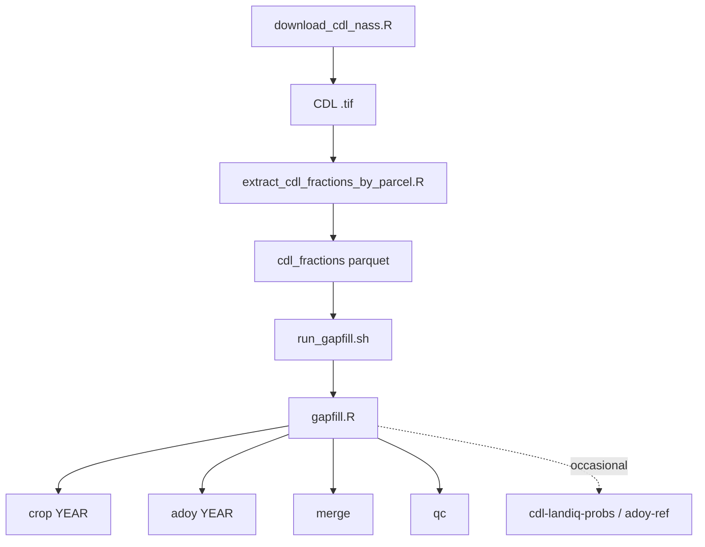

**Docs**

- [ ] [`landiq-gapfill/README.md`](../landiq-gapfill/README.md) (full run path)
- [ ] [`documentation/sessions/01-landiq.md`](sessions/01-landiq.md) (gap-fill / CDL sections)

**Code**

- [ ] [`landiq-gapfill/run_gapfill.sh`](../landiq-gapfill/run_gapfill.sh)
- [ ] [`landiq-gapfill/scripts/gapfill.R`](../landiq-gapfill/scripts/gapfill.R)
- [ ] [`landiq-gapfill/scripts/cdl/download_cdl_nass.R`](../landiq-gapfill/scripts/cdl/download_cdl_nass.R)
- [ ] [`landiq-gapfill/scripts/cdl/extract_cdl_fractions_by_parcel.R`](../landiq-gapfill/scripts/cdl/extract_cdl_fractions_by_parcel.R)

### Step 1.4 -- LandIQ gap-fill libraries

**Schematic**

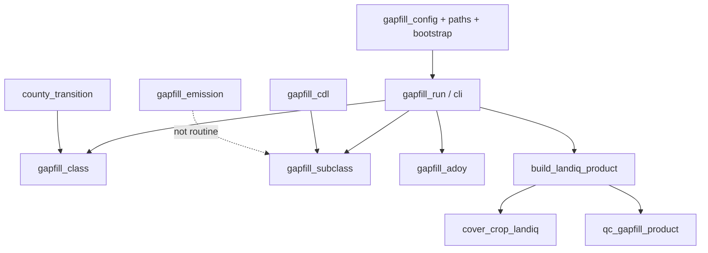

**Docs**

- [ ] [`landiq-gapfill/README.md`](../landiq-gapfill/README.md) (re-skim provenance / season-2)
- [ ] [`landiq-gapfill/outputs/qc_gapfill_report.md`](../landiq-gapfill/outputs/qc_gapfill_report.md) (skim claims only)

**Code**

- [ ] [`landiq-gapfill/scripts/R/bootstrap.R`](../landiq-gapfill/scripts/R/bootstrap.R)
- [ ] [`landiq-gapfill/scripts/R/pkg_root.R`](../landiq-gapfill/scripts/R/pkg_root.R)
- [ ] [`landiq-gapfill/scripts/R/paths.R`](../landiq-gapfill/scripts/R/paths.R)
- [ ] [`landiq-gapfill/scripts/R/lookup_paths.R`](../landiq-gapfill/scripts/R/lookup_paths.R)
- [ ] [`landiq-gapfill/scripts/R/gapfill_cli.R`](../landiq-gapfill/scripts/R/gapfill_cli.R)
- [ ] [`landiq-gapfill/scripts/R/gapfill_config.R`](../landiq-gapfill/scripts/R/gapfill_config.R)
- [ ] [`landiq-gapfill/scripts/R/gapfill_run.R`](../landiq-gapfill/scripts/R/gapfill_run.R)
- [ ] [`landiq-gapfill/scripts/R/gapfill_class.R`](../landiq-gapfill/scripts/R/gapfill_class.R)
- [ ] [`landiq-gapfill/scripts/R/gapfill_subclass.R`](../landiq-gapfill/scripts/R/gapfill_subclass.R)
- [ ] [`landiq-gapfill/scripts/R/gapfill_adoy.R`](../landiq-gapfill/scripts/R/gapfill_adoy.R)
- [ ] [`landiq-gapfill/scripts/R/gapfill_cdl.R`](../landiq-gapfill/scripts/R/gapfill_cdl.R)
- [ ] [`landiq-gapfill/scripts/R/gapfill_emission.R`](../landiq-gapfill/scripts/R/gapfill_emission.R)
- [ ] [`landiq-gapfill/scripts/R/gapfill_lookup_build.R`](../landiq-gapfill/scripts/R/gapfill_lookup_build.R)
- [ ] [`landiq-gapfill/scripts/R/gapfill_lookup_probs.R`](../landiq-gapfill/scripts/R/gapfill_lookup_probs.R)
- [ ] [`landiq-gapfill/scripts/R/landiq_rs_harmonize.R`](../landiq-gapfill/scripts/R/landiq_rs_harmonize.R)
- [ ] [`landiq-gapfill/scripts/R/county_transition.R`](../landiq-gapfill/scripts/R/county_transition.R)
- [ ] [`landiq-gapfill/scripts/R/build_landiq_product.R`](../landiq-gapfill/scripts/R/build_landiq_product.R)
- [ ] [`landiq-gapfill/scripts/R/cover_crop_landiq.R`](../landiq-gapfill/scripts/R/cover_crop_landiq.R)
- [ ] [`landiq-gapfill/scripts/R/qc_gapfill_product.R`](../landiq-gapfill/scripts/R/qc_gapfill_product.R)

**Check:** Season-2-only, COVER, provenance, no routine emission rebuild match code.

## Block 2 -- HLS + MSLSP extract

### Step 2.1 -- HLS parcel-tile map

**Schematic**

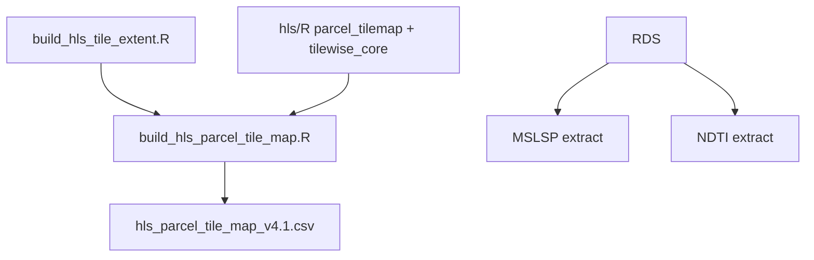

**Docs**

- [ ] [`documentation/sessions/02-phenology.md`](sessions/02-phenology.md) (HLS / tile-map)
- [ ] [`hls/README.md`](../hls/README.md)
- [ ] [`documentation/pipeline.md`](pipeline.md) (HLS step if listed)

**Code**

- [ ] [`hls/build_hls_tile_extent.R`](../hls/build_hls_tile_extent.R)
- [ ] [`hls/build_hls_parcel_tile_map.R`](../hls/build_hls_parcel_tile_map.R)
- [ ] [`hls/R/bootstrap.R`](../hls/R/bootstrap.R)
- [ ] [`hls/R/pkg_root.R`](../hls/R/pkg_root.R)
- [ ] [`hls/R/parcel_tilemap.R`](../hls/R/parcel_tilemap.R)
- [ ] [`hls/R/tilewise_core.R`](../hls/R/tilewise_core.R)
- [ ] [`hls/R/extract_summary_core.R`](../hls/R/extract_summary_core.R)

### Step 2.2 -- MSLSP extract

**Schematic**

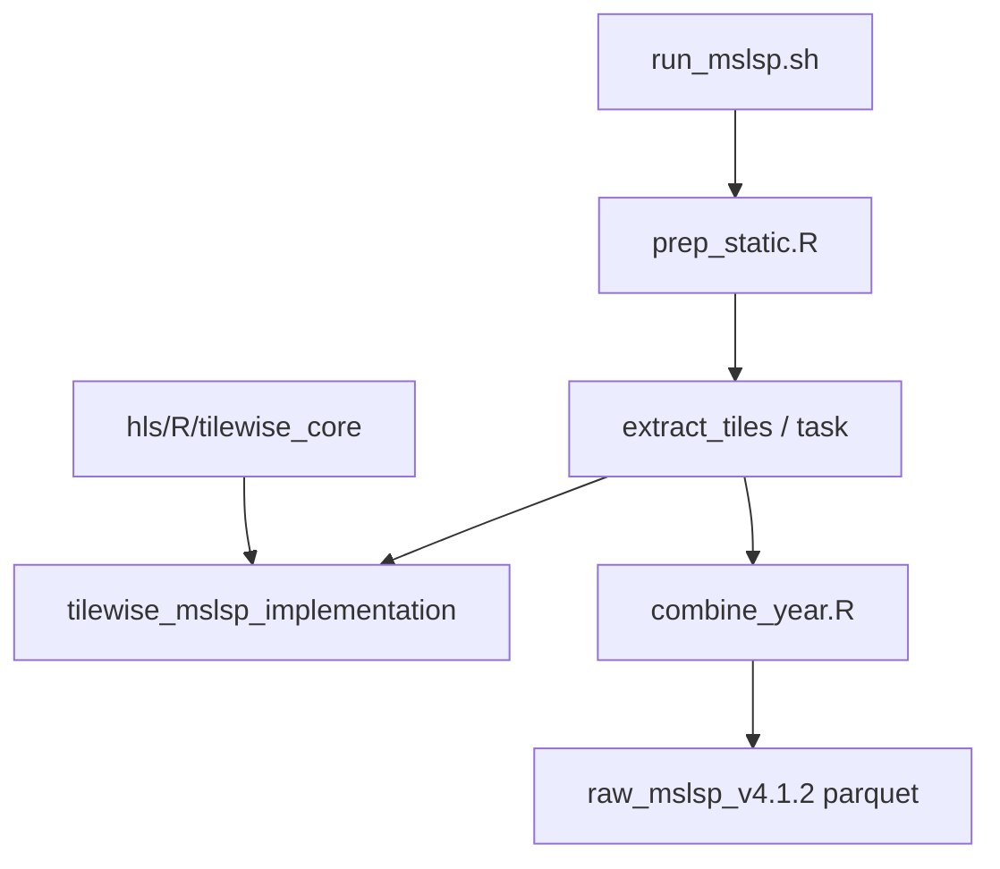

**Docs**

- [ ] [`phenology/README.md`](../phenology/README.md)
- [ ] [`phenology/extract/README.md`](../phenology/extract/README.md)
- [ ] [`documentation/sessions/02-phenology.md`](sessions/02-phenology.md) (MSLSP extract)

**Code**

- [ ] [`phenology/run_mslsp.sh`](../phenology/run_mslsp.sh)
- [ ] [`phenology/extract/scripts/prep_static.R`](../phenology/extract/scripts/prep_static.R)
- [ ] [`phenology/extract/scripts/extract_tiles.R`](../phenology/extract/scripts/extract_tiles.R)
- [ ] [`phenology/extract/scripts/extract_tiles_task.R`](../phenology/extract/scripts/extract_tiles_task.R)
- [ ] [`phenology/extract/scripts/combine_year.R`](../phenology/extract/scripts/combine_year.R)
- [ ] [`phenology/extract/scripts/R/bootstrap.R`](../phenology/extract/scripts/R/bootstrap.R)
- [ ] [`phenology/extract/scripts/R/pkg_root.R`](../phenology/extract/scripts/R/pkg_root.R)
- [ ] [`phenology/extract/scripts/R/paths.R`](../phenology/extract/scripts/R/paths.R)
- [ ] [`phenology/extract/scripts/R/mslsp_cli.R`](../phenology/extract/scripts/R/mslsp_cli.R)
- [ ] [`phenology/extract/scripts/R/mslsp_run.R`](../phenology/extract/scripts/R/mslsp_run.R)
- [ ] [`phenology/extract/scripts/R/mslsp_combine.R`](../phenology/extract/scripts/R/mslsp_combine.R)
- [ ] [`phenology/extract/scripts/R/tilewise_mslsp_implementation.R`](../phenology/extract/scripts/R/tilewise_mslsp_implementation.R)

**Check:** Top-2 cycles, NetCDF layout, `raw_mslsp_v4.1.2`; overlap with `hls/R/tilewise_core.R`.

## Block 3 -- Match + date gap-fill

### Step 3.1 -- LandIQ-MSLSP match

**Schematic**

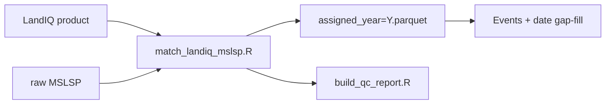

**Docs**

- [ ] [`phenology/match/README.md`](../phenology/match/README.md)
- [ ] [`documentation/sessions/02-phenology.md`](sessions/02-phenology.md) (match section)

**Code**

- [ ] [`phenology/match_landiq_mslsp.sh`](../phenology/match_landiq_mslsp.sh)
- [ ] [`phenology/match/matched_paths.R`](../phenology/match/matched_paths.R)
- [ ] [`phenology/match/match_landiq_mslsp.R`](../phenology/match/match_landiq_mslsp.R)
- [ ] [`phenology/match/build_qc_report.R`](../phenology/match/build_qc_report.R)

**Check:** `assigned_by` / `no_mslsp` / QC vs what events later use.

### Step 3.2 -- Phenology date gap-fill

**Schematic**

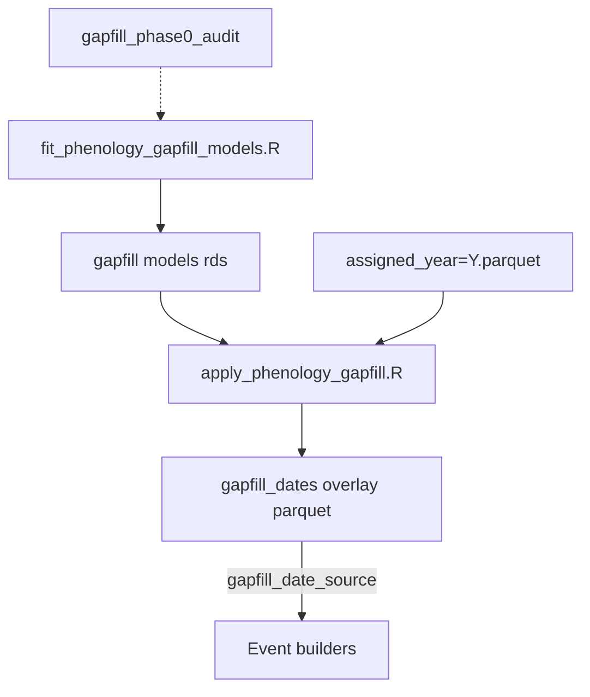

**Docs**

- [ ] [`phenology/gapfill/README.md`](../phenology/gapfill/README.md)
- [ ] [`documentation/sessions/02-phenology.md`](sessions/02-phenology.md) (date gap-fill)
- [ ] [`documentation/pipeline.md`](pipeline.md) (required before statewide planting/harvest)

**Code**

- [ ] [`phenology/run_phenology_date_gapfill.sh`](../phenology/run_phenology_date_gapfill.sh)
- [ ] [`phenology/gapfill/fit_phenology_gapfill_models.R`](../phenology/gapfill/fit_phenology_gapfill_models.R)
- [ ] [`phenology/gapfill/apply_phenology_gapfill.R`](../phenology/gapfill/apply_phenology_gapfill.R)
- [ ] [`phenology/gapfill/gapfill_phase0_audit.sh`](../phenology/gapfill/gapfill_phase0_audit.sh)
- [ ] [`phenology/gapfill/gapfill_phase0_audit.R`](../phenology/gapfill/gapfill_phase0_audit.R)

**Check:** Overlay path, `gapfill_date_source`, does not overwrite canonical assigned parquet.

## Block 4 -- Traits + events

### Step 4.1 -- Trait lookups

**Schematic**

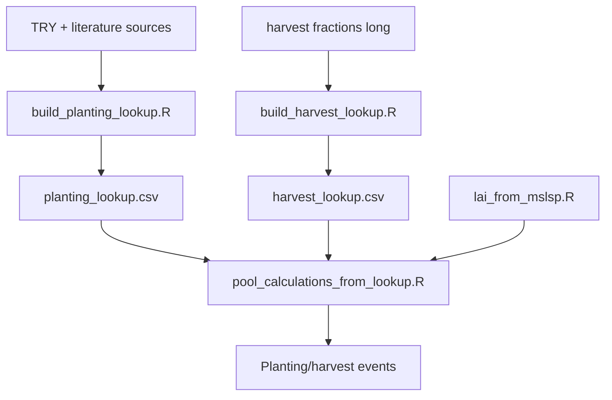

**Docs**

- [ ] [`traits/README.md`](../traits/README.md)
- [ ] [`documentation/sessions/02-phenology.md`](sessions/02-phenology.md) (traits blurb)
- [ ] [`documentation/pipeline.md`](pipeline.md) (traits if listed)

**Code**

- [ ] [`traits/build_planting_lookup.R`](../traits/build_planting_lookup.R)
- [ ] [`traits/build_harvest_lookup.R`](../traits/build_harvest_lookup.R)
- [ ] [`traits/write_harvest_fractions_long.R`](../traits/write_harvest_fractions_long.R)
- [ ] [`traits/lai_from_mslsp.R`](../traits/lai_from_mslsp.R)
- [ ] [`traits/pool_calculations_from_lookup.R`](../traits/pool_calculations_from_lookup.R)

**Check:** Fallback order, destructive woody, LAI `k=0.15` vs MSLSP date defs.

### Step 4.2 -- Statewide events (phenology / planting / harvest)

**Schematic**

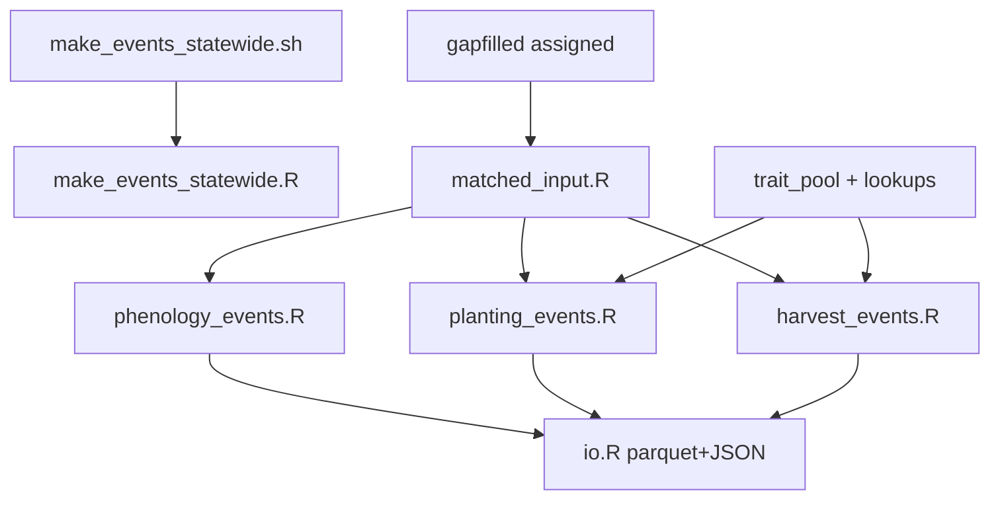

**Docs**

- [ ] [`events/README.md`](../events/README.md)
- [ ] [`documentation/sessions/02-phenology.md`](sessions/02-phenology.md) (events section)
- [ ] [`events/data/planting_statewide_metadata.csv`](../events/data/planting_statewide_metadata.csv)
- [ ] [`events/data/harvest_statewide_metadata.csv`](../events/data/harvest_statewide_metadata.csv)
- [ ] [`events/data/phenology_statewide_metadata.csv`](../events/data/phenology_statewide_metadata.csv)
- [ ] [`documentation/metadata.md`](metadata.md)

**Code**

- [ ] [`events/make_events_statewide.sh`](../events/make_events_statewide.sh)
- [ ] [`events/make_events_statewide.R`](../events/make_events_statewide.R)
- [ ] [`events/R/bootstrap.R`](../events/R/bootstrap.R)
- [ ] [`events/R/paths.R`](../events/R/paths.R)
- [ ] [`events/R/matched_input.R`](../events/R/matched_input.R)
- [ ] [`events/R/phenology_events.R`](../events/R/phenology_events.R)
- [ ] [`events/R/planting_events.R`](../events/R/planting_events.R)
- [ ] [`events/R/harvest_events.R`](../events/R/harvest_events.R)
- [ ] [`events/R/trait_pool.R`](../events/R/trait_pool.R)
- [ ] [`events/R/io.R`](../events/R/io.R)
- [ ] [`events/combine_management_events_pecan.R`](../events/combine_management_events_pecan.R)

**Check:** Provenance columns, YP skip, woody destructive, JSON vs parquet vs metadata.

## Block 5 -- NDTI + tillage events

### Step 5.1 -- NDTI extract

**Schematic**

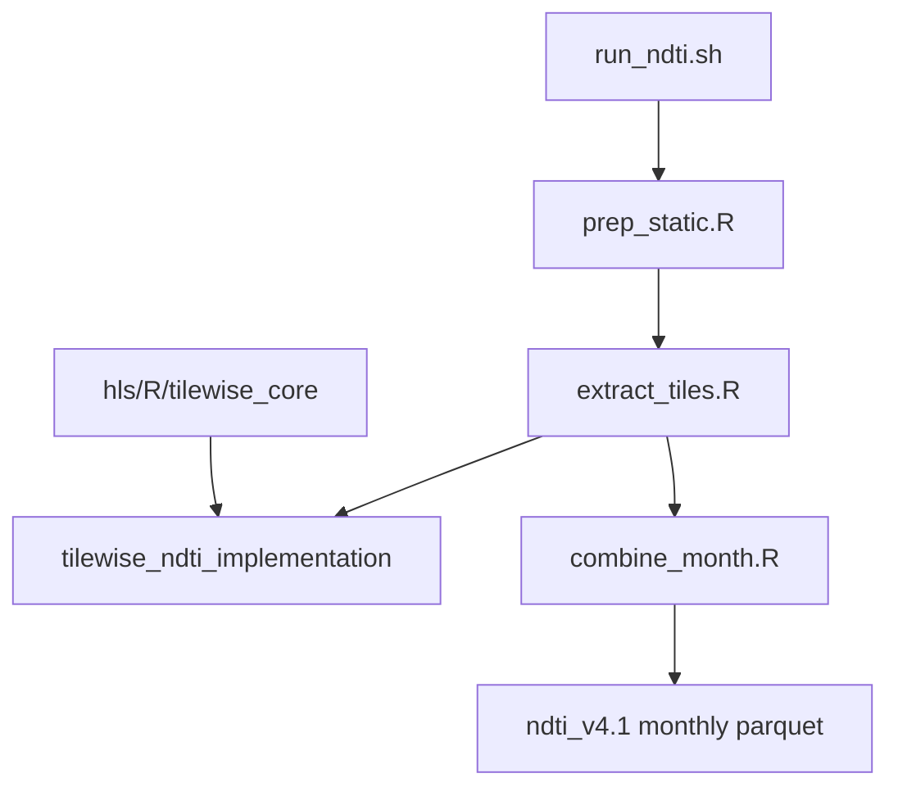

**Docs**

- [ ] [`tillage/README.md`](../tillage/README.md)
- [ ] [`tillage/extract/README.md`](../tillage/extract/README.md)
- [ ] [`documentation/sessions/02-phenology.md`](sessions/02-phenology.md) (NDTI / tillage)

**Code**

- [ ] [`tillage/run_ndti.sh`](../tillage/run_ndti.sh)
- [ ] [`tillage/extract/scripts/prep_static.R`](../tillage/extract/scripts/prep_static.R)
- [ ] [`tillage/extract/scripts/extract_tiles.R`](../tillage/extract/scripts/extract_tiles.R)
- [ ] [`tillage/extract/scripts/combine_month.R`](../tillage/extract/scripts/combine_month.R)
- [ ] [`tillage/extract/scripts/R/bootstrap.R`](../tillage/extract/scripts/R/bootstrap.R)
- [ ] [`tillage/extract/scripts/R/pkg_root.R`](../tillage/extract/scripts/R/pkg_root.R)
- [ ] [`tillage/extract/scripts/R/paths.R`](../tillage/extract/scripts/R/paths.R)
- [ ] [`tillage/extract/scripts/R/ndti_cli.R`](../tillage/extract/scripts/R/ndti_cli.R)
- [ ] [`tillage/extract/scripts/R/ndti_run.R`](../tillage/extract/scripts/R/ndti_run.R)
- [ ] [`tillage/extract/scripts/R/ndti_combine.R`](../tillage/extract/scripts/R/ndti_combine.R)
- [ ] [`tillage/extract/scripts/R/tilewise_ndti_implementation.R`](../tillage/extract/scripts/R/tilewise_ndti_implementation.R)

**Check:** Imagery layout env; duplication vs phenology extract / `hls/R`.

### Step 5.2 -- Tillage events + lookback

**Schematic**

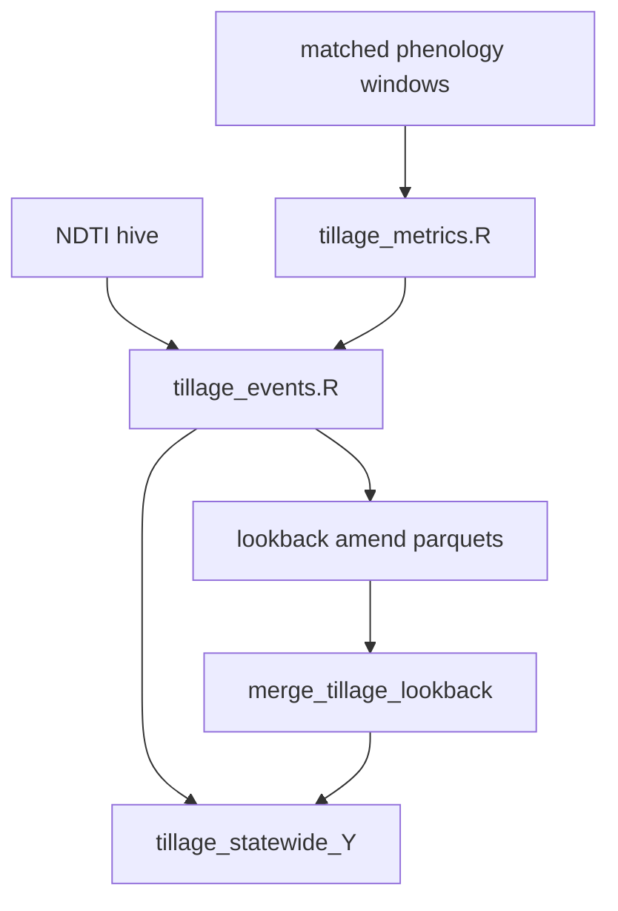

**Docs**

- [ ] [`events/README.md`](../events/README.md) (tillage algorithm)
- [ ] [`events/data/tillage_statewide_metadata.csv`](../events/data/tillage_statewide_metadata.csv)
- [ ] [`documentation/sessions/02-phenology.md`](sessions/02-phenology.md) (tillage events)

**Code**

- [ ] [`events/R/tillage_metrics.R`](../events/R/tillage_metrics.R)
- [ ] [`events/R/tillage_events.R`](../events/R/tillage_events.R)
- [ ] [`events/merge_tillage_lookback.sh`](../events/merge_tillage_lookback.sh)
- [ ] [`events/merge_tillage_lookback.R`](../events/merge_tillage_lookback.R)
- [ ] [`tillage/smoke_tillage_metrics_year.R`](../tillage/smoke_tillage_metrics_year.R)

**Check:** Buffer years, lookback amend merge, provenance fields.

## Block 6 -- Session 3 + SIPNET boundaries

### Step 6.1 -- Fert / irrigation (boundary)

**Schematic**

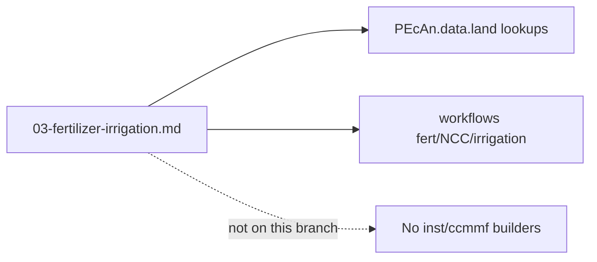

**Docs**

- [ ] [`documentation/sessions/03-fertilizer-irrigation.md`](sessions/03-fertilizer-irrigation.md)
- [ ] [`documentation/pipeline.md`](pipeline.md) (fert / irrigation claims)
- [ ] [`README.md`](../README.md) (coverage claims)
- [ ] [`events/README.md`](../events/README.md) (Session 3 pointers)

**Code**

- Boundary check only (no statewide fert/NCC scripts on this monitoring branch).

**Check:** No dead in-tree fert/NCC builders; pointers to PEcAn.data.land / workflows / PR #4003 only.

### Step 6.2 -- SIPNET handoff (boundary)

**Schematic**

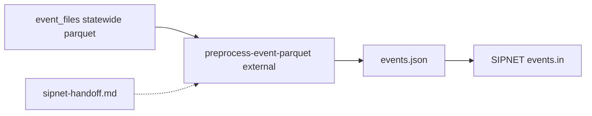

**Docs**

- [ ] [`documentation/sessions/sipnet-handoff.md`](sessions/sipnet-handoff.md)
- [ ] [`documentation/pipeline.md`](pipeline.md) (appendix if any)

**Code**

- Boundary check only.

**Check:** Monitoring stops at statewide event parquet/JSON; conversion outside `inst/ccmmf`.

### Step 6.3 -- Close-out

**Schematic**

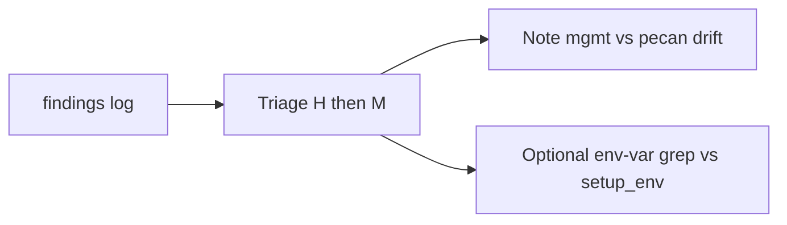

- [ ] Triage [`workflow_code_review_findings.md`](workflow_code_review_findings.md) (H first)
- [ ] Note management-vs-pecan drift for a later sync
- [ ] Optional: env-var grep vs [`documentation/setup_env.sh`](setup_env.sh)
