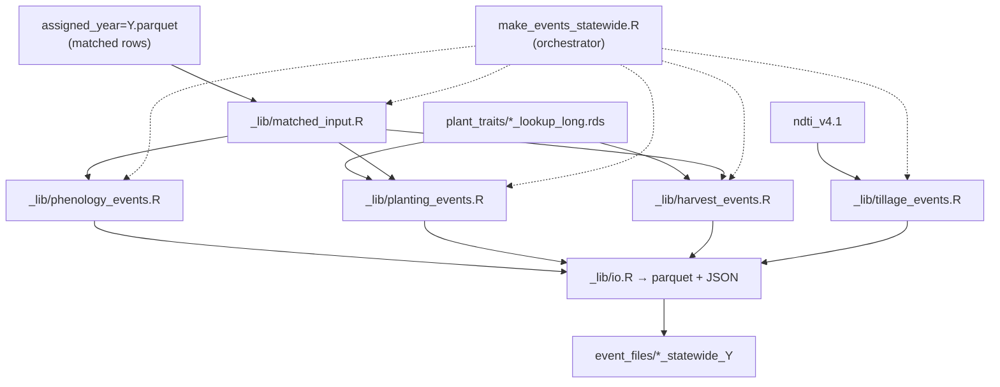

# Statewide event file generation

Builds PEcAn-ready **planting**, **harvest**, **phenology**, and **tillage** event
files from matched LandIQ–MSLSP assignments (and NDTI for tillage).

- **Input (phenology / planting / harvest):** `assigned_year=Y.parquet`, or
  gap-filled overlay `gapfill_dates/assigned_year=Y_gapfilled.parquet` when present
  (includes filled planting/harvest dates for `no_mslsp` rows). See
  [`../phenology/gapfill/README.md`](../phenology/gapfill/README.md).
- **Input (tillage):** NDTI hive dataset + assigned parquet for `year ± buffer`.
- **Output:** `$CCMMF_MANAGEMENT/event_files/*_statewide_{year}.parquet` (+ JSON).



Pipeline order: [`../hls/README.md`](../hls/README.md) (steps 1–5) →
[`../phenology/match/README.md`](../phenology/match/README.md) (step 6) →
trait lookups (step 7, one-time) → this step (8–9).

## Before you run

| Prerequisite | Source |
|--------------|--------|
| Matched seasons | [`../phenology/match/README.md`](../phenology/match/README.md) |
| Planting + harvest lookups | [`../traits/README.md`](../traits/README.md) → `plant_traits/` |
| NDTI (tillage only) | [`../../ndti-extract/README.md`](../../ndti-extract/README.md) |

Build trait lookups once before first event run:

```bash
Rscript $CCMMF_MANAGEMENT/scripts/traits/build_planting_lookup.R
Rscript $CCMMF_MANAGEMENT/scripts/traits/build_harvest_lookup.R
# optional: build_harvest_lookup_faostat.R
```

## Run a year

### Step 1 — Environment

```bash
export CCMMF_ROOT=/projectnb/dietzelab/ccmmf
export CCMMF_MANAGEMENT=$CCMMF_ROOT/management
# optional: HARVEST_LOOKUP_RDS=$CCMMF_MANAGEMENT/plant_traits/harvest_lookup_long_faostat.rds
```

### Step 2 — Generate events (default: phenology + planting + harvest)

```bash
module load R/4.4.0
Rscript $CCMMF_MANAGEMENT/scripts/events/make_events_statewide.R 2024
Rscript $CCMMF_MANAGEMENT/scripts/events/make_events_statewide.R 2023   # after re-match
```

**One event type only:**

```bash
Rscript .../make_events_statewide.R 2024 phenology
Rscript .../make_events_statewide.R 2024 planting
Rscript .../make_events_statewide.R 2024 harvest
Rscript .../make_events_statewide.R 2024 tillage    # heavy; needs NDTI ± buffer years
```

### Step 3 — Cluster (recommended)

```bash
qsub -v YEAR=2024 $CCMMF_MANAGEMENT/scripts/events/make_events_statewide.sge
qsub -v YEAR=2023 $CCMMF_MANAGEMENT/scripts/events/make_events_statewide.sge

# Tillage only
qsub -v YEAR=2024,EVENT_TYPE=tillage $CCMMF_MANAGEMENT/scripts/events/make_events_statewide.sge

# Hold until match job completes
qsub -hold_jid <match_job_id> -v YEAR=2024 .../make_events_statewide.sge
```

### Step 4 — Verify

```r
library(arrow)
od <- file.path(Sys.getenv("CCMMF_MANAGEMENT"), "event_files")
for (kind in c("planting", "harvest", "phenology")) {
  f <- file.path(od, paste0(kind, "_statewide_2024.parquet"))
  if (file.exists(f)) message(kind, ": ", nrow(read_parquet(f)), " rows")
}
```

## Event types

| Type | Date source | Trait / logic |
|------|-------------|---------------|
| **Phenology** | `mslsp_50PCGI`, `mslsp_50PCGD` | Leaf-on / leaf-off dates; `year` = peak calendar year |
| **Planting** | `mslsp_OGI` | C/N pools via `initialize_planting()` + LAI from `mslsp_EVImax`/`EVIamp` |
| **Harvest** | row/rice → `mslsp_OGMn`; hay/woody → `mslsp_OGD` | Removal fractions via `initialize_harvest_from_lookup()`; skip young woody (`SPECOND=Y` / `CLASS=YP`); **woody destructive** when LandIQ season-2 **CLASS** changes year→year+1 (or mature woody → young / non-woody). Subclass-only changes ignored. Re-run the prior year after a new LandIQ year exists so look-ahead can fire. |
| **Tillage** | Minimum NDTI in fallow window | [`tillage_metrics()`](../tillage/tillage_metrics.R) — see [`../tillage/README.md`](../tillage/README.md) |

Default run (no `event_type` arg) produces **phenology + planting + harvest**, not tillage.

## Outputs per year

| File | Description |
|------|-------------|
| `planting_statewide_{year}.parquet` / `.json` | Planting events with C/N pools |
| `harvest_statewide_{year}.parquet` / `.json` | Harvest removal fractions |
| `phenology_statewide_{year}.parquet` / `.json` | Leaf-on / leaf-off phenology |
| `tillage_statewide_{year}.parquet` / `.json` | Tillage timing from NDTI (opt-in) |

Parquet is canonical; JSON is PEcAn nested-by-site format.

## Phenology schema

- **site_id** — parcel ID
- **year** — calendar year of **peak** (`mslsp_Peak`); may differ from assigned run year
- **leafonday**, **leafoffday** — full dates (`YYYY-MM-DD`); can span adjacent calendar years

## Planting schema

`site_id`, `year`, `season`, `date` (OGI), crop `code`, `PFT`, LAI-derived pools
(`C_LEAF`, `N_LEAF`, …). LAI rules: [`../traits/README.md`](../traits/README.md).

## Harvest schema

`site_id`, `year`, `season`, `date`, `CLASS_SUBCLASS`, `PFT`, `destructive`, and fraction
columns (`frac_above_removed_0to1`, …). `destructive=TRUE` uses `woody_destructive`
lookup fractions (stand removal / replant). PFTs without a harvest rule are dropped.

## Combine multiple event types (PEcAn JSON)

`combine_management_events_pecan.R` merges planting, harvest, tillage, and irrigation
CSVs/data frames into one JSON bundle (not the statewide assigned pipeline):

```bash
Rscript $CCMMF_MANAGEMENT/scripts/events/combine_management_events_pecan.R \
  --planting events_planting.csv --harvest events_harvest.csv \
  --out event_files/combined_events_pecanFormat.json
```

## Reference

| Path | Contents |
|------|----------|
| `event_files/*_statewide_{year}.parquet` | Event outputs |
| `event_files/sge_logs/` | SGE stdout/stderr |

### Code layout

| File | Role |
|------|------|
| `make_events_statewide.R` | CLI orchestrator (year, optional event_type) |
| `_lib/matched_input.R` | Load `assigned_year=Y`, filter matched rows |
| `_lib/phenology_events.R` | Leaf-on/off from MSLSP columns |
| `_lib/planting_events.R` | C/N pools via `initialize_planting()` |
| `_lib/harvest_events.R` | Routine harvest + CLASS-level woody destructive look-ahead |
| `_lib/tillage_events.R` | NDTI + `tillage_metrics()` (multi-year) |
| `_lib/trait_pool.R` | Load trait lookup + harvest helpers |
| `_lib/io.R` | Parquet + PEcAn site-nested JSON |
| `combine_management_events_pecan.R` | Merge CSV event tables (separate workflow) |

- Script: `make_events_statewide.R`, SGE: `make_events_statewide.sge`
- Matching: [`../phenology/match/README.md`](../phenology/match/README.md)
- Traits: [`../traits/README.md`](../traits/README.md)
- Tillage: [`../tillage/README.md`](../tillage/README.md)
