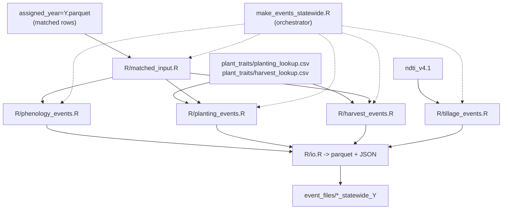

# Statewide event file generation

Builds PEcAn-ready **planting**, **harvest**, **phenology**, and **tillage** event
files from matched LandIQ-MSLSP assignments (and NDTI for tillage). Part of
**Session 2** (HLS events).

Related management layers live in parallel workflows (**Session 3**):

- **N fertilization / organic amendments:**
  [Session 3](../documentation/sessions/03-fertilizer-irrigation.md);
  `PEcAn.data.land` helpers (`look_up_ca_n_rate`, etc.); statewide builders
  `workflows/fertilization-statewide` / `workflows/ncc-statewide` (open PEcAn
  PR [#4003](https://github.com/PecanProject/pecan/pull/4003); not shipped on
  this monitoring branch)
- **Irrigation:** [Session 3](../documentation/sessions/03-fertilizer-irrigation.md)

Full product set: [pipeline.md](../documentation/pipeline.md).

**Downstream of `event_files/`:** unofficial
[SIPNET handoff](../documentation/sessions/sipnet-handoff.md)
(clean / rename -> `events.json` -> SIPNET `events.in`).

- **Input (phenology / planting / harvest):** gap-filled overlay
  `gapfill_dates/assigned_year=Y_gapfilled.parquet` when present (includes filled
  planting/harvest dates and `gapfill_date_source` for `no_mslsp` / related rows).
  Falls back to `assigned_year=Y.parquet` if the overlay is missing. See
  [phenology/gapfill/README.md](../phenology/gapfill/README.md).
- **Input (tillage):** NDTI hive dataset + gapfilled product (else assigned) for
  `(year - buffer):year` (lookback only; next year's job finalizes cross-year
  fallows via `merge_tillage_lookback.sh`).
- **Output:** `$MANAGEMENT/event_files/*_statewide_{year}.parquet` (+ JSON).



Pipeline map: [documentation/pipeline.md](../documentation/pipeline.md).
Upstream match: [phenology/match/README.md](../phenology/match/README.md).
Traits (one-time): [traits/README.md](../traits/README.md).
MSLSP extract / date gap-fill: [phenology/README.md](../phenology/README.md).
NDTI extract (tillage input): [tillage/extract/README.md](../tillage/extract/README.md).

## Before you run

| Prerequisite | Source |
|--------------|--------|
| Matched seasons | [phenology/match/README.md](../phenology/match/README.md) |
| Planting + harvest lookups | [traits/README.md](../traits/README.md) -> `$MANAGEMENT/plant_traits/` |
| NDTI (tillage only) | [tillage/extract/README.md](../tillage/extract/README.md) -> `$MANAGEMENT/tillage/ndti_v4.1/` |

Build trait lookups once before first planting/harvest event run:

```bash
Rscript $CCMMF_CODE/traits/build_planting_lookup.R
Rscript $CCMMF_CODE/traits/build_harvest_lookup.R
```

## Run a year

### Step 1 - Environment

```bash
source "$CCMMF_CODE/documentation/setup_env.sh"
```

### Step 2 - Generate events (`event_type` required)

Every type is opt-in; there is no default bundle.
`event_type`: `phenology` | `planting` | `harvest` | `tillage`.

Why: turn matched seasons (+ trait lookups) into PEcAn event files under
`$MANAGEMENT/event_files/`.

```bash
$CCMMF_CODE/events/make_events_statewide.sh 2024 phenology
$CCMMF_CODE/events/make_events_statewide.sh 2024 planting
$CCMMF_CODE/events/make_events_statewide.sh 2024 harvest
$CCMMF_CODE/events/make_events_statewide.sh 2024 tillage    # heavy; needs NDTI for (Y-buffer):Y
```

Or call the R orchestrator directly:

```bash
Rscript $CCMMF_CODE/events/make_events_statewide.R 2024 planting
Rscript $CCMMF_CODE/events/make_events_statewide.R 2024 tillage
```

After tillage years that amend prior lookbacks:

```bash
$CCMMF_CODE/events/merge_tillage_lookback.sh 2023 2024
```

### Step 3 - Verify

```r
library(arrow)
od <- file.path(Sys.getenv("MANAGEMENT"), "event_files")
for (kind in c("planting", "harvest", "phenology", "tillage")) {
  f <- file.path(od, paste0(kind, "_statewide_2024.parquet"))
  if (file.exists(f)) message(kind, ": ", nrow(read_parquet(f)), " rows")
}
```

## Event types

| Type | Date source | Trait / logic |
|------|-------------|---------------|
| **Phenology** | `mslsp_50PCGI`, `mslsp_50PCGD` (50% of peak green-up / green-down) | Leaf-on / leaf-off dates; `year` = peak calendar year |
| **Planting** | `mslsp_OGI` (~15% of peak; or gap-filled planting date) | RS effective plant (visible greenness / seedling stage), not seed-in-ground; C/N pools via `initialize_planting()` + LAI from `mslsp_EVImax`/`EVIamp` (CLASS/PFT median LAI fallback when EVI missing); skip young woody (`SPECOND=Y` / `CLASS=YP`; phenology-only) and PFT `other` |
| **Harvest** | row/rice -> `mslsp_OGMn`; hay/woody -> `mslsp_OGD` | Removal fractions via `initialize_harvest_from_lookup()`; skip young woody (`SPECOND=Y` / `CLASS=YP`); **orchard clearing** when LandIQ season-2 **CLASS** changes year->year+1 (or mature woody -> young / non-woody): same LandIQ PFT `woody` with `destructive=TRUE` (not a separate PFT). Subclass-only changes ignored. Re-run the prior year after a new LandIQ year exists so look-ahead can fire. |
| **Tillage** | Minimum NDTI in fallow window | `tillage_metrics()` in `R/tillage_metrics.R` (loaded like planting/harvest helpers) |

### Tillage algorithm (summary)

Tillage needs monthly NDTI under `$MANAGEMENT/tillage/ndti_v4.1/` and
matched seasons. Loads NDTI for `(year - TILLAGE_BUFFER_YEARS):year` (default
buffer 1). Cross-year fallow amends are folded in with
`merge_tillage_lookback.sh`.

1. Join NDTI scenes to phenology dates (`OGI_date`, `OGMn_date`) per parcel-year.
2. Build fallow periods: `OGMn` to next `OGI` on the same parcel (can cross years).
3. Smooth NDTI (4-day moving average); find minimum in each fallow window.
4. Record pre-minimum peak, percent change, and neighbor-scene SD when needed.

| Variable | Default | Role |
|----------|---------|------|
| `TILLAGE_BUFFER_YEARS` | `1` | Extra NDTI / matched years around target |
| `TILLAGE_PARCEL_CHUNK` | `3000` | Parcels per chunk in the events runner |

Core function: [`R/tillage_metrics.R`](R/tillage_metrics.R). Runner: [`R/tillage_events.R`](R/tillage_events.R).

## Outputs per year

| File (under `$MANAGEMENT/event_files/`) | Description |
|-----------------------------------------------|-------------|
| `planting_statewide_{year}.parquet` / `.json` | Planting events with C/N pools |
| `harvest_statewide_{year}.parquet` / `.json` | Harvest removal fractions |
| `phenology_statewide_{year}.parquet` / `.json` | Leaf-on / leaf-off phenology |
| `tillage_statewide_{year}.parquet` / `.json` | Tillage timing from NDTI (opt-in) |

Parquet is canonical; JSON is PEcAn nested-by-site format.

Column dictionaries: [data/planting_statewide_metadata.csv](data/planting_statewide_metadata.csv),
[harvest](data/harvest_statewide_metadata.csv),
[phenology](data/phenology_statewide_metadata.csv),
[tillage](data/tillage_statewide_metadata.csv).
Planting / harvest / phenology parquet and JSON carry **`assigned_by`** and
**`gapfill_date_source`** (`mslsp` | `lm_adoy` | `mean_crop` | `none`) from the
gap-fill overlay so synthetic dates are distinguishable from observed MSLSP
(ADV-02). Tillage already surfaces sources via `ogmn_source` / `ogi_source`.
LAI / pool rules for planting: [traits/README.md](../traits/README.md).
Clearing harvests look up fractions with `PFT=woody` and `destructive=TRUE`
(same CSV as routine woody harvest; no `woody_destructive` PFT).

## Combine multiple event types (PEcAn JSON)

`combine_management_events_pecan.R` merges planting, harvest, tillage, and irrigation
CSVs/data frames into one JSON bundle (not the statewide assigned pipeline):

```bash
Rscript $CCMMF_CODE/events/combine_management_events_pecan.R \
  --planting events_planting.csv --harvest events_harvest.csv \
  --out event_files/combined_events_pecanFormat.json
```

Fertilization / NCC and irrigation statewide builders:
[Session 3](../documentation/sessions/03-fertilizer-irrigation.md) and
[#4003](https://github.com/PecanProject/pecan/pull/4003).

## Reference

| Path (under `$MANAGEMENT`) | Contents |
|----------------------------------|----------|
| `event_files/*_statewide_{year}.parquet` | Event outputs |

### Code layout

| File | Role |
|------|------|
| `make_events_statewide.sh` | Portable bash wrapper (year + required event_type) |
| `make_events_statewide.R` | CLI orchestrator (year + required event_type) |
| `merge_tillage_lookback.sh` / `.R` | Fold tillage lookback amend parquets into yearly products |
| `R/matched_input.R` | Load `assigned_year=Y`, filter matched rows |
| `R/phenology_events.R` | Leaf-on/off from MSLSP columns |
| `R/planting_events.R` | C/N pools via `initialize_planting()` |
| `R/harvest_events.R` | Routine harvest + CLASS-level woody clearing look-ahead (`destructive=TRUE`) |
| `R/tillage_metrics.R` | Fallow-window NDTI minimum / intensity (`tillage_metrics()`) |
| `R/tillage_events.R` | NDTI + matched phenology -> tillage events (multi-year) |
| `R/trait_pool.R` | Load trait lookup + harvest helpers |
| `R/io.R` | Parquet + PEcAn site-nested JSON |
| `combine_management_events_pecan.R` | Merge CSV event tables (separate workflow) |

- Matching: [phenology/match/README.md](../phenology/match/README.md)
- Phenology track: [phenology/README.md](../phenology/README.md)
- Traits: [traits/README.md](../traits/README.md)
- Tillage track: [tillage/README.md](../tillage/README.md)
- NDTI extract: [tillage/extract/README.md](../tillage/extract/README.md)
- Training: [Session 2 HLS](../documentation/sessions/02-phenology.md),
  [Session 3 fert/irrigation](../documentation/sessions/03-fertilizer-irrigation.md)
