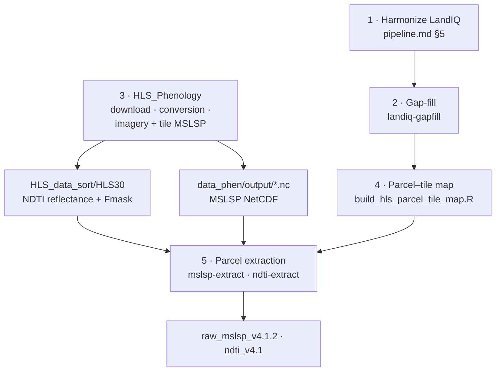
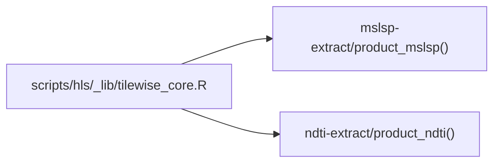

# HLS parcel extraction — NDTI and MSLSP

This package extracts two HLS-derived products at the LandIQ parcel level across
California, on a shared tilewise framework:

| Product | What it is | Cadence | Doc |
|---------|------------|---------|-----|
| **MSLSP** | Multi-Source Land Surface Phenology (green-up/senescence DOY + EVI metrics) | annual | [`mslsp-extract/README.md`](../../mslsp-extract/README.md) |
| **NDTI** | Normalized Difference Tillage Index (bare-soil / residue) | monthly | [`ndti-extract/README.md`](../../ndti-extract/README.md) |



## Pipeline order

When adding **2024** (and rerunning **2023** after gap-fill improves crop identity):

| Step | What | Where |
|------|------|--------|
| 1 | Harmonize LandIQ 2024 | [`pipeline.md`](../../documentation/pipeline.md) §5 |
| 2 | Gap-fill `2023,2024` | [`landiq-gapfill/README.md`](../../landiq-gapfill/README.md) |
| 3 | HLS download, `conversion.R`, tile imagery + MSLSP jobs | [**HLS_Phenology**](https://github.com/mrinareddy/HLS_Phenology) |
| 4 | Parcel–tile map (once) | `build_hls_parcel_tile_map.R` — [§ One-time setup](#one-time-setup) |
| 5 | MSLSP + NDTI parcel extraction | [`mslsp-extract/README.md`](../../mslsp-extract/README.md), [`ndti-extract/README.md`](../../ndti-extract/README.md) |

Steps 2 and 3 are independent after step 1 — either order works, or run them in parallel.

**Step 3 outputs** (under `$CCMMF_ROOT/data_phen/`):

| Path | Used by |
|------|---------|
| `HLS_data_sort/HLS30/<tile>/images/<scene>/` | NDTI (`HLS_IMAGERY_LAYOUT=phenology`, default) |
| `output/<tile>/phenoMetrics/MSLSP_<tile>_<year>.nc` | MSLSP |

Step 3 must finish before step 5 — NDTI needs the imagery tree; MSLSP needs the NetCDF
files. Step 2 must finish before step 4 — the parcel–tile map reads the gap-filled product.

## Quick start (step 5 only)

Assumes steps 1–4 are done. Point `CCMMF_LANDIQ_V4` at the gap-filled product.

```bash
export HLS_ROOT=/projectnb/dietzelab/ccmmf/management/scripts/hls
export MSLSP_EXTRACT_ROOT=/projectnb/dietzelab/ccmmf/management/mslsp-extract
export NDTI_EXTRACT_ROOT=/projectnb/dietzelab/ccmmf/management/ndti-extract

$MSLSP_EXTRACT_ROOT/run_mslsp.sh 2024
$MSLSP_EXTRACT_ROOT/run_mslsp.sh --overwrite 2023
$NDTI_EXTRACT_ROOT/run_ndti.sh  2024
$NDTI_EXTRACT_ROOT/run_ndti.sh --overwrite 2023

# Cluster
qsub -v 'MSLSP_ARGS=2024' $MSLSP_EXTRACT_ROOT/sge/run_mslsp.sge
qsub -v 'MSLSP_ARGS=--overwrite 2023' $MSLSP_EXTRACT_ROOT/sge/run_mslsp.sge
qsub -v 'NDTI_ARGS=2024'  $NDTI_EXTRACT_ROOT/sge/run_ndti.sge
qsub -v 'NDTI_ARGS=--overwrite 2023'  $NDTI_EXTRACT_ROOT/sge/run_ndti.sge
```

## One-time setup

**Parcel–tile map** — built once from harmonized geometry, reused by both products:

```bash
Rscript $HLS_ROOT/build_hls_parcel_tile_map.R overwrite
```

Outputs: `hls_parcel_tile_map_v4.1.rds`, `hls_tile_to_parcels_v4.1.rds`. Agricultural
parcel filtering happens per year inside mslsp-extract / ndti-extract prep.

If the tile-extent grid is missing, run `build_hls_tile_extent.R` first.

## Shared tilewise framework

Both products run through the same orchestration in `_lib/tilewise_core.R`.
Product-specific behaviour lives in [`mslsp-extract`](../../mslsp-extract/) and
[`ndti-extract`](../../ndti-extract/) (`product_mslsp()` / `product_ndti()`):
scene index, per-scene extraction, geometry handling, combine, and output schema.



## What lives here

`scripts/hls/` holds the **shared tilewise framework** and one-time setup scripts.
Extraction orchestrators and product code live in sibling packages:

```
management/
├── mslsp-extract/     run_mslsp.sh, atomic R scripts, MSLSP product impl
├── ndti-extract/      run_ndti.sh, atomic R scripts, NDTI product impl
└── scripts/hls/
    ├── build_hls_parcel_tile_map.R
    ├── build_hls_tile_extent.R
    └── _lib/          tilewise_core.R, extract_summary_core.R
```

## Downstream

After step 5, assign MSLSP cycles to LandIQ seasons, then build event files:

| Step | What | Doc |
|------|------|-----|
| 6 | Match LandIQ seasons → MSLSP cycles | [`../phenology/match/README.md`](../phenology/match/README.md) |
| 7 | Trait lookups (one-time) | [`../traits/README.md`](../traits/README.md) |
| 8 | Events: phenology, planting, harvest | [`../events/README.md`](../events/README.md) |
| 9 | Events: tillage (NDTI + matched phenology) | [`../tillage/README.md`](../tillage/README.md), [`../events/README.md`](../events/README.md) |

## Reference

- Product docs: [`mslsp-extract/README.md`](../../mslsp-extract/README.md), [`ndti-extract/README.md`](../../ndti-extract/README.md)
- Full pipeline: [`../../documentation/pipeline.md`](../../documentation/pipeline.md)
- HLS phenology upstream: [**HLS_Phenology**](https://github.com/mrinareddy/HLS_Phenology)
- Gap-fill: [`../../landiq-gapfill/README.md`](../../landiq-gapfill/README.md)
