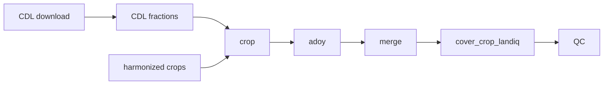

# LandIQ gap-fill

Fills missing season-2 **crop identity** (`CLASS` / `SUBCLASS`) and **peak
greenness** (`ADOY`) on harmonized LandIQ for phenology matching and events.

| Does | Does not |
|------|----------|
| Patch missing crop / ADOY; record provenance | Change geometry or `parcel_id` |
| Rewrite only the years you pass | Retrain lookups on a routine year-pair run |
| Keep `SUBCLASS` on the **Nov 2021 DWR RS legend** | Model sparse seasons 1/3/4 |

Links: [cadwr-landuse](https://github.com/ccmmf/cadwr-landuse),
[pipeline.md](../documentation/pipeline.md),
[01-landiq.md](../documentation/sessions/01-landiq.md),
[qc_gapfill_report.md](outputs/qc_gapfill_report.md).

## Paths

| Role | Path |
|------|------|
| Harmonized crops (in) | `$LANDIQ_HARMONIZED/crops_all_years.parq` (default: `$CADWR_WORK_DIR/03-final`) |
| Geometry (join only) | `$LANDIQ_HARMONIZED/parcels-consolidated.gpkg` |
| Gap-filled crops (out) | `$LANDIQ_GAPFILLED/crops_all_years.parq` |
| Package / lookups | `$LANDIQ_GAPFILL_ROOT` (`outputs/`, `data/`) |
| CDL rasters / fractions | `$CDL_DIR/cdl_YYYY.tif`, `cdl_fractions_year=YYYY.parquet` |

Dictionaries: [crops_all_years_metadata.csv](data/crops_all_years_metadata.csv),
[cdl_fractions_metadata.csv](data/cdl_fractions_metadata.csv),
[cdl_nass_cropland_code_lookup.csv](data/cdl_nass_cropland_code_lookup.csv).

## Data model

One row per `parcel_id` x `year` x `season`. Geometry fixed by `parcel_id`
(consolidated parcels only).

| Season | Role | ~share with a crop (2020) |
|--------|------|---------------------------|
| **2** | Inventory main crop | ~100% ag |
| 1 | Extra / cover | ~7% |
| 3 / 4 | Extra | ~2% / <1% |

Gap-fill targets **season 2** (CDL is annual). Other seasons keep observed
LandIQ or stay NA. 2016 has seasons 1-3 only.

`COVER` is a derived flag (not gap-fill): `TRUE` if cover-crop candidate and alternates from the previous cropped season; `FALSE` on other cropped seasons; `NA` if no CLASS. Downstream steps expect it. Attach with `scripts/R/cover_crop_landiq.R` (also run by default from `run_gapfill.sh` after merge).

## Routine run

Prerequisites under `outputs/` (usually shipped; not rebuilt on a routine run):

- CDL x LandIQ probability tables (`gapfill.R cdl-landiq-probs`)
- ADOY reference tables (`gapfill.R adoy-ref`)

Crop/adoy error clearly if those are missing. Rebuild only when logic or training years change (`--cdl-landiq-probs` / `--adoy-ref` on the shell, or the matching `gapfill.R` commands).

1. New year in `$LANDIQ_HARMONIZED`.
2. `run_gapfill.sh PRIOR,TARGET` (ensures CDL *fractions* if missing, then crop -> adoy -> merge -> cover_crop_landiq -> qc). Or the same steps by hand -- Session 1 sections 1.4–1.6 (one-shot note at end of that session).
3. Review `outputs/qc_gapfill_report.md` when the log says `Done.` (CDL extract ~40 min/year when needed; gap-fill ~1-2 h after that).



### Commands and flags

Year lists: `2023`, `2023,2024`, `2023 2024`, or `2023-2024`.

```bash
YEARS=2023,2024

# Routine year pair (CDL fractions auto-ensured; prerequisite tables must exist)
$LANDIQ_GAPFILL_ROOT/run_gapfill.sh $YEARS

# Rebuild prerequisite tables when missing or after logic/training changes:
# $LANDIQ_GAPFILL_ROOT/run_gapfill.sh --cdl-landiq-probs --adoy-ref $YEARS
```

CDL fractions are not a flag: always ensured (skip years that exist). Prerequisite tables (`cdl-landiq-probs`, `adoy-ref`) are **off by default**; pass `--cdl-landiq-probs` and/or `--adoy-ref` to rebuild. Default-on: crop, adoy, merge, `cover_crop_landiq.R`, qc. Skip with `--no-crop`, `--no-adoy`, `--no-merge`, `--no-cover`, `--no-qc`. Help: `run_gapfill.sh -h` / `Rscript gapfill.R -h`.

If years are omitted on year-aware `gapfill.R` commands, they fall back to `LANDIQ_GAPFILL_RUN_YEARS`.

## Methods (within-year -- usual case)

Default for every year that has LandIQ. Full-gap years (default **2017**) are
the exception; see below.

### CDL x LandIQ probability tables

Shipped under `outputs/`. Trained on season-2 ag parcels with both LandIQ and
CDL (full-gap years excluded). Routine runs load them; rebuild with
`--cdl-landiq-probs` only when logic or training years change.

| Table | Role |
|-------|------|
| P(CDL \| CLASS) | Class-level CDL likelihood |
| P(CDL \| CLASS::SUBCLASS) | Subclass-level CDL likelihood |
| P(SUBCLASS \| CLASS) | LandIQ subclass prior |

### Crop identity

Fills missing season-2 **SUBCLASS** for ag parcels (`is_agricultural`). CLASS
is never predicted. Already-specific subclass stays `observed`. Young perennial
blank subclass is left by design (`YP (no subclass)`). Vineyard still missing
subclass defaults to wine grapes (`observed`).

Dominant CDL code from that year's fraction parquet. Cascade (stop at first
hit):

| # | `subclass_source` | Rule |
|---|-------------------|------|
| 1 | `plurality` | Same parcel + CLASS in other years; vote (inverse year-distance) |
| 2 | `emission_cdl` | Max prior x P(dominant CDL \| CLASS::SUBCLASS) if score > 0 |
| 3 | `prior_only` | Argmax P(SUBCLASS \| CLASS) |
| 4 | `unfilled` | Stays `**` |

Neighbors: nearest LandIQ year before/after (excluding full-gap years).

### ADOY

After crop. Missing = NA or 0. Valid original ADOY stays `observed`.

Fills any season with invalid ADOY on ag parcels. Some CLASSes are exempt
(`not_applicable`, ADOY NA).

`adoy-ref` (opt-in `--adoy-ref`) is not a model. It writes lookup tables from
observed LandIQ ADOY in the training years:

1. **Group means** (or median via `ADOY_REFERENCE_STAT`) of ADOY by county or
   statewide, CLASS, optional SUBCLASS, and season -- typical peak day for that
   crop in that place.
2. **Parcel panel** of every valid observed ADOY (parcel, year, season, CLASS,
   SUBCLASS) -- used only so fill can reuse the *same parcel's* ADOY from a
   nearby year when crop/season match (`temporal_neighbor`).

Routine `adoy` loads these if present; rebuild when training years or the
stat change.

Cascade (stop at first hit):

| # | `adoy_source` | Rule |
|---|---------------|------|
| 1 | `county_class_subclass` | County x CLASS x SUBCLASS mean |
| 2 | `temporal_neighbor` | Same parcel / season / CLASS / SUBCLASS within +/- 3 years |
| 3 | `county_class` | County x CLASS mean |
| 4 | `statewide_class_subclass` | Statewide CSS mean |
| 5 | `statewide_class` | Statewide CLASS mean |
| 6 | `unfilled` | No match |
| 7 | `multiuse_season2` | Post-pass: `MULTIUSE=M`, copy season-2 ADOY if crop matches |

### Merge

`gapfill.R merge` joins the per-year crop and ADOY fill outputs into
`$LANDIQ_GAPFILLED` (existing gap-filled table, or harmonized on first build).
Other years are carried unchanged. Harmonize SUBCLASS to 2021 RS legend; keep
consolidated parcel IDs. Geometry stays under harmonized -- join
`parcels-consolidated.gpkg`. Inactive seasons: crop and provenance **NA**.

Crop and ADOY each write year-specific fill tables; merge overlays those filled
values onto the multi-year base (internal helpers still say "patch" for that
join -- software overlay, not field polygons).

### Cover (required product step; not gap-fill)

`COVER` does not fill missing values. It flags cover-crop candidates from the
parcel season sequence on the product table. Not a `gapfill.R` command:

```bash
Rscript $LANDIQ_GAPFILL_ROOT/scripts/R/cover_crop_landiq.R
```

## Exception: full-gap year (no LandIQ)

Years in `LANDIQ_GAPFILL_FULL_GAP_YEARS` (default **2017**). Same pipeline
order; differences:

| Step | Difference from within-year |
|------|-----------------------------|
| Crop | Predict season-2 **CLASS** then SUBCLASS. CLASS = MAP of CDL likelihood plus neighbor transition (county matrix, statewide fallback). SUBCLASS uses the same cascade on the predicted CLASS. Other seasons empty (NA). |
| ADOY | Season 2 only (default). |

Needs neighbor LandIQ years, CDL fractions for the gap year, and transition
matrices under `data/`.

```bash
Rscript $LANDIQ_GAPFILL_ROOT/scripts/cdl/download_cdl_nass.R 2017
Rscript $LANDIQ_GAPFILL_ROOT/scripts/cdl/extract_cdl_fractions_by_parcel.R 2017
$LANDIQ_GAPFILL_ROOT/run_gapfill.sh 2017
```

## Rebuild from scratch

Only after changing logic or lookups -- not for a routine year pair.

```bash
mv $LANDIQ_GAPFILLED ${LANDIQ_GAPFILLED}.bak-$(date +%Y%m%d)

# Re-download/extract CDL for each year as needed, then:
$LANDIQ_GAPFILL_ROOT/run_gapfill.sh \
  --cdl-landiq-probs --adoy-ref 2016-2023
```

Do not rebuild CDL x LandIQ probability tables on routine runs. Pin
`CDL_LANDIQ_TRAINING_YEARS` if you must, or use shipped `outputs/`.
