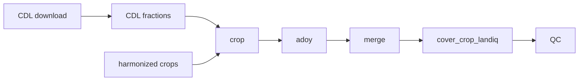

# LandIQ gap-fill

Authoritative methodological and technical reference for LandIQ **attribute** gap filling (crop identity and peak greenness). Geometry harmonization lives in [cadwr-landuse](https://github.com/ccmmf/cadwr-landuse); this package does not change polygons or `parcel_id`.

For the guided inventory year-pair workflow (download, legend QC, cadwr commands, routine execution, QC checklist), see [Session 1 - LandIQ](../documentation/sessions/01-landiq.md). Product layout and accounts: [tree README](../README.md).

| Does | Does not |
|------|----------|
| Patch missing crop / ADOY; record provenance | Change geometry or `parcel_id` |
| Rewrite only the years you pass to crop/adoy/merge | Retrain lookups on a routine year-pair run |
| Keep `SUBCLASS` on the **2021 DWR RS legend** after merge | Reconstruct sparse seasons 1/3/4 crop identity from CDL |
| Within-year: fill season-2 **SUBCLASS** (CLASS observed) | Within-year: invent CLASS |
| Full-gap years: invent season-2 CLASS then SUBCLASS | Treat COVER as a gap-fill step |

---

## Scope

**Usual case (within-year):** LandIQ exists for the calendar year, but some agricultural parcels have missing season-2 subclass and/or invalid ADOY. Fill those attributes.

**Exception (full-gap year):** Years listed in `LANDIQ_GAPFILL_FULL_GAP_YEARS` (default **2017**) have no usable LandIQ. Reconstruct season-2 CLASS and SUBCLASS from CDL + neighbor transitions, then ADOY for that season. See [Full-gap years](#exception-full-gap-year-no-landiq).

**Not gap-filled:**

- Geometry / `parcel_id`
- Season-1/3/4 crop identity (CDL is annual; inventory main crop is season 2)
- Observed specific subclass values (preserved as `observed`)
- Young perennial (`YP`) and idle/urban-style exemptions (see crop and ADOY sections)
- `COVER` (derived flag after merge; separate script)

---

## Inputs and outputs

| Role | Path |
|------|------|
| Harmonized crops (in) | `$LANDIQ_HARMONIZED/crops_all_years.parq` (default: `$CADWR_WORK_DIR/03-final`) |
| Geometry (join only) | `$LANDIQ_HARMONIZED/parcels-consolidated.gpkg` |
| Gap-filled crops (out) | `$LANDIQ_GAPFILLED/crops_all_years.parq` |
| Package / lookups | `$LANDIQ_GAPFILL_ROOT` (`data/`, `outputs/`) |
| CDL rasters / fractions | `$CDL_DIR/cdl_YYYY.tif`, `cdl_fractions_year=YYYY.parquet` (`$CDL_OUT_DIR` overrides fraction dir) |

Column dictionaries: [crops_all_years_metadata.csv](data/crops_all_years_metadata.csv), [cdl_fractions_metadata.csv](data/cdl_fractions_metadata.csv), [cdl_nass_cropland_code_lookup.csv](data/cdl_nass_cropland_code_lookup.csv). Crop-code lookup: [LandIQ_cropCode_lookup_table.csv](data/LandIQ_cropCode_lookup_table.csv).

**Note:** Probability and ADOY-reference tables are in `outputs/` (year-patch parquets stay gitignored). Routine crop/adoy **stop** with a rebuild hint if they are missing; they do not silently retrain. Rebuild with `gapfill.R cdl-landiq-probs` / `adoy-ref` only after a method or training-year change.

---

## Data model

One row per `parcel_id` x `year` x `season`. Geometry is fixed by `parcel_id` (consolidated parcels only).

| Season | Role | ~share with a crop (2020) |
|--------|------|---------------------------|
| **2** | Inventory main crop | ~100% ag |
| 1 | Extra / cover | ~7% |
| 3 / 4 | Extra | ~2% / <1% |

2016 has seasons 1-3 only; 2018+ has 1-4.

| Field group | Notes |
|-------------|--------|
| Crop | `CLASS`, `SUBCLASS` (gap-filled product: SUBCLASS on 2021 RS legend; see below) |
| Peak greenness | `ADOY` (adjusted day of year of peak NDVI; 0 and NA treated as missing for fill) |
| Provenance | `subclass_source`, `adoy_source` (lowercase labels; see below) |
| Cover | `COVER` logical after `cover_crop_landiq.R` |
| Inactive seasons | No CLASS: typically keep structure; COVER NA; full-gap padded seasons have crop and provenance NA |

### Two different "harmonize" steps

Do not confuse cadwr **geometry** harmonization with **subclass legend** remapping.

| Step | Where | What |
|------|-------|------|
| Geometry harmonization | [cadwr-landuse](https://github.com/ccmmf/cadwr-landuse) (before gap-fill) | Stable `parcel_id` + multi-year table. Crop codes stay each year's **native** LandIQ `CLASS` / `SUBCLASS` (legend vintage as published). |
| Subclass legend remap | This package (`scripts/R/landiq_rs_harmonize.R`) | Map stored `SUBCLASS` -> **2021 DWR remote-sensing legend** (`harmonized_SUBCLASS` in [LandIQ_cropCode_lookup_table.csv](data/LandIQ_cropCode_lookup_table.csv); CDL split for grouped codes via [LandIQ_grouped_subclass_cdl_split.csv](data/LandIQ_grouped_subclass_cdl_split.csv)). `CLASS` letters are unchanged across vintages. |

**When subclass remapping runs (not a separate CLI):**

1. **On the fly during gap-fill** -- whenever crop, CDL x LandIQ probability training, plurality history, or ADOY reference/target code reads LandIQ years that may predate the 2021 legend. Logic must vote and train in one code space.
2. **At `merge`** -- the assembled `$LANDIQ_GAPFILLED` product is remapped so shipped `SUBCLASS` is on the 2021 legend for **all** years in the table (filled years and carried years).

`$LANDIQ_HARMONIZED` is therefore **not** guaranteed to already be on the 2021 subclass legend. Trust the **gap-filled** product for inventory joins that assume 2021 codes.

**New LandIQ year:** download + cadwr (geometry) as usual, then gap-fill the year pair. Years from 2021 onward are usually already on the 2021 legend (remap often a no-op for those rows). Older years in the panel are still remapped when used as donors and again when merge writes the product. If DWR adds or changes codes, update the lookup CSV (Session 1 legend QC) **before** gap-fill / before rebuilding probability tables.

---

## Routine pipeline

Prerequisites under `outputs/` (not rebuilt by default):

- CDL x LandIQ probability tables (`gapfill.R cdl-landiq-probs`)
- ADOY reference tables (`gapfill.R adoy-ref`)

1. Harmonized LandIQ present for years of interest (`$LANDIQ_HARMONIZED`).
2. Ensure CDL fractions for those years (auto in `run_gapfill.sh`, or hand download/extract).
3. `crop` -> `adoy` -> `merge` -> `cover_crop_landiq.R` -> `qc`.
4. Review `outputs/qc_gapfill_report.md`.



Guided year-pair commands: [Session 1 Sec. 1.4–1.6](../documentation/sessions/01-landiq.md). Wall-clock (order of magnitude): CDL extract ~40 min/year when needed; gap-fill ~1-2 h after that (hardware-dependent).

### Commands and flags

Year lists: `2023`, `2023,2024`, `2023 2024`, or `2023-2024`.

```bash
YEARS=2023,2024

# Routine year pair (CDL fractions auto-ensured; prerequisite tables must exist)
$LANDIQ_GAPFILL_ROOT/run_gapfill.sh $YEARS

# Rebuild prerequisite tables when missing or after logic/training changes:
# $LANDIQ_GAPFILL_ROOT/run_gapfill.sh --cdl-landiq-probs --adoy-ref $YEARS
```

| Step | Default in `run_gapfill.sh` | CLI |
|------|------------------------------|-----|
| CDL fractions ensure | always (skip years that exist) | `scripts/cdl/download_cdl_nass.R` + `extract_cdl_fractions_by_parcel.R` |
| CDL x LandIQ probs | **off** | `gapfill.R cdl-landiq-probs` / `--cdl-landiq-probs` |
| crop | **on** | `gapfill.R crop YEARS` / `--no-crop` |
| ADOY ref | **off** | `gapfill.R adoy-ref` / `--adoy-ref` |
| adoy | **on** | `gapfill.R adoy YEARS` / `--no-adoy` |
| merge | **on** | `gapfill.R merge YEARS` / `--no-merge` |
| COVER | **on** | `scripts/R/cover_crop_landiq.R` / `--no-cover` |
| qc | **on** | `gapfill.R qc YEARS` / `--no-qc` |

Help: `run_gapfill.sh -h` / `Rscript gapfill.R -h`.

If years are omitted on year-aware `gapfill.R` commands, they fall back to `LANDIQ_GAPFILL_RUN_YEARS` (then `GAPFILL_YEAR`). There is **no** `gapfill.R cover` command.

Rejected / renamed commands (do not use): `emission`, `product`, `cover`, `ensure-tables`, `shared-tables`.

---

## Configuration (method-relevant env vars)

Set via environment (see also [setup_env.sh](../documentation/setup_env.sh) for path defaults).

### Paths

| Variable | Role / default |
|----------|----------------|
| `LANDIQ_GAPFILL_ROOT` | This package |
| `LANDIQ_HARMONIZED` | Harmonized in (`$CADWR_WORK_DIR/03-final`) |
| `LANDIQ_GAPFILLED` | Gap-filled out |
| `CDL_DIR` / `CDL_OUT_DIR` | CDL rasters; fractions (OUT defaults to DIR) |
| `COUNTY_TRANSITION_MATRICES_DIR` | Full-gap county matrices |
| `EXTERNAL_TRANSITION_MATRIX_CSV` | Statewide transition fallback |

### Years and modes

| Variable | Default / behavior |
|----------|-------------------|
| `LANDIQ_GAPFILL_FULL_GAP_YEARS` | `2017` -- years run in full-gap mode |
| `LANDIQ_GAPFILL_AVAILABLE_YEARS` | Parquet years minus full-gap years |
| `LANDIQ_GAPFILL_NEIGHBORING_YEARS` | Full-mode neighbor override (1-2 years); else nearest before/after available |
| `LANDIQ_GAPFILL_RUN_YEARS` | Batch / CLI year fallback |
| `LANDIQ_GAPFILL_START_YEAR` / `END_YEAR` | Inclusive range if RUN_YEARS unset |
| `LANDIQ_ADOY_DEFAULT_SEASON` | `2` -- active season for full-gap crop/ADOY |

### Training / reference

| Variable | Default / behavior |
|----------|-------------------|
| `CDL_LANDIQ_TRAINING_YEARS` | Explicit CDL x LandIQ probability training years |
| `CDL_LANDIQ_TRAINING_YEAR_MIN` / `MAX` | Range override (both required) |
| `CDL_LANDIQ_TRAINING_EXCLUDE_YEARS` | `2017` |
| `LANDIQ_SUBCLASS_PRIOR_YEARS` | Season-2 years in parquet minus full-gap |
| `LANDIQ_ADOY_TRAINING_YEARS` | Available LandIQ years |
| `LANDIQ_ADOY_TRAINING_EXCLUDE_YEARS` | Optional exclusions |
| `ADOY_REFERENCE_STAT` | `mean` (`median` allowed) |
| `ADOY_TEMPORAL_MAX_YEAR_GAP` | `3` |
| `GAPFILL_REBUILD_EMISSION` / `GAPFILL_REBUILD_ADOY_REF` | Silent rebuild if true (prefer explicit CLI) |

### Crop / CDL scoring knobs

| Variable | Default / behavior |
|----------|-------------------|
| `LANDIQ_SUBCLASS_PLURALITY_POOL` | `panel` (all other S2 years); set `neighbors` for nearest only |
| `LANDIQ_SUBCLASS_PLURALITY_WEIGHT` | `inverse_distance` (`count` = equal votes) |
| `LANDIQ_VINEYARD_FALLBACK_SUBCLASS` | `"2"` (wine grapes); provenance forced to `observed` |
| `CDL_LANDIQ_LOOKUP_WEIGHTING` | `fraction` (vs `dominant`) |
| `CDL_CLASS_OBS` | `fraction` for full-gap CLASS CDL message |
| `GAPFILL_TRANSITION_LEVEL` | `county` |

---

## Methods: within-year (usual case)

Default for every year that has LandIQ and is not listed as a full-gap year.

### CDL x LandIQ probability tables

Built by `gapfill.R cdl-landiq-probs` from season-2 **agricultural** parcels that have both LandIQ and CDL fractions. Full-gap years are excluded by default (`CDL_LANDIQ_TRAINING_EXCLUDE_YEARS`). Years without a fraction parquet are skipped.

Outputs under `outputs/` (suffix like `2016-2023_excl2017`):

| Table | Role |
|-------|------|
| `cdl_prob_by_class_*.parquet` | P(CDL \| CLASS) (additive smoothing) |
| `cdl_prob_by_subclass_*.parquet` | P(CDL \| CLASS::SUBCLASS) |
| `landiq_subclass_frequency_*.parquet` | P(SUBCLASS \| CLASS) prior |
| Supporting mass/dominant lookups + coverage CSVs | Diagnostics / alternate weighting |

Routine `crop` **loads** these; it does not rebuild them.

### Crop identity

**Eligibility:** season-2 rows with agricultural CLASS (`is_agricultural` in the crop-code lookup), missing subclass (`NA` / `""` / `**`), and CLASS not in subclass-exempt set **`X`, `YP`**.

**CLASS:** never predicted in within-year mode. Observed LandIQ CLASS is kept.

**Already-specific subclass:** stays; `subclass_source = observed`.

**Special cases (not the main cascade):**

- **`YP` / `X` / `I` with blank or `**` subclass:** left without inventing a crop; provenance normalized to `X/I/YP (no subclass)` (legacy label `YP (no subclass)` still recognized by QC as non-gap-filled).
- **Vineyard (`V`) still missing subclass after the cascade:** SUBCLASS set to wine grapes (`LANDIQ_VINEYARD_FALLBACK_SUBCLASS`, default `"2"`); `subclass_source` forced to **`observed`**.

**Dominant CDL** for the year comes from that year's fraction parquet.

**Cascade** (`assign_subclass` -- stop at first hit):

| # | `subclass_source` | Rule |
|---|-------------------|------|
| 1 | `plurality` | Same parcel + same CLASS in other season-2 years; vote. Default pool = **entire panel** except the fill year (`LANDIQ_SUBCLASS_PLURALITY_POOL=panel`). Weight = `1/(1+|year_dist|)` unless `count`. |
| 2 | `emission_cdl` | Argmax `prior * P(dominant CDL \| CLASS::SUBCLASS)` if score > 0 (provenance label name is historical; step = CDL likelihood) |
| 3 | `prior_only` | Argmax P(SUBCLASS \| CLASS) |
| 4 | `unfilled` | Stays `**` |

Nearest before/after LandIQ years (excluding full-gap years) are resolved for full-gap CLASS transitions and attached as neighbor metadata; they are **not** the default plurality pool unless `LANDIQ_SUBCLASS_PLURALITY_POOL=neighbors`.

Per-year crop fill tables are written under the package outputs (e.g. within-year season-2 patch parquets) and consumed by merge.

### ADOY

Runs after crop so filled subclass can inform matching.

**Invalid / missing ADOY:** not numeric, NA, or **0**. Valid original ADOY stays `observed`.

**Exempt CLASSes:** `X`, `I` -> ADOY NA, `adoy_source = not_applicable`. **`YP` is not exempt** (ADOY can be filled).

**Season scope (within-year):** any season with invalid ADOY on ag parcels (base LandIQ plus within-year subclass overlay). Full-gap differs (season 2 only).

**Reference tables** (`adoy-ref`, opt-in): not a predictive model. Built from observed LandIQ ADOY in training years:

1. **Group summaries** (mean or median via `ADOY_REFERENCE_STAT`) by county or statewide x CLASS x optional SUBCLASS x season.
2. **Parcel panel** of every valid observed ADOY -- donors for `temporal_neighbor`.

**Cascade** (coalesce order; stop at first hit):

| # | `adoy_source` | Rule |
|---|---------------|------|
| 1 | `county_class_subclass` | County x CLASS x SUBCLASS x season |
| 2 | `temporal_neighbor` | Same parcel / season / CLASS / SUBCLASS within +/- `ADOY_TEMPORAL_MAX_YEAR_GAP` (default 3); aggregate by `ADOY_REFERENCE_STAT` |
| 3 | `county_class` | County x CLASS x season |
| 4 | `statewide_class_subclass` | Statewide CSS x season |
| 5 | `statewide_class` | Statewide CLASS x season |
| 6 | `unfilled` | No match |
| 7 | `multiuse_season2` | Post-pass: `MULTIUSE=M`, non-season-2, invalid ADOY; copy matching season-2 ADOY if crop matches |

### Merge

`gapfill.R merge YEARS`:

1. **Base table:** existing `$LANDIQ_GAPFILLED/crops_all_years.parq` if present, else harmonized `$LANDIQ_HARMONIZED/crops_all_years.parq`.
2. Overlay year-specific crop and ADOY fill patches for requested years.
3. Years not in `YEARS` are carried from the base unchanged.
4. Remap SUBCLASS to the 2021 RS legend for the full product table (see [Two different "harmonize" steps](#two-different-harmonize-steps)); vineyard `**` -> wine grapes + source normalization.
5. Restrict to consolidated `parcel_id`s; write `$LANDIQ_GAPFILLED/crops_all_years.parq`.

**Inactive seasons:**

- **Within-year:** non-season-2 rows keep LandIQ values; provenance typically initialized as `observed` for subclass (then normalized for X/I/YP blanks). ADOY may be filled on those seasons.
- **Full-gap padded seasons:** crop fields and provenance set to **NA** for inactive seasons.

Geometry stays under harmonized -- join `parcels-consolidated.gpkg` when polygons are needed. Internal helpers may say "patch" for the year overlay (software join, not field polygons).

### COVER (required product step; not gap-fill)

`COVER` does not fill missing values. It flags cover-crop candidates from the parcel season sequence on the product table.

Implemented in `scripts/R/cover_crop_landiq.R` (library + CLI). Default-on in `run_gapfill.sh` after merge. Not a `gapfill.R` command.

**Default candidate CLASS/SUBCLASS pairs:** F/{2,11,12,16}, G/{2,6}, P/{1,3,4,6}.

**Semantics:**

- On seasons with a CLASS: `COVER = TRUE` iff the pair is a candidate **and** CLASS or SUBCLASS differs from the previous cropped season on the same parcel; else `FALSE`.
- First cropped observation on a parcel cannot alternate -> `FALSE`.
- Inactive / no CLASS: `COVER = NA` after left-join.

```bash
Rscript $LANDIQ_GAPFILL_ROOT/scripts/R/cover_crop_landiq.R
```

---

## Exception: full-gap year (no LandIQ)

Years in `LANDIQ_GAPFILL_FULL_GAP_YEARS` (default **2017**). Same pipeline order; differences:

| Step | Difference from within-year |
|------|-----------------------------|
| Crop | Predict season-2 **CLASS** then SUBCLASS. CLASS = MAP of CDL likelihood plus neighbor transition (county matrix, statewide fallback). Temporal modes: both neighbors -> `(p_fwd+p_bwd+p_cdl)/3`; single neighbor -> average available temporal message with `p_cdl`. SUBCLASS uses the same cascade on the **predicted** CLASS. Other seasons empty (NA). |
| ADOY | Season `LANDIQ_ADOY_DEFAULT_SEASON` only (default 2). |

Needs neighbor LandIQ years, CDL fractions for the gap year, transition matrices under `data/county_transition_matrices/` (and statewide CSV), and the CDL x LandIQ probability tables.

```bash
Rscript $LANDIQ_GAPFILL_ROOT/scripts/cdl/download_cdl_nass.R 2017
Rscript $LANDIQ_GAPFILL_ROOT/scripts/cdl/extract_cdl_fractions_by_parcel.R 2017
$LANDIQ_GAPFILL_ROOT/run_gapfill.sh 2017
```

---

## CDL download and fractions

| Script | Role |
|--------|------|
| `scripts/cdl/download_cdl_nass.R` | NASS national 30 m zip, clipped to California -> `$CDL_DIR/cdl_YYYY.tif` (skip if exists; years >= 2008) |
| `scripts/cdl/extract_cdl_fractions_by_parcel.R` | Zonal fractions vs `parcels-consolidated.gpkg` -> `cdl_fractions_year=YYYY.parquet` (`parcel_id`, `year`, `cdl_code`, `frac`, weights) |

`run_gapfill.sh` always ensures fractions for requested years before crop.

---

## Provenance reference

Product labels are **lowercase** (metadata CSV still says `OBSERVED` in places -- treat runtime labels as truth).

### `subclass_source`

| Label | Meaning |
|-------|---------|
| `observed` | LandIQ (or vineyard wine-grape fallback treated as observed) |
| `plurality` | Same-parcel historical vote |
| `emission_cdl` | Prior x CDL likelihood (label kept for product stability) |
| `prior_only` | Subclass prior only |
| `unfilled` | Still `**` |
| `X/I/YP (no subclass)` | Blank subclass left by design for those classes |

### `adoy_source`

| Label | Meaning |
|-------|---------|
| `observed` | Valid original ADOY |
| `county_class_subclass` / `county_class` / `statewide_*` | Reference-table fills |
| `temporal_neighbor` | Same parcel nearby year |
| `multiuse_season2` | Copied from season 2 on multiuse parcels |
| `not_applicable` | Exempt CLASS (X, I) |
| `unfilled` | No reference match |

---

## QC interpretation

`gapfill.R qc YEARS` writes:

- `outputs/qc_gapfill_report.md`
- `qc_gapfill_summary.csv`
- `qc_gapfill_summary_provenance.csv` (season-2 `subclass_source` / `adoy_source`)
- `qc_gapfill_summary_subclass.csv`

"Gap-filled subclass" tallies exclude `observed`, `X/I/YP (no subclass)`, legacy `YP (no subclass)`, and `vineyard_fallback`. ADOY gap-filled excludes `observed` / `not_applicable`. Prefer high season-2 observed share for inventory years; there is no hard pass/fail threshold in code.

---

## Assumptions and limitations

Derived from the implementation and inventory design (not exhaustive theory):

1. **Season 2 is the inventory crop.** CDL is annual; we do not use it to reconstruct sparse secondary seasons' crop identity.
2. **Within-year CLASS is trusted when present.** Only SUBCLASS is modelled for ordinary years.
3. **Observed specific subclasses are never overwritten** by the cascade.
4. **CDL x LandIQ probability tables are stationary** across the training window; routine year-pair runs do not retrain. Changing legend, training years, or fill logic requires an explicit rebuild.
5. **Plurality default uses the full season-2 panel** (not only nearest neighbors), weighted by inverse year distance -- parcels with long inconsistent history can vote from distant years.
6. **ADOY references assume** that county/statewide distributions of observed peak day by crop (and optional subclass) are usable donors for missing peaks; temporal reuse assumes same crop/season within a short year gap.
7. **Vineyard blank subclass -> wine grapes as `observed`** is a product convention, not an empirical fill label.
8. **Full-gap years are a different problem** (CLASS invention + transitions). Do not treat 2017-style reconstruction as interchangeable with within-year SUBCLASS fill quality.
9. **Insufficient evidence** falls through to `unfilled` / `**` rather than forcing a crop.
10. **COVER is a heuristic flag** (candidate codes + alternation), not a LandIQ field and not a gap-fill.

---

## Rebuild from scratch

Only after changing logic, lookups, or training years -- not for a routine year pair.

```bash
mv $LANDIQ_GAPFILLED ${LANDIQ_GAPFILLED}.bak-$(date +%Y%m%d)

# Re-download/extract CDL for each year as needed, then:
$LANDIQ_GAPFILL_ROOT/run_gapfill.sh \
  --cdl-landiq-probs --adoy-ref 2016-2023
```

Pin `CDL_LANDIQ_TRAINING_YEARS` if you must reproduce a specific training window, or copy a known-good `outputs/` cache. Do not rebuild CDL x LandIQ probability tables on routine inventory updates.

---

## Developer notes

- Entry: `scripts/gapfill.R` -> `gapfill_main()` in `scripts/R/gapfill_cli.R`; bootstrap loads the R library via `scripts/R/bootstrap.R`.
- Crop cascade: `gapfill_subclass.R` (`assign_subclass`); within-year vs full orchestration: `gapfill_run.R` / `gapfill_class.R`.
- CDL x LandIQ probability build/load: `gapfill_emission.R` (filename still says emission), `gapfill_lookup_*.R`.
- Subclass legend remap: `landiq_rs_harmonize.R` (on the fly + at merge).
- ADOY: `gapfill_adoy.R`.
- Merge: `build_landiq_product.R` (`gapfill.R merge`).
- Full-gap transitions: `county_transition.R` + matrices under `data/`.
- When modifying method behavior, update **this README** and keep Session 1 as the operational pointer -- do not duplicate cascades there.
