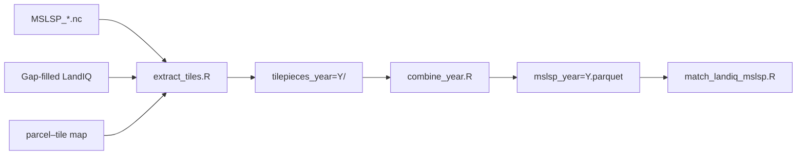

# MSLSP parcel extraction

Extract the **Multi-Source Land Surface Phenology (MSLSP)** product to the LandIQ
parcel level for California. For each agricultural parcel and year, summarize
phenological timing (green-up / senescence DOY) and EVI metrics from pre-computed
per-tile NetCDF files, area-weighted within the parcel.

MSLSP is **annual**: one output Parquet per year, with up to two phenological
**cycles** per parcel (cycle 1 = dominant amplitude, cycle 2 = secondary).

- **Input:** `MSLSP_<tile>_<year>.nc` per MGRS tile, gap-filled LandIQ, parcel–tile map.
- **Output:** `$CCMMF_MANAGEMENT/phenology/raw_mslsp_v4.1.2/year=Y/mslsp_year=Y.parquet`.

This package mirrors the [`landiq-gapfill/`](../landiq-gapfill/README.md) layout:
a bash orchestrator, atomic R scripts per step, shared `_lib/`, and SGE wrappers.



**Pipeline order** (harmonize → gap-fill → HLS download → this step):
[`documentation/pipeline.md`](../documentation/pipeline.md). NDTI sibling:
[`ndti-extract/README.md`](../ndti-extract/README.md).

---

## Package layout

```
mslsp-extract/
├── run_mslsp.sh              orchestrator (extract + combine per year)
├── run_mslsp_submit_tiles.sh prep + SGE tile array + held combine
├── README.md
├── scripts/
│   ├── prep_static.R         per-year prep cache + sge_tiles.txt
│   ├── extract_tiles.R       NetCDF → tilepieces (all tiles or one tile)
│   ├── extract_tiles_sge.R   SGE array entry (one tile via SGE_TASK_ID)
│   ├── combine_year.R        tilepieces → Parquet
│   └── _lib/
│       ├── tilewise_mslsp_implementation.R
│       ├── mslsp_combine.R
│       └── mslsp_run.R
├── sge/
│   ├── run_mslsp.sge         one job/year, serial tiles (legacy/simple)
│   ├── run_mslsp_tiles.sge   array: one tile per task
│   └── run_mslsp_combine.sge combine after array completes
└── (shared tilewise framework in scripts/hls/_lib/)
```

---

## Before you run

| Prerequisite | Source |
|--------------|--------|
| MSLSP NetCDF per tile | [HLS_Phenology](https://github.com/mrinareddy/HLS_Phenology) → `$CCMMF_ROOT/data_phen/output/` |
| Gap-filled LandIQ | `CCMMF_LANDIQ_V4` → [landiq-gapfill](../landiq-gapfill/README.md) product |
| Parcel–tile map | `hls_parcel_tile_map_v4.1.rds` — build once with [`scripts/hls/build_hls_parcel_tile_map.R`](../scripts/hls/build_hls_parcel_tile_map.R) |

---

## Run a year

### Step 1 — Environment

```bash
export CCMMF_ROOT=/projectnb/dietzelab/ccmmf
export CCMMF_MANAGEMENT=$CCMMF_ROOT/management
export MSLSP_EXTRACT_ROOT=$CCMMF_MANAGEMENT/mslsp-extract
export CCMMF_LANDIQ_V4=$CCMMF_ROOT/LandIQ-harmonized-v4.1.2

export mslsp_new_base=$CCMMF_ROOT/data_phen/output
export mslsp_legacy_dir=$CCMMF_ROOT/HLS_data
export HLS_PARCEL_TILEMAP=$CCMMF_MANAGEMENT/hls_parcel_tile_map_v4.1.rds
export mslsp_parcel_tilemap=$HLS_PARCEL_TILEMAP
export MSLSP_TILE_LIST=$CCMMF_ROOT/data_phen/tileLists/tileids.txt
```

### Step 2 — Orchestrator (recommended)

```bash
$MSLSP_EXTRACT_ROOT/run_mslsp.sh 2024
$MSLSP_EXTRACT_ROOT/run_mslsp.sh --overwrite 2023
```

Runs **extract** then **combine** per year. Use `--no-extract` or `--no-combine` to
run individual steps; `--prep-only` for static prep cache only.

**Prep cache** (written by `prep_static.R` or first extract/combine):

- `phenology/raw_mslsp_v4.1.2/year=Y/mslsp_prep_static_year=Y.rds` — ag parcel IDs per tile (no geometry)
- `phenology/raw_mslsp_v4.1.2/year=Y/sge_tiles.txt` — per-year SGE task list (see below)

**SGE tile array** uses [HLS_Phenology `tileids.txt`](https://github.com/mrinareddy/HLS_Phenology/blob/main/tileids.txt) as the canonical tile set, but **only tiles with ag parcels** for that year are scheduled. Prep writes `sge_tiles.txt` = `tileids.txt` ∩ tiles in the prep cache (same order as `tileids.txt`). Not every HLS tile has agricultural land in California. Tiles with ag parcels but missing NetCDF still run and write an empty tilepiece.

Single-tile local run:

```bash
$MSLSP_EXTRACT_ROOT/run_mslsp.sh --tile 10SDH --no-combine 2024
```

### Step 3 — Atomic scripts (optional)

```bash
Rscript $MSLSP_EXTRACT_ROOT/scripts/extract_tiles.R 2024
Rscript $MSLSP_EXTRACT_ROOT/scripts/combine_year.R 2024
Rscript $MSLSP_EXTRACT_ROOT/scripts/combine_year.R 2023 overwrite
```

### Step 4 — Cluster

**Parallel tiles (recommended for production):**

```bash
$MSLSP_EXTRACT_ROOT/run_mslsp_submit_tiles.sh 2024
$MSLSP_EXTRACT_ROOT/run_mslsp_submit_tiles.sh --overwrite 2023
```

This runs prep locally (writes `sge_tiles.txt`), submits one SGE task per tile with ag
parcels, then a combine job held on the array.

Manual tile array (after prep):

```bash
Rscript $MSLSP_EXTRACT_ROOT/scripts/prep_static.R 2024
N=$(grep -c . $CCMMF_MANAGEMENT/phenology/raw_mslsp_v4.1.2/year=2024/sge_tiles.txt)
qsub -t 1-$N -v 'MSLSP_YEAR=2024' $MSLSP_EXTRACT_ROOT/sge/run_mslsp_tiles.sge
qsub -hold_jid <array_job_id> -v 'MSLSP_ARGS=2024' $MSLSP_EXTRACT_ROOT/sge/run_mslsp_combine.sge
```

**Serial one job/year** (fine for smoke tests or small reruns):

```bash
qsub -v 'MSLSP_ARGS=2024' $MSLSP_EXTRACT_ROOT/sge/run_mslsp.sge
qsub -v 'MSLSP_ARGS=--overwrite 2023' $MSLSP_EXTRACT_ROOT/sge/run_mslsp.sge
```

### Step 5 — Verify

See [Verify the output](#verify-the-output). No automatic QC step yet.

---

## Requirements

On SCC, the orchestrator loads (override with `HLS_MODULES`):

```
gcc/12.2.0 gdal/3.11.5 geos/3.14.1 proj/9.7.1 netcdf/4.9.2 udunits/2.2.28 R/4.4.0
```

R packages: `sf`, `terra`, `data.table`, `stringr`, `arrow`, `exactextractr`, `dplyr`.

---

## Data model

- **One row per `parcel_id × year × cycle`.**
- **Cycles:** `cycle = 1` dominant; `cycle = 2` secondary.
- **Metrics** are area-weighted across overlapping pixels and tiles.
- **Quality:** `n_eff = w_valid² / sum_w2`; `na_frac` = fraction of parcel with no data.

---

## Backfill all years

Parallel tiles per year:

```bash
for y in 2016 2018 2019 2020 2021 2022; do
  $MSLSP_EXTRACT_ROOT/run_mslsp_submit_tiles.sh "$y"
done
$MSLSP_EXTRACT_ROOT/run_mslsp_submit_tiles.sh 2024
$MSLSP_EXTRACT_ROOT/run_mslsp_submit_tiles.sh --overwrite 2023
```

Or serial one job/year:

```bash
for y in 2016 2018 2019 2020 2021 2022; do
  qsub -v "MSLSP_ARGS=$y" $MSLSP_EXTRACT_ROOT/sge/run_mslsp.sge
done
qsub -v 'MSLSP_ARGS=2024' $MSLSP_EXTRACT_ROOT/sge/run_mslsp.sge
qsub -v 'MSLSP_ARGS=--overwrite 2023' $MSLSP_EXTRACT_ROOT/sge/run_mslsp.sge
```

---

## Verify the output

```r
library(arrow); library(dplyr)
ds <- open_dataset(file.path(Sys.getenv("CCMMF_MANAGEMENT"),
                             "phenology/raw_mslsp_v4.1.2"))
ds |> filter(year == 2024) |> count(cycle) |> collect()
```

Per-tile timing: `phenology/raw_mslsp_v4.1.2/year=2024/tilepieces_year=2024/_tile_timing.csv`.

---

## Output schema

| Column | Description |
|--------|-------------|
| `parcel_id`, `year`, `cycle` | Keys |
| `n_valid`, `w_valid`, `sum_w2`, `na_frac` | Coverage / quality |
| `OGI_mean/sd` … `OGMn_mean/sd` | Phenology DOY metrics |
| `EVImax_mean/sd`, `EVIamp_mean/sd`, `EVIarea_mean/sd` | EVI metrics |
| `gupQA_mode/mode_frac`, `gdownQA_mode/mode_frac` | QA flags |
| `NumCycles_mode/mode_frac`, `numObs_mean/sd` | Cycle count / observations |

---

## Troubleshooting

| Symptom | Fix |
|---------|-----|
| `undefined symbol: curl_multi_poll` | Set `LD_PRELOAD` via orchestrator (`HLS_LIBCURL_PRELOAD`) |
| Parcel–tile map missing | `Rscript scripts/hls/build_hls_parcel_tile_map.R overwrite` |
| No ag parcels for year | Check gap-filled `crops_all_years.parq` |
| `empty_no_scenes` | Missing NetCDF under `mslsp_new_base` / `mslsp_legacy_dir` |
| `EVImax_mean` ≈ thousands | Re-run with `--overwrite` (2020+ EVI rescale) |

---

## Special cases

- **NetCDF lookup:** `mslsp_legacy_dir` then `mslsp_new_base`.
- **Smoke test:** `TILEWISE_ONE_TILE=10SDH ./run_mslsp.sh 2024` or `./run_mslsp.sh --tile 10SDH --no-combine 2024`

---

## Reference

| Path | Contents |
|------|----------|
| `phenology/raw_mslsp_v4.1.2/year=Y/mslsp_year=Y.parquet` | Final output |
| `.../mslsp_prep_static_year=Y.rds` | Per-year prep cache |
| `.../sge_tiles.txt` | SGE array task list (tileids ∩ ag parcels) |
| `.../tilepieces_year=Y/` | Per-tile CSV.gz intermediates |
| `.../logs/` | R logs |
| `phenology/raw_mslsp_v4.1.2/sge_logs/` | SGE stdout/stderr |

- Orchestrator: `./run_mslsp.sh --help`
- Downstream: [`scripts/phenology/match/README.md`](../scripts/phenology/match/README.md)
- Training: [`documentation/sessions/02-phenology.md`](../documentation/sessions/02-phenology.md)
