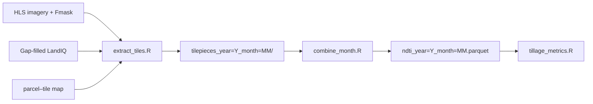

# NDTI parcel extraction

Extract the **Normalized Difference Tillage Index (NDTI)** to the LandIQ parcel
level for California. For each agricultural parcel it computes an area-weighted
NDTI per HLS scene from raw reflectance bands, masked with Fmask.

NDTI is **monthly**: one output Parquet per (year, month), with one row per parcel
per HLS scene date.

- **HLSL (Landsat):** `(B06 − B07) / (B06 + B07)`
- **HLSS (Sentinel-2):** `(B11 − B12) / (B11 + B12)`
- Cloud / shadow / snow masked via Fmask (bits 1, 3, 4).

- **Input:** HLS reflectance + Fmask per scene, gap-filled LandIQ, parcel–tile map.
- **Output:** `$CCMMF_MANAGEMENT/tillage/ndti_v4.1/year=Y/ndti_year=Y_month=MM.parquet`.

This package mirrors the [`landiq-gapfill/`](../landiq-gapfill/README.md) and
[`mslsp-extract/`](../mslsp-extract/README.md) layout: a bash orchestrator, atomic
R scripts per step, shared `_lib/`, and SGE wrappers.



**Pipeline order** (harmonize → gap-fill → HLS download → this step):
[`documentation/pipeline.md`](../documentation/pipeline.md). MSLSP sibling:
[`mslsp-extract/README.md`](../mslsp-extract/README.md).

---

## Package layout

```
ndti-extract/
├── run_ndti.sh              orchestrator (extract + combine per year × month)
├── README.md
├── scripts/
│   ├── prep_static.R         one-time / debug: static prep cache only
│   ├── extract_tiles.R       HLS scenes → tilepieces (one month)
│   ├── combine_month.R       tilepieces → monthly Parquet
│   └── _lib/
│       ├── tilewise_ndti_implementation.R
│       ├── ndti_combine.R
│       └── ndti_run.R
├── sge/run_ndti.sge         12-task month array
└── (shared tilewise framework in scripts/hls/_lib/)
```

---

## Before you run

| Prerequisite | Source |
|--------------|--------|
| HLS reflectance + Fmask | [HLS_Phenology](https://github.com/mrinareddy/HLS_Phenology) → `$CCMMF_ROOT/data_phen/HLS_data_sort/HLS30/` |
| Gap-filled LandIQ | `CCMMF_LANDIQ_V4` → [landiq-gapfill](../landiq-gapfill/README.md) product |
| Parcel–tile map | `hls_parcel_tile_map_v4.1.rds` — build once with [`scripts/hls/build_hls_parcel_tile_map.R`](../scripts/hls/build_hls_parcel_tile_map.R) |

Imagery layout: `$CCMMF_ROOT/data_phen/HLS_data_sort/HLS30/<tile>/images/<scene>/`
with B06/B07 or B11/B12 + Fmask per scene. Set `HLS_IMAGERY_ROOT` to that tree.

---

## Run a year

### Step 1 — Environment

```bash
export CCMMF_ROOT=/projectnb/dietzelab/ccmmf
export CCMMF_MANAGEMENT=$CCMMF_ROOT/management
export NDTI_EXTRACT_ROOT=$CCMMF_MANAGEMENT/ndti-extract
export CCMMF_LANDIQ_V4=$CCMMF_ROOT/LandIQ-harmonized-v4.1.2

export HLS_IMAGERY_ROOT=$CCMMF_ROOT/data_phen/HLS_data_sort/HLS30
export HLS_PARCEL_TILEMAP=$CCMMF_MANAGEMENT/hls_parcel_tile_map_v4.1.rds
export NDTI_PARCEL_TILEMAP=$HLS_PARCEL_TILEMAP
```

### Step 2 — Orchestrator (recommended)

```bash
$NDTI_EXTRACT_ROOT/run_ndti.sh 2024
$NDTI_EXTRACT_ROOT/run_ndti.sh --overwrite 2023
$NDTI_EXTRACT_ROOT/run_ndti.sh --months 1-6 2024
```

Runs **extract** then **combine** per month. Use `--no-extract` or `--no-combine` to
run individual steps; `--prep-only` for static prep cache only.

### Step 3 — Atomic scripts (optional)

```bash
Rscript $NDTI_EXTRACT_ROOT/scripts/extract_tiles.R 2024 3
Rscript $NDTI_EXTRACT_ROOT/scripts/combine_month.R 2024 3
Rscript $NDTI_EXTRACT_ROOT/scripts/combine_month.R 2023 6 overwrite
```

### Step 4 — Cluster (recommended)

12-task array — one month per task:

```bash
qsub -v 'NDTI_ARGS=2024' $NDTI_EXTRACT_ROOT/sge/run_ndti.sge
qsub -v 'NDTI_ARGS=--overwrite 2023' $NDTI_EXTRACT_ROOT/sge/run_ndti.sge
qsub -t 3 -v 'NDTI_ARGS=2024' $NDTI_EXTRACT_ROOT/sge/run_ndti.sge
```

Do not put `--months` in `NDTI_ARGS`; the array task id selects the month.

### Step 5 — Verify

See [Verify the output](#verify-the-output). No automatic QC step yet.

---

## Requirements

On SCC, the orchestrator loads (override with `HLS_MODULES`):

```
gcc/12.2.0 gdal/3.11.5 geos/3.14.1 proj/9.7.1 netcdf/4.9.2 udunits/2.2.28 R/4.4.0
```

R packages: `sf`, `terra`, `data.table`, `stringr`, `arrow`, `dplyr`, `exactextractr`.
`NDTI_TERRA_THREADS` controls terra threads (default 8; SGE sets 4).

---

## Data model

- **One row per `parcel_id × scene date`.** Each monthly Parquet holds every HLS scene
  in that month.
- **Hive-partitioned dataset:** `open_dataset(".../tillage/ndti_v4.1")`.
- **Area-weighted** over unmasked pixels, aggregated across tiles for boundary parcels.
- **Quality:** `n_eff = w_valid² / sum_w2`; `na_frac` is masked fraction.

---

## Backfill all years

```bash
for y in 2016 2018 2019 2020 2021 2022; do
  qsub -v "NDTI_ARGS=$y" $NDTI_EXTRACT_ROOT/sge/run_ndti.sge
done
qsub -v 'NDTI_ARGS=2024' $NDTI_EXTRACT_ROOT/sge/run_ndti.sge
qsub -v 'NDTI_ARGS=--overwrite 2023' $NDTI_EXTRACT_ROOT/sge/run_ndti.sge
```

---

## Verify the output

```r
library(arrow); library(dplyr); library(lubridate)
ds <- open_dataset(file.path(Sys.getenv("CCMMF_MANAGEMENT"), "tillage/ndti_v4.1"))

ds |> mutate(month = month(date)) |> count(year, month) |>
  collect() |> arrange(year, month) |> print(n = 60)

ds |> filter(year == 2024, month(date) == 3) |>
  summarize(n = n(),
            ndti_med = median(ndti_mean, na.rm = TRUE),
            na_med   = median(na_frac, na.rm = TRUE)) |>
  collect()
```

Per-tile timing: `.../year=2024/tilepieces_year=2024_month=03/_tile_timing.csv`.

---

## Output schema

| Column | Description |
|--------|-------------|
| `parcel_id` | LandIQ parcel identifier |
| `year` | Calendar year |
| `date` | Exact HLS scene acquisition date |
| `ndti_mean` | Area-weighted mean NDTI |
| `ndti_sd` | Area-weighted standard deviation |
| `n_valid` | Unmasked pixels contributing |
| `w_valid` | Sum of pixel coverage fractions |
| `sum_w2` | Sum of squared coverage fractions; `n_eff = w_valid² / sum_w2` |
| `na_frac` | Fraction of parcel area masked — quality flag |

---

## Troubleshooting

| Symptom | Fix |
|---------|-----|
| `undefined symbol: curl_multi_poll` | Set `LD_PRELOAD` via orchestrator (`HLS_LIBCURL_PRELOAD`) |
| Parcel–tile map missing | `Rscript scripts/hls/build_hls_parcel_tile_map.R overwrite` |
| `no scenes for year=Y time_key=M` | Imagery missing under `$HLS_IMAGERY_ROOT` |
| Monthly Parquet is empty | Whole month cloud-covered (`ndti_mean` NA → rows dropped) |
| Rerunning existing output | Pass `--overwrite` |
| Stale prep cache | `run_ndti.sh --prep-only 2024` |

---

## Special cases

- **No-LandIQ year (2017).** Requires gap-filled product and parcel–tile map with
  `year=2017` rows. See
  [landiq-gapfill](../landiq-gapfill/README.md#special-case-no-landiq-year-2017).
- **Fmask masking.** Cloud (bit 1), shadow (bit 3), snow (bit 4).
- **Smoke test:** `TILEWISE_ONE_TILE=10SDH ./run_ndti.sh --months 3 2024`

---

## Reference

| Path | Contents |
|------|----------|
| `tillage/ndti_v4.1/year=Y/ndti_year=Y_month=MM.parquet` | Final monthly output |
| `.../tilepieces_year=Y_month=MM/` | Per-tile intermediates + `_tile_timing.csv` |
| `.../ndti_prep_static_year=Y.rds` | Cached per-year prep |
| `.../logs/` | R logs |
| `tillage/ndti_v4.1/sge_logs/` | SGE stdout/stderr |

- Orchestrator: `./run_ndti.sh --help`
- Downstream: [`scripts/tillage/README.md`](../scripts/tillage/README.md)
- Training: [`documentation/sessions/03-tillage-fertilizer.md`](../documentation/sessions/03-tillage-fertilizer.md)
