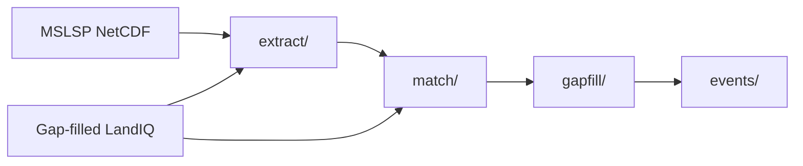

# Phenology

Part of Session 2 (HLS events): extract MSLSP onto parcels, match LandIQ seasons
to MSLSP cycles, then gap-fill planting/harvest dates (required before events).



| Step | Doc | Orchestrator |
|------|-----|--------------|
| MSLSP parcel extract | [extract/README.md](extract/README.md) | `./run_mslsp.sh YEAR` |
| LandIQ <-> MSLSP match | [match/README.md](match/README.md) | `./match_landiq_mslsp.sh YEAR` |
| Date gap-fill (required) | [gapfill/README.md](gapfill/README.md) | `./run_phenology_date_gapfill.sh Y1 Y2` |
| Statewide events | [../events/README.md](../events/README.md) | `$EVENTS_ROOT/make_events_statewide.sh YEAR` |

Pipeline map: [tree README](../README.md).
Session 2 walkthrough: [documentation/sessions/02-phenology.md](../documentation/sessions/02-phenology.md).
Shared HLS helpers / parcel-tile map: [../hls/README.md](../hls/README.md).

## Layout

```
phenology/
  README.md
  run_mslsp.sh
  match_landiq_mslsp.sh
  run_phenology_date_gapfill.sh
  extract/          # MSLSP NetCDF -> parcel parquet
  match/            # assigned_year=Y.parquet
  gapfill/          # gapfill_dates overlays (required)
```

## Run (typical year pair)

```bash
source "$CCMMF_CODE/documentation/setup_env.sh"

$PHENOLOGY_ROOT/run_mslsp.sh $YEAR
$PHENOLOGY_ROOT/match_landiq_mslsp.sh $YEAR
$PHENOLOGY_ROOT/run_phenology_date_gapfill.sh $PRIOR_YEAR $TARGET_YEAR
$EVENTS_ROOT/make_events_statewide.sh $YEAR
```

`PHENOLOGY_ROOT` defaults to `$CCMMF_CODE/phenology`.
