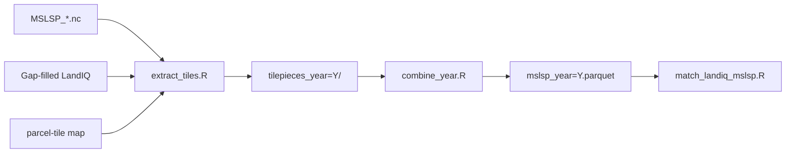

# MSLSP parcel extraction

Extract the **Multi-Source Land Surface Phenology (MSLSP)** product to the LandIQ
parcel level for California.

**What MSLSP is:** an annual, tile-level phenology product built from
**Harmonized Landsat Sentinel-2 (HLS)** surface reflectance. For each HLS tile and
calendar year it stores green-up / senescence timing (day-of-year) and Enhanced
Vegetation Index (EVI) metrics in NetCDF. CCMMF does **not** re-run that tile
algorithm here; this component only area-weights those metrics onto agricultural
parcels.

For each ag parcel and year, write up to two phenological **cycles** (cycle 1 =
dominant amplitude, cycle 2 = secondary). Those parcel metrics feed matching,
then planting / harvest / phenology event files (see
[pipeline.md](../../documentation/pipeline.md)).

- **Input:** `MSLSP_<tile>_<year>.nc` per MGRS tile, gap-filled LandIQ, parcel-tile map.
- **Output:** `$CCMMF_MANAGEMENT/phenology/raw_mslsp_v4.1.2/year=Y/mslsp_year=Y.parquet`.



Parent index: [../README.md](../README.md).
Pipeline order: [documentation/pipeline.md](../../documentation/pipeline.md).
Shared helpers / parcel-tile map: [hls/README.md](../../hls/README.md).
NDTI sibling: [tillage/extract/README.md](../../tillage/extract/README.md).
Downstream match: [match/README.md](../match/README.md).
Orchestrator: [`../run_mslsp.sh`](../run_mslsp.sh).

---

## Component layout

```
phenology/extract/
+-- README.md
+-- data/
+-- scripts/
|   +-- prep_static.R         per-year prep cache + tiles_to_run.txt
|   +-- extract_tiles.R       NetCDF -> tilepieces (all tiles or one tile)
|   +-- extract_tiles_task.R  optional: one tile via TASK_ID -> tiles list
|   +-- combine_year.R        tilepieces -> Parquet
|   +-- R/
|       +-- tilewise_mslsp_implementation.R
|       +-- mslsp_combine.R
|       +-- mslsp_run.R
+-- (shared tilewise framework in hls/R/)
```

---

## Before you run

| Prerequisite | Source |
|--------------|--------|
| MSLSP NetCDF per tile | [HLS_Phenology](https://github.com/mrinareddy/HLS_Phenology) -> `$CCMMF_ROOT/data_phen/output/` |
| Gap-filled LandIQ | `CCMMF_LANDIQ_V4` -> [landiq-gapfill](../../landiq-gapfill/README.md) product |
| Parcel-tile map | `hls_parcel_tile_map_v4.1.rds` - build once; see [hls/README.md](../../hls/README.md) |

---

## Run a year

### Step 1 - Environment

`source` your `setup_env.sh` (Session 0), or set:

```bash
export CCMMF_ROOT="${CCMMF_ROOT:-$HOME/ccmmf}"
export CCMMF_MANAGEMENT="${CCMMF_MANAGEMENT:-$CCMMF_ROOT/management}"
export PHENOLOGY_ROOT="${PHENOLOGY_ROOT:-$CCMMF_CODE/phenology}"
export CCMMF_LANDIQ_V4="$CCMMF_ROOT/LandIQ-harmonized-v4.1.2"

export mslsp_new_base=$CCMMF_ROOT/data_phen/output
export mslsp_legacy_dir=$CCMMF_ROOT/HLS_data
export HLS_PARCEL_TILEMAP=$CCMMF_MANAGEMENT/hls_parcel_tile_map_v4.1.rds
export mslsp_parcel_tilemap=$HLS_PARCEL_TILEMAP
export MSLSP_TILE_LIST=$CCMMF_ROOT/data_phen/tileLists/tileids.txt
```

### Step 2 - Orchestrator (recommended)

Why: one command runs prep (if needed), extract across tiles, then combine into
the year Parquet.

```bash
$PHENOLOGY_ROOT/run_mslsp.sh 2024
$PHENOLOGY_ROOT/run_mslsp.sh --overwrite 2023
```

Flags: `--no-extract` / `--no-combine` for individual steps; `--prep-only` for
the static prep cache only.

**Prep cache** (written by `prep_static.R` or first extract/combine):

- `phenology/raw_mslsp_v4.1.2/year=Y/mslsp_prep_static_year=Y.rds` - ag parcel IDs per tile
- `phenology/raw_mslsp_v4.1.2/year=Y/tiles_to_run.txt` - tiles with ag parcels for that year
  (`tileids.txt` intersect prep cache)

Not every HLS tile has agricultural land in California. Tiles with ag parcels but
missing NetCDF still run and write an empty tilepiece.

Single-tile local run:

```bash
$PHENOLOGY_ROOT/run_mslsp.sh --tile 10SDH --no-combine 2024
```

### Step 3 - Atomic scripts (optional)

```bash
Rscript $PHENOLOGY_ROOT/extract/scripts/extract_tiles.R 2024
Rscript $PHENOLOGY_ROOT/extract/scripts/combine_year.R 2024
Rscript $PHENOLOGY_ROOT/extract/scripts/combine_year.R 2023 overwrite
```

### Step 4 - Parallel tiles (optional)

For production wall-clock, prep once, run one tile per process, then combine:

```bash
$PHENOLOGY_ROOT/run_mslsp.sh --prep-only 2024
# then for each tile in year=2024/tiles_to_run.txt:
$PHENOLOGY_ROOT/run_mslsp.sh --tile 10SDH --no-combine 2024
# after all tiles finish:
$PHENOLOGY_ROOT/run_mslsp.sh --no-extract 2024
```

`run_mslsp.sh --task-tile` adapts array jobs that set `TASK_ID` to a 1-based line
in `tiles_to_run.txt`. Prefer `--tile` for portable runs.

### Step 5 - Verify

See [Verify the output](#verify-the-output). No automatic QC step yet.

---

## Requirements

R packages: `sf`, `terra`, `data.table`, `stringr`, `arrow`, `exactextractr`, `dplyr`.
On sites that use environment modules, the orchestrator may load GDAL/NetCDF/R via
`HLS_MODULES` (override as needed).

---

## Data model

- **One row per `parcel_id x year x cycle`.**
- **Cycles:** `cycle = 1` dominant; `cycle = 2` secondary.
- **Metrics** are area-weighted across overlapping pixels and tiles.
- **Quality:** `n_eff = w_valid^2 / sum_w2`; `na_frac` = fraction of parcel with no data.

---

## Backfill all years

```bash
for y in 2016 2018 2019 2020 2021 2022 2024; do
  $PHENOLOGY_ROOT/run_mslsp.sh "$y"
done
$PHENOLOGY_ROOT/run_mslsp.sh --overwrite 2023
```

---

## Verify the output

```r
library(arrow); library(dplyr)
ds <- open_dataset(file.path(Sys.getenv("CCMMF_MANAGEMENT"),
                             "phenology/raw_mslsp_v4.1.2"))
ds |> filter(year == 2024) |> count(cycle) |> collect()
```

Per-tile timing: `phenology/raw_mslsp_v4.1.2/year=2024/tilepieces_year=2024/_tile_timing.csv`.

---

## Output schema

See [data/mslsp_year_metadata.csv](data/mslsp_year_metadata.csv) (column dictionary).
Summary: keys `parcel_id`, `year`, `cycle`; coverage `n_valid` / `w_valid` / `na_frac`;
phenology and EVI `*_mean`/`*_sd`; QA `*_mode`/`*_mode_frac`.

---

## Special cases

- **NetCDF lookup:** `mslsp_legacy_dir` then `mslsp_new_base`.
- **Smoke test:** `TILEWISE_ONE_TILE=10SDH $PHENOLOGY_ROOT/run_mslsp.sh 2024` or `$PHENOLOGY_ROOT/run_mslsp.sh --tile 10SDH --no-combine 2024`

---

## Reference

| Path | Contents |
|------|----------|
| `phenology/raw_mslsp_v4.1.2/year=Y/mslsp_year=Y.parquet` | Final output |
| `.../mslsp_prep_static_year=Y.rds` | Per-year prep cache |
| `.../tiles_to_run.txt` | Tile list for year (tileids intersect ag parcels) |
| `.../tilepieces_year=Y/` | Per-tile CSV.gz intermediates |
| `.../logs/` | R logs |

- Orchestrator: [`../run_mslsp.sh`](../run_mslsp.sh) (`--help`)
- Downstream: [match/README.md](../match/README.md)
- Training: [documentation/sessions/02-phenology.md](../../documentation/sessions/02-phenology.md)
