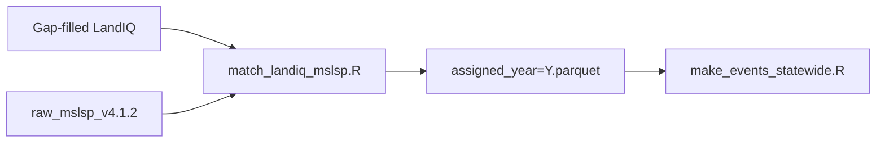

# Match LandIQ seasons to MSLSP cycles

Assign each LandIQ **parcel x year x season** row to a **Multi-Source Land
Surface Phenology (MSLSP)** phenological **cycle**, or mark it unmatched.
Matched rows carry MSLSP timing columns (`mslsp_OGI`, `mslsp_Peak`,
`mslsp_50PCGD`, and related day-of-year fields) used downstream for planting,
harvest, and phenology events.

- **Input:** gap-filled LandIQ (`crops_all_years.parq`), raw MSLSP parquet for the year.
- **Output:** `$MANAGEMENT/phenology/matched_landiq_mslsp_v4.1.2/assigned_year=Y.parquet`.



Pipeline map: [documentation/pipeline.md](../../documentation/pipeline.md).
MSLSP extract: [extract/README.md](../extract/README.md).
Parent index: [phenology/README.md](../README.md).
Events: [events/README.md](../../events/README.md).

## Before you run

| Prerequisite | Source |
|--------------|--------|
| Gap-filled LandIQ | `LANDIQ_GAPFILLED` -> [landiq-gapfill](../../landiq-gapfill/README.md) product |
| Raw MSLSP for the year | [extract/README.md](../extract/README.md) -> `phenology/raw_mslsp_v4.1.2/` |
| Crop code lookup | `$MANAGEMENT/LandIQ_cropCode_lookup_table.csv` |

Only agricultural parcels (`is_agricultural == TRUE` in the lookup) are included.
The matcher uses a **left join**: every ag parcel-year in LandIQ is written to
`assigned_year=Y.parquet`. Parcel-years with no combined MSLSP row get
`assigned_by == "no_mslsp"`. Without a gap-fill overlay, event builders keep only
`"matched"` rows; with a gap-filled overlay present, planting/harvest intake can
also include `"no_mslsp"` / `"no_match"` rows that received filled dates (see
[events/README.md](../../events/README.md)).

## Run a year

### Step 1 - Environment

```bash
source "$CCMMF_CODE/documentation/setup_env.sh"
```

### Step 2 - Match

Why: link LandIQ crop seasons to satellite cycles so event builders can use MSLSP
dates (onset of greenness, peak, senescence) on the correct season.

```bash
$CCMMF_CODE/phenology/match_landiq_mslsp.sh 2024
$CCMMF_CODE/phenology/match_landiq_mslsp.sh 2023   # rerun after gap-fill
```

Or call R directly:

```bash
Rscript -e "YEAR <- 2024; source('$CCMMF_CODE/phenology/match/match_landiq_mslsp.R')"
```

### Step 3 - Verify

See [Verify the output](#verify-the-output). Optional QC report: [QC report](#qc-report).

## Requirements

R packages: `data.table`, `arrow`, `dplyr`, `lubridate`.

## Matching logic (summary)

Rule-based assignment (no cost matrix):

1. **Primary:** LandIQ **ADOY** (adjusted day-of-year of peak greenness) inside
   the MSLSP cycle window `[OGI, OGMn]` (onset of greenness to onset of minimum).
2. **Tie-break:** nearest `Peak` to `ADOY`, then prefer cycle 1 over cycle 2.
3. **Season priority:** season 2 (main crop) first when `CLASS` is present; season 1
   prioritized for `MULTIUSE` D/M; then seasons 3/4.

Rows with a successful assignment have `assigned_by == "matched"`. Event generation
defaults to those rows; when `$MANAGEMENT/phenology/.../gapfill_dates/`
overlays exist, `load_matched_for_events()` also admits `"no_mslsp"` / `"no_match"`
candidates so filled planting/harvest dates can flow into builders.

ADOY is peak greenness timing (adjusted day of year), not emergence or senescence.

## Data model: how to read the output

- **One row per `parcel_id x year x season`.** Long format; multiple seasons per parcel-year.
- **Matched rows** include `mslsp_*` date/DOY columns and EVI metrics from the assigned cycle.
- **QC columns** (`qc_adoy_vs_cycle`, `qc_heterogeneity`, `match_outcome`) describe quality;
  they do not automatically exclude rows from events.
- **`year`** in the filename is the LandIQ assignment year; phenology event `year` uses
  peak calendar year (can differ for cross-year cycles).

## Verify the output

```r
library(arrow); library(dplyr)
p <- file.path(Sys.getenv("MANAGEMENT"), "phenology/matched_landiq_mslsp_v4.1.2",
               "assigned_year=2024.parquet")
assigned <- read_parquet(p)

assigned |> count(assigned_by, match_outcome) |> arrange(desc(n))
assigned |> filter(assigned_by == "matched") |>
  summarize(n = n(), peak_ok = mean(!is.na(mslsp_Peak)))
```

Event-ready subset:

```r
matched <- assigned |> filter(assigned_by == "matched")
```

## Output schema

See [data/assigned_year_metadata.csv](data/assigned_year_metadata.csv) (column dictionary).
Key fields: `assigned_by`, `landiq_*`, `mslsp_*` dates/EVI, `qc_*`, `match_outcome`.

## Reference

| Path | Contents |
|------|----------|
| `phenology/matched_landiq_mslsp_v4.1.2/assigned_year=Y.parquet` | Assignment output |
| `phenology/matched_landiq_mslsp_v4.1.2/qc_summary_year=Y.csv` | Per-year QC counts |

- Scripts: `../match_landiq_mslsp.sh`, `match_landiq_mslsp.R`
- Upstream: [extract/README.md](../extract/README.md)
- Downstream: [events/README.md](../../events/README.md), [traits/README.md](../../traits/README.md)
- Training: [documentation/sessions/02-phenology.md](../../documentation/sessions/02-phenology.md)
