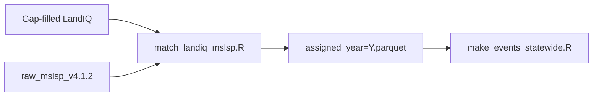

# Match LandIQ seasons to MSLSP cycles

This step assigns each LandIQ **parcel × year × season** row to an MSLSP phenological
**cycle** (or marks it unmatched). Matched rows carry MSLSP timing columns (`mslsp_OGI`,
`mslsp_Peak`, `mslsp_50PCGD`, etc.) used downstream for phenology, planting, harvest,
and tillage events.

- **Input:** gap-filled LandIQ (`crops_all_years.parq`), raw MSLSP parquet for the year.
- **Output:** `$CCMMF_MANAGEMENT/phenology/matched_landiq_mslsp_v4.1.2/assigned_year=Y.parquet`.



Pipeline steps 1–5: [`../../hls/README.md`](../../hls/README.md). Events:
[`../../events/README.md`](../../events/README.md).

## Before you run

| Prerequisite | Source |
|--------------|--------|
| Gap-filled LandIQ | `CCMMF_LANDIQ_V4` → gap-filled product ([landiq-gapfill](../../../landiq-gapfill/README.md)) |
| Raw MSLSP for the year | [`../../mslsp-extract/README.md`](../../mslsp-extract/README.md) → `phenology/raw_mslsp_v4.1.2/` |
| Crop code lookup | `$CCMMF_MANAGEMENT/LandIQ_cropCode_lookup_table.csv` |

Only agricultural parcels (`is_agricultural == TRUE` in the lookup) are included.
The matcher uses a **left join**: every ag parcel-year in LandIQ is written to
`assigned_year=Y.parquet`. Parcel-years with no combined MSLSP row get
`assigned_by == "no_mslsp"` (events still use only `"matched"` rows).

## Run a year

### Step 1 — Environment

```bash
export CCMMF_ROOT=/projectnb/dietzelab/ccmmf
export CCMMF_MANAGEMENT=$CCMMF_ROOT/management
export CCMMF_LANDIQ_V4=$CCMMF_ROOT/LandIQ-harmonized-v4.1.2   # gap-filled product
```

### Step 2 — Match

```bash
module load R/4.4.0
Rscript -e "YEAR <- 2024; source('$CCMMF_MANAGEMENT/scripts/phenology/match_landiq_mslsp.R')"
Rscript -e "YEAR <- 2023; source('$CCMMF_MANAGEMENT/scripts/phenology/match_landiq_mslsp.R')"  # rerun after gap-fill
```

### Step 3 — Cluster (recommended)

```bash
qsub -v YEAR=2024 $CCMMF_MANAGEMENT/scripts/phenology/match_landiq_mslsp.sge
qsub -v YEAR=2023 $CCMMF_MANAGEMENT/scripts/phenology/match_landiq_mslsp.sge
```

### Step 4 — Verify

See [Verify the output](#verify-the-output). Optional QC report: [§ QC report](#qc-report).

## Requirements

`module load R/4.4.0`. R packages: `data.table`, `arrow`, `dplyr`, `lubridate`.

## Matching logic (summary)

Rule-based assignment (no cost matrix):

1. **Primary:** LandIQ `ADOY` inside MSLSP cycle window `[OGI, OGMn]`.
2. **Tie-break:** nearest `Peak` to `ADOY`, then prefer cycle 1 over cycle 2.
3. **Season priority:** season 2 (main crop) first when `CLASS` is present; season 1
   prioritized for `MULTIUSE` D/M; then seasons 3/4.

Rows with a successful assignment have `assigned_by == "matched"`. Event generation
uses only those rows.

## Data model: how to read the output

- **One row per `parcel_id × year × season`.** Long format; multiple seasons per parcel-year.
- **Matched rows** include `mslsp_*` date/DOY columns and EVI metrics from the assigned cycle.
- **QC columns** (`qc_adoy_vs_cycle`, `qc_heterogeneity`, `match_outcome`) describe quality;
  they do not automatically exclude rows from events.
- **`year`** in the filename is the LandIQ assignment year; phenology event `year` uses
  peak calendar year (can differ for cross-year cycles).

## Verify the output

```r
library(arrow); library(dplyr)
p <- file.path(Sys.getenv("CCMMF_MANAGEMENT"), "phenology/matched_landiq_mslsp_v4.1.2",
               "assigned_year=2024.parquet")
assigned <- read_parquet(p)

assigned |> count(assigned_by, match_outcome) |> arrange(desc(n))
assigned |> filter(assigned_by == "matched") |>
  summarize(n = n(), peak_ok = mean(!is.na(mslsp_Peak))) 
```

Event-ready subset:

```r
matched <- assigned |> filter(assigned_by == "matched")
```

More filter examples: [`../qc_filter_examples.R`](../qc_filter_examples.R).

## QC report

Build a narrative report across all assigned years:

```bash
Rscript $CCMMF_MANAGEMENT/scripts/phenology/build_qc_report.R
```

Writes `QC_report_YYYYMMDD.md` and CSV tables under `qc_report_tables/`.

## Output schema (key columns)

| Column | Description |
|--------|-------------|
| `parcel_id`, `year`, `season` | LandIQ parcel-season key |
| `assigned_by` | `"matched"`, `"no_mslsp"` (LandIQ ag parcel, no MSLSP retrieval), or `"no_match"` |
| `landiq_CLASS`, `landiq_SUBCLASS`, `landiq_PFT`, `landiq_ADOY`, `landiq_SPECOND` | LandIQ crop for this season (`SPECOND=Y` young perennial) |
| `mslsp_cycle` | Assigned MSLSP cycle (1 = dominant amplitude) |
| `mslsp_OGI`, `mslsp_50PCGI`, `mslsp_Peak`, `mslsp_50PCGD`, `mslsp_OGMn`, … | Phenology dates (cross-year safe) |
| `mslsp_EVImax`, `mslsp_EVIamp` | Used by planting LAI (`traits/lai_from_mslsp.R`) |
| `qc_adoy_vs_cycle` | `adoy_inside_cycle` / `adoy_outside_cycle` |
| `qc_heterogeneity` | Masking quality from raw MSLSP (`low_na_frac` / …) |
| `match_outcome` | Shape of match (e.g. `mismatch_2cycles_1season`) |

## Troubleshooting

| Symptom | Cause / fix |
|---------|-------------|
| No rows for year | Raw MSLSP missing — run [mslsp-extract](../../mslsp-extract/README.md) first |
| All `mslsp_cycles_filtered_out` | High `na_frac` in raw MSLSP or no cycles for parcel |
| Gap-fill year (2017) | Point `CCMMF_LANDIQ_V4` at gap-filled product with that year |
| Rerun after gap-fill | Re-match prior year (e.g. 2023 after `2023,2024` gap-fill) |

## Reference

| Path | Contents |
|------|----------|
| `phenology/matched_landiq_mslsp_v4.1.2/assigned_year=Y.parquet` | Assignment output |
| `phenology/matched_landiq_mslsp_v4.1.2/qc_summary_year=Y.csv` | Per-year QC counts |
| `phenology/matched_landiq_mslsp_v4.1.2/sge_logs/` | SGE stdout/stderr |

- Script: `match_landiq_mslsp.R`, SGE: `match_landiq_mslsp.sge`
- Upstream: [`../../mslsp-extract/README.md`](../../mslsp-extract/README.md)
- Downstream: [`../../events/README.md`](../../events/README.md), [`../../traits/README.md`](../../traits/README.md)
