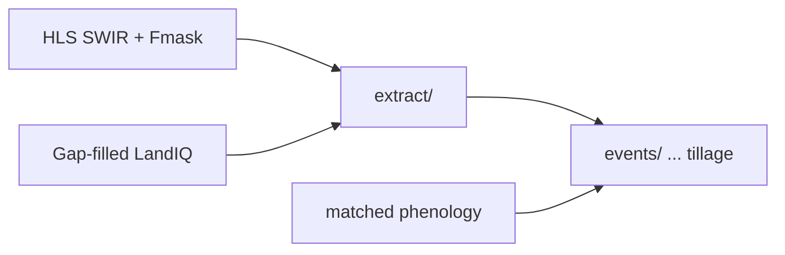

# Tillage

Session 3 track: extract NDTI onto parcels, then build tillage events from NDTI
in fallow windows (matched phenology from Session 2).



| Step | Doc | Orchestrator |
|------|-----|--------------|
| NDTI parcel extract | [extract/README.md](extract/README.md) | `./run_ndti.sh YEAR` |
| Tillage events | [../events/README.md](../events/README.md) | `$EVENTS_ROOT/make_events_statewide.sh YEAR tillage` |

Pipeline map: [documentation/pipeline.md](../documentation/pipeline.md).
Shared HLS helpers / parcel-tile map: [../hls/README.md](../hls/README.md).
Upstream match: [../phenology/match/README.md](../phenology/match/README.md).

## Layout

```
tillage/
  README.md
  run_ndti.sh
  extract/          # HLS -> monthly NDTI parquet
```

Tillage timing/intensity (`tillage_metrics.R`) and the statewide event runner live
in [events/](../events/) (same pattern as planting/harvest).

## Run

```bash
source "$CCMMF_CODE/documentation/setup_env.sh"

$TILLAGE_ROOT/run_ndti.sh $YEAR
$EVENTS_ROOT/make_events_statewide.sh $YEAR tillage
```

`TILLAGE_ROOT` defaults to `$CCMMF_CODE/tillage`.
