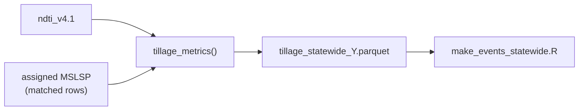

# Tillage metrics

Computes **per-fallow-window** tillage indicators from NDTI time series aligned to
matched MSLSP phenology. Each fallow window runs from one season's `OGMn` (senescence)
to the next season's `OGI` (green-up) on the same parcel — including cross-year gaps.

Production use is through [`make_events_statewide.R`](../events/make_events_statewide.R)
(`event_type=tillage`), which loads NDTI for a buffered year range and calls
`tillage_metrics()` in parcel chunks. This folder holds the core function and smoke tests.



Pipeline order: [`../hls/README.md`](../hls/README.md) (steps 1–5) →
[`../phenology/match/README.md`](../phenology/match/README.md) (step 6) →
[`../events/README.md`](../events/README.md) (step 9).

## Before you run

| Prerequisite | Source |
|--------------|--------|
| NDTI monthly parquet | [`../../ndti-extract/README.md`](../../ndti-extract/README.md) → `tillage/ndti_v4.1/` |
| Matched phenology | [`../phenology/match/README.md`](../phenology/match/README.md) → `assigned_by == "matched"` |
| PFT on NDTI rows | Joined from assigned table in `make_events_statewide.R` |

Tillage event generation reads NDTI for **`year ± TILLAGE_BUFFER_YEARS`** (default 1)
so cross-year fallow windows have scene coverage.

## Algorithm (summary)

1. Join NDTI scenes to phenology dates (`OGI_date`, `OGMn_date`) per parcel-year.
2. Build fallow periods: `fallow_start = OGMn`, `fallow_end = lead(OGI)` per parcel.
3. Smooth NDTI (4-day moving average), find minimum NDTI date in each fallow window.
4. Compute pre-minimum peak, percent change, neighbor-scene SD when min-day has no obs.

## Smoke test (one year, small sample)

```bash
module load R/4.4.0
Rscript $CCMMF_MANAGEMENT/scripts/tillage/smoke_tillage_metrics_year.R 2023 40
```

## Production run (via events)

Tillage is opt-in — heavier than phenology/planting/harvest:

```bash
module load R/4.4.0
Rscript $CCMMF_MANAGEMENT/scripts/events/make_events_statewide.R 2024 tillage

# Cluster
qsub -v YEAR=2024,EVENT_TYPE=tillage $CCMMF_MANAGEMENT/scripts/events/make_events_statewide.sge
```

Env vars (tillage only):

| Variable | Default | Role |
|----------|---------|------|
| `TILLAGE_BUFFER_YEARS` | `1` | NDTI + assigned years loaded around target year |
| `TILLAGE_PARCEL_CHUNK` | `3000` | Parcels per chunk in `make_events_statewide.R` |

## Output columns (`tillage_metrics` return value)

| Column | Description |
|--------|-------------|
| `parcel_id`, `year`, `PFT` | Parcel and reference year |
| `OGMn_date` | Fallow window start (prior season senescence) |
| `max_date`, `max_ndti` | Pre-minimum NDTI peak in fallow window |
| `min_date`, `min_ndti` | Minimum smoothed NDTI (tillage signal) |
| `ndti_pct_change` | Percent drop from pre-min peak to minimum |
| `min_n_valid`, `min_sd` | Observation count / SD at minimum (pooled from neighbors if needed) |
| `min_val_date_before/after` | Neighbor scene dates used for SD pooling |

Event output schema: [`../events/README.md`](../events/README.md).

## Reference

| Script | Purpose |
|--------|---------|
| `tillage_metrics.R` | Core function (`tillage_metrics(ndti_table, phenology_table)`) |
| `smoke_tillage_metrics_year.R` | Local smoke test on parcel sample |
| `tillage_histogram_timing_by_pft.R` | Diagnostic plots |

- Event driver: [`../events/make_events_statewide.R`](../events/make_events_statewide.R)
- NDTI upstream: [`../../ndti-extract/README.md`](../../ndti-extract/README.md)
