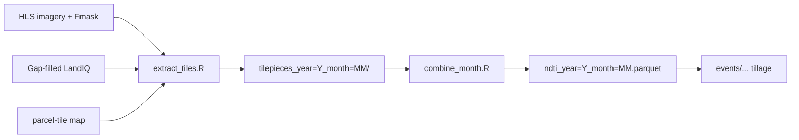

# NDTI parcel extraction

Extract the **Normalized Difference Tillage Index (NDTI)** to the LandIQ parcel
level for California. NDTI is a shortwave-infrared (SWIR) index from Harmonized
Landsat Sentinel-2 (HLS) reflectance. Lower values indicate less crop residue /
more exposed soil, which is the remote signal used later to infer tillage in
fallow windows ([events/README.md](../../events/README.md)).

For each agricultural parcel the extract computes an **area-weighted NDTI** per
HLS scene from raw SWIR bands, masked with Fmask.

NDTI products are **monthly**: one output Parquet per (year, month), with one row
per parcel per HLS scene date.

- **HLSL (Landsat):** `(B06 - B07) / (B06 + B07)`
- **HLSS (Sentinel-2):** `(B11 - B12) / (B11 + B12)`
- Cloud / shadow / snow masked via Fmask (bits 1, 3, 4).

- **Input:** HLS reflectance + Fmask per scene, gap-filled LandIQ, parcel-tile map.
- **Output:** `$CCMMF_MANAGEMENT/tillage/ndti_v4.1/year=Y/ndti_year=Y_month=MM.parquet`.

This component mirrors the [`landiq-gapfill/`](../../landiq-gapfill/README.md) and
[`phenology/extract/`](../../phenology/extract/README.md) layout: a bash orchestrator
(`run_ndti.sh`), atomic R scripts per step, and shared `R/`.



Parent index: [../README.md](../README.md).
Pipeline map: [documentation/pipeline.md](../../documentation/pipeline.md).
MSLSP sibling: [phenology/extract/README.md](../../phenology/extract/README.md).
Shared helpers / parcel-tile map: [hls/README.md](../../hls/README.md).
Downstream tillage events: [events/README.md](../../events/README.md).

---

## Component layout

```
tillage/extract/
+-- README.md
+-- data/
+-- scripts/
|   +-- prep_static.R         one-time / debug: static prep cache only
|   +-- extract_tiles.R       HLS scenes -> tilepieces (one month)
|   +-- combine_month.R       tilepieces -> monthly Parquet
|   +-- R/
|       +-- tilewise_ndti_implementation.R
|       +-- ndti_combine.R
|       +-- ndti_run.R
+-- (shared tilewise framework in hls/R/)
```

---

## Before you run

| Prerequisite | Source |
|--------------|--------|
| HLS reflectance + Fmask | [HLS_Phenology](https://github.com/mrinareddy/HLS_Phenology) -> `$CCMMF_ROOT/data_phen/HLS_data_sort/HLS30/` |
| Gap-filled LandIQ | `CCMMF_LANDIQ_V4` -> [landiq-gapfill](../../landiq-gapfill/README.md) product |
| Parcel-tile map | `hls_parcel_tile_map_v4.1.rds` - build once; see [hls/README.md](../../hls/README.md) |

Default imagery layout (`HLS_IMAGERY_LAYOUT=phenology`, set by `setup_env.sh`):

`$CCMMF_ROOT/data_phen/HLS_data_sort/HLS30/<tile>/images/<scene>/`

with B06/B07 or B11/B12 + Fmask per scene. Point `HLS_IMAGERY_ROOT` at that tree.
For older flat year directories, set `HLS_IMAGERY_LAYOUT=flat` (see Special cases).

---

## Run a year

### Step 1 - Environment

`source` your `setup_env.sh` (Session 0), or set:

```bash
export CCMMF_ROOT="${CCMMF_ROOT:-$HOME/ccmmf}"
export CCMMF_MANAGEMENT="${CCMMF_MANAGEMENT:-$CCMMF_ROOT/management}"
export TILLAGE_ROOT="${TILLAGE_ROOT:-$CCMMF_CODE/tillage}"
export CCMMF_LANDIQ_V4="$CCMMF_ROOT/LandIQ-harmonized-v4.1.2"

export HLS_IMAGERY_ROOT=$CCMMF_ROOT/data_phen/HLS_data_sort/HLS30
export HLS_PARCEL_TILEMAP=$CCMMF_MANAGEMENT/hls_parcel_tile_map_v4.1.rds
export NDTI_PARCEL_TILEMAP=$HLS_PARCEL_TILEMAP
```

### Step 2 - Orchestrator (recommended)

Why: one command runs extract then combine for every month; outputs land under
`$CCMMF_MANAGEMENT/tillage/ndti_v4.1/`.

```bash
$TILLAGE_ROOT/run_ndti.sh 2024
$TILLAGE_ROOT/run_ndti.sh --overwrite 2023
$TILLAGE_ROOT/run_ndti.sh --months 1-6 2024
```

Use `--no-extract` or `--no-combine` for individual steps; `--prep-only` for the
static prep cache only.

### Step 3 - Atomic scripts (optional)

```bash
Rscript $TILLAGE_ROOT/extract/scripts/extract_tiles.R 2024 3
Rscript $TILLAGE_ROOT/extract/scripts/combine_month.R 2024 3
Rscript $TILLAGE_ROOT/extract/scripts/combine_month.R 2023 6 overwrite
```

### Step 4 - Parallel months (optional)

Run months in parallel (separate terminals or your site's batch system):

```bash
for m in $(seq 1 12); do
  $TILLAGE_ROOT/run_ndti.sh --months "$m" 2024 &
done
wait
```

### Step 5 - Verify

See [Verify the output](#verify-the-output). No automatic QC step yet.

---

## Requirements

R packages: `sf`, `terra`, `data.table`, `stringr`, `arrow`, `dplyr`, `exactextractr`.
`NDTI_TERRA_THREADS` controls terra threads (default 8). On sites that use environment
modules, the orchestrator may load GDAL/NetCDF/R via `HLS_MODULES`.

---

## Data model

- **One row per `parcel_id x scene date`.** Each monthly Parquet holds every HLS scene
  in that month.
- **Hive-partitioned dataset:** `open_dataset(".../tillage/ndti_v4.1")` under
  `$CCMMF_MANAGEMENT`.
- **Area-weighted** over unmasked pixels, aggregated across tiles for boundary parcels.
- **Quality:** `n_eff = w_valid^2 / sum_w2`; `na_frac` is masked fraction.

---

## Backfill all years

```bash
for y in 2016 2018 2019 2020 2021 2022 2024; do
  $TILLAGE_ROOT/run_ndti.sh "$y"
done
$TILLAGE_ROOT/run_ndti.sh --overwrite 2023
```

---

## Verify the output

```r
library(arrow); library(dplyr); library(lubridate)
ds <- open_dataset(file.path(Sys.getenv("CCMMF_MANAGEMENT"), "tillage/ndti_v4.1"))

ds |> mutate(month = month(date)) |> count(year, month) |>
  collect() |> arrange(year, month) |> print(n = 60)

ds |> filter(year == 2024, month(date) == 3) |>
  summarize(n = n(),
            ndti_med = median(ndti_mean, na.rm = TRUE),
            na_med   = median(na_frac, na.rm = TRUE)) |>
  collect()
```

Per-tile timing: `.../year=2024/tilepieces_year=2024_month=03/_tile_timing.csv`.

---

## Output schema

See [data/ndti_year_metadata.csv](data/ndti_year_metadata.csv) (column dictionary).

---

## Special cases

- **No-LandIQ year (2017).** Requires gap-filled product and parcel-tile map with
  `year=2017` rows. See
  [landiq-gapfill](../../landiq-gapfill/README.md#special-case-no-landiq-year-2017).
- **Flat imagery layout.** Older years may use year directories instead of the
  phenology tile/image tree. Set `HLS_IMAGERY_LAYOUT=flat` (and point
  `HLS_IMAGERY_ROOT` at that tree).
- **Fmask masking.** Cloud (bit 1), shadow (bit 3), snow (bit 4).
- **Smoke test:** `TILEWISE_ONE_TILE=10SDH $TILLAGE_ROOT/run_ndti.sh --months 3 2024`

---

## Reference

| Path (under `$CCMMF_MANAGEMENT`) | Contents |
|----------------------------------|----------|
| `tillage/ndti_v4.1/year=Y/ndti_year=Y_month=MM.parquet` | Final monthly output |
| `tillage/ndti_v4.1/year=Y/tilepieces_year=Y_month=MM/` | Per-tile intermediates + `_tile_timing.csv` |
| `tillage/ndti_v4.1/year=Y/ndti_prep_static_year=Y.rds` | Cached per-year prep |
| `tillage/ndti_v4.1/logs/` | R logs |

- Orchestrator: [`../run_ndti.sh`](../run_ndti.sh) (`--help`)
- Downstream: [events/README.md](../../events/README.md) (tillage events)
- Training: [documentation/sessions/02-phenology.md](../../documentation/sessions/02-phenology.md)
